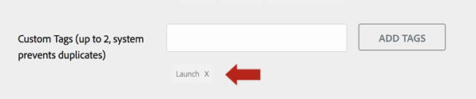

# Create an exchange listing for an extension

Adobe Experience Platform has a single unified catalog where users can view tag extensions that are available for installation. This catalog is available within the product and contains extensions of three types:

1. **Public extensions**: These are completed extensions designed for production use by any user.
1. **Private extensions**: These are completed extensions designed for production, but were developed by other users in your company and are only available to users within your company.
1. **Development extensions**: These extensions are under active development and are only available within your company and only on a property that is specifically designated as a Development property.

Separate from the extensions in the product catalog, public extensions also have listings in the [Experience Cloud Exchange App Marketplace](https://exchange.adobe.com/apps/browse/ec).  

These listings enable extension developers to post descriptions of functionality, provide links to additional support and documentation, and to market extensions to prospective users who may not be aware of your company or the functionality of your extension. In this marketplace, your extension will have a public listing that can be viewed without the user being authenticated to Experience Platform. For public extensions, creating this Exchange listing is a required step.

>[!TIP]
>
>When your Exchange listing is published, a link is automatically added to the listing content that enables your customers and prospects to click and `Connect with publisher` for more information about your products and services. Your contact email address is not displayed as these messages will be forwarded to you by the Exchange system.

If you do not have a company to upload and test your extension package, you should register for the Exchange program and begin a listing. This will trigger the creation of a company account (it takes some time, you'll get an email when this is completed) that you can use to upload and test your extension. Again, Exchange listings are only required for public extensions.

If you already have a company account, or if you do not need an Exchange listing (private extensions only), you can skip the rest of this step and proceed to [uploading and testing your extension](./upload-and-test.md).

## Create a listing

>[!NOTE]
>
>The following process details the creation of an application listing in the Adobe Exchange program. This is the term used for the various integrations, and extensions in Adobe Experience Platform. 

1. Sign in to the [Exchange Partner site](https://partners.adobe.com/exchangeprogram/experiencecloud). Once signed in, select the **App Manager** link next to your name.
1. Select the **Create New Application** tab, and then select **Create New App** for a customized solution, or select an applicable template.
1. Provide your listing information. For detailed information on App Manager check out the full [article](https://adobeexchangeec.zendesk.com/hc/en-us/articles/360024197931). Listing information should be very clear about what the extension does and why it is useful. The listing functions as a marketing space for your app. Promote your extension here using clear descriptions, links to landing pages on your site, links to help docs or support email addresses, and so on. Although space in extension views is limited, the Exchange listing provides an opportunity to promote both your extension and your company. The following are suggestions to improve promotion of the extension:
   - **App Icon** – Make sure the icon for the Exchange listing has the appropriate dimensions, 512 x 512 for png or 1:1 aspect ratio for jpg.
   
      >[!NOTE]
      >
      >This is a different file format than used in your extension code. The extension itself will contain an svg file as the [icon](../manifest.md).

   - **Featured Image** - Get attention by using an image that can stand alone and will show your brand and highlight your application. The Featured Image is the one shown when someone shares a link to your Exchange listing or posts about it on social media. It therefore needs to be a model representation of your brand.
   - **App Publisher's Logo** - This is your corporate logo, make sure the icon has the appropriate dimensions of 1280 x 720, or 2560 x 1440 (16:9) in png or jpg format.
   - **Configuration Instructions** – Inform customers how to configure your Adobe Experience Platform extension. Make sure they understand any required settings and next steps when your [configuration view](../configuration.md) appears immediately after installing your extension in a property. 
   - **Tags** - On the first page of editing your listing, please be sure to include the word "Launch" in the 'Custom Tags' field. This will make your listing appear in searches for tags in the Exchange marketplace:
     
   - **Sandboxes** - Your access to Adobe Solutions is through a Sandbox account where you have access to a fully functioning version of Adobe Experience Platform. These Sandbox accounts are requested as you create your application listing. In the **Connections** section select the specific connections that are applicable for the application you created (your tag extension), and when you hit **Save**, the sandbox request will be generated if needed.  
1. Submit your listing. The Adobe Exchange team will review your application and provide feedback if updates are required. If you mark the **publish immediately** checkbox when you submit your listing, it will be published immediately upon approval. If you want to publish your application at a later time, leave the checkbox unchecked. When your extension listing is approved, a blue **Publish** button will appear next to it on your app (extension) listings page.

### Create an effective listing

Please take a look at the [App Submission Guideline](https://partners.adobe.com/exchangeprogram/experiencecloud/build/ec-exchange.html) for detailed information on how to create the most engaging listing.

#### After submitting your Exchange listing

Once submitted, the Adobe Exchange team will review the application and will either approve the application, or respond with comments about changes. This process is detailed in the App Submission Guidelines.

If you don't have a login to the Exchange site, make sure that your email is registered for the Exchange program by following the instructions in the [Program Registration Guide](https://partners.adobe.com/content/mcp/us/en/home/reg-guide.html). Each user must associate their email with the partner account for their company. Questions on this process can be directed via email to <ExchangeHelpEC@adobe.com>.

#### Update your Exchange listing after initial approval

When you update your extension, or just need to update your Exchange listing, login to the [Partner Portal](https://partners.adobe.com/exchangeprogram/experiencecloud), and select the App Manager button next to your name. Then select your application and follow the flow above that was initially used to create the listing. Once re-submitted, the Adobe Exchange team will review the changes and will either approve the changes, or respond with comments about the changes.

## Link your extension package to your listing

After your listing has been approved and is publicly available, we recommend that you provide a link to the public listing in the `exchange_url` field of the `extension.json` file within your extension package.  This will create a "More Info" link within the tag extension catalog so users within the product can find your listing and it's extra information.
