# Upload and implement end-to-end testing

>[!NOTE]
>
>Adobe Experience Platform Launch has been rebranded as a suite of data collection technologies in Adobe Experience Platform. Several terminology changes have rolled out across the product documentation as a result. Please refer to the following [document](../../term-updates.md) for a consolidated reference of the terminology changes.

To test tag extensions in Adobe Experience Platform, use the tags API and/or command-line tools to upload your extension packages. Next, use the Platform UI or Data Collection UI to install your extension package to a property and exercise its capabilities inside a tag library and build.

This document covers how to implement end-to-end testing for your extension. 

>[!NOTE]
>
>This guide assumes that you are using MacOS with Node.js and npm installed and available.

## Validate your extension {#validate}

Once your team is satisfied with the performance of your extension and the results they see in the [Sandbox](https://www.npmjs.com/package/@adobe/reactor-sandbox#running-the-sandbox) tool, you should be ready to upload your extension package to tags. 

Before uploading, please validate that any required fields or settings are present. For example, reviewing your [extension manifest](../manifest.md), your [extension configuration](../configuration.md), your [views](../web/views.md), and your [library modules](../web/format.md) (at a minimum) is good practice. 

A specific example is your logo file: Add an `"iconPath": "example.svg",` line to your `extension.json` file and include that logo image file in your project. This is the relative path to the icon that will be displayed for the extension. It should not begin with a slash. It must reference an SVG file with a `.svg` extension. The SVG should appear normally when rendered square and may be scaled by the user interface. See the [How to Scale SVG article](https://css-tricks.com/scale-svg/) for more details.

>[!NOTE]
>
>For public extensions, please include an item in your `extension.json` with a link to your Exchange listing. Your [extension manifest](../manifest.md) should include an entry like this: `"exchangeUrl":"https://www.adobeexchange.com/experiencecloud.details.12345.html"` pointing to the URL of your Exchange listing.

## Create an Adobe I/O integration {#integration}

In order to use the API or command-line tools, you need a technical account with Adobe I/O. You must create the technical account in the I/O console and then use the Uploader tool to upload the extension package.

For information on creating a technical account for use with tags in Adobe Experience Platform, please refer to the [Access Tokens](https://developer.adobelaunch.com/api/guides/access_tokens/) guide.

>[!IMPORTANT]
>
>In order to create an Integration in Adobe I/O you must be an Experience Cloud Organization Administrator or an Experience Cloud Org Developer.

If you cannot create an Integration, it is likely that you do not have the correct permissions. This will require either an Org Admin to complete the steps for you or to assign you as a developer.

## Upload Your extension package {#upload}

Now that you have credentials, you are ready to test your extension package end-to-end.

When you first upload your extension package, it goes into a state of `development`. This means that it is only visible to your own organization, and only with a property that has been marked for extension development.

Use the command line to run the following command within the directory that contains your .zip package.

```bash
npx @adobe/reactor-uploader
```

`npx` allows you to download and run an npm package without actually installing it on your machine. This is the simplest way to run the Uploader.

The Uploader requires you to input several pieces of information. The technical account ID, API key, and other bits of information can be retrieved from the Adobe I/O console. Navigate to the [Integrations page](https://console.adobe.io/integrations) in the I/O console. Select the correct Org from the dropdown, find the right integration, and select **[!UICONTROL View]**.

- What is the path to your private key? /path/to/private.key. This is the place you saved your private key in step 2 above.
- What is your Org ID? Copy and paste this from the I/O Console overview page that you left open earlier.
- What is your technical account ID? Copy and paste this from the I/O Console.
- What is your API key? Copy and paste this from the I/O Console.
- What is the client secret? Copy and paste this from the I/O Console.
- What is the path to the extension_package you want to upload? /path/to/extension_package.zip. If you invoke the uploader from within the directory containing your .zip package, you can just select it from the list instead of typing the path.

Your extension package will then be uploaded and the uploader will give you the ID of the extension_package.

>[!NOTE]
>
>When uploading or patching, extension packages are placed into a pending state while the system asynchronously extracts the package and deploys. While this process is taking place, you can poll the `extension_package` ID for its status using the API and within the UI. You will see an extension card in the catalog marked as Pending.

>[!NOTE]
>
>If you plan to run the uploader often, putting all this information in each time can be a burden. You can also pass these in as arguments from the command line. Check out the [Command Line Arguments section](https://www.npmjs.com/package/@adobe/reactor-uploader#command-line-arguments) of the NPM docs for more info.

## Create a development property {#property}

After you sign into the UI and select **[!UICONTROL Tags]** in the left navigation, the [!UICONTROL Properties] screen is displayed. A property is a container for the tags that you want to deploy and it can be used on one or many sites.

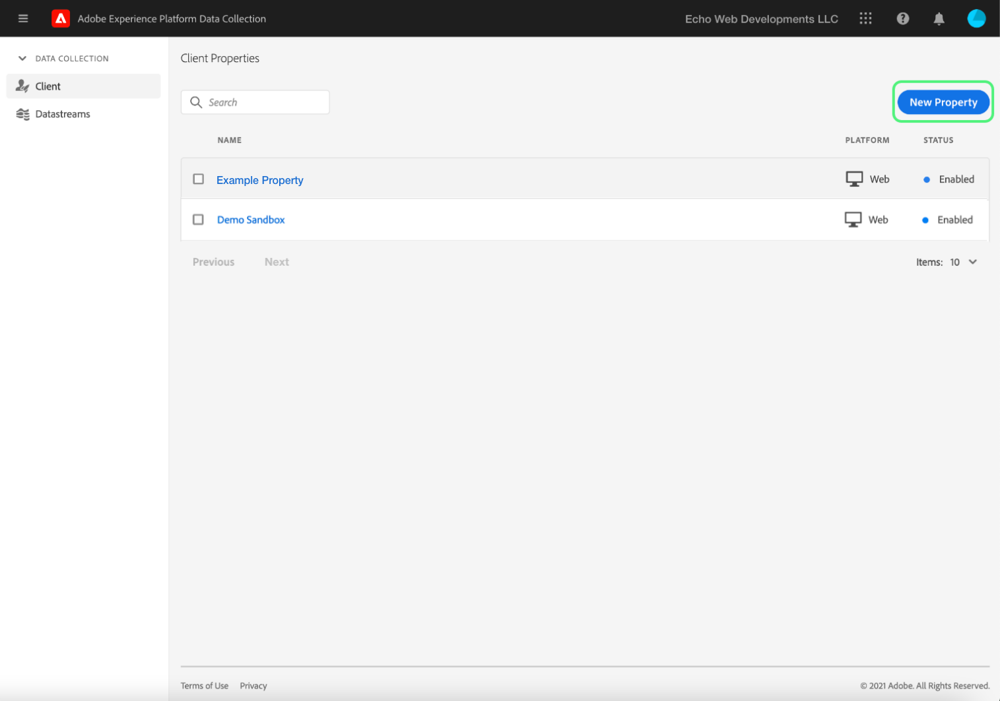

You will not see any properties on your screen the first time you sign in. Select **New Property** to create one. Enter a name and a URL. Use the URL of your test site or the page where you'll be testing your extension. This domain field can be used by some extensions or by a condition using the Core extension. 

>[!NOTE]
>
>`localhost` will not work as a URL value. Instead, use any mock value for testing if you are using a `localhost` URL. For example, example.com.

To use this property for extension development testing, you must expand the **ADVANCED OPTIONS** and make sure to check the box for **Configure for extension development**.

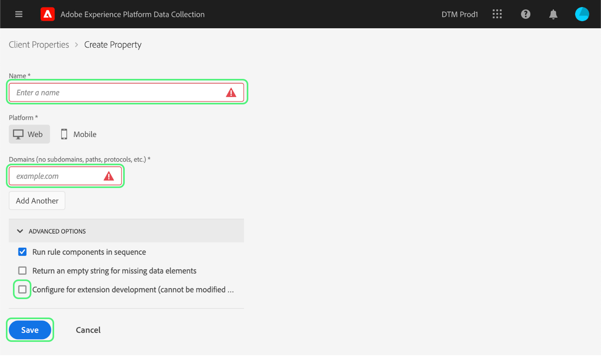

Select **Save** at the bottom to save your new property.

The Properties screen appears. Select the name of your property that you just created. The Property Overview screen appears. It provides links to each area of the system with the global navigation links in the column on the left.

## Install your extension {#install-extension}

To install your extension in this property, select the **Extensions** link in the main navigation links in the left column. The **Core** extension is displayed on the **Installed** screen. The Core extension contains all the tag management functionality within data collection.

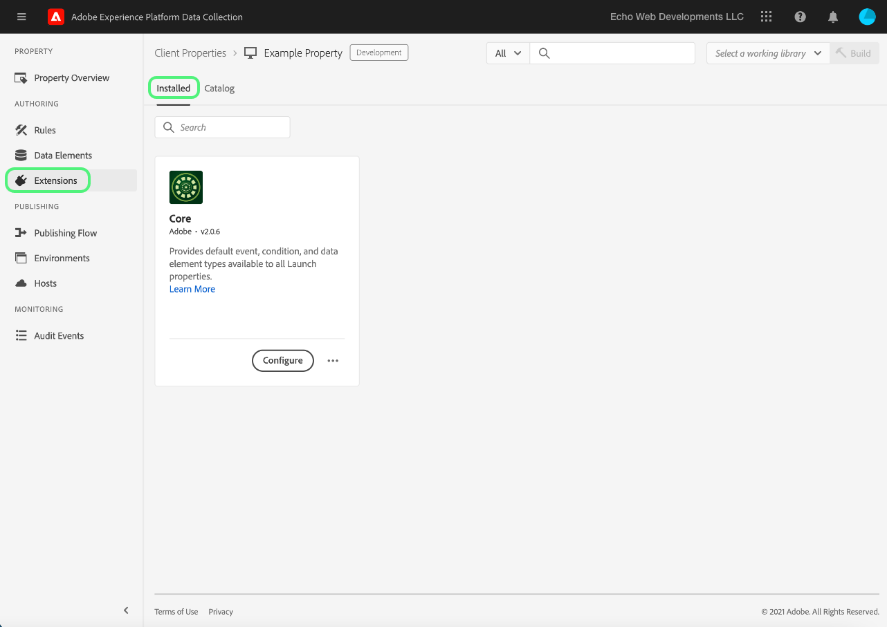

To add your extension, select the **Catalog** tab.

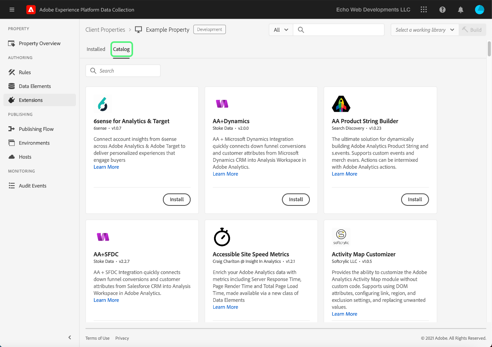

The catalog displays card icons for each available extension. If your extension is not displayed in the catalog, ensure that you have completed the steps above in the Adobe Administration Console Set Up and Creating Your Extension Package sections. Your extension package may also appear as Pending if Platform has not completed the initial processing.

If you have followed the the previous steps and still do not see a Pending or Failed extension package in the catalog, you should check the status of your extension package directly using the API. For information on how to make the appropriate API call, read [Fetch an ExtensionPackage](https://developer.adobelaunch.com/api/reference/1.0/extension_packages/fetch/) in the API documentation.

After your extension package has finished processing, select **Install** at the bottom of the card.

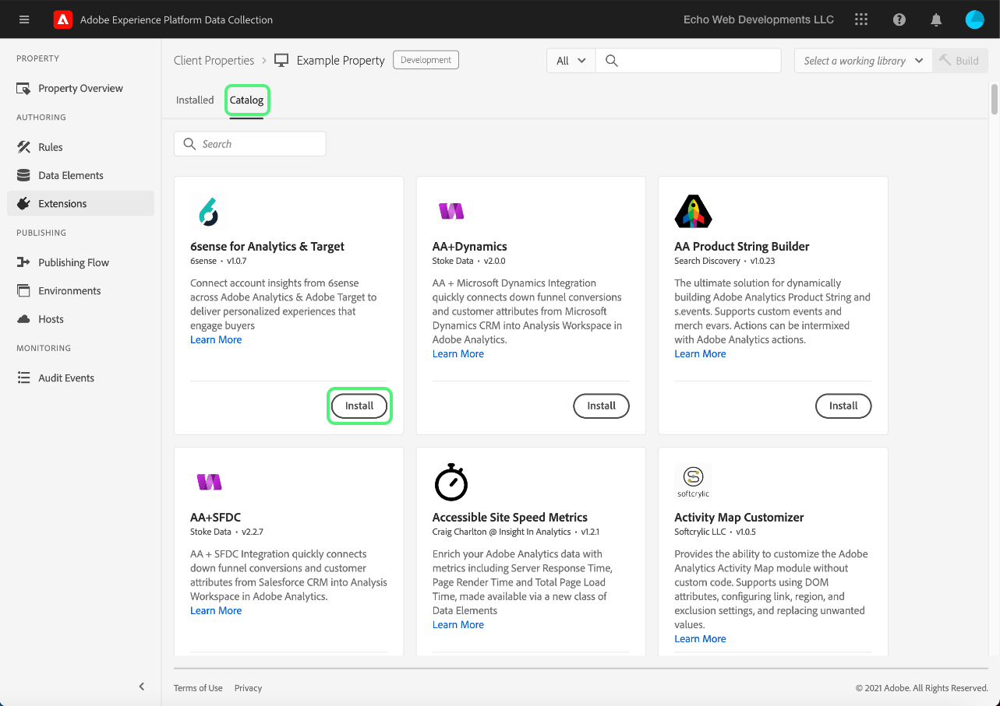

The configuration screen opens (providing the extension has one). Add any information needed to configure your extension and select **Save** at the bottom. The configuration screen example seen here uses the Facebook extension which requires a Pixel ID.

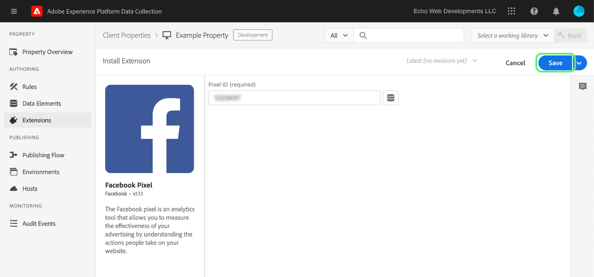

You should now see the **Installed** extensions screen with the Core extension and your extension.

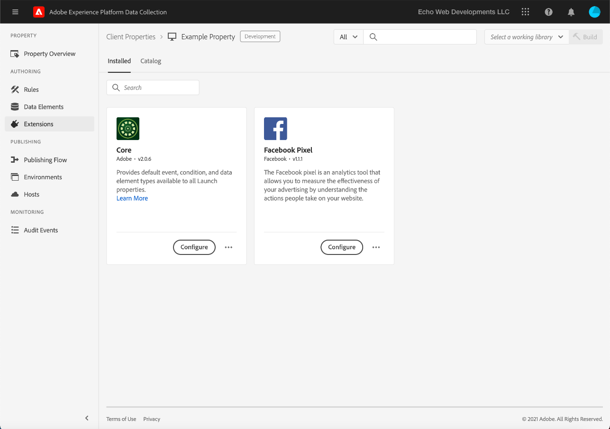

## Create resources to test your extension {#resources}

Extensions provide new capabilities to users of Adobe Experience Platform. These are typically displayed in Data Elements or the Rule Builder.

### Data elements

The purpose of tag data elements is to help users persist values. Each data element is a mapping or pointer to source data. A single data element is a variable that can be mapped to query strings, URLs, cookie values, JavaScript variables, etc. Select **Data Elements** from the left navigation bar, and **Create New Data Element**.


Extensions can define data element types if needed for your extension to operate, or simply as a convenience to users. When an extension provides data element types, they appear in a dropdown list for users on the **Create Data Element** screen:

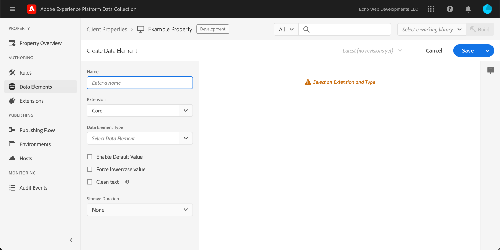

When a user selects your extension from the **Extension** dropdown, the **Data Element Type** dropdown is populated with any data element types supplied by your extension. The user can then map each data element to its source value. Data elements can then be used when building rules in the Data Element Change Event or Custom Code Event to trigger a rule to execute. A data element can also be used in the Data Element Condition or other Conditions, Exceptions, or Actions in a rule.

Once the data element is created (the mapping is set up), users can reference the source data simply by referencing the data element. If the source of the value ever changes (site re-designs, etc.) users only need to update the mapping once in the UI and all the data elements will automatically receive the new source value.

### Rules

Select the **Rules** link in the left navigation, then **Create New Rule**.

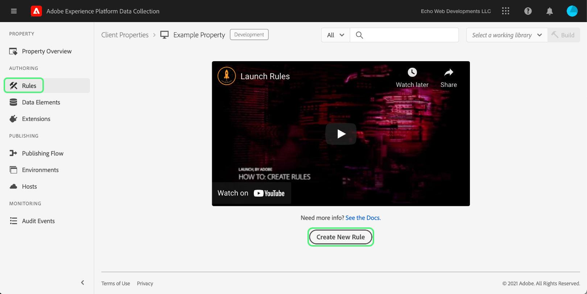

First, input a descriptive name the rule. The **Create Rule** screen is set up like an `if-then` statement.

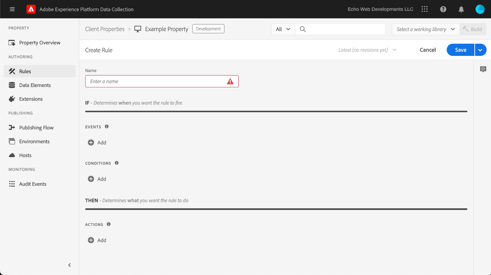

If an event occurs, and conditions pass, and there are no exceptions, the action is triggered. This same flow exists in extensions where you can create or leverage events, conditions, exceptions, data elements, or actions.

Using the Facebook extension example, add an event for every occasion a page loads on the test site.

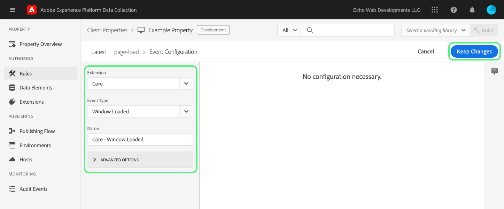

The `Window Loaded` **Event Type** ensures that any time a page loads on the test site this rule will be triggered. Select **Keep Changes**. For this example, ignore **Conditions** as the rule should be triggered for any page on the test site.

Under **ACTIONS** select **Add**. The **Action Configuration** screen appears.Next you must choose the extension that the rule is to be applied to, and the action to occur when the rule is triggered. Select **Facebook Pixel** from the **Extension** dropdown list, and **Send Page View** from the **Action Type** dropdown list. Select **Keep Changes**, and then **Save** on the following **Edit Rule** screen.

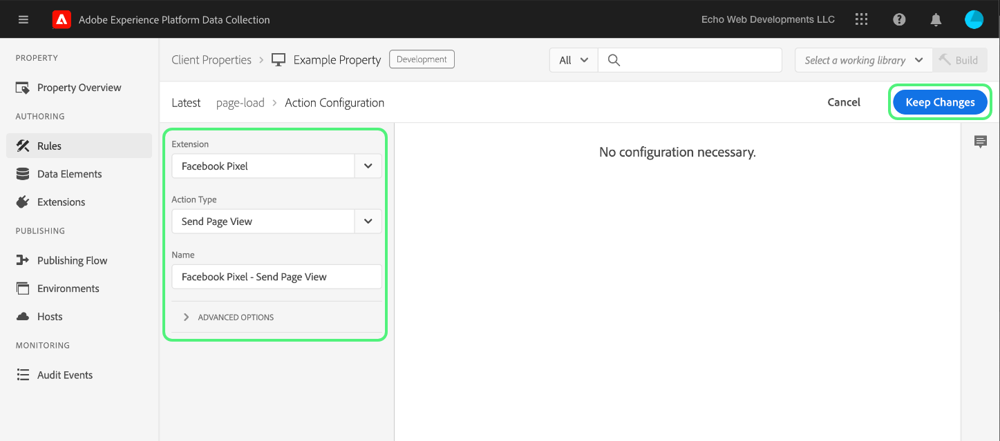

When testing your extension, select any relevant events, conditions, etc. supplied by your extension in any number of rules.

## Publish your changes {#publish}

In the main navigation, select **Publishing**, then on **Add New Library** link:

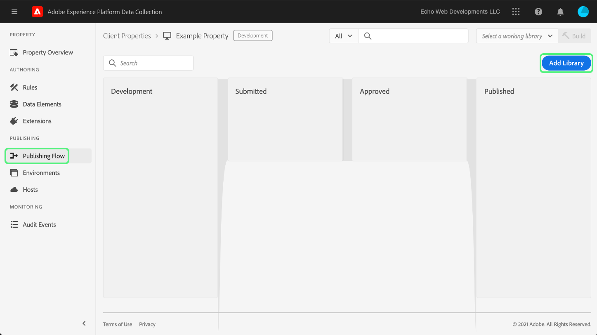

A library is a set of instructions for how extensions, data elements, and rules will interact with one another and with a website. Libraries are compiled into builds. A library can contain as many changes as a user is comfortable making or testing at once.

On the **Create Library** screen, add a name in the **Name** text field. Tags provide a default development environment named **Development**. Select **Development** from the **Environment** dropdown list. For simplicity add all the available resources. Select **Add All Changed Resources**, then select **Save**.

>[!NOTE]
>
>When you add a resource to a library, a snapshot of that resource as of that exact moment is taken and added to the library. When you make changes to your resources later (for example, as a result of fixes you need to make), you'll need to also update the library to include the latest changes to your resources. The **Add All Changed Resources** button is useful for this purpose as well.

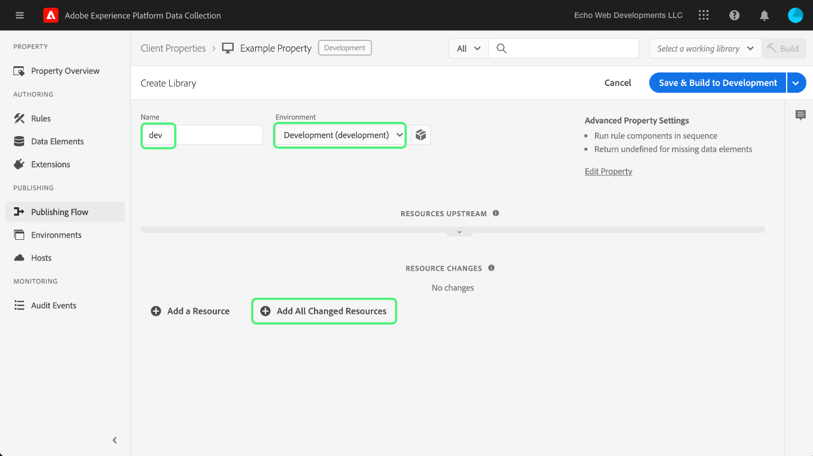

Now that all the changes have been included in the newly created library (named **dev** in the provided example), select **Save and Build to Development**.

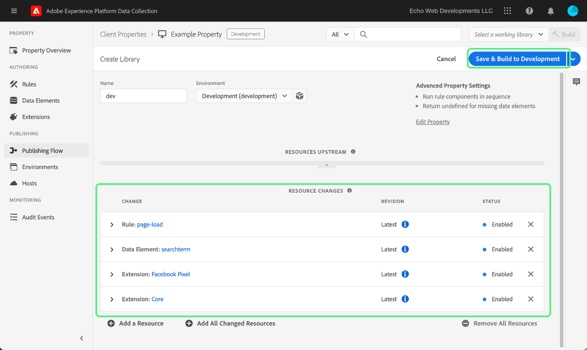

After the build process completes, a green **success** indicator displays next to the library name.

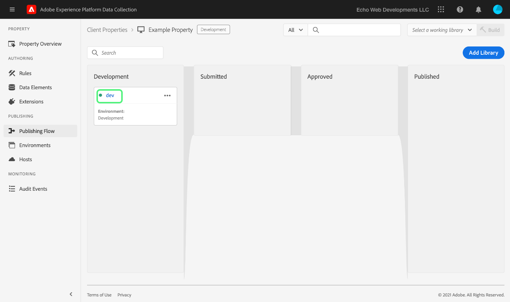

The tag library is now published and available for use. The test page must use the newly created library in order to test the page behavior for the end-user in a browser.

## Install tags on a test site {#install-data-collection-tags}

Installation instructions are available from the Environments tab. This page displays all available environments and also allows you to create more. As the library was published to the Development environment select the box icon in the **INSTALL** column on the **Development** row.

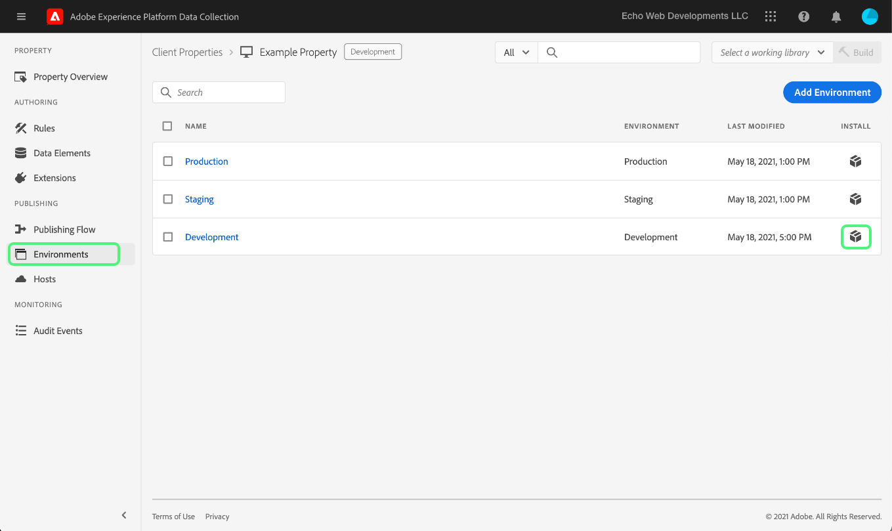

The **Web Install Instructions** dialog for the Development environment appears. Select the copy icon to copy the entire `<script>` tag.

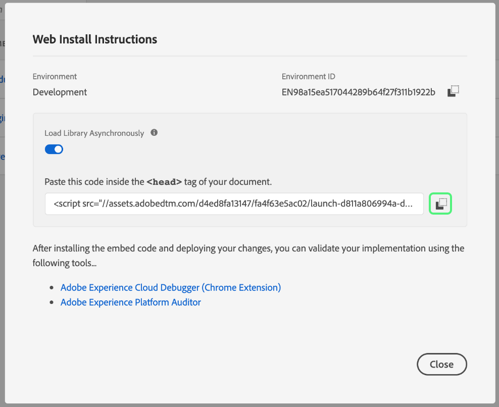

Complete the installation by placing this single `<script>` tag inside the `<head>` section of your document or site template. Next, visit the test site to examine the behavior of your published tag library.

## Test {#test}

The following is a list of useful console commands for validating your extension on your test page or site.

- `_satellite.setDebug(true);` will enable debug mode and output useful logging statements to the console.
- The `_satellite._container` object contains useful information about the deployed library including details about the Build, Data Elements, Rules, and Extensions included.

The objective of this testing is to check the functionality of the deployed library, and ensure that the extension package behaves as expected after it has been complied into a library.

When you discover changes that need to be made to your extension package, the iteration process is similar to the development process.

1. Make changes to the code in your project.
1. Validate the changes with the Sandbox tool.
1. Use the Packager tool to create a new .zip package
1. Use the Uploader tool to upload your new .zip package. The process follows the same instructions as before regarding the initial upload. However, you will notice that because there is already an extension package of that name in development mode, this new package will overwrite the older version instead of creating a new one. 
   
   >[!NOTE]
   >
   >Arguments can be passed on the command line to save time by avoiding the repeated entering of credentials. For more information on this, read the [reactor-uploader documentation](https://www.npmjs.com/package/@adobe/reactor-uploader). 
1. The installation step can be skipped when updating an existing package.
1. Modify resources - if the configuration for any of your extension components has been changed, you will need to update those resources in the UI.
1. Add your latest changes to your Library and build again.
1. Complete another round of tests.
