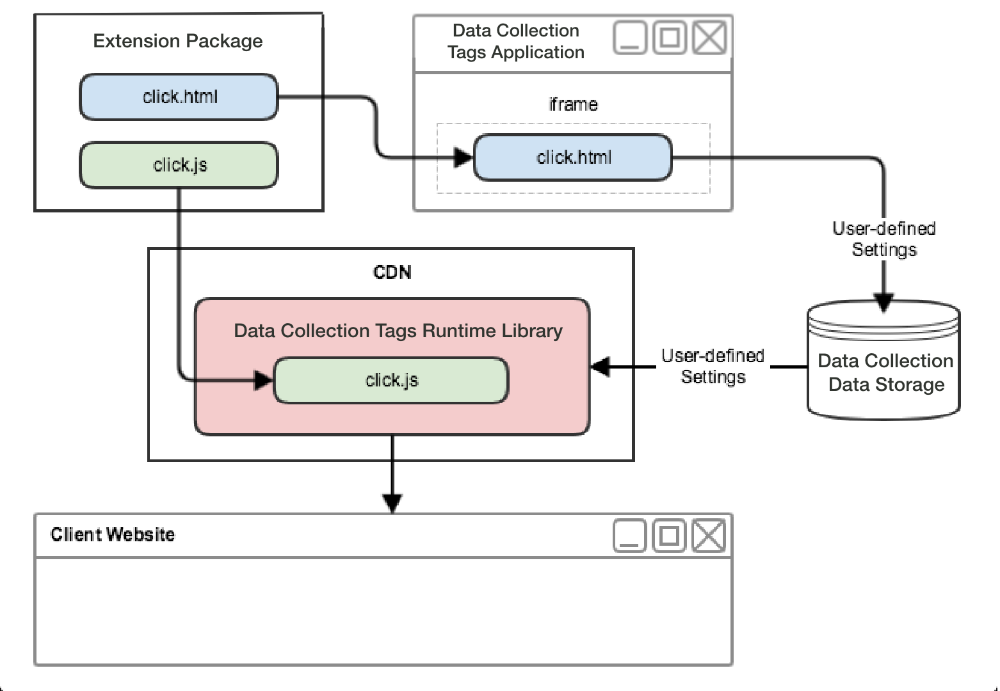

# Web extension flow

In web extensions, each event, condition, action, and data element type has both a view which allows users to modify settings and a library module to act upon those user-defined settings.

As the following high-level diagram shows, the extension's event type view will be shown inside an iframe within the application integrated with Adobe Experience Platform. The user then uses the view to modify settings which are then saved within Experience Platform. When the tag runtime library is built, both the extension's event type library module as well as the user-defined settings will be included in the runtime library. At runtime, Experience Platform will inject the user-defined settings into the library module.

In the following diagram you can see the link between events, conditions and actions inside the rule processing flow.

The rule processing flow contains the following phases:

1. The `settings` and the `trigger` method are provided to the event library module at startup.
1. When the event library module determines the event has occurred, the event library module calls `trigger`.
1. Tags passes `settings` into the rule's condition library modules where conditions are evaluated.
1. Each condition library module returns whether a condition evaluates to true.
1. If all conditions pass, the rule's actions are executed.
