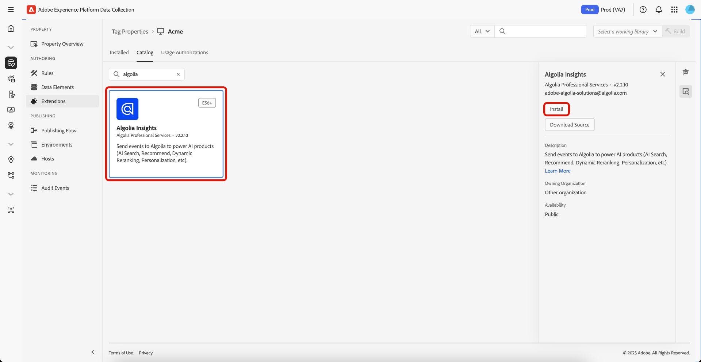

# [!DNL Algolia] Tags extension overview

The [!DNL Algolia] Tags extension empowers marketers to easily set up rules that send user interaction data to [!DNL Algolia], helping you deliver more personalized AI Search and Discovery experiences.

This extension is powered by a key feature:

* **[!DNL Algolia] Insights**: Automatically captures and sends user interaction events to [!DNL Algolia], which enables powerful analytics, personalized experiences, and improved search relevance.

## Prerequisites {#prerequisites}

You must have a valid [!DNL Algolia] account in order to use this extension. Go to the [[!DNL Algolia] sign up page](https://dashboard.algolia.com/users/sign_up) to create an account if you do not have one already.

### Gather required configuration details {#configuration-details}

To connect [!DNL Algolia] with Adobe Experience Platform, you'll need the following information:

| Credential | Description | Example |
| --- | --- | --- |
| Application ID | Your Application Id can be found in the [API Keys](https://www.algolia.com/account/api-keys/all) section of your [!DNL Algolia] Dashboard. | 0ABCDEFG12 |
| Search API Key | Your Search API Key can be found in the [API Keys](https://www.algolia.com/account/api-keys/all) section of your [!DNL Algolia] Dashboard. | 1234a12345678901b1234567890c1ab1 |

## Install and configure the [!DNL Algolia] Insights extension {#install-configure}

To install the [!DNL Algolia] Insights extension, navigate to the [!UICONTROL Data Collection UI] and select  **[!UICONTROL Tags]** from the left navigation. From here, select a property to add the extension to, or create a new property instead.

Once you have selected or created the desired property, select **[!UICONTROL Extensions]** in the left navigation, then select the **[!UICONTROL Catalog]** tab. Search for the [!DNL Algolia] Insights card, then select **[!UICONTROL Install]**.



In the configuration view that appears, you must provide the following details:

| Property | Description |
| --- | --- |
| [!UICONTROL Application ID ] | Enter the [!UICONTROL Application Id] you previously gathered in the [configuration details](#configuration-details) section. |
| [!UICONTROL Search API Key ]  | Enter the [!UICONTROL Search API Key] you previously gathered in the [configuration details](#configuration-details) section. |
| [!UICONTROL Index Name ]   | The [!UICONTROL Index Name] contains the Products or Content.  This Index will be used as a default. |
| [!UICONTROL User Token Data Element ]  | The Data Element that will return the User Token. |
| [!UICONTROL Authenticated User Token Data Element ]  | Set the Data Element that will return the Authenticated User Token. |
| [!UICONTROL Currency ]  | Select a currency type.  The default value is set to `USD`. |


## [!DNL Algolia] Insights extension action types {#action-types}

[!DNL Algolia] supports a set of predefined standard events, each with specific contexts and properties. The actions available in the [!DNL Algolia] extension align with these event types, making it easy to categorize and configure the events you send to [!DNL Algolia] based on their type.

### Load Insights {#load-insights}

>[!NOTE]
>
>In most cases, it's recommended to load [!DNL Algolia] Insights on every page of your site.

Add the **[!UICONTROL Load Insights]** action to your tag rule wherever it makes the most sense for loading [!DNL Algolia] Insights based on your rule's context. This action loads the `search-insights.js` library onto the page. 

Create a new tag rule or open an existing one. Define the conditions according to your requirements, then select **[!UICONTROL Algolia]** as the [!UICONTROL Extension] and select **[!UICONTROL Load Insights]** as the [!UICONTROL Action Type].

| Property | Description |
| --- | --- |
| [!UICONTROL Insight Library Version] | The [!DNL Algolia] Insights version. The default is `2.13.0`. |
| [!UICONTROL User Opt Out Data Element] | The Data Element that captures the user's tracking preference. |
| [!UICONTROL Use User Token Cookie] | Check this box to allow [!DNL Algolia] to generate a User Token cookie. By default, this option is set to `false`. |


### Clicked {#clicked}

Add the **[!UICONTROL Click]** action to your tag rule to send clicked events to [!DNL Algolia]. Create a new tag rule or open an existing one. Define the conditions according to your requirements, then select **[!UICONTROL Algolia]** as the [!UICONTROL Extension] and select **[!UICONTROL Clicked]** as the [!UICONTROL Action Type].

| Property | Description |
| --- | --- |
| [!UICONTROL Event Name ] | The Event Name that can be used to further refine this click event. |
| [!UICONTROL Event Details Data Element ] | The Data Element returns event details, including: <ul><li>`indexName`</li><li>`objectIDs`</li><li>`queryID` (optional)</li><li>`position` (optional)</li></ul> |
| [!UICONTROL Record ID Data Element ] | The Record ID is used as a key for the event data stored in the browser storage on a `click` event.  The page url is the default Record ID.  In order to override this behaviour, use this property to provide a data element that will return the Record ID as a string. |

>[!NOTE]
>
>If both `queryID` and `position` are included, the event is classed as **Clicked object IDs after Search**. Otherwise, it's classed as a **Clicked object IDs** event.
><br>
>If the Data Element does not provide an `indexName`, the **Default Index Name** will be used when the event is sent.


For more information on the event categories, see the [Clicked object IDs after search](https://www.algolia.com/doc/api-reference/api-methods/clicked-object-ids-after-search/)
and [Clicked object IDs](https://www.algolia.com/doc/api-reference/api-methods/clicked-object-ids/) guides.

### Converted {#converted}

Add the **[!UICONTROL Converted]** action to your tag rule to send converted events to [!DNL Algolia]. Create a new tag rule or open an existing one. Define the conditions according to your requirements, then select **[!UICONTROL Algolia]** as the [!UICONTROL Extension] and select **[!UICONTROL Converted]** as the [!UICONTROL Action Type].                

| Property | Description |
| --- | --- |
| [!UICONTROL Event Name ] | The Event Name that will be used to further refine this **convert** event. | 
| [!UICONTROL Event Details Data Element ]| The Data Element returns event details, including: <ul><li>`indexName`</li><li>`objectIDs`</li><li>`queryID` (optional)</li></ul> |
| [!UICONTROL Disable Removal of Event Data ] | On a coversion event, the event data is removed from storage. If this event data is needed for further conversion events, then disable the removal process so the event data is available. | 
| [!UICONTROL Record ID Data Element ] | The Record ID is used as a key to look up the event data that is stored in the browser storage.  The page url is the default Record ID.  In order to override this behaviour, use this property to provide a data element that will return the Record ID as a string. |

>[!NOTE]
>
>If the Data Element contains `queryId`, the event is classed as **Converted after Search**. Otherwise, it will be classed as a **Converted** event. 
><br>
>If the Data Element does not provide an `indexName`, the **Default Index Name** will be used when the event is sent. 


For more information on the event categories, see the [Converted object IDs after search](https://www.algolia.com/doc/api-reference/api-methods/converted-object-ids-after-search/) and [Converted object IDs](https://www.algolia.com/doc/api-reference/api-methods/converted-object-ids/) guides.

### Added to Cart {#added-to-cart}

Add the **[!UICONTROL Added to Cart]** action to your tag rule to send added to cart events to [!DNL Algolia]. Create a new tag rule or open an existing one. Define the conditions according to your requirements, then select **[!UICONTROL Algolia]** as the [!UICONTROL Extension] and select **[!UICONTROL Added to cart]** as the [!UICONTROL Action Type].

| Property | Description |
| --- | --- |
| [!UICONTROL Event Name ] | The Event Name that will be used to further refine this **convert** event. | 
| [!UICONTROL Event Details Data Element ] | The Data Element returns event details, including: <ul><li>`indexName`</li><li>`objectIDs`</li><li>`objectData`<ul><li>`queryID` (optional)</li><li>`price`</li><li>`quantity`</li><li>`discount`</li></ul></li><li>`queryID` (optional)</li></ul>. |
| [!UICONTROL Currency ] | Specifies the type of currency, such as `USD`. |

>[!NOTE]
>
>If the Data Element contains `queryId`, the event will be classed as **Added to cart object IDs after Search**. Otherwise, it will be classed as a **Added to cart object IDs** event. 
><br>
>If the Data Element does not provide an `indexName`, the **Default Index Name** will be used when the event is sent. 
><br>
>If the default Data Elements do not meet your requirements, a custom one Data Element can be created to return the desired event details.

 

For more information on the event categories, see the [Added to cart object IDs after search](https://www.algolia.com/doc/api-reference/api-methods/added-to-cart-object-ids-after-search/) and [Added to cart object IDs](https://www.algolia.com/doc/api-reference/api-methods/added-to-cart-object-ids/) guides.

### Purchased {#purchased}

Add the **[!UICONTROL Purchased]** action to your tag rule to send purchased events to [!DNL Algolia]. Create a new tag rule or open an existing one. Define the conditions according to your requirements, then select **[!UICONTROL Algolia]** as the [!UICONTROL Extension] and select **[!UICONTROL Purchased]** as the [!UICONTROL Action Type].

| Property | Description |
| --- | --- |
| [!UICONTROL Event Name ] | The Event Name that will be used to further refine this **purchase** event. | 
| [!UICONTROL Event Details Data Element ] | The Data Element returns event details, including: <ul><li>`indexName`</li><li>`objectIDs`</li><li>`objectData`<ul><li>`queryID` (optional)</li><li>`price`</li><li>`quantity`</li><li>`discount`</li></ul></li><li>`queryID` (optional)</li></ul>. |
| [!UICONTROL Currency ] | Specifies the type of currency, such as `USD`. |

>[!NOTE]
>
>If the Data Element contains `queryId`, the event will be classed as **Purchased object IDs after Search**. Otherwise it will be classed as a **Purchased object IDs** event. 
><br>
>If the Data Element does not provide an `indexName`, the **Default Index Name** will be used when the event is sent. 
><br>
>If the default Data Elements do not meet your requirements, a custom one Data Element can be created to return the desired event details.

 

For more information on the event categories, see the [Purchased object IDs after search](https://www.algolia.com/doc/api-reference/api-methods/purchased-object-ids-after-search/)
and [Purchased object IDs](https://www.algolia.com/doc/api-reference/api-methods/purchased-object-ids/) guides.

### Viewed {#viewed}

Add the **[!UICONTROL Viewed]** action to your tag rule to send purchased events to [!DNL Algolia]. Create a new tag rule or open an existing one. Define the conditions according to your requirements, then select **[!UICONTROL Algolia]** as the [!UICONTROL Extension] and select **[!UICONTROL Viewed]** as the [!UICONTROL Action Type].

| Property | Description |
| --- | --- |
| [!UICONTROL Event Name ] | The Event Name that will be used to further refine this **view** event. | 
| [!UICONTROL Event Details Data Element ] | The Data Element returns event details, including: <ul><li>`indexName`</li><li>`objectIDs`</li></ul> |

>[!NOTE]
>
>If the Data Element does not provide an `indexName`, the **Default Index Name** will be used when sending the event.

 

For more information on the view event, see the [Viewed object IDs](https://www.algolia.com/doc/api-reference/api-methods/viewed-object-ids/) guide.

## [!DNL Algolia] Insights extension data elements {#data-elements}

[!DNL Algolia] supports a set of predefined data elements, each with specific contexts and properties. The following sections describes the data elements available in the [!DNL Algolia] Insights extension.

### DataSet {#dataset}

The DataSet Data Element retrieves data associated with HTML elements, which is then used in [!DNL Algolia] actions.

| Property | Description |
| --- | --- |
| [!UICONTROL Hit Element Div/Class Name ] | The HTML Element Name and/or CSS Class Name containing the dataset attributes including `data-insights-object-id` and optionally`data-insights-query-id` and `data-insights-position` on the HTML Element. |
| [!UICONTROL Index Name Element Div/Class Name ] | The HTML Element Name and/or CSS Class Name that has the dataset attributes (`data-indexname`) on the HTML Element. |
| [!UICONTROL Query ID Data Element ] | The Query ID is retreived from the dataset on the HTML element.  The example is below.  In order to override this behaviour, use this property to provide a data element that will return the Query ID as a string. |
| [!UICONTROL Object IDs Data Element ] | The Object IDs are retreived from the dataset on the HTML element.  The example is below.  In order to override this behaviour, use this property to provide a data element that will return the Object IDs as an array. |
| [!UICONTROL Positions Data Element ] | The Positions are retreived from the dataset on the HTML element.  The example is below.  In order to override this behaviour, use this property to provide a data element that will return the Positions as an array. |
| [!UICONTROL Index Name Data Element ] | The Index Name is retreived from the dataset on the HTML element.  The example is below.  In order to override this behaviour, use this property to provide a data element that will return the Index Name as a string. |


This Data Element returns:

```javascript
{
  timestamp,
  queryID,
  indexName,
  objectIDs,
  positions
}
```

An example of HTML that contains dataset:

```html
<div data-indexname="acme_master_default_products" class="instant-search-comp__hits">
  <div class="hit-card"
    data-insights-object-id="${hit.objectID}"
    data-insights-position="${hit.__position}"
    data-insights-query-id="${hit.__queryID}">
    <h4 class="hit-name">...</h4>   
  </div>
</div>
```

### Query String {#query-string}

The Query String Data Element extracts data from the URL query string to be used in [!DNL Algolia] actions.

| Property | Description |
| --- | --- |
| [!UICONTROL Object ID Param Name ] | The query param name that contains the Object Id.  |
| [!UICONTROL Index Name Param Name ] | The query param name that contains the Index Name. |
| [!UICONTROL Query ID Param Name ] | The query param name that contains the Query Id.   |
| [!UICONTROL Position Param Name ] | The query param name that contains the Position.   |

 

This Data Element returns:

```javascript
{
  timestamp,
  queryID,
  indexName,
  objectIDs
}
```

An example of HTML that contains query parameters.

```
<a href="product.html?objectID=${hit.objectID}&queryID=${hit.__queryID}&indexName=${indexName}&position=${hit.position}">Read More</a>
```

### Storage {#storage}

The Storage Data Element retrieves data from Session Storage for use in [!DNL Algolia] actions.

This Data Element retrieves event details from Session Storage. No configuration is required. The data is automatically added during the *click* event action and removed during the *convert* event action.

| Property | Description |
| --- | --- |
| [!UICONTROL Record ID Data Element ] | The Record ID is used as a key to look up the event data that is stored in the browser storage.  The page url is the default Record ID.  In order to override this behaviour, use this property to provide a data element that will return the Record ID as a string. |

 

This Data Element returns what is stored in the Session Storage.

```javascript
{
  timestamp,
  queryID,
  indexName,
  objectIDs
}
```

## Clicked or Converted after Search {#clicked-converted-after-search}

The *Clicked after Search* or *Converted after Search* events require a `queryId`, and `position` is also required for *Clicked after Search*. These properties are available when the `insights` flag is enabled in InstantSearch and/or Autocomplete query parameters. Refer to the following resources to learn how to configure Insights for your site:

* [Setting up Insights on Autocomplete](https://www.algolia.com/doc/ui-libraries/autocomplete/api-reference/autocomplete-js/autocomplete/#param-insights)
* [Setting up Insights on InstantSearch.js](https://www.algolia.com/doc/guides/building-search-ui/events/js/#set-the-insights-option-to-true)
* [Get started with click and conversion events](https://www.algolia.com/doc/guides/sending-events/implementing/how-to/sending-events-backend/)
* [Sending [!DNL Algolia] Insights events](https://www.algolia.com/doc/ui-libraries/autocomplete/guides/sending-algolia-insights-events/)
* [[!DNL Algolia] Launch Extension GitHub Repository](https://github.com/algolia/algolia-launch-extension)
* [InstantSearch.js Documentation](https://www.algolia.com/doc/guides/building-search-ui/what-is-instantsearch/js/)
* [[!DNL Algolia] Insights API Documentation](https://www.algolia.com/doc/rest-api/insights/)
* [Algolia Launch Extension Code Repo](https://github.com/algolia/algolia-launch-extension)

## Next steps {#next-steps}

This guide covered how to send data to [!DNL Algolia] using the [!DNL Algolia Insights] tag extension. If you are planning on also sending server-side events to [!DNL Algolia], you can now proceed to install and configure the [[!DNL Conversions API] event forwarding extension](../../server/algolia/overview.md).

For more information on tags in Experience Platform, refer to the [tags overview](../../../home.md).
