# [!DNL Algolia] Tags extension overview

The [!DNL Algolia] Tags extension empowers marketers to easily set up rules that send user interaction data to [!DNL Algolia], helping you deliver more personalized AI Search and Discovery experiences.

This extension is powered by a key feature:

* **[!DNL Algolia] Insights**: Automatically captures and sends user interaction events to [!DNL Algolia], which enables powerful analytics, personalized experiences, and improved search relevance.

## Prerequisites {#prerequisites}

You must have a valid [!DNL Algolia] account in order to use this extension. Go to the [[!DNL Algolia] sign up page](https://dashboard.algolia.com/users/sign_up) to create an account if you do not have one already.

### Gather required configuration details {#configuration-details}

To connect [!DNL Algolia] with Adobe Experience Platform, you'll need the following information:

| Credential | Description | Example |
| --- | --- | --- |
| Application ID | Your Application Id can be found in the [API Keys](https://www.algolia.com/account/api-keys/all) section of your [!DNL Algolia] Dashboard. | 0ABCDEFG12 |
| Search API Key | Your Search API Key can be found in the [API Keys](https://www.algolia.com/account/api-keys/all) section of your [!DNL Algolia] Dashboard. | 1234a12345678901b1234567890c1ab1 |

>[!NOTE]
>
>If you route Insights events through your own server using the [!UICONTROL Proxy] authentication method, the proxy injects the [!DNL Algolia] Application ID and Search API Key server-side. In that case, you can leave the [!UICONTROL Application ID] and [!UICONTROL Search API Key] blank in the extension configuration to keep the key hidden from the browser.

## Install and configure the [!DNL Algolia] Insights extension {#install-configure}

To install the [!DNL Algolia] Insights extension, navigate to the [!UICONTROL Data Collection UI] and select  **[!UICONTROL Tags]** from the left navigation. From here, select a property to add the extension to, or create a new property instead.

Once you have selected or created the desired property, select **[!UICONTROL Extensions]** in the left navigation, then select the **[!UICONTROL Catalog]** tab. Search for the [!DNL Algolia] Insights card, then select **[!UICONTROL Install]**.


The configuration view is organized into an **[!UICONTROL Authentication]** section and a **[!UICONTROL Configuration]** section.

### Authentication {#authentication}

Use the **[!UICONTROL Authentication method]** option to choose how the extension authenticates with [!DNL Algolia]:

* **[!UICONTROL Default]**: Send events directly to [!DNL Algolia] using your Application ID and Search API Key.
* **[!UICONTROL Proxy]**: Route events through your own server, which injects the credentials server-side and keeps them hidden from the browser.

The fields shown depend on the selected authentication method:

| Property | Description |
| --- | --- |
| [!UICONTROL Application ID] | Enter the [!UICONTROL Application Id] you previously gathered in the [configuration details](#configuration-details) section. This field is **required** when using the [!UICONTROL Default] method and **optional** when using the [!UICONTROL Proxy] method, since the proxy supplies the credentials. |
| [!UICONTROL Search API Key] | Enter the [!UICONTROL Search API Key] you previously gathered in the [configuration details](#configuration-details) section. This field is **required** when using the [!UICONTROL Default] method. When using the [!UICONTROL Proxy] method, leave this blank to keep the key hidden from the browser. The proxy injects it server-side. |
| [!UICONTROL Proxy URL] | Required when the [!UICONTROL Proxy] authentication method is selected. Enter the URL of your server to route Insights events through before Adobe Experience Platform forwards them to [!DNL Algolia]. Your proxy injects the [!DNL Algolia] Application ID and Search API Key, so you can leave those fields blank. This field supports data elements to set the value statically or resolve it dynamically at runtime. |

The following image shows the [!UICONTROL Default] authentication method:

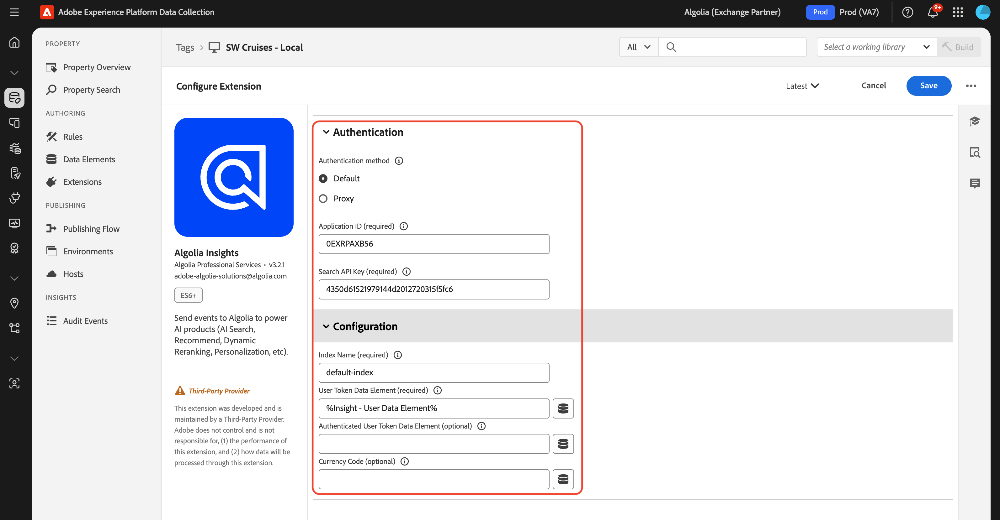

The following image shows the [!UICONTROL Proxy] authentication method:

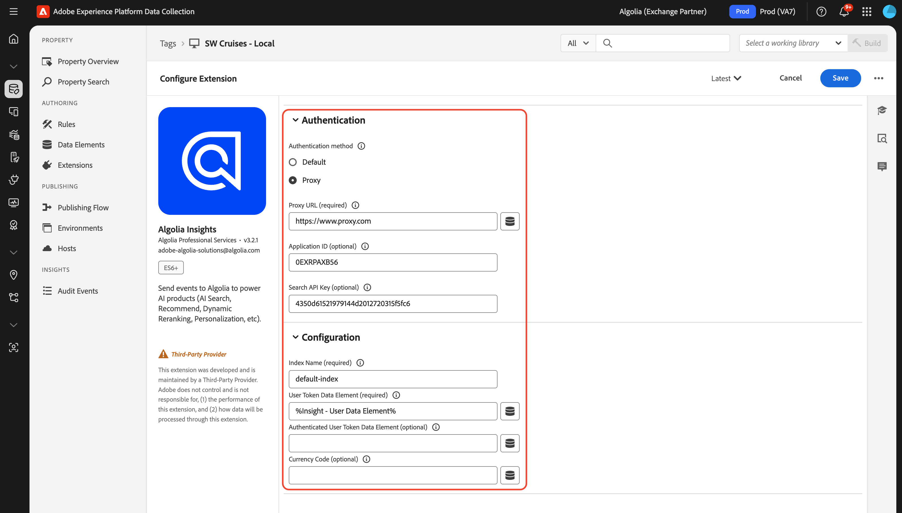

### Configuration {#configuration}

In the **[!UICONTROL Configuration]** section, provide the following details:

| Property | Description |
| --- | --- |
| [!UICONTROL Index Name ] | Required. The [!UICONTROL Index Name] contains the Products or Content.  This Index will be used as a default. |
| [!UICONTROL User Token Data Element ]  | Required. The Data Element that will return the User Token. This field supports data elements. |
| [!UICONTROL Authenticated User Token Data Element ]  | Optional. Set the Data Element that will return the Authenticated User Token. This field supports data elements. |
| [!UICONTROL Currency Code ] | Optional. Enter the currency code in ISO-4217 format, such as USD or EUR. This field supports data elements. |

## [!DNL Algolia] Insights extension action types {#action-types}

[!DNL Algolia] supports a set of predefined standard events, each with specific contexts and properties. The actions available in the [!DNL Algolia] extension align with these event types, making it easy to categorize and configure the events you send to [!DNL Algolia] based on their type.

### Load Insights {#load-insights}

>[!NOTE]
>
>In most cases, it's recommended to load [!DNL Algolia] Insights on every page of your site.

Add the **[!UICONTROL Load Insights]** action to your tag rule wherever it makes the most sense for loading [!DNL Algolia] Insights based on your rule's context. This action loads the `search-insights.js` library onto the page. 

Create a new tag rule or open an existing one. Define the conditions according to your requirements, then select **[!UICONTROL Algolia]** as the [!UICONTROL Extension] and select **[!UICONTROL Load Insights]** as the [!UICONTROL Action Type].

| Property | Description |
| --- | --- |
| [!UICONTROL Insight Library Version] | The [!DNL Algolia] Insights version. The default is `2.17.3`. |
| [!UICONTROL User Opt Out Data Element] | The Data Element that captures the user's tracking preference. |
| [!UICONTROL Use User Token Cookie] | Check this box to allow [!DNL Algolia] to generate a User Token cookie. This option is not selected by default. |

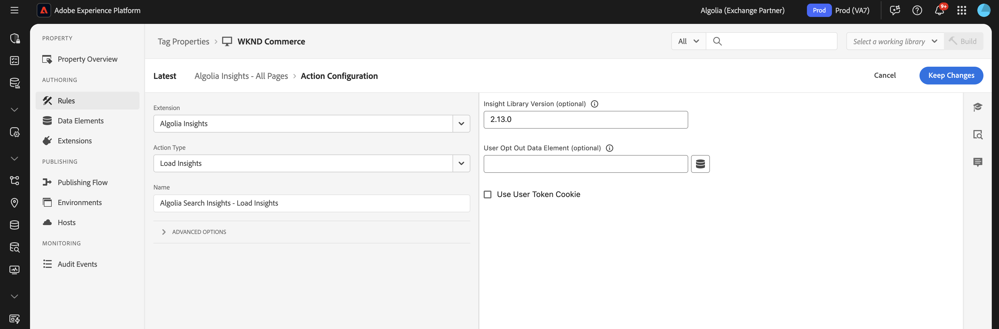

### Clicked {#clicked}

Add the **[!UICONTROL Click]** action to your tag rule to send clicked events to [!DNL Algolia]. Create a new tag rule or open an existing one. Define the conditions according to your requirements, then select **[!UICONTROL Algolia]** as the [!UICONTROL Extension] and select **[!UICONTROL Clicked]** as the [!UICONTROL Action Type].

| Property | Description |
| --- | --- |
| [!UICONTROL Event Name ] | The Event Name that can be used to further refine this click event. |
| [!UICONTROL Event Details Data Element ] | The Data Element returns event details in JSON format, including: <ul><li>`indexName` (string)</li><li>`objectIDs` (array of strings)</li><li>`queryID` (string, optional)</li><li>`positions` (array of integers, optional)</li></ul> |


>[!NOTE]
>
>If both `queryID` and `positions` are included, the event is classed as **Clicked object IDs after Search**. Otherwise, it's classed as a **Clicked object IDs** event.
><br>
>If the Data Element does not provide an `indexName`, the **Default Index Name** will be used when the event is sent.
><br>
>The same Data Element may also return fields used by other actions, such as commerce details (`price`, `quantity`, `discount`, `objectData`, `currency`) or `recordID`. Those are not click event parameters. Only the fields listed above are sent to [!DNL Algolia] with a click event.

The following example shows the event details for a click on the second search result:

```javascript
{
  indexName: "INDEX_NAME",
  objectIDs: ["objectID-1"],
  queryID: "queryID",
  positions: [2]
}
```

The extension then sends these details to [!DNL Algolia] as a [`clickedObjectIDsAfterSearch`](https://www.algolia.com/doc/libraries/search-insights/clicked-object-ids-after-search) event, adding the event name from your rule and the user token from the extension configuration.

When the click didn't come from a search, the Data Element has no `queryID` or `positions` to return, and the extension sends a [`clickedObjectIDs`](https://www.algolia.com/doc/libraries/search-insights/clicked-object-ids) event instead.

>[!IMPORTANT]
>
>Both `queryID` and `positions` are required for the after-search variant. If your Data Element returns a `queryID` but no `positions`, the extension falls back to `clickedObjectIDs` and the `queryID` is not included in the event, so the click is not attributed to the search.

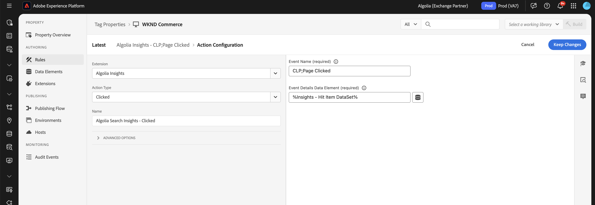

For more information on the event categories, see the [Clicked object IDs after search](https://www.algolia.com/doc/libraries/search-insights/clicked-object-ids-after-search) and [Clicked object IDs](https://www.algolia.com/doc/libraries/search-insights/clicked-object-ids) guides.

### Converted {#converted}

Add the **[!UICONTROL Converted]** action to your tag rule to send converted events to [!DNL Algolia]. Create a new tag rule or open an existing one. Define the conditions according to your requirements, then select **[!UICONTROL Algolia]** as the [!UICONTROL Extension] and select **[!UICONTROL Converted]** as the [!UICONTROL Action Type].                

| Property | Description |
| --- | --- |
| [!UICONTROL Event Name] | The Event Name that will be used to further refine this **convert** event. |
| [!UICONTROL Event Details Data Element]| The Data Element returns event details, including: <ul><li>`indexName` (string)</li><li>`objectIDs` (array of strings)</li><li>`queryID` (string, optional)</li><li>`recordID` (string, optional) — local storage key used by this action if provided; not sent to [!DNL Algolia]</li></ul> |
| [!UICONTROL Disable Removal of Event Data] | Check this box to disable removing the event data from storage. When disabled, the data can be reused for other conversion events. The default value is `false`. |

>[!NOTE]
>
>If the Data Element contains `queryID`, the event is classed as **Converted after Search**. Otherwise, it will be classed as a **Converted** event. 
><br>
>If the Data Element does not provide an `indexName`, the **Default Index Name** will be used when the event is sent. 
><br>
>The same Data Element may also return fields used by other actions, such as `positions` or commerce details (`price`, `quantity`, `discount`, `objectData`, `currency`). Those are not conversion event parameters. Only `indexName`, `objectIDs`, and `queryID` are sent to [!DNL Algolia] with a conversion event.
><br>
>If `recordID` is provided, the Converted action uses it as the key to remove the matching event from browser storage after the conversion is sent, unless [!UICONTROL Disable Removal of Event Data] is selected. The [DataSet](#dataset) and [Storage](#storage) data elements return this field automatically. If `recordID` is omitted, the conversion is still sent, but no stored event is removed.

The following example shows the event details your Data Element returns for a conversion following a search:

```javascript
{
  indexName: "INDEX_NAME",
  objectIDs: ["objectID-1"],
  queryID: "queryID",
  recordID: "/products/product-1"  // storage key, used locally only
}
```

The extension then sends these details to [!DNL Algolia] as a [`convertedObjectIDsAfterSearch`](https://www.algolia.com/doc/libraries/search-insights/converted-object-ids-after-search) event, adding the event name from your rule and the user token from the extension configuration. The `recordID` is not part of the event, since it is only used to clear the stored click data.

When the conversion didn't originate from a search, there is no `queryID` and the extension sends a [`convertedObjectIDs`](https://www.algolia.com/doc/libraries/search-insights/converted-object-ids) event instead.

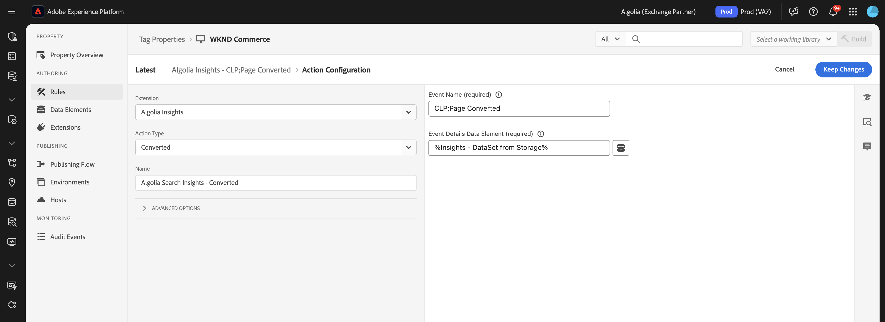

For more information on the event categories, see the [Converted object IDs after search](https://www.algolia.com/doc/libraries/search-insights/converted-object-ids-after-search) and [Converted object IDs](https://www.algolia.com/doc/libraries/search-insights/converted-object-ids) guides.

### Added to Cart {#added-to-cart}

Add the **[!UICONTROL Added to Cart]** action to your tag rule to send added to cart events to [!DNL Algolia]. Create a new tag rule or open an existing one. Define the conditions according to your requirements, then select **[!UICONTROL Algolia]** as the [!UICONTROL Extension] and select **[!UICONTROL Added to cart]** as the [!UICONTROL Action Type].

| Property | Description |
| --- | --- |
| [!UICONTROL Event Name ] | The Event Name that will be used to further refine this **add to cart** event. |
| [!UICONTROL Event Details Data Element ] | The Data Element returns event details in JSON format, including: <ul><li>`indexName` (string)</li><li>`objectIDs` (array of strings)</li><li>`queryID` (string, optional)</li><li>`objectData` (array of objects) — one object per `objectID`, each with: <ul><li>`price` (number)</li><li>`quantity` (integer)</li><li>`discount` (number, optional)</li></ul></li><li>`currency` (string, optional)</li></ul> |

>[!NOTE]
>
>If the Data Element contains `queryID`, the event will be classed as **Added to cart object IDs after Search**. Otherwise, it will be classed as a **Added to cart object IDs** event. 
><br>
>If the Data Element does not provide an `indexName`, the **Default Index Name** will be used when the event is sent. 
><br>
>If the default Data Elements do not meet your requirements, a custom Data Element can be created to return the desired event details.
><br>
>Commerce details are read from `objectData`, so include the `price`, `quantity`, and `discount` for each item there. The extension calculates the event's total `value` for you from those entries, so your Data Element does not need to provide it.
><br>
>The same Data Element may also return fields used by other actions, such as `positions` or `recordID`. Those are not add-to-cart event parameters. Only the fields listed above are sent to [!DNL Algolia] with an add-to-cart event, plus the calculated `value`.

The following example shows the event details for an add to cart event resulting from a search, where the top-level `queryID` applies to every item in `objectData`:

```javascript
{
  indexName: "INDEX_NAME",
  queryID: "queryID",
  objectIDs: ["objectID-1", "objectID-2"],
  objectData: [
    {
      price: 19.99,
      quantity: 3,
      discount: 0.2  // 20% off
    },
    {
      price: 59.99,
      quantity: 2
    }
  ],
  currency: "USD"
}
```

The extension then sends these details to [!DNL Algolia] as an [`addedToCartObjectIDsAfterSearch`](https://www.algolia.com/doc/libraries/search-insights/added-to-cart-object-ids-after-search) event, adding the event name from your rule, the user token from the extension configuration, and a `value` of `167.96` calculated from `objectData`.

When the item wasn't added to the cart from a search, there is no `queryID` and the extension sends an [`addedToCartObjectIDs`](https://www.algolia.com/doc/libraries/search-insights/added-to-cart-object-ids) event instead. The commerce details and the calculated `value` are still included.

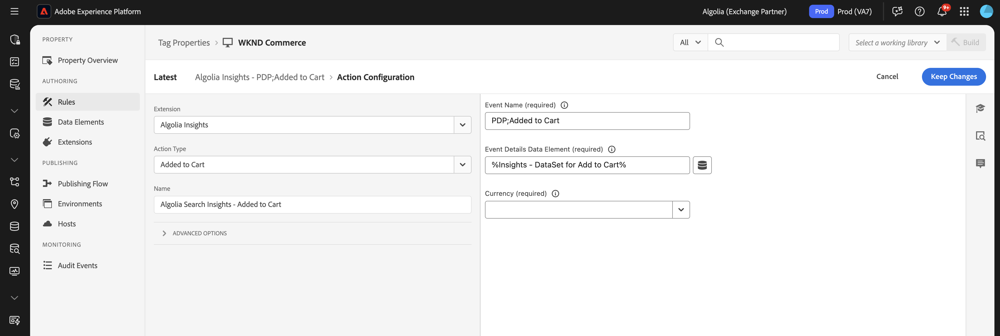 

For more information on the event categories, see the [Added to cart object IDs after search](https://www.algolia.com/doc/libraries/search-insights/added-to-cart-object-ids-after-search) and [Added to cart object IDs](https://www.algolia.com/doc/libraries/search-insights/added-to-cart-object-ids) guides.

### Purchased {#purchased}

Add the **[!UICONTROL Purchased]** action to your tag rule to send purchased events to [!DNL Algolia]. Create a new tag rule or open an existing one. Define the conditions according to your requirements, then select **[!UICONTROL Algolia]** as the [!UICONTROL Extension] and select **[!UICONTROL Purchased]** as the [!UICONTROL Action Type].

| Property | Description |
| --- | --- |
| [!UICONTROL Event Name ] | The Event Name that will be used to further refine this **purchase** event. |
| [!UICONTROL Purchased Items Data Element ] | The Data Element that returns the purchased item IDs (array of strings). These IDs are used to look up the matching events previously stored in browser storage, which are then sent to [!DNL Algolia] as a purchase event. |

>[!NOTE]
>
>The Purchased action retrieves event data from browser storage based on the purchased item IDs. If any of the purchased items contain a `queryID` in their stored data, the event will be classed as **Purchased object IDs after Search**. Otherwise, it will be classed as a **Purchased object IDs** event. 
><br>
>This approach allows the purchase event to automatically include all relevant context (query ID, index name, price, quantity, discount) from the user's earlier interactions with the items.
><br>
>Because a single purchase can include items that came from different searches (or no search at all), the `queryID` is tracked per item inside `objectData`, rather than once for the whole event. The action copies each stored item's Query ID into its `objectData` entry as it assembles the purchase event. Only items with a `queryID` are attributed to a search and included in revenue analytics; items without one are still sent as part of the purchase event, but aren't counted toward that query's revenue.
><br>
>The extension calculates the event's total `value` from the `price`, `quantity`, and `discount` of each item in `objectData`, so you do not need to provide it.
><br>
>Purchased items are grouped by index name. If a purchase contains items from more than one index, the extension sends a separate purchase event for each index. After a purchase event is sent, the extension clears the corresponding data from browser storage so that no further events are sent for those items.
><br>
>Only the following properties are sent to [!DNL Algolia] with a purchase event: `index`, `objectIDs`, `objectData` (`price`, `quantity`, `discount`, and per-item `queryID` when available), calculated `value`, and `currency`. Other stored fields, such as `positions` and `recordID`, are not purchase event parameters and are not sent.

Unlike the other actions, you don't author the event details for a purchase. The extension assembles them from browser storage and sends them as a [`purchasedObjectIDsAfterSearch`](https://www.algolia.com/doc/libraries/search-insights/purchased-object-ids-after-search) event, or as a [`purchasedObjectIDs`](https://www.algolia.com/doc/libraries/search-insights/purchased-object-ids) event when none of the purchased items came from a search. The following example shows the details it assembles for a purchase where one item was bought as the result of a search, and one wasn't:

```javascript
{
  eventName: "Order Completed",
  index: "INDEX_NAME",
  objectIDs: ["objectID-1", "objectID-2"],
  objectData: [
    {
      queryID: "queryID-1",
      price: 19.99,
      quantity: 3,
      discount: 0.2
    }, // This item was purchased as the result of a query
    {
      price: 59.99,
      quantity: 2
    } // This item isn't associated with a query and won't be included in revenue analytics
  ],
  value: 167.96,
  currency: "USD"
}
```

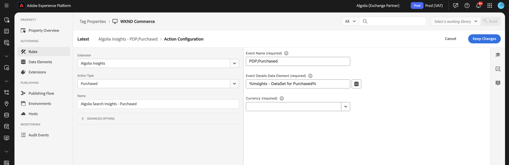 

For more information on the event categories, see the [Purchased object IDs after search](https://www.algolia.com/doc/libraries/search-insights/purchased-object-ids-after-search) and [Purchased object IDs](https://www.algolia.com/doc/libraries/search-insights/purchased-object-ids) guides.

### Viewed {#viewed}

Add the **[!UICONTROL Viewed]** action to your tag rule to send view events to [!DNL Algolia]. Create a new tag rule or open an existing one. Define the conditions according to your requirements, then select **[!UICONTROL Algolia]** as the [!UICONTROL Extension] and select **[!UICONTROL Viewed]** as the [!UICONTROL Action Type].

| Property | Description |
| --- | --- |
| [!UICONTROL Event Name ] | The Event Name that will be used to further refine this **view** event. |
| [!UICONTROL Event Details Data Element ] | The Data Element returns event details in JSON format, including: <ul><li>`indexName` (string)</li><li>`objectIDs` (array of strings)</li></ul> |

>[!NOTE]
>
>If the Data Element does not provide an `indexName`, the **Default Index Name** will be used when sending the event.
><br>
>The same Data Element may also return fields used by other actions, such as `queryID`, `positions`, commerce details (`price`, `quantity`, `discount`, `objectData`, `currency`), or `recordID`. Those are not view event parameters. Only the fields listed above are sent to [!DNL Algolia] with a view event.

The following example shows the event details for a view event covering two items:

```javascript
{
  indexName: "INDEX_NAME",
  objectIDs: ["objectID-1", "objectID-2"]
}
```

The extension then sends these details to [!DNL Algolia] as a [`viewedObjectIDs`](https://www.algolia.com/doc/libraries/search-insights/viewed-object-ids) event, adding the event name from your rule and the user token from the extension configuration. View events are never tied to a search, so they don't take a `queryID` or `positions`.

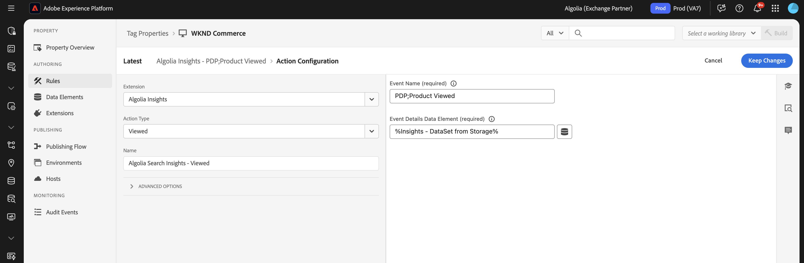 

For more information on the view event, see the [Viewed object IDs](https://www.algolia.com/doc/libraries/search-insights/viewed-object-ids) guide.

## [!DNL Algolia] Insights extension data elements {#data-elements}

[!DNL Algolia] supports a set of predefined data elements, each with specific contexts and properties. The following sections describes the data elements available in the [!DNL Algolia] Insights extension.

### DataSet {#dataset}

The DataSet Data Element retrieves data associated with HTML elements, which is then used in [!DNL Algolia] actions. This data element automatically stores the retrieved event data in the browser's local storage for later use (such as in conversion or purchase events).

**General Configuration:**

| Property | Description |
| --- | --- |
| [!UICONTROL Hit Element Div/Class Name] | The HTML Element Name and/or CSS Class Name containing the dataset attributes including `data-insights-object-id` and optionally `data-insights-query-id` and `data-insights-position` on the HTML Element. |
| [!UICONTROL Index Name Element Div/Class Name ] | The HTML Element Name and/or CSS Class Name that has the dataset attributes (`data-indexname`) on the HTML Element. |

**Commerce Configuration (Optional):**

| Property | Description |
| --- | --- |
| [!UICONTROL Price Data Element ] | Data Element that returns the price for the item as a number. If provided, this will be included in the stored event data for commerce events. |
| [!UICONTROL Quantity Data Element ] | Data Element that returns the quantity for the item as an integer. Defaults to 1 if not provided. |
| [!UICONTROL Discount Data Element ] | Data Element that returns the discount for the item as a decimal rate. For example, use `0.2` for 20% off. |
| [!UICONTROL Currency Code ] | The currency code in ISO-4217 format (string). If no currency code is specified, the default currency from the extension configuration will be used. |

**Overrides (Optional):**

These fields allow you to override the default behavior of retrieving data from HTML dataset attributes.

| Property | Description |
| --- | --- |
| [!UICONTROL Record ID Data Element ] | The record ID is the key used to store and later look up the event data to send to [!DNL Algolia] for this product/page. By default, it is the path of the link that was clicked, such as `/products/product-1`. To override this behavior, use this property to provide a data element that returns the record ID as a string. |
| [!UICONTROL Query ID Data Element ] | The Query ID is retrieved from the dataset on the HTML element. To override this behavior, use this property to provide a data element that returns the Query ID as a string. |
| [!UICONTROL Object IDs Data Element ] | The Object IDs are retrieved from the dataset on the HTML element. To override this behavior, use this property to provide a data element that returns the Object IDs as an array. |
| [!UICONTROL Positions Data Element ] | The Positions are retrieved from the dataset on the HTML element. To override this behavior, use this property to provide a data element that will return the Positions as an array. |
| [!UICONTROL Index Name Data Element ] | The Index Name is retrieved from the dataset on the HTML element. To override this behavior, use this property to provide a data element that will return the Index Name as a string. |

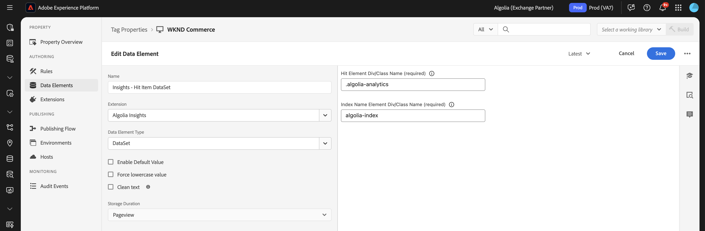

This Data Element returns:

```javascript
{
  timestamp,   // number
  queryID,     // string
  indexName,   // string
  objectIDs,   // array of strings
  positions,   // array of integers
  objectData,  // array of objects, optional: commerce data if price is provided
  currency,    // string, optional: if provided
  recordID,    // string
  raw          // object: all dataset attributes found on the HTML element
}
```

`objectData` is only included when a [!UICONTROL Price Data Element] is configured. It contains one object with the following properties, populated from the [Commerce Configuration](#dataset) fields:

| Property | Type | Description |
| --- | --- | --- |
| `price` | number | The price for the item, from the [!UICONTROL Price Data Element]. |
| `quantity` | integer | The quantity for the item, from the [!UICONTROL Quantity Data Element]. Defaults to `1` if not provided. |
| `discount` | number | The discount for the item as a decimal rate, from the [!UICONTROL Discount Data Element]. For example, use `0.2` for 20% off. |

>[!NOTE]
>
>The Query ID is returned at the top level of this Data Element, not inside `objectData`. When the [Purchased](#purchased) action later assembles a purchase event from stored items, it copies each item's Query ID into that item's `objectData` entry so revenue can be attributed per item.

An example of HTML that contains dataset:

```html
<div data-indexname="acme_master_default_products" class="instant-search-comp__hits">
  <div class="hit-card"
    data-insights-object-id="${hit.objectID}"
    data-insights-position="${hit.__position}"
    data-insights-query-id="${hit.__queryID}">
    <h4 class="hit-name">...</h4>   
  </div>
</div>
```

### Query String {#query-string}

The Query String Data Element extracts data from the URL query string to be used in [!DNL Algolia] actions.

| Property | Description |
| --- | --- |
| [!UICONTROL Object ID Param Name ] | The query param name that contains the Object ID. |
| [!UICONTROL Index Name Param Name ] | The query param name that contains the Index Name. |
| [!UICONTROL Query ID Param Name ] | The query param name that contains the Query ID. |
| [!UICONTROL Position Param Name ] | The query param name that contains the Position. |

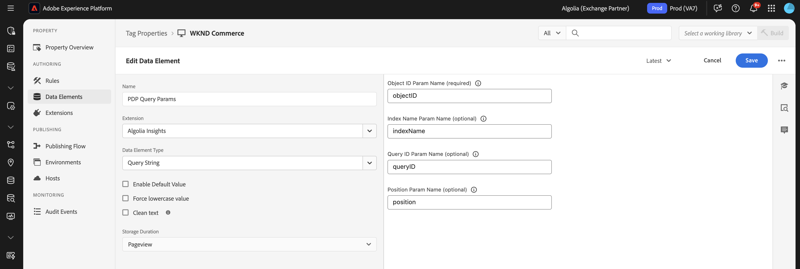 

This Data Element returns:

```javascript
{
  timestamp,  // number
  queryID,    // string
  indexName,  // string
  objectIDs,  // array of strings
  positions,  // array of integers
  raw         // object: all query string parameters
}
```

An example of HTML that contains query parameters:

```html
<a href="product.html?objectID=${hit.objectID}&queryID=${hit.__queryID}&indexName=${indexName}&position=${hit.position}">Read More</a>
```

### Storage {#storage}

The Storage Data Element retrieves data from the browser's local storage for use in [!DNL Algolia] actions. This data element can also be used to augment the stored data with additional commerce information.

This Data Element retrieves event details that were previously stored in local storage (typically by the DataSet data element during click events). The data is automatically removed during conversion events unless the removal is explicitly disabled.

**Overrides (Optional):**

| Property | Description |
| --- | --- |
| [!UICONTROL Record ID Data Element] | The Record ID is used as a key to look up the event data that is stored in browser storage. By default, it is the path of the current page, such as `/products/product-1`, which matches the record ID the [DataSet](#dataset) data element stored when the item was clicked. To override this behavior, use this property to provide a data element that returns the Record ID as a string. |
| [!UICONTROL Price Data Element ] | Data Element that returns the price for the item as a number. If provided, this will update the stored event data with price information. |
| [!UICONTROL Quantity Data Element ] | Data Element that returns the quantity for the item as an integer. If provided, this will update the stored event data with quantity information. |
| [!UICONTROL Discount Data Element ] | Data Element that returns the discount for the item as a decimal rate, such as `0.2` for 20% off. If provided, this will update the stored event data with discount information. |
| [!UICONTROL Currency Code ] | Enter the currency code in ISO-4217 format (string). If provided, this will update the stored event data with currency information. |

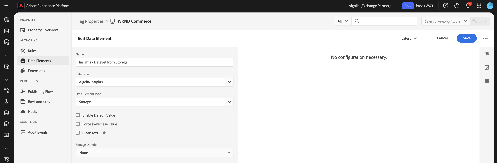 

This Data Element returns what is stored in local storage, including any augmented commerce data:

```javascript
{
  timestamp,      // number
  queryID,        // string
  indexName,      // string
  objectIDs,      // array of strings
  positions,      // array of integers, if available from original event
  objectData,     // array of objects: commerce data for the item
  currency,       // string, optional: if provided
  recordID,       // string
  raw             // object: all dataset attributes from the original event
}
```

`objectData` contains one object holding the commerce details for the item, carried over from the original stored event and updated with any values supplied through the [Overrides](#storage) fields above:

| Property | Type | Description |
| --- | --- | --- |
| `price` | number | The price for the item, from the [!UICONTROL Price Data Element]. |
| `quantity` | integer | The quantity for the item, from the [!UICONTROL Quantity Data Element]. |
| `discount` | number | The discount for the item as a decimal rate, from the [!UICONTROL Discount Data Element]. For example, use `0.2` for 20% off. |

>[!NOTE]
>
>`objectData` is always returned, even when no commerce values are available. In that case, it contains a single empty object.
><br>
>Any commerce values you supply through the [!UICONTROL Price Data Element], [!UICONTROL Quantity Data Element], [!UICONTROL Discount Data Element], and [!UICONTROL Currency Code] fields are also written back to browser storage. This is how commerce details reach the [Purchased](#purchased) action, which reads its event data from storage rather than from a Data Element.
><br>
>If no event is stored for the Record ID, this Data Element returns only `recordID` and an empty `objectData`. Actions that depend on `objectIDs` do not send an event in that case.

## Clicked or Converted after Search {#clicked-converted-after-search}

The *Clicked after Search* or *Converted after Search* events require a `queryID`, and `positions` is also required for *Clicked after Search*. These properties are available when the `insights` flag is enabled in InstantSearch and/or Autocomplete query parameters. Refer to the following resources to learn how to configure Insights for your site:

* [Setting up Insights on Autocomplete](https://www.algolia.com/doc/ui-libraries/autocomplete/api-reference/autocomplete-js/autocomplete/#param-insights)
* [Setting up Insights on InstantSearch.js](https://www.algolia.com/doc/guides/building-search-ui/events/js/#set-the-insights-option-to-true)
* [Get started with click and conversion events](https://www.algolia.com/doc/guides/sending-events/implementing/how-to/sending-events-backend/)
* [Sending [!DNL Algolia] Insights events](https://www.algolia.com/doc/ui-libraries/autocomplete/guides/sending-algolia-insights-events/)
* [[!DNL Algolia] Launch Extension GitHub Repository](https://github.com/algolia/algolia-launch-extension)
* [InstantSearch.js Documentation](https://www.algolia.com/doc/guides/building-search-ui/what-is-instantsearch/js/)
* [[!DNL Algolia] Insights API Documentation](https://www.algolia.com/doc/rest-api/insights/)
* [Algolia Launch Extension Code Repo](https://github.com/algolia/algolia-launch-extension)

## Next steps {#next-steps}

This guide covered how to send data to [!DNL Algolia] using the [!DNL Algolia Insights] tag extension. If you are planning on also sending server-side events to [!DNL Algolia], you can now proceed to install and configure the [[!DNL Conversions API] event forwarding extension](../../server/algolia/overview.md).

For more information on tags in Experience Platform, refer to the [tags overview](../../../home.md).
