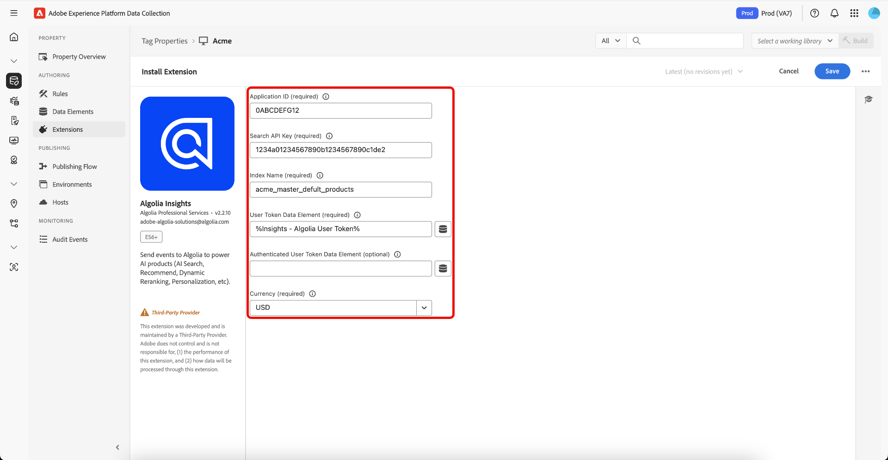

# Algolia Launch extension overview

>[!NOTE]
>
>Adobe Experience Platform Launch has been rebranded as a suite of data collection technologies in Adobe Experience Platform. Several terminology changes have rolled out across the product documentation as a result. Please refer to the following [document](../../term-updates.md) for a consolidated reference of the terminology changes.

The Algolia Launch extension allows Marketers set up rules to send events to Algolia to power AI Search and Discovery experience. This extension uses one main component:

* **Algolia Insights**: Send user interaction events to Algolia to power analytics, personalization, and search relevance improvement.


## Prerequisites

* An Algolia account with a valid Application ID and API Key
* Permissions to install extensions in Adobe Experience Platform

## Configure the Algolia Insights extension

If the Algolia Insights extension is not yet installed, open your property, then select **[!UICONTROL Extensions > Catalog]**, hover over the Algolia Insights extension, and select **[!UICONTROL Install]**.

To configure the extension, open the Extensions tab, hover over the extension, and then select **[!UICONTROL Configure]**.



| Property                              | Description                                                                                                                                          |
|---------------------------------------|------------------------------------------------------------------------------------------------------------------------------------------------------|
| Application ID                        | Enter the Application Id which can be found in the on the Algolia Dashboard in the [API Keys](https://www.algolia.com/account/api-keys/all) section. |
| Search API Key                        | Enter Search API Key which can be found in the on the Algolia Dashboard in the [API Keys](https://www.algolia.com/account/api-keys/all) section.     |
| Index Name                            | Enter the Index Name that contain the Products or Content.  This Index will be used as a default.                                                    |
| User Token Data Element               | Set the Data Element that will return the User Token.                                                                                                |
| Authenticated User Token Data Element | Set the Data Element that will return the Authenticated User Token.                                                                                  |
| Currency                              | Select a currency type.  The default value is `USD`.                                                                                                 |


## Algolia Insights extension action types

This section describes the action types available in the Algolia Insights extension. It provides the following actions in the Then portion of a rule:

### Load Insights

Add this action to your tag rule where it makes sense to load Algolia Insights in the context of your rule. This loads the `search-insights.js` library into the page. In most implementations, Algolia Insights should be loaded on every page of your site. Select **[!UICONTROL Rules]**, then **[!UICONTROL Add Rule]** or select an existing rule. In the Then portion of a rule, add the action and select **[!UICONTROL Extension]** `Algolia Insights`, then **[!UICONTROL Action Type]** `Load Insights`.


| Property                  | Description                                                                                        |
|---------------------------|----------------------------------------------------------------------------------------------------|
| Use User Token Cookie     | Check this box if you want Algolia to generate a User Token cookie.  The default value is `false`. |
| Insight Library Version   | Enter the Algolia Insight version.  The default value is `2.13.0`.                                 |
| User Opt Out Data Element | Select a Data Element that will retrieve the user's decision on tracking.                          |


### Clicked

Add this action to your tag rule to send a clicked event to Algolia. Select **[!UICONTROL Rules]**, then **[!UICONTROL Add Rule]** or select an existing rule. In the Then portion of a rule, add the action and select **[!UICONTROL Extension]** `Algolia Insights`, then **[!UICONTROL Action Type]** `Clicked`.


| Property                              | Description |
|---------------------------------------|--------------|
| Event Name                            | Enter the Event Name that can be used to further refine this `click` event |
| Event Type                            | Automatically set as `click` |
| Event Details Data Element            | Select a Data Element that will retrieve the event details (`indexName`, `objectIDs`, `queryID` (optional), `position` (optional)). If the Data Element contains `queryID` and `position`, the event will be classed as *Clicked object IDs after Search* otherwise it will be considered a *Clicked object IDs* event. If Index Name is not available from the Data Element, then the default Index Name will be used when sending events. |
| User Token Data Element               | Select a Data Element that will retrieve the User Token. |
| Authenticated User Token Data Element | Set the Data Element that will return the Authenticated User Token. |

### Converted

Add this action to your tag rule to send a converted event to Algolia. Select **[!UICONTROL Rules]**, then **[!UICONTROL Add Rule]** or select an existing rule. In the Then portion of a rule, add the action and select **[!UICONTROL Extension]** `Algolia Insights`, then **[!UICONTROL Action Type]** `Converted`.

                  

| Property                   | Description                                                                                                                                                                                                                                                                                                                                                                                               |
|----------------------------|-----------------------------------------------------------------------------------------------------------------------------------------------------------------------------------------------------------------------------------------------------------------------------------------------------------------------------------------------------------------------------------------------------------|
| Event Name                 | Enter the Event Name that can be used to further refine this `convert` event                                                                                                                                                                                                                                                                                                                              |
| Event Type                 | Automatically set as `convert`                                                                                                                                                                                                                                                                                                                                                                            |
| Event Details Data Element | Select a Data Element that will retrieve the event details (`indexName`, `objectIDs`, `queryID` (optional)). If the Data Element contains `queryID`, the event will be classed as *Converted object IDs after Search* otherwise it will be considered a *Converted object IDs* event.  If Index Name is not available from the Data Element, then the default Index Name will be used when sending events. |


### Converted - Added to Cart

Add this action to your tag rule to send a clicked event to Algolia. Select **[!UICONTROL Rules]**, then **[!UICONTROL Add Rule]** or select an existing rule. In the Then portion of a rule, add the action and select **[!UICONTROL Extension]** `Algolia Insights`, then **[!UICONTROL Action Type]** `Added to Cart`.

 

| Property                   | Description                                                                                                                                                                                                                                                                                                                                                                                                                                |
|----------------------------|--------------------------------------------------------------------------------------------------------------------------------------------------------------------------------------------------------------------------------------------------------------------------------------------------------------------------------------------------------------------------------------------------------------------------------------------|
| Event Name                 | Enter the Event Name that can be used to further refine this `convert` event                                                                                                                                                                                                                                                                                                                                                               |
| Event Type                 | Automatically set as `convert`                                                                                                                                                                                                                                                                                                                                                                                                             |
| Sub Event Type             | Automatically set as `addToCart`                                                                                                                                                                                                                                                                                                                                                                                                           |
| Event Details Data Element | Select a Data Element that will retrieve the event details (`indexName`, `objectIDs`, `queryID` (optional), `objectData` (optional)). If the Data Element contains `queryID`, the event will be classed as *Added to Cart object IDs after Search* otherwise it will be considered a *Added to Cart object IDs* event.  If Index Name is not available from the Data Element, then the default Index Name will be used when sending events. |

### Converted - Purchased

Add this action to your tag rule to send a clicked event to Algolia. Select **[!UICONTROL Rules]**, then **[!UICONTROL Add Rule]** or select an existing rule. In the Then portion of a rule, add the action and select **[!UICONTROL Extension]** `Algolia Insights`, then **[!UICONTROL Action Type]** `Purchased`.

 

| Property                   | Description                                                                                                                                                                                                                                                                                                                                                                                                                        |
|----------------------------|------------------------------------------------------------------------------------------------------------------------------------------------------------------------------------------------------------------------------------------------------------------------------------------------------------------------------------------------------------------------------------------------------------------------------------|
| Event Name                 | Enter the Event Name that can be used to further refine this `convert` event                                                                                                                                                                                                                                                                                                                                                       |
| Event Type                 | Automatically set as `convert`                                                                                                                                                                                                                                                                                                                                                                                                     |
| Sub Event Type             | Automatically set as `purchase`                                                                                                                                                                                                                                                                                                                                                                                                    |
| Event Details Data Element | Select a Data Element that will retrieve the event details (`indexName`, `objectIDs`, `queryID` (optional), `objectData` (optional)). If the Data Element contains `queryID`, the event will be classed as *Purchased object IDs after Search* otherwise it will be considered a *Purchased object IDs* event.  If Index Name is not available from the Data Element, then the default Index Name will be used when sending events. |

### Viewed

Add this action to your tag rule to send a clicked event to Algolia. Select **[!UICONTROL Rules]**, then **[!UICONTROL Add Rule]** or select an existing rule. In the Then portion of a rule, add the action and select **[!UICONTROL Extension]** `Algolia Insights`, then **[!UICONTROL Action Type]** `Viewed`.

 

| Property                   | Description                                                                                                                                                                                               |
|----------------------------|-----------------------------------------------------------------------------------------------------------------------------------------------------------------------------------------------------------|
| Event Name                 | Enter the Event Name that can be used to further refine this `view` event                                                                                                                                 |
| Event Type                 | Automatically set as `view`                                                                                                                                                                               |
| Event Details Data Element | Select a Data Element that will retrieve the event details (`indexName`, `objectIDs`). If Index Name is not available from the Data Element, then the default Index Name will be used when sending events. |


## Algolia Insights extension data elements

This section describes the data elements available in the Algolia Insights extension.

### DataSet

The DataSet Data Element returns the data associated to the HTML elements to be used for Algolia Actions.

 

| Property                          | Description                                                                                                                                                                                                  |
|-----------------------------------|--------------------------------------------------------------------------------------------------------------------------------------------------------------------------------------------------------------|
| Hit Element Div/Class Name        | Enter the HTML Element Name and/or CSS Class Name that has the dataset attributes (`data-insights-object-id`, `data-insights-query-id` (optional), `data-insights-position` (optional)) on the HTML Element. |
| Index Name Element Div/Class Name | Enter the HTML Element Name and/or CSS Class Name that has the dataset attributes (`data-indexname`) on the HTML Element.                                                                                    |

This Data Element returns:

```javascript
{
  timestamp,
    queryID,
    indexName,
    objectIDs,
    positions
}
```

#### Example of HTML that contains dataset.

```
<div data-indexname="magento2_master_default_products" class="instant-search-comp__hits">
...
<div class="hit-card"
    data-insights-object-id="${hit.objectID}"
    data-insights-position="${hit.__position}"
    data-insights-query-id="${hit.__queryID}">
    <h4 class="hit-name">...</h4>
      
</div>
...
</div>
```

#### Query String

The Query String Data Element returns the data from the url query to be used for Algolia Actions.

 

| Property                         | Description                                              |
|----------------------------------|----------------------------------------------------------|
| Object ID Param Name             | Enter the query param name that contains the Object Id.  |
| Index Name Param Name (Optional) | Enter the query param name that contains the Index Name. |
| Query ID Param Name (Optional)   | Enter the query param name that contains the Query Id.   |
| Position Param Name (Optional)   | Enter the query param name that contains the Position.   |

This Data Element returns:

```javascript
{
  timestamp,
    queryID,
    indexName,
    objectIDs
}
```

##### Example of HTML that contains query parameters.

```
<a href="product.html?objectID=${hit.objectID}&queryID=${hit.__queryID}&indexName=${indexName}&position=${hit.position}">Read More</a></div>
```

#### Storage

The Storage Data Element returns the data from Session Storage to be used for Algolia Actions.

 

This Data Element uses the Session Storage to get the event details. There is no configuration needed for this Data
Element. The data is added in the *click* event action automatically. On *convert* event action, the data is removed.

This Data Element returns what is stored in the Session Storage.

```javascript
{
  timestamp,
    queryID,
    indexName,
    objectIDs
}
```


## Clicked or Converted after Search

### InstantSearch & Autocomplete

The Clicked or Converted after Search requires a `queryID`. `position` is required on Clicked after Search. These two
properties are available when `insights` flag is enabled on InstantSearch and/or Autocomplete qeury parameters. Please review below resources to learn and configure Insights for you site.

#### Resources

* [Setting up Insights on Autocomplete](https://www.algolia.com/doc/ui-libraries/autocomplete/api-reference/autocomplete-js/autocomplete/#param-insights)
* [Setting up Insights on InstantSearch.js](https://www.algolia.com/doc/guides/building-search-ui/events/js/#set-the-insights-option-to-true)
* [Get started with click and conversion events](https://www.algolia.com/doc/guides/sending-events/implementing/how-to/sending-events-backend/)
* [Sending Algolia Insights events](https://www.algolia.com/doc/ui-libraries/autocomplete/guides/sending-algolia-insights-events/)
* [Algolia Launch Extension GitHub Repository](https://github.com/algolia/algolia-launch-extension)
* [InstantSearch.js Documentation](https://www.algolia.com/doc/guides/building-search-ui/what-is-instantsearch/js/)
* [Algolia Insights API Documentation](https://www.algolia.com/doc/rest-api/insights/)