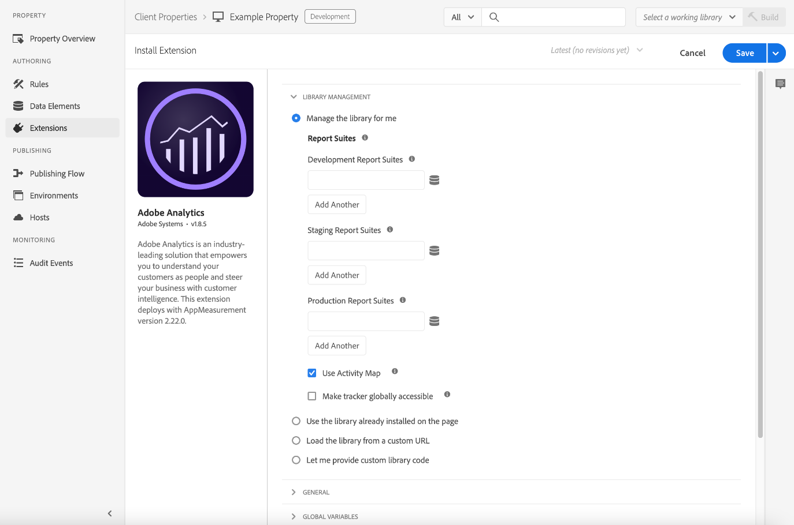
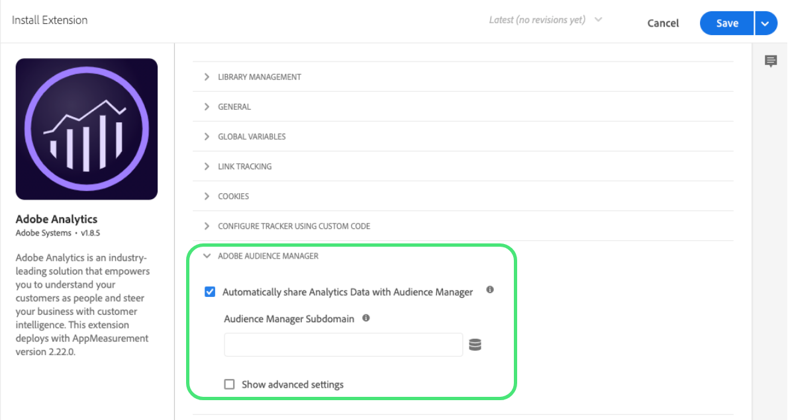
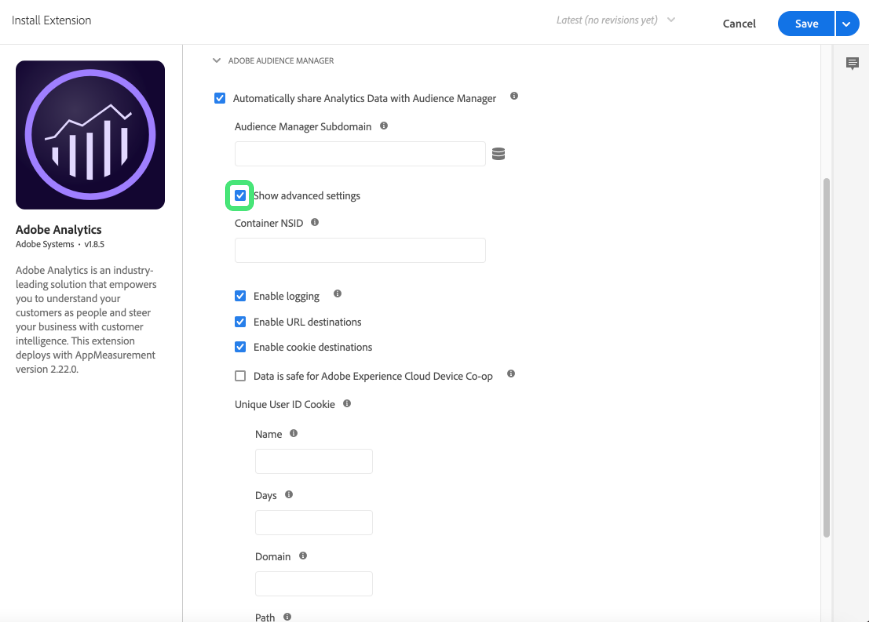

# Adobe Analytics extension overview

>[!NOTE]
>
>Adobe Experience Platform Launch has been rebranded as a suite of data collection technologies in Adobe Experience Platform. Several terminology changes have rolled out across the product documentation as a result. Please refer to the following [document](../../../term-updates.md) for a consolidated reference of the terminology changes.

Use this reference for information about configuring the Adobe Analytics extension, and the options available when using this extension to build a rule.

## Configure the Adobe Analytics extension

This section provides a reference for the options available when configuring the Adobe Analytics extension.

If the Adobe Analytics extension is not yet installed, open your property, then select **[!UICONTROL Extensions > Catalog]**, hover over the Adobe Analytics extension, and select **[!UICONTROL Install]**.

To configure the extension, open the Extensions tab, hover over the extension, and then select **[!UICONTROL Configure]**.



## Library Management

Select an option from the Library Management section of the configuration page. The following configuration options are available:

### Manage the library for me

#### Report Suites

Specify one or more report suites for each of the following environments:

* Development
* Staging
* Production

### Use the library already installed on the page

#### Set the following report suites on tracker

If you select this option, specify one or more report suites for each of the following environments:

* Development
* Staging
* Production

#### Using the activity map module

The activity map is loaded as a separate module (like the AAM module). By default activity map is turned on, but if you would prefer to turn it off you can do so by unchecking the box in the configuration.  

#### Tracker is accessible on the global variable named

Checking this box allows the tracker object to be used globally. For example, you could define the variable `window.s.pageName` anywhere on your site.

### Load the library from a custom URL

#### HTTP URL

Specify the URL where the library is located.

#### HTTPS URL

Specify the URL where the library is located.

#### Set the following report suites on tracker

If you select this option, specify one or more report suites for each of the following environments:

* Development
* Staging
* Production

#### Tracker is accessible on the global variable named

Specify the tracker object to be used globally.

### Let me provide custom library code

#### Open Editor

Lets you insert core [AppMeasurement.js](https://experienceleague.adobe.com/docs/analytics/implementation/js/overview.html) code. This code is populated automatically when using the automatic configuration method.

>[!NOTE]
>
>The validator used in the tags code editor is designed to identify issues with developer-written code. Code that has gone through a minification process--such as the AppMeasurement.js code downloaded from the Code Manager--might be falsely flagged as having issues by the tags validator, which can usually be ignored.

#### Set the following report suites on tracker

If you select this option, specify one or more report suites for each of the following environments:

* Development
* Staging
* Production

#### Tracker is accessible on the global variable named

Specify the tracker object to be used globally.

## General

Select an option from the General section of the configuration page. The following configuration options are available:

### Enable EU compliance for Adobe Analytics

Enables or disables tracking based on the EU privacy cookie.

When you check the EU Compliance check box, the [!UICONTROL Tracking Cookie Name] field appears. The Tracking Cookie overrides the default tracking cookie name. You can customize the name that tags uses to track your opt-out status for receiving other cookies.

When a page is loaded, the system checks to see if a cookie called sat\_track is set (or the custom cookie name specified on the Edit Property page). Consider the following information:

* If the cookie does not exist or if the cookie exists and is set to anything but true, the loading of the tool is skipped when this setting is enabled. Meaning, any portion of a rule that uses the tool will not apply. If a rule has analytics with EU compliance on and third-party code, and the cookie is set to false, the third-party code still runs. However, the analytics variables will not be set.
* If the cookie exists but it is set to true, the tool loads normally.

You are responsible for setting the sat\_track (or custom named) cookie to false if a visitor opts out. You can accomplish this using custom code:

```javascript
_satellite.cookie.set("sat_track", "false");
```

You must also have a mechanism to set that cookie to true if you want a visitor to be able to opt in later:

```javascript
_satellite.cookie.set("sat_track", "true");
```

### Character Set

Determines how the image request is encoded. If your implementation or site uses non-ASCII characters, it is important to define character set here. You can select a preset character set or specify a custom character set. Adobe recommends using the same character coding as your site. Typically this value is UTF-8.

Character Set can be set in Analytics custom code using the variable `s.charSet`.
For more information about character sets, see the [charSet documentation](https://experienceleague.adobe.com/docs/analytics/implementation/vars/config-vars/charset.html).

### Currency Code

Determines the conversion rate to be applied to revenue and currency events. If your site allows visitors to purchase in multiple currencies, setting the currency code ensures the monetary amount is converted and stored correctly.

For more information about the supported currency codes, see [currencyCode](https://experienceleague.adobe.com/docs/analytics/implementation/vars/config-vars/currencycode.html).

### Tracking Server

Used for first-party cookie implementations to dictate where the first-party cookie is stored. If you use the Experience Cloud ID Service, Adobe advises against populating this field.

Tracking Server can be set in Analytics custom code using the variable `s.trackingServer`.

See [trackingServer](https://experienceleague.adobe.com/docs/analytics/implementation/vars/config-vars/trackingserver.html) in the Adobe Analytics Implementation guide.

### SSL Tracking Server

Used for SSL first-party cookie implementations to dictate where the first-party cookie is stored. If you use the Experience Cloud ID Service, Adobe advises against populating this field. If not defined, SSL data uses Tracking Server.

SSL Tracking Server can be set in Analytics custom code using the variable `s.trackingServerSecure`.

See [trackingServerSecure](https://experienceleague.adobe.com/docs/analytics/implementation/vars/config-vars/trackingserversecure.html).

## Global Variables

Use this section to set up [eVars and Props](https://experienceleague.adobe.com/docs/analytics/implementation/vars/page-vars/evar.html), and to create hierarchies.

Global variables are variables that are set on the Analytics tracking object when that object is initialized on the page. Any variables you set here will be set when the tracking object is created on each page. Once these variables are set, they are just like any other variables set any other way. Specifically, this means that a rule can modify, change, or clear these variables.

If your web application typically sends one beacon per page, this section can help make it simple to set your variables in one place. If your application sends more than one beacon per page (such as in a single-page application), and you need to clear your variables and reset them using the same tracking object, it is simpler to rely on rules to set and clear your variables.

## Link Tracking

Select an option from the Link Tracking section of the configuration page. The following configuration options are available:

### Enable ClickMap

[ClickMap](https://experienceleague.adobe.com/docs/analytics/analyze/activity-map/activity-map.html) is a plug-in for Internet Explorer and Firefox, and a module of Reports & Analytics.

### Track download links

Tracks links to downloadable files on your site.

See [s.trackDownLoadLinks](https://experienceleague.adobe.com/docs/analytics/implementation/vars/config-vars/trackdownloadlinks.html).

### Download Extensions

If the Track Download Links option is enabled, you can select the extensions of file links that are included in the Downloads Report If your site contains links to files with any of the listed extensions, the URLs of these links will appear in reporting.

See [s.linkDownloadFileTypes](https://experienceleague.adobe.com/docs/analytics/implementation/vars/config-vars/linkdownloadfiletypes.html).

### Track outbound links

Determines whether any selected link is an exit link.

See [s.trackExternalLinks](https://experienceleague.adobe.com/docs/analytics/implementation/vars/config-vars/trackexternallinks.html).

**Single-Page App Considerations:** Because of the way some SPA websites are coded, an internal link to a page on the SPA site might look like it is an outbound link.

You can use one of the following methods to track outbound links from SPA sites:

* If you do not want to track any outbound links from your SPA, insert an entry into the Never Track section.  For example, `http://testsite.com/spa/\#`. All \# links to this host are ignored. All outbound links to other hosts are tracked, such as [https://www.google.com](https://www.google.com).
* If there are some links that you want to track on your SPA, use the Always Track section.

For example, if you have a spa/\#/about page, you could put "about" in the Always Track section.

The "about" page is the only outbound link that is tracked. Any other links on the page (for example, [https://www.google.com](https://www.google.com)) are not tracked.

>[!NOTE]
>
>These two options are mutually exclusive.

### Keep URL Parameters

Preserves query strings.

See [s.linkLeaveQueryString](https://experienceleague.adobe.com/docs/analytics/implementation/vars/config-vars/linkleavequerystring.html).

## Cookies

Configure field descriptions for the Cookies global settings used for deploying the Adobe Analytics extension. The following configuration options are available:

### Visitor ID

Unique value that represents a customer in both the online and offline systems.

See [visitorID](https://experienceleague.adobe.com/docs/analytics/implementation/vars/config-vars/visitorid.html).

### Visitor Namespace

Variable to identify the domain with which cookies are set.

See [visitorNamespace](https://experienceleague.adobe.com/docs/analytics/implementation/vars/config-vars/visitornamespace.html).

### Domain Periods

The domain on which the Analytics cookie `s_cc` and `s_sq` are set by determining the number of periods in the domain of the page URL. This variable is also used by some plug-ins in determining the correct domain to set the plug-in's cookie.

See [s.cookieDomainPeriods](https://experienceleague.adobe.com/docs/analytics/implementation/vars/config-vars/cookiedomainperiods.html).

### First-Party Domain Periods

The `fpCookieDomainPeriods` variable is for cookies set by JavaScript (`s_sq`, `s_cc`, plug-ins) that are inherently first-party cookies, even if your implementation uses the third-party 2o7.net or omtrdc.net domains.

See [s.fpCookieDomainPeriods](https://experienceleague.adobe.com/docs/analytics/implementation/vars/config-vars/fpcookiedomainperiods.html).

### Cookie Lifetime

Determines the life span of a cookie.

See [s.cookieLifetime](https://experienceleague.adobe.com/docs/analytics/implementation/vars/config-vars/cookielifetime.html).

### Secure Cookies

This variable allows AppMeasurement to write secure cookies.

See [writeSecureCookies](https://experienceleague.adobe.com/docs/analytics/implementation/vars/config-vars/writesecurecookies.html)


## Customize Page Code

Use the editor to customize your page code.

## Adobe Audience Manager

Use this section of the extension configuration to specify how Audience Manager works with Analytics.

Enable **Automatically share Analytics data with Audience Manager**.

The following options appear:



The Audience Manager subdomain is assigned by Adobe Audience Manager. It is sometimes referred to as your "Partner Name" or "Partner Subdomain." Contact your Adobe consultant or Customer Care if you do not know your Partner Name.

You can configure advanced settings by selecting **Show advanced settings** and entering your preferences.



For information about each setting, select the info icon, or refer to the [Adobe Audience Manager documentation](https://experienceleague.adobe.com/docs/audience-manager/user-guide/aam-home.html).

## Analytics extension action types

This section describes the action types available in the Analytics extension.

The Analytics extension provides the following actions:

* [Set Variables](#set-variables)
* [Send Beacon](#send-beacon)
* [Clear Variables](#clear-variables)

### Set Variables {#set-variables}

Important: Using a "set variables" action won't send the beacon. You must use the "send beacon" action.

#### eVars

Set one or more [eVars](https://experienceleague.adobe.com/docs/analytics/implementation/vars/page-vars/evar.html).

1. Select an eVar from the dropdown.
1. Specify whether you want to set the eVar as the value (Set As) or copy (Duplicate From) another eVar.
1. Provide a Set As value, or select the eVar you want to duplicate.
1. (Optional) Select Add eVar to set more eVars.
1. Select **[!UICONTROL Keep Changes]**.

#### Props

Set one or more [props](https://experienceleague.adobe.com/docs/analytics/implementation/vars/page-vars/prop.html).

1. Select a prop from the dropdown.
1. Specify whether you want to set the prop as the value (Set As) or copy (Duplicate From) another eVar.
1. Provide a Set As value, or select the eVar you want to duplicate the prop from.
1. (Optional) Select **[!UICONTROL Add prop]** to set more props.
1. Select **[!UICONTROL Keep Changes]**.

#### Events

Set one or more [events](https://experienceleague.adobe.com/docs/analytics/implementation/vars/page-vars/events/events-overview.html).

1. Select an event from the dropdown.
1. (Optional) Select or specify a data element used for [event serialization](https://experienceleague.adobe.com/docs/analytics/implementation/vars/page-vars/events/event-serialization.html).
1. (Optional) Select **[!UICONTROL Add event]** to set more events.
1. Select **[!UICONTROL Keep Changes]**.

#### Hierarchy

Set the Analytics [Hierarchy](https://experienceleague.adobe.com/docs/analytics/implementation/vars/page-vars/hier.html) variable.

Specify each level in the hierarchy.

If desired, configure additional hierarchies.

#### Page name

This value refers to the name of a given page, and corresponds to the [`pageName` variable](https://experienceleague.adobe.com/docs/analytics/implementation/vars/page-vars/pagename.html) in Analytics.

>[!IMPORTANT]
>
>In Adobe Experience Manager implementations, this variable tells AEM where to store the fetched Analytics report. To ensure that reports are properly persisted, the page name string must be formatted as a colon-separated path to the site.
>
>For example, a webpage at `content/we-retail/language-masters/en/men.html` should have page name value of `content:we-retail:language-masters:en:men`.

#### Other information

Specify other information used by your pages.

These settings include:

* Page URL
* Server
* Channel
* Referrer
* Campaign
* Purchase ID

  Specify either a value or a query parameter

* State
* Zip
* Transaction ID

These settings can be found in the "Global Variables" menu by selecting  the "Additional Settings" checkbox.

#### Custom Page Code

**Description**

Use the editor to specify your custom page code.

**Settings**

1. Select **[!UICONTROL Open Editor]**.
1. Type the custom code.
1. Select **[!UICONTROL Save]**.

### Send Beacon {#send-beacon}

#### Increment a pageview - s.t()

Select if you want to increment a pageview.

#### Do not increment a pageview - s.tl()

Select if you do not want to increment a pageview.

**Settings**

1. Select a link type.

   You can select one of the following:

   * Custom Link
   * Download Link
   * Exit Link

1. Set the parameter for the selected link.
   * Custom Link: Specify the link name.
   * Download Link: Specify a file name.
   * Exit Link: Specify the destination URL.
1. Select **[!UICONTROL Keep Changes]**.

### Clear Variables {#clear-variables}

There are no configuration options if the Clear Variables action type is selected.
