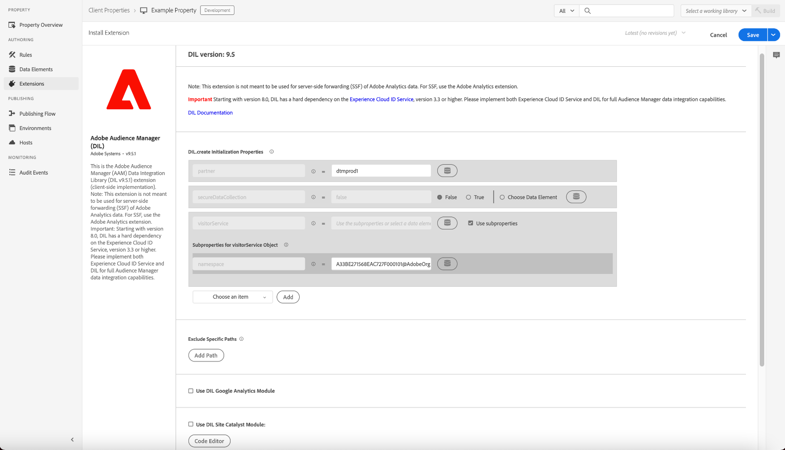

# Adobe Audience Manager extension overview

>[!NOTE]
>
>Adobe Experience Platform Launch has been rebranded as a suite of data collection technologies in Adobe Experience Platform. Several terminology changes have rolled out across the product documentation as a result. Please refer to the following [document](../../../term-updates.md) for a consolidated reference of the terminology changes.

With the Audience Manager tag extension, you can integrate the DIL code used by Audience Manager with your properties in Adobe Experience Platform.

Use this reference for information about the options available when using this extension to build a rule.

>[!NOTE]
>
>This extension is not meant to be used for event forwarding of Adobe Analytics data. For event forwarding, use the [Adobe Analytics extension](../analytics/overview.md).

## Configure the Adobe Audience Manager extension

If the Adobe Audience Manager extension is not yet installed, open your property, then select **[!UICONTROL Extensions > Catalog]**, hover over the Adobe Audience Manager extension, and select **[!UICONTROL Install]**.

To configure the extension, open the [!UICONTROL Extensions] tab, hover over the extension, and then select **[!UICONTROL Configure]**.

### DIL Settings

Configure your DIL settings. The following configuration options are available:

#### DIL Version

Shows the Data Integration Library (DIL) version.

This setting cannot be changed.

#### Exclude Specific Paths

If the URL matches any of the excluded paths, the extension is not loaded.

Select **[!UICONTROL Add Path]** to specify an excluded URL.

Enable Regex if the URL is a regular expression.

#### Use DIL Site Catalyst Module

The [SiteCatalyst module](https://experiencecloud.adobe.com/resources/help/en_US/aam/r_dil_sc_init.html) works with DIL to send Analytics tag elements to Audience Manager.

Use the Code Editor to configure the siteCatalyst.init file.

You can also create a note containing information about this configuration.

#### Use DIL Google Analytics Module

Enable the [Google Analytics module](https://experiencecloud.adobe.com/resources/help/en_US/aam/dil-google-universal-analytics.html).

#### DIL.create Initialization Properties

Add initialization properties used by [DIL.create](https://experiencecloud.adobe.com/resources/help/en_US/aam/r_dil_create.html) and the namespace subproperty for the [visitorService object](https://experiencecloud.adobe.com/resources/help/en_US/aam/r_dil_visitor_service.html). Two sample use cases are included in the code comments, in the Code Editor.

Select **[!UICONTROL Choose an Item]** to add additional properties.

Hover over the "i" icons to learn what each property does. You can find more information for the properties in the [Audience Manager DIL documentation](https://experiencecloud.adobe.com/resources/help/en_US/aam/r_dil_create.html).

Select **[!UICONTROL Save]** when you have finished configuring the extension.

## Adobe Audience Manager extension action types

This topic describes the action types available in the Audience Manager extension.

The Adobe Audience Manager extension provides the following actions in the Then portion of a rule:

### Run Custom Code

Run the custom code configured in the code editor.

Enter the desired code in the Code Editor, then provide a name for the code. This code will become available in the Then portion of the rule builder.

You can also add a note with information about the configuration.
