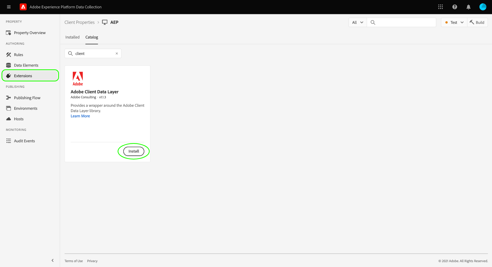

# Adobe Client Data Layer extension

This documentation provides examples and best practices on how to use the Adobe Client Data Layer extension.

<!-- (Missing document?)
If you would like to have more details on development consideration, [please reach this page](./dev.md). -->

## Installation

In order to install the extension, navigate to the extension catalog in the Experience Platform UI or Data Collection UI and select Adobe Client Data Layer.



<!-- (GitHub link?)
There is also the possibility to fork this project. You can download this github project, realize the change that you deem required for your specific use-case and re-upload it on your Organization as a private extension.
This installation will not be supported on our end.<br>
>[!NOTE]
>
> _Consider renaming the extension name in the extension.json file_ -->

## Extension View

By default the ACDL script creates a new data layer with the variable name `adobeDataLayer`. The extension view provides you with the possibility to change this name if you wish. The name that you have set will be instantiated when tags are loaded.

>[!NOTE]
>
>When changing the object name, the original `adobeDataLayer` object is still being instantiated and then being duplicated to the new variable name you have selected.

## Events

The extension provides you with the possibility to listen to events on the Data Layer. The following events are available:

### Listen to all data changes

If you select this option, your event listener listens to any change made to the data layer.

>[!IMPORTANT]
>
>Pushing events does not change data layer itself.

The following example push events would be tracked by the listener:

* ` adobeDataLayer.push({"data":"something"})`
* ` adobeDataLayer.push({"event":"myevent","data":"something"})`

The following example push event would not be tracked by the listener:

* ` adobeDataLayer.push({"event":"myevent"})`

### Listen to all events

If you select this option, your event listener listens to any event pushed to the data layer.

The following example push events would be tracked by the listener:

* ` adobeDataLayer.push({"event":"myevent"})`
* ` adobeDataLayer.push({"event":"myevent","data":"something"})`

The following example push event would not be tracked by the listener:

* ` adobeDataLayer.push({"data":"something"}) `

### Listen to specific event

In the case that you specify an event, then the event listener tracks any events that match a specific string.

For example, setting `myEvent` when using this configuration results in the listener only tracking the following push event:

* `adobeDataLayer.push({"event":"myEvent"})`

You can also change the scope of your event listener. The different options are summarized below:

* `all`: This is the default option and triggers the rule every time the condition you have selected above has been met in the past, or will be pushed in the future. This is the safest option if you are using an asynchronous implementation.
* `future`: This option triggers the rule only when new push events matching your condition will be sent to the Data Layer.
* `past`: This option triggers the rule only for old push events matching your condition. New pushes matching your condition are ignored and do not trigger the rule anymore.

## Actions

The following sections outline the actions supported by the extension.

### Reset Data Layer

The extension provides you with a way to reset the data layer length, which can help keep a limited size for a single-page application (SPA).

However, there is currently no possibility to completely remove information set previously during the push methods.

The **Reset & Set Computed State** action copies the last computed state, empties the data layer object, and re-pushes the last state.

### Push to Data Layer

The extension provides you with an action to push JSON content to the Data Layer itself.This action makes it possible to use data elements directly in the JSON. Within the JSON editor, data elements should be referenced using percent notation (for example, `%dataElementName%`).

```json
{
    "page": {
        "url": "%url%",
        "previous_url": "%previous_url%",
        "concatenated_values": "static string %dataElement%"
    }
}
```

## Data elements

The sections below cover the unique data element types provided by the extension.

### Computed state

The Data Layer Computed State data element can return one of two things, depending on how you configure it:

* The complete Data Layer state: By default, the complete Data Layer Computed State is returned.
* A specific path: You can specify the path that you want to return in your Data Layer. Paths are specified using dot notation (for example, `data.foo`).

### Data Layer size

This data element returns the size of the Data Layer. The Data Layer's size is represented by the number of elements that have been pushed to this object.

Given the following list of push events, this data element would return the integer `2`:

```js
adobeDataLayer.push({"event":"myEvent"})
adobeDataLayer.push({"data":{"foo":"bar"}})
```
