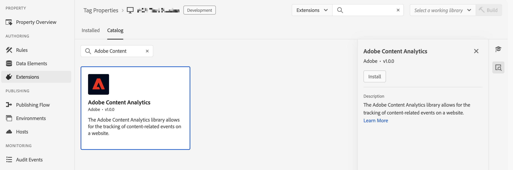
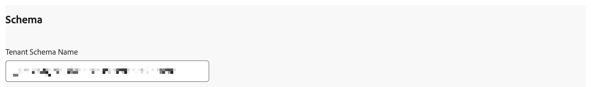
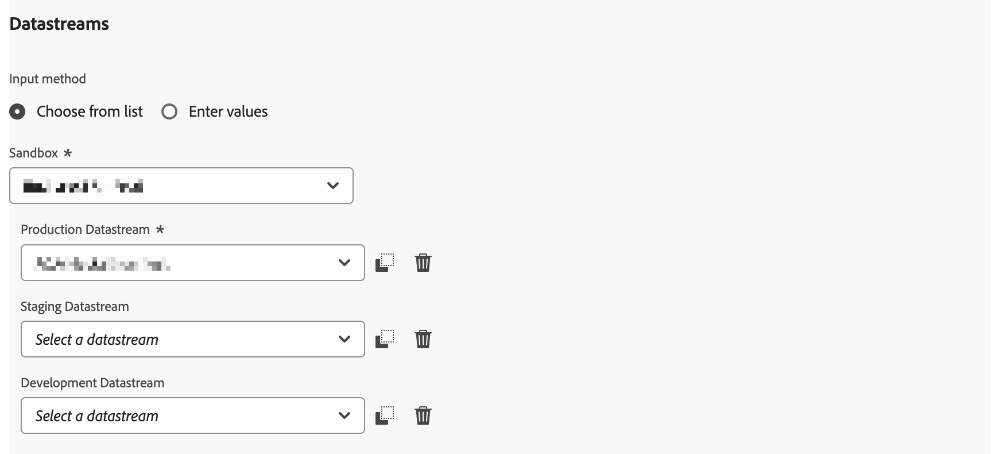
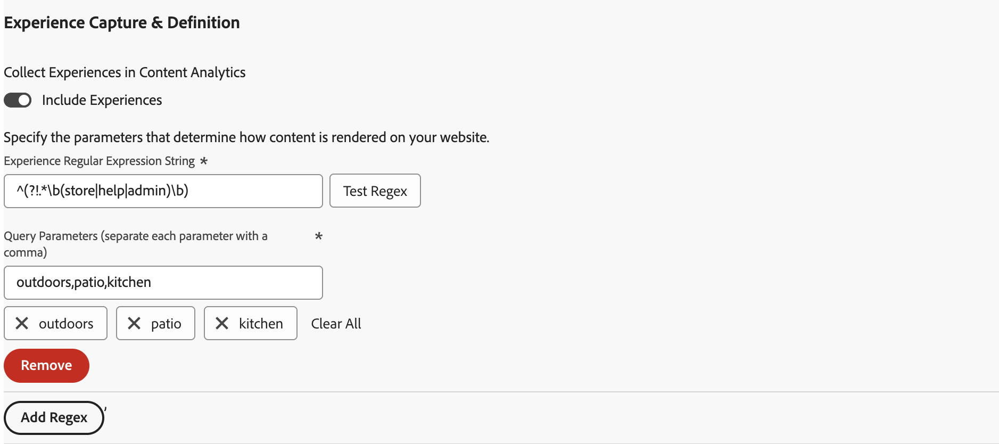
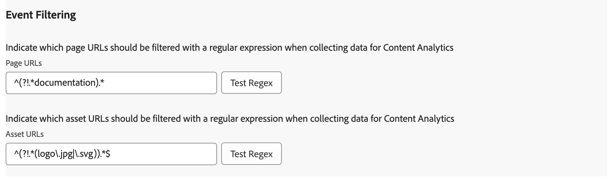
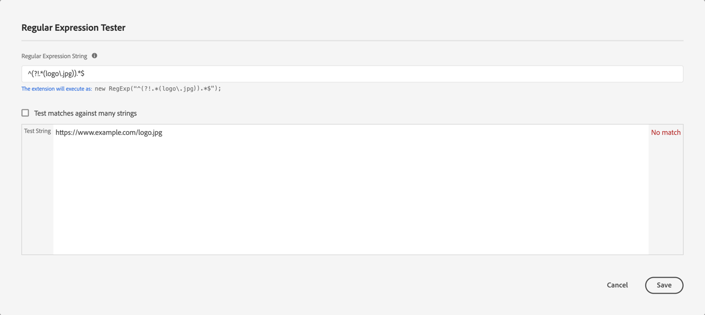

# Adobe Content Analytics extension overview

The [!DNL Adobe Content Analytics] tag extension allows for the tracking of content-related events on a website. The extension sends content data (experiences and assets) to a datastream in Adobe Experience Cloud from web properties through the Experience Platform Edge Network.

The extension allows you to stream specific content-releated event data into Experience Platform so you can use that data in your content analytics reports in Customer Journey Analytics.

This document explains how to configure the tag extension in the Tags UI.

## Install the Adobe Content Analytics tag extension {#install}

The Adobe Content Analytics tag extension is automatically installed as part of the tag property that is automatically created when using the [Content Analytics guided configuration wizard](https://experienceleague.adobe.com/en/docs/analytics-platform/using/content-analytics/configuration/guided). 

<!--
### Manual installation

In case of a manual configuration, the Adobe Content Analytics tag extension needs a property to be installed on. If you have not done so already, see the documentation on [creating a tag property](https://experienceleague.adobe.com/en/docs/platform-learn/implement-in-websites/configure-tags/create-a-property).

After you have created a property or when you select the property created using the [Content Analytics guided configuration wizard](https://experienceleague.adobe.com/en/docs/analytics-platform/using/content-analytics/configuration/guided), open the property and select the **[!UICONTROL Extensions]** tab on the left side bar.

Select the **[!UICONTROL Catalog]** tab. From the list of available extensions, find the **[!DNL Adobe Content Analytics]** extension and select **[!UICONTROL Install]**.

After selecting **[!UICONTROL Install]**, you must configure the Adobe Content Analytics tag extension and save the configuration.
-->

<!--
## Configure schema

The [Content Analytics guided configuration wizard](https://experienceleague.adobe.com/en/docs/analytics-platform/using/content-analytics/configuration/guided) automatically populates the proper value for the **[!UICONTROL Tenant Schema Name]**. 

>[!WARNING]
>
>Do not modify the value for **[!UICONTROL Tenant Schema Name]**.

-->

## Configure datastreams

The [Content Analytics guided configuration wizard](https://experienceleague.adobe.com/en/docs/analytics-platform/using/content-analytics/configuration/guided) automatically selects the proper value for the **[!UICONTROL Sandbox]** and **[!UICONTROL Production Datastream]**. You can optionally configure an additional **[!UICONTROL Staging Datastream]** and **[!UICONTROL Development Datastream]**.

You can override the automatic selected values for **[!UICONTROL Sandbox]** and **[!UICONTROL Production Datastream]** in case you want to use Content Analytics on a different sandbox and with different datastreams. When doing so, you can either select a sandbox and datastreams from the available drop-down menus, or select **[!UICONTROL Enter values]** and enter a custom datastream ID for each environment.

>[!IMPORTANT]
>
>When you configure another sandbox and datastreams, ensure that
>
>* the selected sandbox is not already associated with another Content Analytics configuration, and 
>* any selected datastream has the Experience Platform service configured with an enabled Content Analytics experience event dataset. 

See the guide on [datastreams](../../../../datastreams/overview.md) to learn how to configure a datastream.

## Configure experience capture and definition

In the **[!UICONTROL Experience Capture & Definition]** section, you can enable **[!UICONTROL Include Experiences]** to include experiences when collecting data for Content Analytics. 

1. Enable **[!UICONTROL Include experiences]**.
1. Optionally. specify the parameters how content is rendered on your website. The parameters are zero or more combinations of a **[!UICONTROL Domain regular expression]** and **[!UICONTROL Query parameters]**.
   1. Enter a **[!UICONTROL Domain regular expression]**, for example `^(?!.*\b(store|help|admin)\b)`.
   1. Specify a comma separated list of **[!UICONTROL Query parameters]**, for example `outdoors, patio, kitchen`. 
   Use  to delete individual parameters, or **[!UICONTROL Clear all]** to delete all parameters.
1. Select **[!UICONTROL Remove]** if you want to remove a combination of domain regular expression and query parameters.
1. Select **[!UICONTROL Add Regex]** if you want to add another combination of a regular expression and query parameters.

## Configure event filtering

In the **[!UICONTROL Event Filtering]** section, you can modify the regular expressions to filter **[!UICONTROL Page URLs]** and **[!UICONTROL Assets URLs]** when collecting data for Content Analytics. The regular expressions that you have defined in the [Content Analytics guided configuration wizard](https://experienceleague.adobe.com/en/docs/analytics-platform/using/content-analytics/configuration/guided) are populated automatically.

### Examples

* You want to exclude all documentation pages from Content Analytics. Use the following regular expression: `^(?!.*documentation).*`
* You want to exclude all logo JPEG images from Content Analytics. Use the following regular expression: `^(?!.*(logo\.jpg|)).*$`

You can use **[!UICONTROL Test Regex]** to test your regular expression in the **[!UICONTROL Regular Expression Tester]**.

