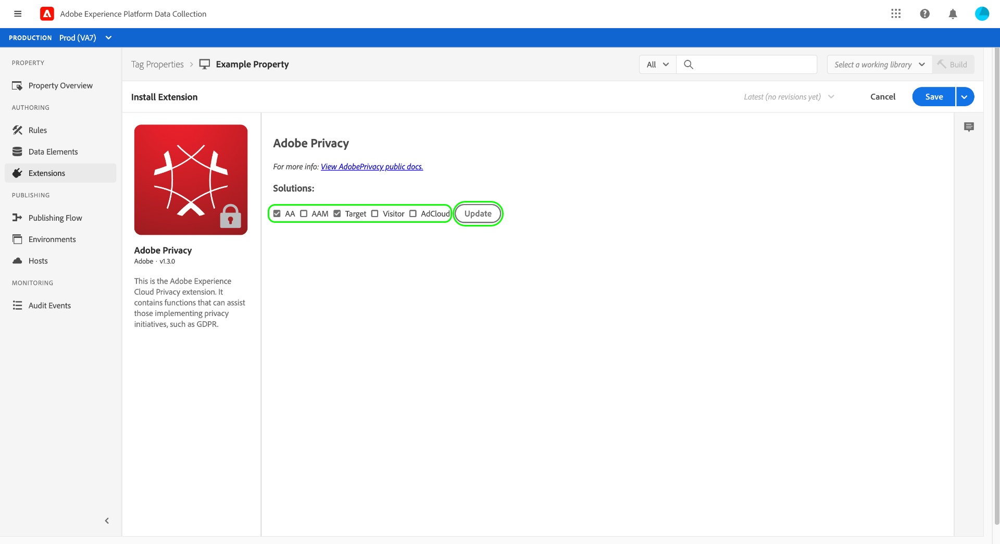
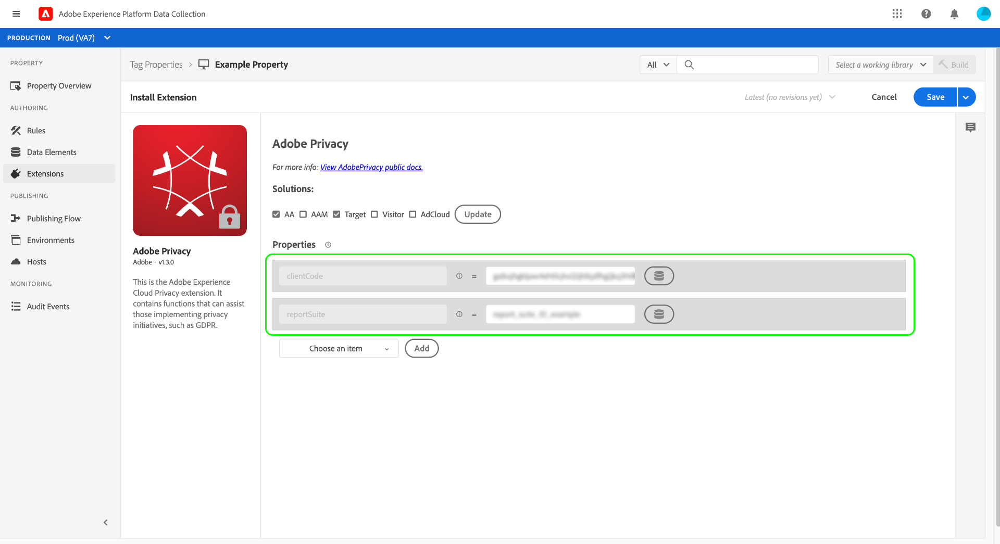
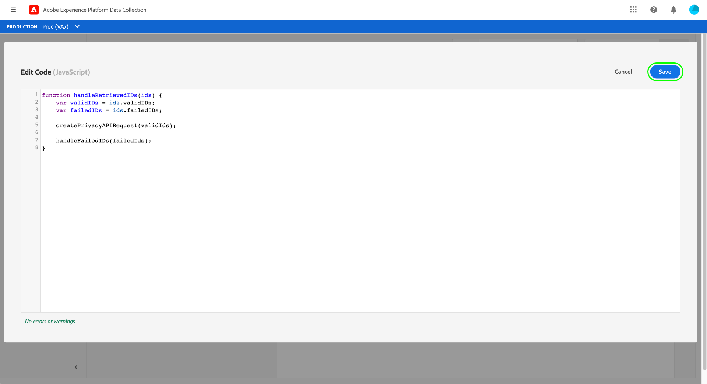
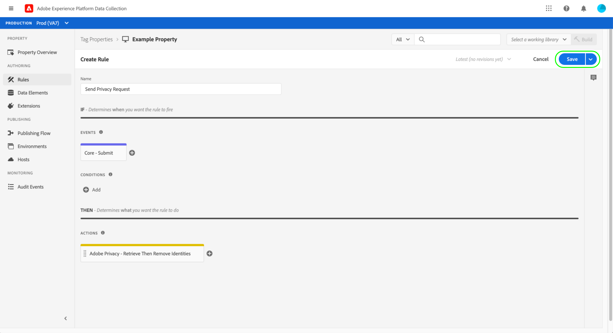

# Adobe Privacy extension overview

>[!NOTE]
>
>Adobe Experience Platform Launch has been rebranded as a suite of data collection technologies in Adobe Experience Platform. Several terminology changes have rolled out across the product documentation as a result. Please refer to the following [document](../../../term-updates.md) for a consolidated reference of the terminology changes.

The Adobe Privacy tag extension allows you to collect and remove user IDs assigned to end users by Adobe solutions on client-side devices. Collected IDs can then be sent to [Adobe Experience Platform Privacy Service](../../../../privacy-service/home.md) to access or delete the related individual's personal data in supported Adobe Experience Cloud applications.

This guide covers how to install and configure the Adobe Privacy extension in the Experience Platform UI or Data Collection UI.

>[!NOTE]
>
>If you prefer to install these functionalities without using tags, see the the [Privacy JavaScript Library overview](../../../../privacy-service/js-library.md) for steps on how to implement using raw code.

## Install and configure the extension

Select **[!UICONTROL Extensions]** in the left navigation, followed by the **[!UICONTROL Catalog]** tab. Use the search bar to narrow down the list of available extensions until you locate Adobe Privacy. Select **[!UICONTROL Install]** to continue.

The next screen allows you to configure which sources and solutions you want the extension to collect IDs from. The following solutions are supported for the extension:

* Adobe Analytics (AA)
* Adobe Audience Manager (AAM)
* Adobe Target
* Adobe Experience Cloud Identity Service (Visitor, or ECID)
* Adobe Advertising Cloud (AdCloud)

Select one or more solutions, then select **[!UICONTROL Update]**.

The screen updates to show inputs for the required configuration parameters based on the solutions you selected.

Using the dropdown menu below, you can also add additional solution-specific parameters to the configuration.

>[!NOTE]
>
>See the section on [configuration parameters](../../../../privacy-service/js-library.md#config-params) in the Privacy JavaScript Library overview for details on the accepted configuration values for each supported solution.

Once you have finished adding parameters for your selected solutions, select **[!UICONTROL Save]** to save the configuration.

## Using the extension {#using}

The Adobe Privacy extension provides three action types that can be used in a [rule](../../../ui/managing-resources/rules.md) when a certain event occurs and conditions are met:

* **[!UICONTROL Retrieve Identities]**: The user's stored identity information is retrieved.
* **[!UICONTROL Remove Identities]**: The user's stored identity information is removed.
* **[!UICONTROL Retrieve Then Remove Identities]**: The user's stored identity information is retrieved, then removed.

For each of the above actions, you must provide a callback JavaScript function that accepts and handles the retrieved identity data as an object parameter. From here, you can store these identities, display them, or send them to the [Privacy Service API](../../../../privacy-service/api/overview.md) as you require.

When using the Adobe Privacy tag extension, you must provide the required callback function in the form of a data element. Refer to the next section for steps on how to configure this data element.

### Define a data element to handle identities

Start the process of creating a new data element by selecting **[!UICONTROL Data Elements]** in the left navigation, followed by **[!UICONTROL Add Data Element]**. Once you are on the configuration screen, select **[!UICONTROL Core]** for the extension and **[!UICONTROL Custom Code]** for the data element type. From here, select **[!UICONTROL Open Editor]** in the right panel.

In the dialog that appears, define a JavaScript function that will handle the retrieved identities. The callback must accept a single object-type argument (`ids` in the example below). The function can then handle the IDs however you wish, and can also invoke any variables and functions that are globally available on your site for further processing.

>[!NOTE]
>
>For more information on the structure of the `ids` object that the callback function is expected to handle, refer to the [code samples](../../../../privacy-service/js-library.md#samples) provided in the overview for the Privacy JavaScript Library.

When finished, select **[!UICONTROL Save]**.

You can continue creating other custom-code data elements if you require different callbacks for different events.

### Create a rule with a privacy action

After configuring a callback data element to handle retrieved IDs, you can create a rule that invokes the Adobe Privacy extension whenever a certain event occurs on your site along with any other conditions you require.

When configuring the action for the rule, select **[!UICONTROL Adobe Privacy]** for the extension. For the action type, select one of the [three functions](#using) provided by the extension.

The right panel prompts you to select a data element that will serve as the action's callback. Select the database icon () and choose the data element you created earlier from the list. Select **[!UICONTROL Keep Changes]** to continue.

From here, you can continue configuring the rule so that the Adobe Privacy action  fires under the events and conditions you require. When you are satisfied, select **[!UICONTROL Save]**.

You can now add the rule to a library to deploy as a build on your website for testing. See the overview on the [tags publishing flow](../../../ui/publishing/overview.md) for more information.

## Disable or uninstall the extension

After you install the extension, you can disable or delete it. Select **[!UICONTROL Configure]** on the Adobe Privacy card in your installed extensions, then select either **[!UICONTROL Disable]** or **[!UICONTROL Uninstall]**.

## Next steps

This guide covered the use of the Adobe Privacy tag extension in the UI. For more information on the functionalities provided by the extension, including examples of how to employ it using raw code, see the [Privacy JavaScript Library overview](../../../../privacy-service/js-library.md) in the Privacy Service documentation.
