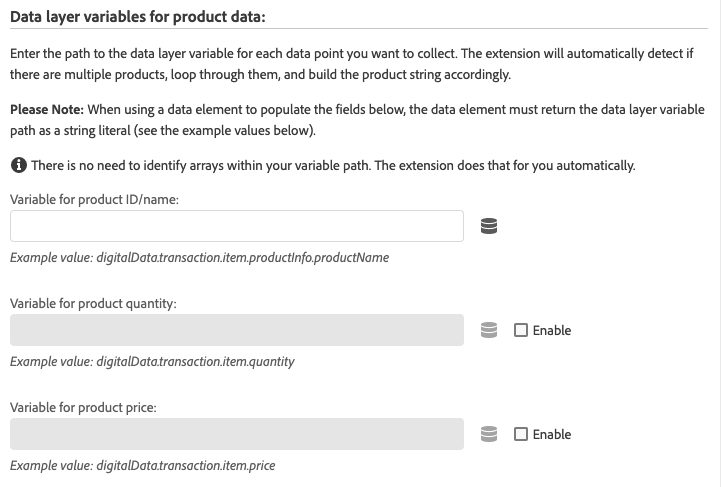
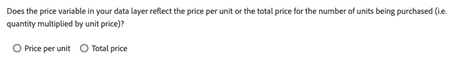
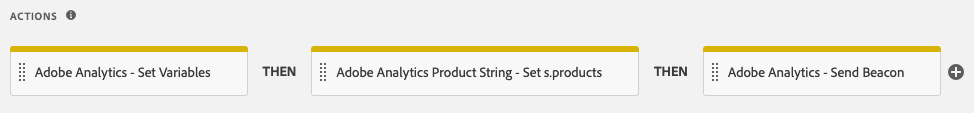

# Adobe Analytics Product String extension overview

>[!NOTE]
>
>Adobe Experience Platform Launch has been rebranded as a suite of data collection technologies in Adobe Experience Platform. Several terminology changes have rolled out across the product documentation as a result. Please refer to the following [document](../../../term-updates.md) for a consolidated reference of the terminology changes.

The `products` variable tracks how users interact with products on your site. For example, the `products` variable can track how many times a product is viewed, added to the shopping cart, checked out, and purchased. It can also track the relative effectiveness of merchandising categories on your site.

The `products` variable should always be set in conjunction with a success event.

The [!DNL Adobe Analytics Product String Builder] extension automatically sets the `products` variable for you by looping through your data layer, grabbing all the necessary product related data, and formatting it in the proper syntax shown below. You no longer need to write and maintain custom JavaScript to perform these complex actions.

## Syntax of the Products Variable

```bash
Category;Product;Quantity;Price;eventN=X|eventN2=X2;eVarN=merch_category|eVarN2=merch_category2
```

For complete documentation, visit [Products](https://experienceleague.adobe.com/docs/analytics/implementation/vars/page-vars/products.html).

## Extension Instructions

### Action Configuration

Add the "Adobe Analytics Product String - Set s.products" action to your rule.


### Setting the Standard Product Data

Next, define your data layer variables. After you configure the action as outlined in the previous step, the following screen appears:



For each of the data points you want to include in the product string, enter the path to the appropriate data layer variable.

For example, if your data layer is structured like this:

```json
digitalData = {
  "transaction": {
    "item": [{
      "productInfo": {
        "productName": "My Product"
      }
    }]
  }
};
```

You would enter the following path in the "Variable for product ID/name" field to capture the `productName` variable:

```json
digitalData.transaction.item.productInfo.productName
```

>[!NOTE]
>
>If you're using a data element to populate the field, it should be configured using the Constant or Custom Code data element type and must return the path above as a string literal.

### Price Type

The `price` parameter in the [!DNL Adobe Analytics] product string must reflect the total price for the number of units purchased, not the unit price, for that product. When enabling the Price field in the extension action, you must specify whether your data layer exposes the total price or unit price. When using the unit price, the [!DNL Adobe Analytics Product String] extension automatically multiplies the unit price by the quantity to get the total price and set the product string properly.



### Custom Events &amp; Merchandising eVars


If your implementation uses custom events or merchandising eVars, follow these steps:

1. Select the associated **[!UICONTROL Add]** button.
1. Choose the event or eVar you need to set from the dropdown.
1. Enter the path to the appropriate data layer variable using the same syntax described above.

### Action Sequence

This action must be accompanied by an "Adobe Analytics - Set Variables" action that sets the corresponding success events, as well as an "Adobe Analytics - Send Beacon" action. The proper sequence of actions is illustrated below.



### Requirements

* An object-based [data layer](https://theblog.adobe.com/data-layers-buzzword-best-practice/) with variables for all product related data (such as product ID, quantity, price). This extension does not work with array-based data layers.
* The [Adobe Analytics](../analytics/overview.md) extension must be installed.
