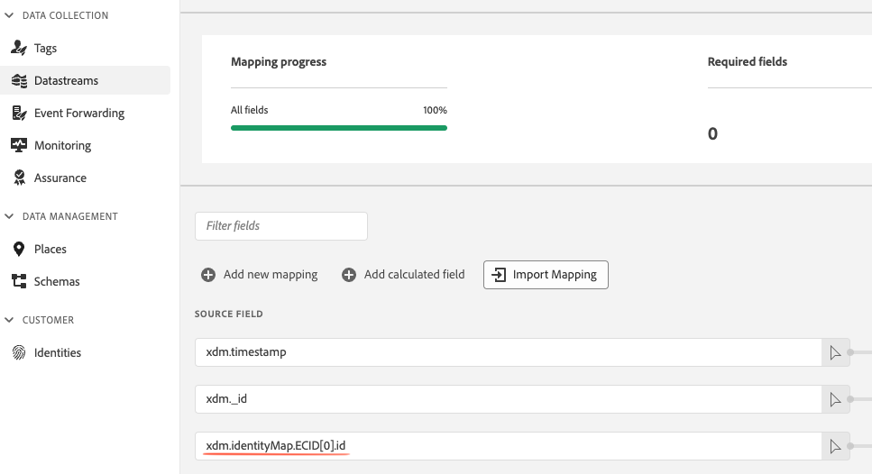

# Accessing the ECID

The [!DNL Experience Cloud Identity (ECID)] is a persistent identifier assigned to a user when they visit your website. In certain circumstances, you might prefer to access the [!DNL ECID] (to send it to a third party, for example). Another use case is setting the [!DNL ECID] in a custom XDM field, in addition to having it in the identity map.

You can access the ECID either via [Data Prep for Data Collection](../../../../datastreams/data-prep.md) (recommended) or via tags.

## Accessing the ECID via Data Prep (preferred method) {#accessing-ecid-data-prep}

If you are looking to set the ECID in a custom XDM field, in addition to having it in the identity map, you can do this by setting the `source` to the following path:

```js
xdm.identityMap.ECID[0].id
```

Then, set the target to an XDM path where the field is of type `string`.



## Tags

If you need to access the [!DNL ECID] on the client side, use the tags approach as described below.

1. Ensure your property is configured with [rule component sequencing](../../../ui/managing-resources/rules.md#sequencing) enabled. 
1. Create a new rule. This rule should be used exclusively for capturing the [!DNL ECID] without any other important actions.
1. Add a [!UICONTROL Library Loaded] event to the rule.
1. Add a [!UICONTROL Custom Code] action to the rule with the following code (assuming the name you've configured for the SDK instance is `alloy` and there isn't already a data element of the same name):

   ```js
    return alloy("getIdentity")
      .then(function(result) {
        _satellite.setVar("ECID", result.identity.ECID);
      });
   ```

1. Save the rule.

You should then be able to access the [!DNL ECID] in subsequent rules using `%ECID%` or `_satellite.getVar("ECID")`, like you would access any other data element.
