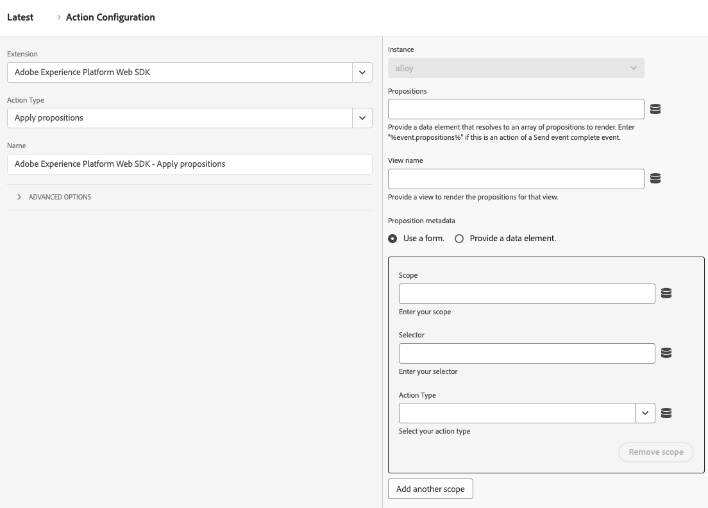

# Apply propositions

The **[!UICONTROL Apply propositions]** action type allows you to render propositions in single-page applications without incrementing metrics. This action type is useful when working with single-page applications where portions of the page get re-rendered, potentially overwriting any personalizations already applied to the page.

1. Log in to [experience.adobe.com](https://experience.adobe.com) using your Adobe ID credentials.
1. Navigate to **[!UICONTROL Data Collection]** > **[!UICONTROL Tags]**.
1. Select the desired tag property.
1. Navigate to **[!UICONTROL Rules]**, then select the desired rule.
1. Under [!UICONTROL Actions], select an existing action or create an action.
1. Set the [!UICONTROL Extension] dropdown field to **[!UICONTROL Adobe Experience Platform Web SDK]**, then set the [!UICONTROL Action type] to **[!UICONTROL Apply propositions]**.

## Use cases

You can use this action type for various use cases, such as:

1. **Render mbox HTML offers**. Propositions explicitly requested via a scope or surface from a **[!UICONTROL Send event]** action are not automatically rendered. You can use the **[!UICONTROL Apply propositions]** action type to tell Web SDK where to render them by specifying the proposition metadata.
2. **Render the offers for a view on a single-page application**. When rendering a view change event, if the analytics data is not ready yet, you can use the **[!UICONTROL Apply propositions]** action to render the view propositions at the top of page. See [top and bottom of page events (Second page view - Option 2)](/help/collection/use-cases/personalization/top-bottom-page-events.md) for more details. To use this, enter a **[!UICONTROL View name]** in the form.
3. **Re-render propositions**. When your site uses a framework like React to re-render content, you may need to re-apply personalization. In such cases you can use the **[!UICONTROL Apply propositions]** action type to do this.

This action type does not send a display event for rendered propositions. It keeps track of rendered propositions so that they can be included in subsequent **[!UICONTROL Send event]** calls.

## Available fields

This action type supports the following fields:

* **[!UICONTROL Instance]**: The SDK instance that the action applies to. This drop-down menu is disabled if your implementation uses a single SDK instance.
* **[!UICONTROL Propositions]**: An array of proposition objects that you want to re-render.
* **[!UICONTROL View name]**: The name of the view to render.
* **[!UICONTROL Proposition metadata]**: An object that determines how HTML offers can be applied. You can provide this information either through the form or through a data element. It contains the following properties:
  * **[!UICONTROL Scope]**
  * **[!UICONTROL Selector]**
  * **[!UICONTROL Action type]**
