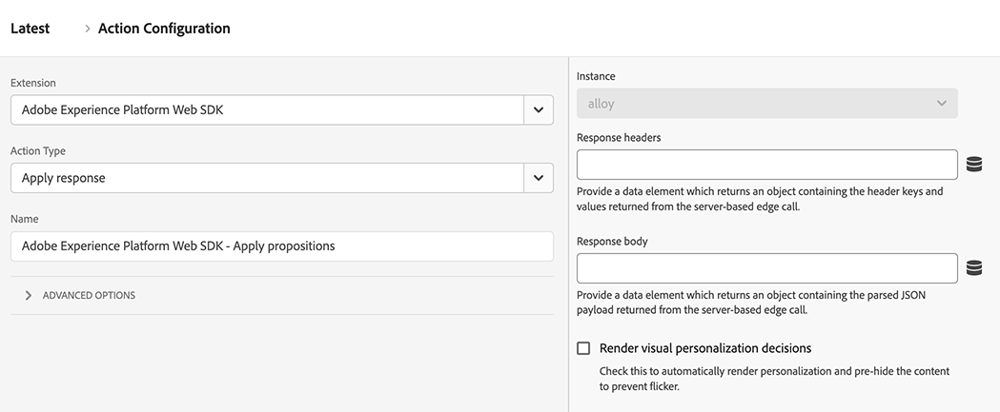

# Apply response

The **[!UICONTROL Apply response]** action type lets you perform various actions based on a response from the Edge Network. This action type is typically used in hybrid deployments where the server makes an initial call to the Edge Network, then this action type takes the response from that call and initializes the Web SDK in the browser. Using this action type can reduce client load times for hybrid personalization use cases.

1. Log in to [experience.adobe.com](https://experience.adobe.com) using your Adobe ID credentials.
1. Navigate to **[!UICONTROL Data Collection]** > **[!UICONTROL Tags]**.
1. Select the desired tag property.
1. Navigate to **[!UICONTROL Rules]**, then select the desired rule.
1. Under [!UICONTROL Actions], select an existing action or create an action.
1. Set the [!UICONTROL Extension] dropdown field to **[!UICONTROL Adobe Experience Platform Web SDK]**, then set the [!UICONTROL Action type] to **[!UICONTROL Apply response]**.

## Use cases

* **Manual split between data collection and personalization**: You can trigger a [Send event](send-event.md) action with render decisions set to `false`, then have a 'Send event complete' rule catch the promise. The first action within this rule can be 'Apply response'. This workflow lets you delay DOM manipulation until after your organization's own code finishes other work.
* **Edge response received from outside of the Web SDK**: If you use another library to communicate with the Edge Network, you can allow the Web SDK to still handle the response from the Edge Network using this action.

## Available fields

This action type supports the following configuration options:

* **[!UICONTROL Instance]**: The SDK instance that the action applies to. This drop-down menu is disabled if your implementation uses a single SDK instance.
* **[!UICONTROL Response headers]**: Select the data element which returns an object containing the header keys and values returned from the Edge Network server call.
* **[!UICONTROL Response body]**: Select the data element which returns the object containing the JSON payload provided by the Edge Network response.
* **[!UICONTROL Render visual personalization decisions]**: Enable this option to automatically render the personalization content provided by the Edge Network and pre-hide the content to prevent flicker.
