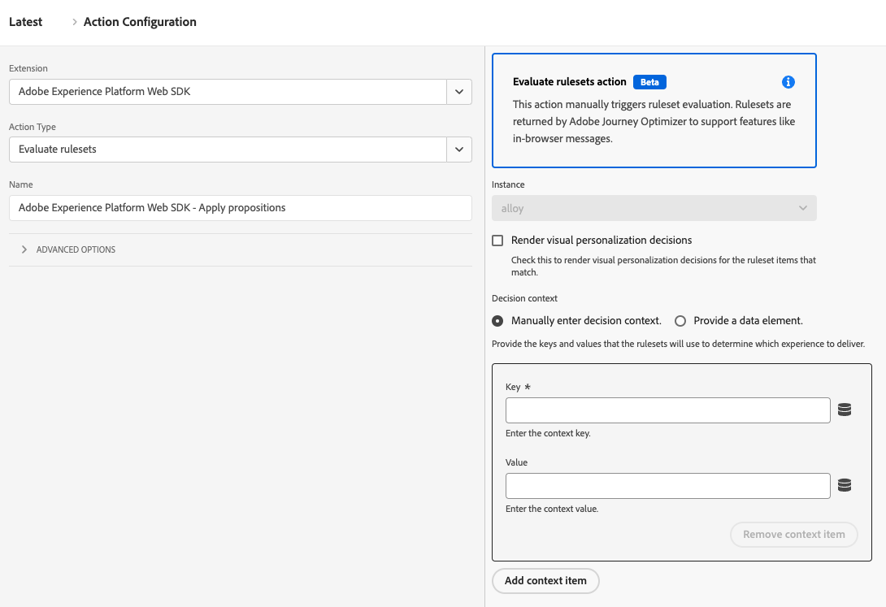

# Evaluate rulesets

The **[!UICONTROL Evaluate rulesets]** action type lets you manually trigger ruleset evaluations. Rulesets are returned by Adobe Journey Optimizer to support features like in-browser messages.

1. Log in to [experience.adobe.com](https://experience.adobe.com) using your Adobe ID credentials.
1. Navigate to **[!UICONTROL Data Collection]** > **[!UICONTROL Tags]**.
1. Select the desired tag property.
1. Navigate to **[!UICONTROL Rules]**, then select the desired rule.
1. Under [!UICONTROL Actions], select an existing action or create an action.
1. Set the [!UICONTROL Extension] dropdown field to **[!UICONTROL Adobe Experience Platform Web SDK]**, then set the [!UICONTROL Action type] to **[!UICONTROL Evaluate rulesets]**.

## Available fields

This action type supports the following options:

* **[!UICONTROL Render visual personalization decisions]**: A checkbox that, when enabled, renders visual personalization decisions for the ruleset items that match.
* **[!UICONTROL Decision context]**: A key-value map that is used when evaluating Adobe Journey Optimizer rulesets for on-device decisioning. You can provide the decision context manually or through a data element.
