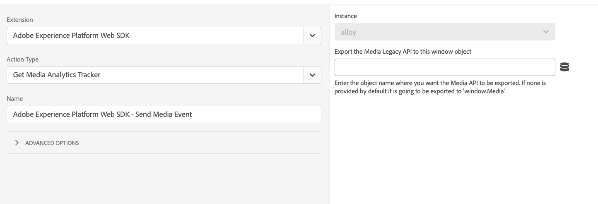

# Get Media Analytics Tracker

The **[!UICONTROL Get Media Analytics tracker]** action is used to get the Legacy Media Analytics API. When configuring the action and an object name is provided, then the legacy Media Analytics API is be exported to that window object. This action is useful for moving from legacy Media Analytics to Streaming Media Analytics.

1. Log in to [experience.adobe.com](https://experience.adobe.com) using your Adobe ID credentials.
1. Navigate to **[!UICONTROL Data Collection]** > **[!UICONTROL Tags]**.
1. Select the desired tag property.
1. Navigate to **[!UICONTROL Rules]**, then select the desired rule.
1. Under [!UICONTROL Actions], select an existing action or create an action.
1. Set the [!UICONTROL Extension] dropdown field to **[!UICONTROL Adobe Experience Platform Web SDK]**, then set the [!UICONTROL Action type] to **[!UICONTROL Get Media Analytics tracker]**.

This action contains a single field that you can configure:

* **[!UICONTROL Export the Media Legacy API to this window object]**: Selects the desired object to export the Media Legacy API to. If none is provided, the action exports the API to `window.Media`.
