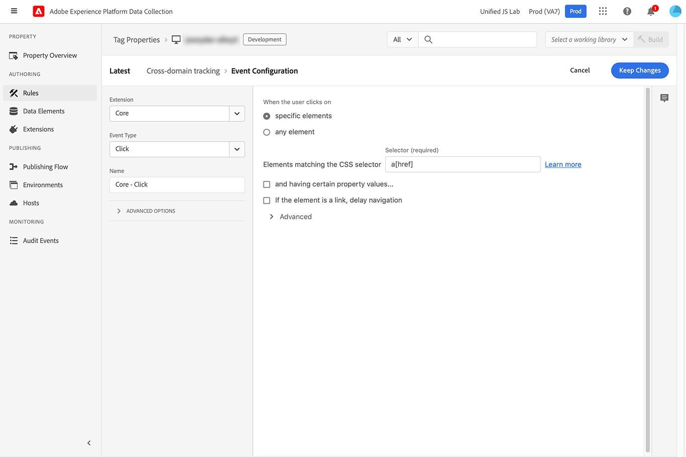

# Redirect with identity

The **[!UICONTROL Redirect with identity]** action type allows you to share a visitor identifier from the current page to another domain that your organization owns. It is designed to be used with a click event and a value comparison condition. It is functionally similar to the [`appendIdentityToUrl`](/help/collection/js/commands/appendidentitytourl.md) command in the JavaScript library.

1. Log in to [experience.adobe.com](https://experience.adobe.com) using your Adobe ID credentials.
1. Navigate to **[!UICONTROL Data Collection]** > **[!UICONTROL Tags]**.
1. Select the desired tag property.
1. Navigate to **[!UICONTROL Rules]**, then select the desired rule.
1. Under [!UICONTROL Actions], select an existing action or create an action.
1. Set the [!UICONTROL Extension] dropdown field to **[!UICONTROL Adobe Experience Platform Web SDK]**, then set the [!UICONTROL Action type] to **[!UICONTROL Redirect with identity]**.

## Use cases

* **Identify an individual across domains**: If a visitor clicks from one domain to another owned by your organization, you can use this action so that they are still considered the same individual. This identification method is especially useful if you have reports that combine data from multiple domains, preventing visitor inflation.
* **Identify an individual from a mobile app to a web app**: If a visitor is inside your mobile app and they click a link to your web app, you can use this action so the Web SDK acknowledges that it is the same individual. This workflow allows a consistent experience for reporting and personalization.

## Available fields

* **[!UICONTROL Instance]**: The SDK instance that the action applies to. This drop-down menu is disabled if your implementation uses a single SDK instance.
* **[!UICONTROL Datastream configuration overrides]**: This command supports datastream configuration overrides, giving you control over which apps and services receive this data. When you set a datastream configuration override in both an individual command and within the tag extension configuration settings, the individual command takes precedence. See [Datastream configuration overrides](../configure/configuration-overrides.md) for more information.

## Example rule

This command is typically used with a specific rule that listens for clicks and checks desired domains.

+++Rule event criteria

Triggers when an anchor tag with an `href` property is clicked.

* **[!UICONTROL Extension]**: Core
* **[!UICONTROL Event type]**: Click
* **[!UICONTROL When the user clicks on]**: Specific elements
* **[!UICONTROL Elements matching the CSS selector]**: `a[href]`

+++

+++Rule condition

Triggers only on desired domains.

* **[!UICONTROL Logic type]**: Regular
* **[!UICONTROL Extension]**: Core
* **[!UICONTROL Condition Type]**: Value Comparison
* **[!UICONTROL Left Operand]**: `%this.hostname%`
* **[!UICONTROL Operator]**: Matches Regex
* **[!UICONTROL Right Operand]**: A regular expression that matches the desired domains. For example, `adobe.com$|behance.com$`

+++

+++Rule action

Append the identity to the URL.

* **[!UICONTROL Extension]**: Adobe Experience Platform Web SDK
* **[!UICONTROL Action Type]**: Redirect with identity

+++