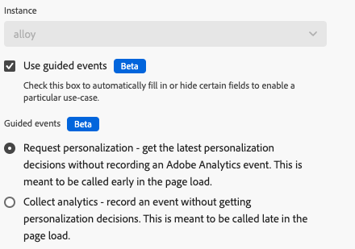
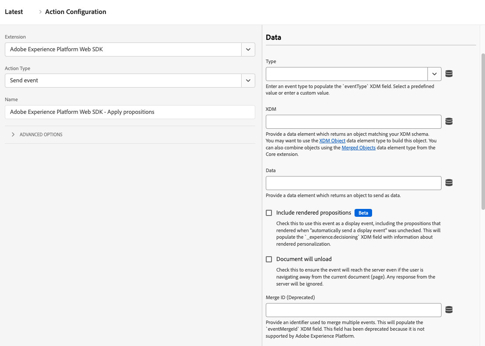
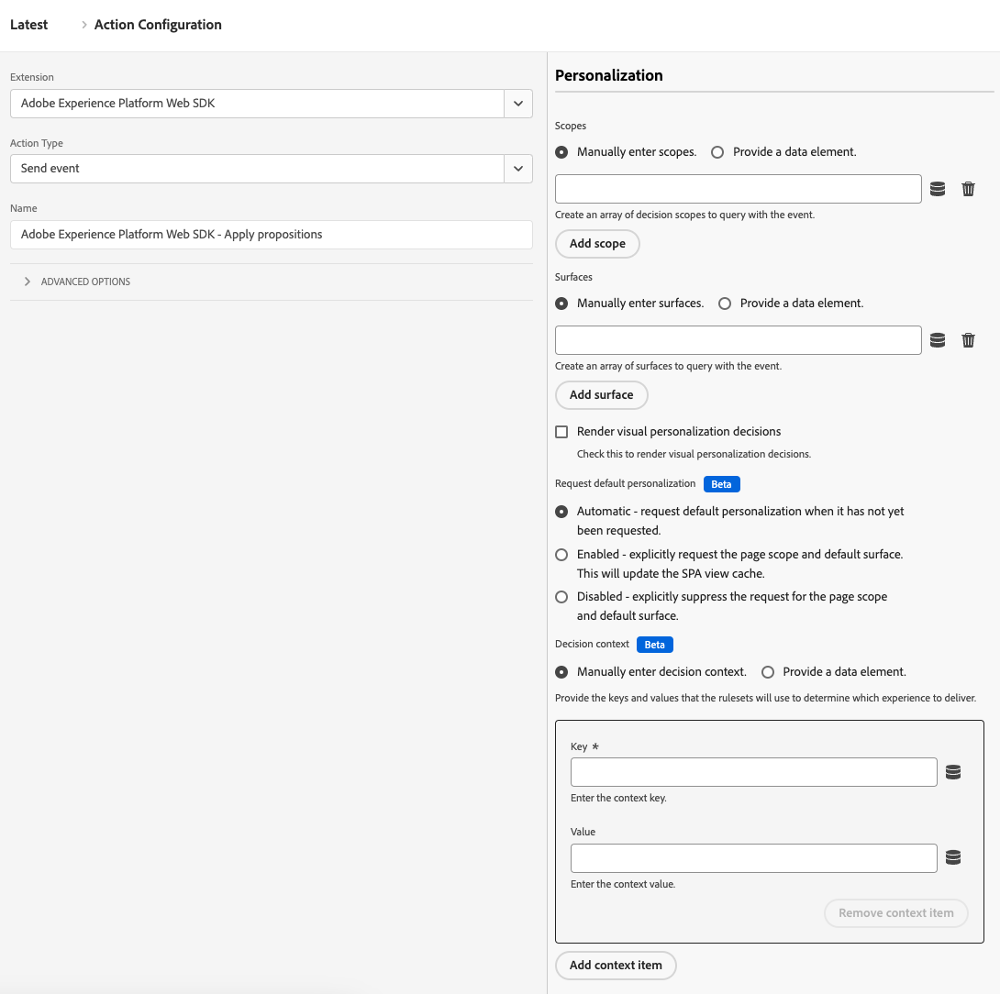

# Send event

The **[!UICONTROL Send event]** action sends a payload to a datastream on the Adobe Experience Platform Edge Network. It is a core feature of data collection and personalization; almost all organizations use this action as part of their Web SDK implementation.

1. Log in to [experience.adobe.com](https://experience.adobe.com) using your Adobe ID credentials.
1. Navigate to **[!UICONTROL Data Collection]** > **[!UICONTROL Tags]**.
1. Select the desired tag property.
1. Navigate to **[!UICONTROL Rules]**, then select the desired rule.
1. Under [!UICONTROL Actions], select an existing action or create an action.
1. Set the [!UICONTROL Extension] dropdown field to **[!UICONTROL Adobe Experience Platform Web SDK]**, then set the [!UICONTROL Action type] to **[!UICONTROL Send event]**.

## General fields

* **[!UICONTROL Instance]**: The SDK instance that the action applies to. This drop-down menu is disabled if your implementation uses a single SDK instance.
* **[!UICONTROL Use guided events]**: Enable this option to automatically fill in or hide certain fields to enable a particular use case. This setting can help reduce noise of available options when setting up the action for each respective purpose, and follows Adobe's best practices of [Top/bottom page events](/help/collection/use-cases/personalization/top-bottom-page-events.md). Enabling this checkbox triggers the display of the following radio buttons:
  * **[!UICONTROL Request personalization]**: Get the latest personalization decisions without recording an Adobe Analytics event. It is most commonly called at the top of the page. When selected, this radio button sets the following fields:
    * [!UICONTROL Type] is locked to [!UICONTROL Decisioning Proposition Fetch]
    * [!UICONTROL Render visual personalization decisions] is locked to enabled
    * [!UICONTROL Automatically send a display event] is locked to disabled
  * **[!UICONTROL Collect analytics]**: Record an event without getting personalization decisions. It is most commonly called at the bottom of the page. When selected, this radio button sets the following fields:
    * [!UICONTROL Include rendered propositions] is locked to enabled
   
## Data fields

* **[!UICONTROL Type]**: The event type. You can select from a pre-defined set of values, or define your own value. See [Accepted values for `eventType`](/help/xdm/classes/experienceevent.md#accepted-values-for-eventtype) for more information. The JavaScript library equivalent to this field is [`eventType`](/help/collection/js/commands/sendevent/eventtype.md).
* **[!UICONTROL XDM]**: The XDM payload that you want to send to Adobe. You can use either an [XDM object](../data-element-types.md#xdm-object) or [Variable](../data-element-types.md#variable) in this field. If you have rules that populate multiple XDM objects, you can use [Merged objects](../../core/overview.md#merged-objects) to combine them.
* **[!UICONTROL Data]**: The data payload that you want to send to Adobe. Some apps and services do not require adhering to an XDM schema, such as Adobe Analytics or Adobe Target. Use a [Variable](../data-element-types.md#variable) data element type for this field.
* **[!UICONTROL Include rendered propositions]**: Enable this checkbox to use this event as a display event, including the propositions that rendered when "automatically send a display event" was unchecked. The `_experience.decisioning` XDM field populates with information about rendered personalization.
* **[!UICONTROL Document will unload]**: Enable this checkbox to make sure that the event reaches the server even if the user navigates away from the page. This setting allows events to reach the server, but responses from the Edge Network are ignored.
* **[!UICONTROL Merge ID]** _(Deprecated)_: Populates the `eventMergeId` XDM field.

## Personalization fields

* **[!UICONTROL Scopes]**: An array of scopes that you want to explicitly request from personalization. You can enter the scopes manually, or provide a data element. When manually entering scopes, each field represents one scope. Select **[!UICONTROL Add scope]** to add more scopes to the action.
* **[!UICONTROL Surfaces]**: An array of surfaces to query with the event. See [Create web experiences](https://experienceleague.adobe.com/docs/journey-optimizer/using/web/create-web.html) in the Adobe Journey Optimizer documentation for more information. When manually entering surfaces, each field represents one surface. Select **[!UICONTROL Add surface]** to add more surfaces to the action.
* **Render visual personalization decisions:** A checkbox that, when enabled, lets you render personalized content on the page. See [Render personalized content](/help/collection/use-cases/personalization/rendering-personalization-content.md#automatically-rendering-content) for more information.
* **[!UICONTROL Request default personalization]**: Controls whether the page-wide scope and default surface is requested. By default, it is requested automatically during the first `sendEvent` call of the page load. The JavaScript library equivalent to these radio buttons is [`requestDefaultPersonalization`](/help/collection/js/commands/sendevent/personalization.md). You can choose from the following options:
  * **[!UICONTROL Automatic]**: The default behavior. Only request default personalization when it has not yet been requested.
  * **[!UICONTROL Enabled]**: Explicitly request the page scope and default surface. This updates the SPA view cache.
  * **[!UICONTROL Disabled]**: Explicitly suppress the request for the page scope and default surface.
* **[!UICONTROL Decision context]**: A key-value map that is used when evaluating Adobe Journey Optimizer rulesets for on-device decisioning. You can provide the decision context manually or through a data element.

## Advertising fields

* **[!UICONTROL Request default advertising data]**: Determines when (or if) the library adds advertising information to the XDM payload. You can choose from the following options:
  * **[!UICONTROL Automatic]**: Any advertising data available at the time of the event is added to the event payload.
  * **[!UICONTROL Wait]**: Delay sending the event until advertising data is received.
  * **[!UICONTROL Disabled]**: Do not add advertising data to the event payload. Select this option if your implementation does not use Adobe Analytics or Customer Journey Analytics.

## Datastream configuration overrides

This command supports datastream configuration overrides, giving you control over which apps and services receive this data. When you set a datastream configuration override in both an individual command and within the tag extension configuration settings, the individual command takes precedence. See [Datastream configuration overrides](../configure/configuration-overrides.md) for more information.
