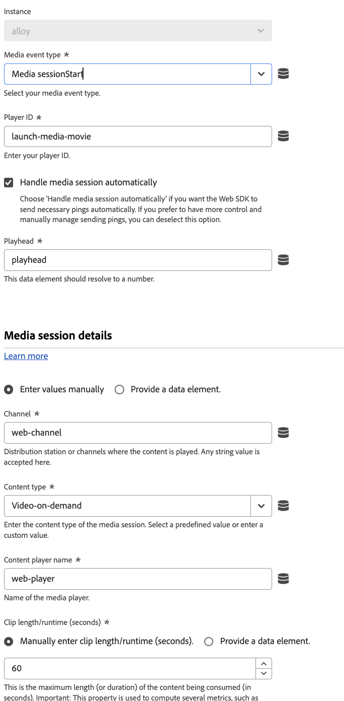

# Send media event

The **[!UICONTROL Send media event]** action sends media event to a datastream, which can then be used by apps and services like Adobe Experience Platform or Adobe Analytics. This action is useful when you track streaming media content on your property.

Available options depend on the **[!UICONTROL Media event type]** that you select. All media event types require a **[!UICONTROL Player ID]**, which is the Content Player Name.

Some event types offer the ability to configure other fields. If a media event type is not listed here, then the only available field is [!UICONTROL Player ID]. The following media event types include other fields:

## [!UICONTROL Ad break start]

Allows you to configure advertising pod details.

* **[!UICONTROL Ad break name]**: The friendly name of the ad break.
* **[!UICONTROL Ad break offset (seconds)]**: The offset of the ad break inside the content, in seconds.
* **[!UICONTROL Ad break index]**: The index of the ad break inside the content, starting at 1.

## [!UICONTROL Ad start]

Allows you to configure advertising details.

* **[!UICONTROL Ad name]**: The friendly name of the ad.
* **[!UICONTROL Ad ID]**: The ID of the ad. Any alpha-numeric value is supported.
* **[!UICONTROL Ad length (seconds)]**: The length of the video ad, in seconds.
* **[!UICONTROL Advertiser]**: The company or brand whose product is featured in the ad.
* **[!UICONTROL Campaign ID]**: The ID of the ad campaign.
* **[!UICONTROL Creative ID]**: The ID of the ad creative.
* **[!UICONTROL Creative URL]**: The URL of the ad creative.
* **[!UICONTROL Placement ID]**: The placement ID of the ad.
* **[!UICONTROL Site ID]**: The ID of the ad site.
* **[!UICONTROL Pod position]**: The index of the ad inside of the parent ad break, starting at 0.

This event type also supports the ability to provide custom metadata as part of the media event payload.

## [!UICONTROL Bitrate change]

* **[!UICONTROL Quality of experience data]**: A [Quality of Experience](/help/xdm/data-types/qoe-data-details-collection.md) object that specifies the bitrate, dropped frames, frames per second, and time to start.

## [!UICONTROL Chapter start]

Allows you to configure chapter details.

* **[!UICONTROL Chapter name]**: The name of the chapter or segment.
* **[!UICONTROL Chapter length]**: The length of the chapter, in seconds.
* **[!UICONTROL Chapter index]**: The position of the chapter inside of the content.
* **[!UICONTROL Chapter offset]**: The offset of the chapter from the start of the content, in seconds.

This event type also supports the ability to provide custom metadata as part of the media event payload.

## [!UICONTROL Error]

Allows you to configure error details.

* **[!UICONTROL Error name]**: The error name.
* **[!UICONTROL Source]**: The source of the error.

## [!UICONTROL Session start]

Allows you to configure media session details.

* **[!UICONTROL Handle media session automatically]**: A checkbox that allows the Web SDK to send necessary pings automatically. You can uncheck this box if you want to manually send pings yourself.
* **[!UICONTROL Playhead]**: The playback playhead, in seconds.
* **[!UICONTROL Content type]**: The content type. Any string value is supported; Adobe also offers the following presets:
  * [!UICONTROL Audiobook]
  * [!UICONTROL Downloaded video-on-demand]
  * [!UICONTROL Linear playback of the media asset]
  * [!UICONTROL Live streaming]
  * [!UICONTROL Podcast]
  * [!UICONTROL Radio show]
  * [!UICONTROL Song]
  * [!UICONTROL User-generated content]
  * [!UICONTROL Video-on-demand]
* **[!UICONTROL Clip length/runtime (seconds)]**: The maximum duration of the content being consumed, in seconds. For live media with an unknown duration, the value of `86400` is the default.
* **[!UICONTROL Content ID]**: The content ID of the content.
* **[!UICONTROL Ad load type]**: The type of ad loaded. The following two values are supported:
  * [!UICONTROL Ads same as TV]
  * [!UICONTROL Other (custom/dynamic ads)]
* **[!UICONTROL Album]**: The album that the song belongs to.
* **[!UICONTROL Artist]**: The song's artist.
* **[!UICONTROL Asset ID]**: The unique identifier for the content of the media asset. These IDs are typically derived from metadata authorities like EIDR, TMS/Gracenote, or Rovi. These identifiers can also be from other proprietary or in-house systems.
* **[!UICONTROL Author]**: The name of the author of the audiobook.
* **[!UICONTROL Authorized]**: A flag that determines if the user is logged in through Adobe authentication.
* **[!UICONTROL Day part]**: The time of the day when the content was broadcast or played. Any string value is supported.
* **[!UICONTROL Episode]**: The episode number.
* **[!UICONTROL Feed type]**: The type of feed.
* **[!UICONTROL First air date]**: The date when the content first aired on television. Any string value is supported; however, Adobe recommends using the format `YYYY-MM-DD`.
* **[!UICONTROL First digital date]**: The date when the content first aired on any digital channel or platform. Any string value is supported; however, Adobe recommends using the format `YYYY-MM-DD`.
* **[!UICONTROL Content name]**: The friendly name of the content.
* **[!UICONTROL Genre]**: The type or grouping of content defined by the content producer. This field supports multiple values, delimited by a comma.
* **[!UICONTROL Label]**: The name of the record label.
* **[!UICONTROL Rating]**: The rating as defined by TV Parental Guidelines.
* **[!UICONTROL MVPD]**: The MVPD as provided by Adobe authentication.
* **[!UICONTROL Network]**: The network or channel name.
* **[!UICONTROL Originator]**: The creator of the content.
* **[!UICONTROL Publisher]**: The audio content publisher.
* **[!UICONTROL Season]**: If the show is part of a series, the season number of the show.
* **[!UICONTROL Show]**: If the show is part of a series, the series name.
* **[!UICONTROL Show type]**: The show type. Any string value is supported; Adobe also offers the following presets:
  * [!UICONTROL Clip]
  * [!UICONTROL Full episode]
  * [!UICONTROL Other]
  * [!UICONTROL Preview/trailer]
* **[!UICONTROL Stream type]**: The stream type.
* **[!UICONTROL Stream format]**: The format of the stream, such as HD or SD.
* **[!UICONTROL Station]**: The name or ID of the radio station.

This event type also supports the ability to provide custom metadata as part of the media event payload. It also allows datastream configuration overrides, giving you control over which apps and services receive this data. When you set a datastream configuration override in both an individual command and within the tag extension configuration settings, the individual command takes precedence. See [Datastream configuration overrides](../configure/configuration-overrides.md) for more information.

## [!UICONTROL States update]

Allows you to configure state update details. You can start or end the following states:

* [!UICONTROL Closed captioning]
* [!UICONTROL Full screen]
* [!UICONTROL In focus]
* [!UICONTROL Mute]
* [!UICONTROL Picture in picture]

The following fields are available:

* **[!UICONTROL States started]**: A drop-down menu that lets you indicate that a state started. Selecting the **[!UICONTROL Add another state that started]** button allows you to start multiple states in the same action.
* **[!UICONTROL States ended]**: A drop-down menu that lets you indicate that a state ended. Selecting the **[!UICONTROL Add another state that ended]** button allows you to end multiple states in the same action.
