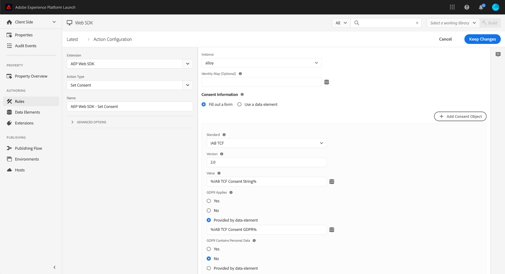

# Set consent

The **[!UICONTROL Set consent]** action determines if the tag extension should send data (opt in), discard data (opt out), or use [default consent](../configure/consent.md) (consent unknown). When a user allows or denies consent on your site, you can use this action to sync their preferences with the tag extension. The JavaScript library equivalent of this action is the [`setConsent`](/help/collection/js/commands/setconsent.md) command.

1. Log in to [CX Enterprise](https://experience.adobe.com) using your Adobe ID credentials.
1. Navigate to **[!UICONTROL Data Collection]** > **[!UICONTROL Tags]**.
1. Select the desired tag property.
1. Navigate to **[!UICONTROL Rules]**, then select the desired rule.
1. Under [!UICONTROL Actions], select an existing action or create an action.
1. Set the [!UICONTROL Extension] dropdown field to **[!UICONTROL Adobe Experience Platform Web SDK]**, then set the [!UICONTROL Action type] to **[!UICONTROL Set consent]**.

The tag extension supports the following standards:

* **[Adobe standard](/help/landing/governance-privacy-security/consent/adobe/overview.md)**: Both 1.0 and 2.0 standards are supported.
* **[IAB Transparency & Consent Framework](/help/landing/governance-privacy-security/consent/iab/overview.md)**: If you use this standard, the visitor's Real-Time Customer Profile is updated with the consent information if your implementation is correctly configured:
  1. The XDM individual profile schema contains the [IAB TCF 2.0 Consent field group](/help/xdm/field-groups/profile/iab.md).
  1. The Experience Event schema contains the [IAB TCF 2.0 Consent field group](/help/xdm/field-groups/event/iab.md).

Adobe recommends that you store any consent dialog preferences separately, such as in a data element. The tag extension does not offer a way to retrieve consent. To make sure that the user preferences stay in sync with the tag extension, you can this action on every page load.

## Available fields

This action type supports the following configuration options:

* **[!UICONTROL Instance]**: The SDK instance that the action applies to. This drop-down menu is disabled if your implementation uses a single SDK instance.
* **[!UICONTROL Identity map]**: A data element that controls how an ECID is generated and which IDs consent information is tied to.
* **[!UICONTROL Consent information]**: Determines if you want to fill out a form, or provide a data element containing consent information.
* **[!UICONTROL Standard]**: The consent standard that you want to use. Available options include '[!UICONTROL Adobe]' and '[!UICONTROL IAB TCF]'.
* **[!UICONTROL Version]**: The version of the consent standard that you want to use.
* **[!UICONTROL Datastream configuration overrides]**: This command supports datastream configuration overrides, giving you control over which apps and services receive this data. When you set a datastream configuration override in both an individual command and within the tag extension configuration settings, the individual command takes precedence. See [Datastream configuration overrides](../configure/configuration-overrides.md) for more information.

## Creating a rule that updates consent information

An ideal time to use this action is when a customer's consent preferences have changed. You can create a tag rule to listen for this change.

1. Within a tag property, navigate to **[!UICONTROL Rules]** and select **[!UICONTROL Add rule]**.
1. Give the rule a desired name, then select the '`+`' icon next to **[!UICONTROL Events]**.
1. Set the following properties on the left:
   * **[!UICONTROL Extension]**: [!UICONTROL Core]
   * **[!UICONTROL EVent type]**: [!UICONTROL Custom code]
1. Open the editor on the right and use the following code as a template:

  ```javascript
  // Wait for window.__tcfapi to be defined, then trigger when the customer has completed their consent and preferences.
  function addEventListener() {
    if (window.__tcfapi) {
      window.__tcfapi("addEventListener", 2, function (tcData, success) {
        if (success && tcData.eventStatus === "useractioncomplete") {
          // save the tcData.tcString in a data element
          _satellite.setVar("IAB TCF Consent String", tcData.tcString);
          _satellite.setVar("IAB TCF Consent GDPR", tcData.gdprApplies);
          trigger();
        }
      });
    } else {
      // window.__tcfapi wasn't defined. Check again in 100 milliseconds
      setTimeout(addEventListener, 100);
    }
  }
  addEventListener();
  ```

1. Select **[!UICONTROL Keep changes]**.

The above custom code block does two things:

* Triggers the rule when the consent preferences have changed.
* Sets two data elements: **IAB TCF Consent String** and **IAB TCF Consent GDPR**.

These data elements are useful when setting the '[!UICONTROL Set Consent]' action:

1. Select the '`+`' icon next to **[!UICONTROL Actions]**.
1. Set the following properties on the left:
   * **[!UICONTROL Extension]**: [!UICONTROL Adobe Experience Platform Web SDK]
   * **[!UICONTROL Action type]**: [!UICONTROL Set consent]
1. Set the following properties on the right:
   * **[!UICONTROL Standard]**: [!UICONTROL IAB TCF]
   * **[!UICONTROL Version]**: [!UICONTROL 2.0]
   * **[!UICONTROL Value]**: `%IAB TCF Consent String%`
   * **[!UICONTROL Does GDPR apply to this consent value]**: [!UICONTROL Provide a data element], with the value `%IAB TCF Consent GDPR%`



>[!NOTE]
>
>You cannot choose these data elements using the data element selector because they were created through custom code. You must type in the data element name with the percent signs.
