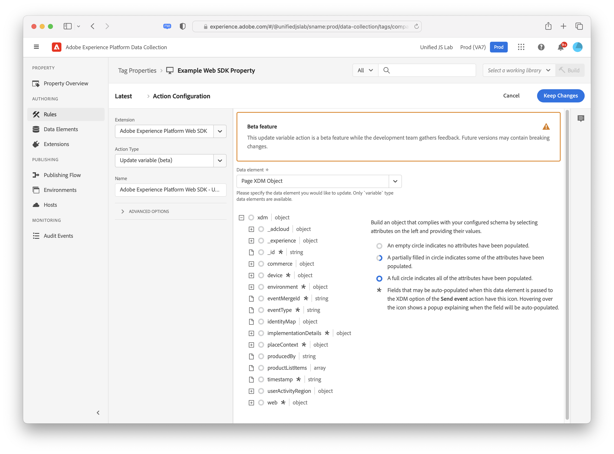
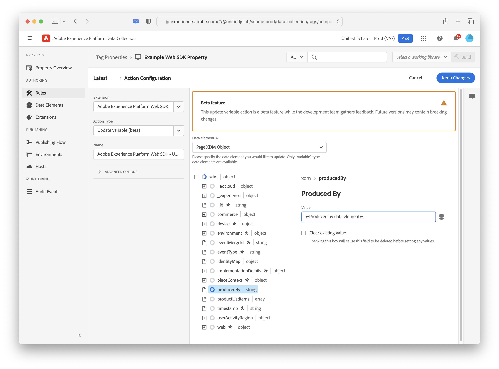
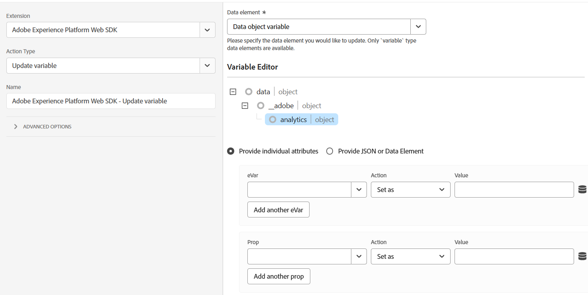

# Update variable

The **[!UICONTROL Update variable]** action allows you to make partial or incremental changes to a [variable data element](../data-element-types.md#variable). You can use this action to build up an object that can later be referenced in a [[!UICONTROL Send event]](send-event.md) action. Populating data elements and assigning them to properties within an XDM object fits most use cases; this action provides more flexibility to allow you to conditionally set properties to different data elements based on rule conditions.

Before using this action, you must already have a variable data element created. Once you select a variable data element to modify, an editor appears, allowing you to set any desired fields for this action.

The XDM schema used in the editor matches the schema selected within the variable data element. You can set one or more properties of the object by expanding objects and selecting desired properties. For example, in the screenshot below, the `producedBy` property is set to the data element `%Produced by data element%`.

If you select a variable data element that uses a data object instead of an XDM object, available fields depend on the products selected when configuring the data element. For example, if you create a data object that includes Adobe Analytics, fields, then selecing the variable data element in this UI would provide fields that you can fill out specific to Adobe Analytics.

