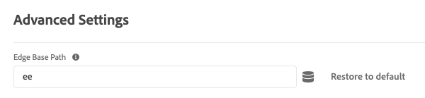

# Advanced configuration settings {#advanced}

>[!CONTEXTUALHELP]
>id="platform_tags_websdk_advanced"
>title="Advanced settings"
>abstract="Advanced configuration settings. Adobe recommends leaving these options as-is for most implementations."

This configuration section allows you to alter advanced settings. Adobe recommends leaving these options as-is for most implementations.

1. Log in to [experience.adobe.com](https://experience.adobe.com) using your Adobe ID credentials.
1. Navigate to **[!UICONTROL Data Collection]** > **[!UICONTROL Tags]**.
1. Select the desired tag property.
1. Navigate to **[!UICONTROL Extensions]**, then select **[!UICONTROL Configure]** on the [!UICONTROL Adobe Experience Platform Web SDK] card.
1. Scroll down to the **[!UICONTROL Advanced Settings]** section.

Currently, there is one option available.

## [!UICONTROL Edge base path]

Use this field to change the base path that is used to interact with the Edge Network. Adobe might request that you change this field if you participate in certain alpha or beta tests; otherwise, Adobe recommends leaving it at the default value of `ee`.

This field is the tag equivalent of [`edgeBasePath`](/help/collection/js/commands/configure/edgebasepath.md) when configuring the JavaScript library.
