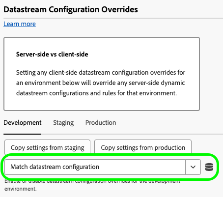
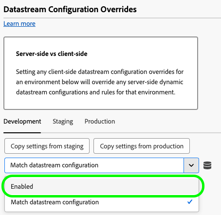
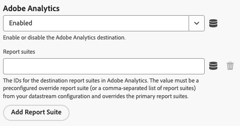
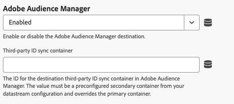
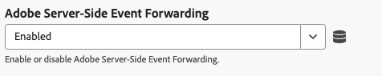
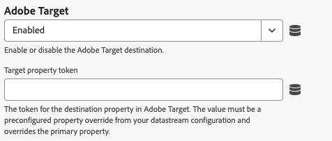

# Datastream configuration override settings

Datastream overrides allow you to define additional configurations for your datastreams, which get passed to the Edge Network via the Web SDK. This feature helps you conditionally trigger different datastream behaviors without creating a new datastream or modifying your existing settings.

1. Log in to [experience.adobe.com](https://experience.adobe.com) using your Adobe ID credentials.
1. Navigate to **[!UICONTROL Data Collection]** > **[!UICONTROL Tags]**.
1. Select the desired tag property.
1. Navigate to **[!UICONTROL Extensions]**, then select **[!UICONTROL Configure]** on the [!UICONTROL Adobe Experience Platform Web SDK] card.
1. Scroll down to the **[!UICONTROL Datastream configuration overrides]** section.

Datastream configuration override is a two step process:

1. First, you must define your datastream configuration override when [configuring a datastream](/help/datastreams/configure.md) in the Datastreams UI. See [Datastream configuration overrides](/help/datastreams/overrides.md) in the datastreams documentation for instructions on how to configure overrides.
1. After you have configured the datastream override in the datastreams UI, you can configure the tag extension.

Datastream overrides must be configured on a per-environment basis. The development, staging, and production environments all have separate overrides. You can copy the override settings between any desired environment:

By default, datastream configuration overrides are disabled. The **[!UICONTROL Match datastream configuration]** option is selected by default.

To enable datastream overrides in the tag extension, select **[!UICONTROL Enabled]** from the drop down menu.

After you enable the datastream configuration overrides, you can configure the overrides for each service described below. These datastream override settings override any server-side datastream configurations and rules for the selected environment.

## Adobe Analytics

Override data routing to the Adobe Analytics service.

* **[!UICONTROL Enabled]** / **[!UICONTROL Disabled]**: Enable or disable data routing to Adobe Analytics.
* **[!UICONTROL Report suites]**: The IDs for the destination report suites in Adobe Analytics. The value must be a preconfigured override report suite (or a comma-separated list of report suites) from your datastream configuration. This setting overrides the primary report suites.
* **[!UICONTROL Add Report Suite]**: Select this option to add additional report suites.

## Adobe Audience Manager

Override data routing to Adobe Audience Manager.

* **[!UICONTROL Enabled]** / **[!UICONTROL Disabled]**: Enable or disable data routing to Adobe Audience Manager.
* **[!UICONTROL Third-party ID sync container]**: The ID for the destination third-party ID sync container in Audience Manager. The value must be a preconfigured secondary container from your datastream configuration and overrides the primary container.

## Adobe Experience Platform

Override data routing to Adobe Experience Platform.

* **[!UICONTROL Enabled]** / **[!UICONTROL Disabled]**: Enable or disable data routing to Adobe Experience Platform.
* **[!UICONTROL Event dataset]**: The ID for the destination event dataset in the Adobe Experience Platform. The value must be a preconfigured secondary dataset from your datastream configuration.
* **[!UICONTROL Offer Decisioning]**: Enable or disable data routing to the [!DNL Offer Decisioning] service.
* **[!UICONTROL Edge Segmentation]**: Enable or disable data routing to the [!DNL Edge Segmentation] service.
* **[!UICONTROL Personalization Destinations]**: Enable or disable data routing to personalization destinations.
* **[!UICONTROL Adobe Journey Optimizer]**: Enable or disable data routing to [!DNL Adobe Journey Optimizer].

## Adobe Server-Side Event Forwarding

Override data routing to the Adobe Server-Side Event Forwarding service.

* **[!UICONTROL Enabled]** / **[!UICONTROL Disabled]**: Enable or disable data routing to the Adobe Server-Side Event Forwarding service.

## Adobe Target {#target}

Override data routing to Adobe Target.

* **[!UICONTROL Enabled]** / **[!UICONTROL Disabled]**: Enable or disable data routing to Adobe Target.
