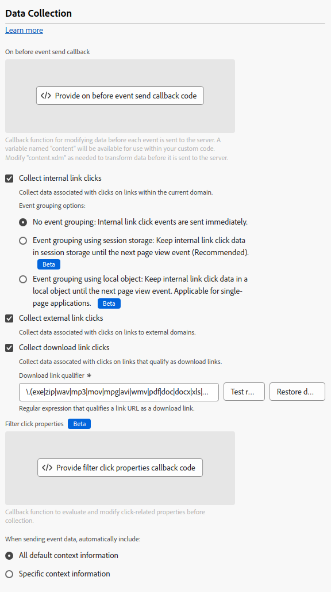

# Data collection configuration settings {#data-collection}

>[!CONTEXTUALHELP]
>id="platform_tags_websdk_datacollection"
>title="Data collection"
>abstract="Determine what data to collect and how that data is collected across the tag extension."

This configuration section allows you to determine how data is collected across the extension.

1. Log in to [CX Enterprise](https://experience.adobe.com) using your Adobe ID credentials.
1. Navigate to **[!UICONTROL Data Collection]** > **[!UICONTROL Tags]**.
1. Select the desired tag property.
1. Navigate to **[!UICONTROL Extensions]**, then select **[!UICONTROL Configure]** on the [!UICONTROL Adobe Experience Platform Web SDK] card.
1. Scroll down to the **[!UICONTROL Data collection]** section.



The following options are available:

## [!UICONTROL On before event send callback]

A callback function to evaluate and modify the payload sent to Adobe. Within the code editor, you have access to the following variables:

* **`content.xdm`**: The XDM payload for the event.
* **`content.data`**: The data object payload for the event.
* **`return true`**: Immediately exit the callback and send data to Adobe with the current values in the `content` object.
* **`return false`**: Immediately exit the callback and abort sending data to Adobe.

Any variables defined outside of `content` can be used, but are not included in the payload sent to Adobe.

>[!WARNING]
>
>This callback allows the use of custom code. If any code that you include in the callback throws an uncaught exception, processing for the event halts. **Data is not sent to Adobe.**

```js
// Use nullish coalescing assignments to add objects if they don't yet exist
content.xdm.commerce ??= {};
content.xdm.commerce.order ??= {};

// Then add the purchase ID
content.xdm.commerce.order.purchaseID = "12345";

// Use optional chaining to prevent undefined errors when setting tracking code to lower case
if(content.xdm.marketing?.trackingCode) content.xdm.marketing.trackingCode = content.xdm.marketing.trackingCode.toLowerCase();

// Delete operating system version
if(content.xdm.environment) delete content.xdm.environment.operatingSystemVersion;

// Immediately end onBeforeEventSend logic and send the data to Adobe for this event type
if (content.xdm.eventType === "web.webInteraction.linkClicks") {
  return true;
}

// Cancel sending data if it is a known bot
if (myBotDetector.isABot()) {
  return false;
}
```

>[!TIP]
>Avoid returning `false` on the first event on a page. Returning `false` on the first event can negatively impact personalization.

This callback is the tag equivalent to [`onBeforeEventSend`](/help/collection/js/commands/configure/onbeforeeventsend.md) in the JavaScript library.

## [!UICONTROL Collect internal link clicks]

A checkbox that enables the collection of link tracking data internal to your site or property. This checkbox is the tag equivalent to [`clickCollection.internalLinkEnabled`](/help/collection/js/commands/configure/clickcollection.md) in the JavaScript library. When you enable this checkbox, event grouping options appear:

* **[!UICONTROL No event grouping]**: Link tracking data is sent to Adobe in separate events. Link clicks sent in separate events can increase the contractual usage of data sent to Adobe Experience Platform.
* **[!UICONTROL Event grouping using session storage]**: Store link tracking data in session storage until the next "page view" event. On the next event that is considered a "page view", the stored link tracking data is merged with the "page view" event payload. Adobe recommends enabling this setting when tracking internal links.
* **[!UICONTROL Event grouping using local object]**: Store link tracking data in a local object until the next "page view" event. If a visitor navigates to a new browser page, link tracking data is lost. This setting is most beneficial in context of single-page applications.

The tag library considers a given event a "page view" when the following elements are included in the payload:

* `xdm.web.webPageDetails.name` contains a string value
* `xdm.web.webPageDetails.pageViews.value` is greater than `0`

## [!UICONTROL Collect external link clicks]

A checkbox that enables the collection of external links. This checkbox is the tag equivalent to [`clickCollection.externalLinkEnabled`](/help/collection/js/commands/configure/clickcollection.md) in the JavaScript library.

## [!UICONTROL Collect download link clicks]

A checkbox that enables the collection of download links. This checkbox is the tag equivalent to [`clickCollection.downloadLinkEnabled`](/help/collection/js/commands/configure/clickcollection.md) in the JavaScript library.

## [!UICONTROL Download link qualifier]

A regular expression that qualifies a link URL as a download link. This string is the tag equivalent to [`downloadLinkQualifier`](/help/collection/js/commands/configure/downloadlinkqualifier.md) in the JavaScript library.

## [!UICONTROL Filter click properties]

A callback function to evaluate and modify click-related properties before collection. This function runs before the [!UICONTROL On before event send callback], and is the tag equivalent to [`clickCollection.filterClickDetails`](/help/collection/js/commands/configure/clickcollection.md) in the JavaScript library. Within the code editor, you have access to the following variables:

* **`content.clickedElement`**: The DOM element that was clicked.
* **`content.pageName`**: The page name when the click happened.
* **`content.linkName`**: The name of the clicked link.
* **`content.linkRegion`**: The region of the clicked link.
* **`content.linkType`**: The type of link (exit, download, or other).
* **`content.linkURL`**: The destination URL of the clicked link.
* **`return true`**: Immediately exit the callback with the current variable values.
* **`return false`**: Immediately exit the callback and abort collecting data.
* Any variables defined outside of `content` can be used, but are not included in the payload sent to Adobe.

>[!TIP]
>
>The **[!UICONTROL On before link click send]** field is a deprecated callback that is only visible for properties that already have it configured. It is the tag equivalent to [`onBeforeLinkClickSend`](/help/collection/js/commands/configure/onbeforelinkclicksend.md) in the JavaScript library. Use the **[!UICONTROL Filter click properties]** callback to filter or adjust click data, or use the **[!UICONTROL On before event send callback]** to filter or adjust the overall payload sent to Adobe. If both the **[!UICONTROL Filter click properties]** callback and the **[!UICONTROL On before link click send]** callback are set, only the **[!UICONTROL Filter click properties]** callback runs.

## Context settings

Automatically collect visitor information, which populates specific XDM fields for you. You can choose **[!UICONTROL All default context information]** or **[!UICONTROL Specific context information]**. It is the tag equivalent to [`context`](/help/collection/js/commands/configure/context.md) in the JavaScript library.

* **[!UICONTROL Web]**: Collects information about the current page.
* **[!UICONTROL Device]**: Collects information about the user's device. 
* **[!UICONTROL Environment]**: Collects information about the user's browser.
* **[!UICONTROL Place context]**: Collects information about the user's location.
* **[!UICONTROL High entropy user-agent hints]**: Collects more detailed information about the user's device.
* **[!UICONTROL Send referrer to Adobe Analytics only once per page view]**: Prevent duplicate referrer data from being sent to Adobe Analytics.
