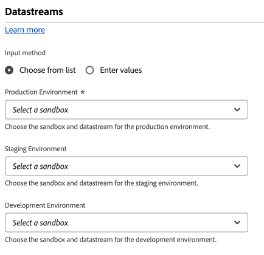

# Datastream configuration settings {#datastreams}

>[!CONTEXTUALHELP]
>id="platform_tags_websdk_datastreams"
>title="Datastreams"
>abstract="Required. Sets the datastream within the Edge Network that you want to send data to."

This configuration section allows you to determine which [datastream](/help/datastreams/overview.md) that you want to send data to. **A datastream ID is required for all data sent to the Edge Network.**

1. Log in to [experience.adobe.com](https://experience.adobe.com) using your Adobe ID credentials.
1. Navigate to **[!UICONTROL Data Collection]** > **[!UICONTROL Tags]**.
1. Select the desired tag property.
1. Navigate to **[!UICONTROL Extensions]**, then select **[!UICONTROL Configure]** on the [!UICONTROL Adobe Experience Platform Web SDK] card.
1. Scroll down to the **[!UICONTROL Datastreams]** section.

When selecting datastreams, you can do so for each [environment](/help/tags/ui/publishing/environments.md) ([!UICONTROL Development], [!UICONTROL Staging], and [!UICONTROL Production]). These fields are valuable when you want to separate data sent between development, staging, and production environments. It enables a convenient workflow where you do not need to worry about sending data to the wrong datastream, as long as you install the correct tag loader in each respective environment.

You can populate datastream IDs using one of the following methods:

* **[!UICONTROL Choose from list]**: Each environment contains two drop-down menus, allowing you to select the sandbox and datastream for the selected environment. The values in each drop-down menu depend on your configured [datastreams](/help/datastreams/overview.md) within each respective [sandbox](/help/sandboxes/ui/overview.md).

* **[!UICONTROL Enter values]**: As an alternative to using drop-down menus to select the desired datastream, you can manually specify the desired datastream ID directly. Each environment allows you to directly input a datastream ID, or populate this field using a [data element](/help/tags/ui/managing-resources/data-elements.md).
