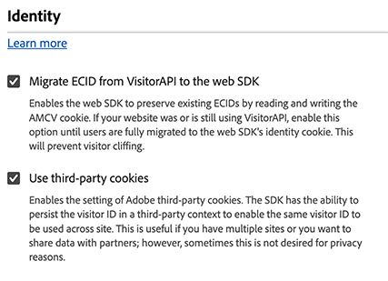

# Identity configuration settings {#identity}

>[!CONTEXTUALHELP]
>id="platform_tags_websdk_identity"
>title="Identity"
>abstract="Define how the tag extension identifies visitors."

This configuration section allows you to define the behavior of the Web SDK when it comes to handling user identification.

1. Log in to [experience.adobe.com](https://experience.adobe.com) using your Adobe ID credentials.
1. Navigate to **[!UICONTROL Data Collection]** > **[!UICONTROL Tags]**.
1. Select the desired tag property.
1. Navigate to **[!UICONTROL Extensions]**, then select **[!UICONTROL Configure]** on the [!UICONTROL Adobe Experience Platform Web SDK] card.
1. Scroll down to the **[!UICONTROL Identity]** section.

The following options are available:

## [!UICONTROL Migrate ECID from VisitorAPI]

A checkbox that allows the Web SDK to read the `AMCV` and `s_ecid` cookies and set the `AMCV` cookie used by `Visitor.js`. This feature is important when migrating from libraries that use `VisitorAPI.js` to the Web SDK, as some pages might still be using `Visitor.js`. This option allows the SDK to continue to use the same ECID so that users are not identified as two separate users. The JavaScript library equivalent to this checkbox is [`idMigrationEnabled`](/help/collection/js/commands/configure/idmigrationenabled.md).

## [!UICONTROL Use third-party cookies]

When this option is enabled, the Web SDK attempts to store a user identifier in a third-party cookie. If successful, the user is identified as a single user as they navigate across multiple domains, rather than being identified as a separate user on each domain. If this option is enabled, the SDK might still be unable to store the user identifier in a third-party cookie if the browser does not support third-party cookies or has been configured by the user to not allow third-party cookies. In this case, the SDK only stores the identifier in the first-party domain. The JavaScript library equivalent to this checkbox is [`thirdPartyCookiesEnabled`](/help/collection/js/commands/configure/thirdpartycookiesenabled.md).
