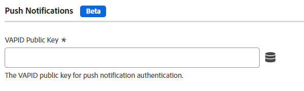

# Push notification settings

>[!AVAILABILITY]
>
>Push notifications for the Web SDK are currently in **beta**. The functionality and documentation are subject to change.

This configuration section allows you to set a VAPID public key for push notification authentication.

>[!NOTE]
>
>This feature must first be enabled using [Custom build components](custom-build-components.md); it is disabled by default.

1. Log in to [experience.adobe.com](https://experience.adobe.com) using your Adobe ID credentials.
1. Navigate to **[!UICONTROL Data Collection]** > **[!UICONTROL Tags]**.
1. Select the desired tag property.
1. Navigate to **[!UICONTROL Extensions]**, then click **[!UICONTROL Configure]** on the [!UICONTROL Adobe Experience Platform Web SDK] card.
1. Expand **[!UICONTROL Custom build components]**, then enable **[!UICONTROL Push notifications]**.
1. Under [!UICONTROL SDK instances], scroll down to locate the [!UICONTROL Push Notifications] section.
1. Enter your VAPID public key in the **[!UICONTROL VAPID Public Key]** field.

The following fields are available:

## [!UICONTROL VAPID public key]

The VAPID public key used for push subscriptions. It is a Base64-encoded string.

## [!UICONTROL Application ID]

The application ID associated with the VAPID public key.

## [!UICONTROL Tracking dataset ID]

The dataset ID for push notification tracking and analytics.

## Push notifications using the JavaScript library

This section is the tag equivalent of [`pushNotifications`](/help/collection/js/commands/configure/pushnotifications.md) when configuring the JavaScript library. The linked page also provides information about prerequisites and generating a VAPID public key.
