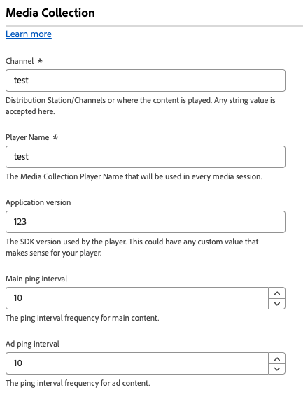

# Streaming media configuration settings

The media collection feature helps you collect data related to media sessions, such as media playbacks, pauses, completions, and other related events. Once collected, you can send this data to Adobe Experience Platform or Adobe Analytics to generate reports. This feature provides a comprehensive solution for tracking and understanding media consumption behavior on your website.

1. Log in to [experience.adobe.com](https://experience.adobe.com) using your Adobe ID credentials.
1. Navigate to **[!UICONTROL Data Collection]** > **[!UICONTROL Tags]**.
1. Select the desired tag property.
1. Navigate to **[!UICONTROL Extensions]**, then select **[!UICONTROL Configure]** on the [!UICONTROL Adobe Experience Platform Web SDK] card.
1. Scroll down to the **[!UICONTROL Streaming media]** section.

## Prerequisites

To use the streaming media component of the Web SDK, you must meet the following prerequisites:

* Make sure that you have access to Adobe Experience Platform or Adobe Analytics.
* Enable the **[[!UICONTROL Media Analytics]](/help/datastreams/configure.md#advanced-options)** option for the datastream you are using.
* Ensure that the schema used by your datastream includes the Media Collection schema fields.
* Configure the Streaming Media feature in the Web SDK tag extension, as shown on this page.

## [!UICONTROL Channel]

The name of the channel where media collection occurs. For example, `Video channel`. Any string value is valid.

## [!UICONTROL Player Name]

The name of the media player that your property uses for media playback.

## [!UICONTROL Application Version]

The version of the media player application that your property uses for media playback.

## [!UICONTROL Main ping interval]

The frequency of pings for main content, in seconds. The default value is `10`. Values can range from `10` to `50` seconds. If no value is specified, the default value is used when using [automatically-tracked sessions](/help/collection/js/commands/createmediasession.md#automatic).

## [!UICONTROL Ad ping interval]

The frequency of pings for ad content, in seconds. The default value is `10`. Values can range from `1` to `10` seconds. If no value is specified, the default value is used when using [automatically-tracked sessions](/help/collection/js/commands/createmediasession.md#automatic).
