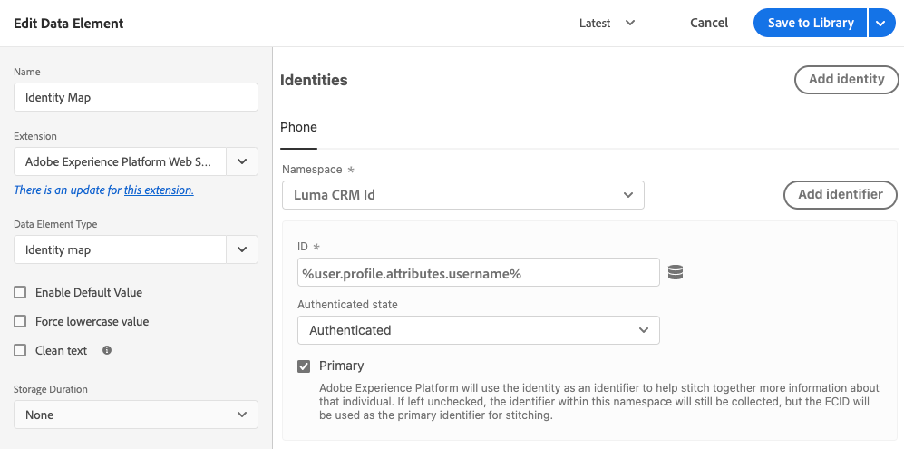
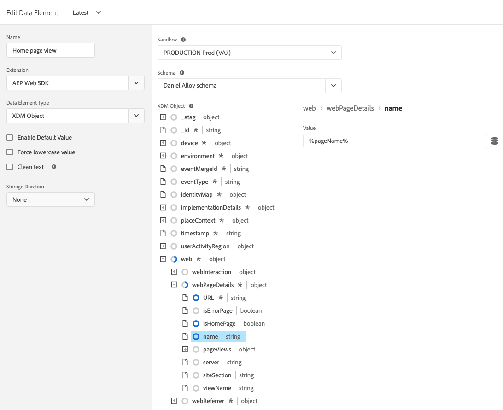
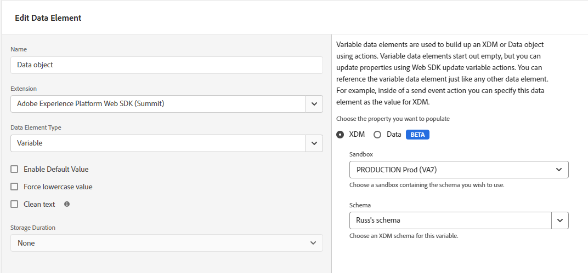
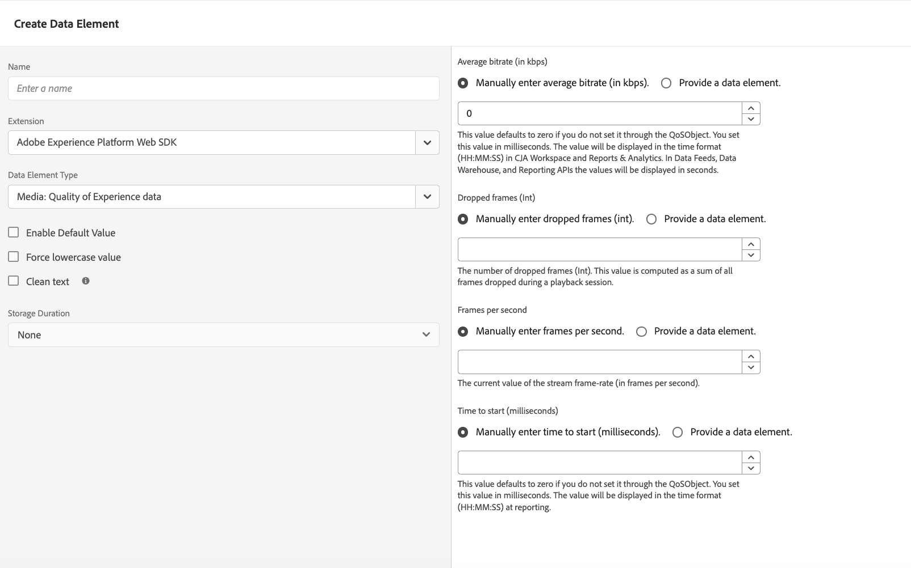

# Data element types

After you set your [action types](actions/actions-overview.md) in the tag extension, you must configure your data element types. This page describes the available data element types.

## Identity map {#identity-map}

An identity map allows you to establish identities for the visitor of your web page. An identity map consists of namespaces, like `CRMID`, `Phone` or `Email`, with each namespace containing one or more identifiers. For example, if the individual on your website has provided two phone numbers, your phone namespace should contain two identifiers.

In the [!UICONTROL Identity map] data element, you will provide the following pieces of information for each identifier:

* **[!UICONTROL ID]**: The value identifying the visitor. For example, if the identifier belongs to the _phone_ namespace, the [!UICONTROL ID] could be _555-555-5555_. This value typically is derived from a JavaScript variable or some other piece of data on your page, so it's best to create a data element that references the page data, then reference the data element in the [!UICONTROL ID] field within the [!UICONTROL Identity map] data element. If, when running on your page, the ID value is anything but a populated string, the identifier will be automatically removed from the identity map.
* **[!UICONTROL Authenticated state]**: A selection indicating whether the visitor is authenticated.
* **[!UICONTROL Primary]**: A selection indicating whether the identifier should be used as the primary identifier for the individual. If no identifier is marked as primary, the ECID will be used as the primary identifier.

>[!TIP]
>
>Adobe recommends sending identities which represent a person, such as `Luma CRM Id` as the primary identity.
>
>If the identity map contains the person identifier (e.g. `Luma CRM Id`), then the person identifier will become the primary identifier. Otherwise, `ECID` becomes the primary identity.

You should not provide an [!DNL ECID] when building an identity map. When using the SDK, an [!DNL ECID] is automatically generated on the server and included in the identity map.

The identity map data element is often used with the [[!UICONTROL Variable]](#variable) data element and the [[!UICONTROL Set consent]](actions/set-consent.md) action.

Read more about the [Adobe Experience Platform Identity Service](/help/identity-service/home.md).

## XDM object {#xdm-object}

Formatting your data to XDM is easier with the XDM object data element. When you first open this data element, select the correct Adobe Experience Platform sandbox and schema. After you have selected your schema, you see the structure of your schema, which you can easily fill out.

Notice that when you open certain fields of your schema, such as `web.webPageDetails.URL`, some items are automatically collected. Even though several items are automatically collected, you can overwrite any, if needed. All the values can be filled in manually or using other data elements.

>[!NOTE]
>
>Only fill in the pieces of information you are interested in collecting. Anything that is not filled in is omitted when the data is sent to the solutions.

## Variable {#variable}

You can create payload objects using the **[!UICONTROL Variable]** data element. Both [!UICONTROL XDM] and [!UICONTROL Data] objects are supported.

* When you select [!UICONTROL XDM], select the desired [!UICONTROL Sandbox] and [!UICONTROL Schema].
* When you select [!UICONTROL Data], select the desired solutions. Available solutions include [!UICONTROL Adobe Analytics] and [!UICONTROL Adobe Target].

After you create this data element, you can use the [Update variable](actions/update-variable.md) action to modify it. When ready, you can include this data element in the [Send event](actions/send-event.md) action to send data to a datastream.

## Media: Quality of Experience {#quality-experience}

A **[!UICONTROL Quality of Experience]** data element is helpful when sending streaming media events to Adobe Experience Platform. You can add this element when creating a media session and the following media events will contain updated Quality of Experience data.

## Next steps {#next-steps}

Learn about specific use cases such as [accessing the ECID](accessing-the-ecid.md).
