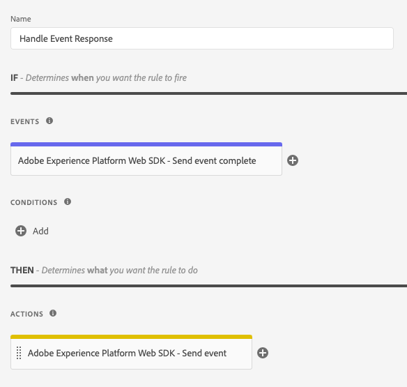
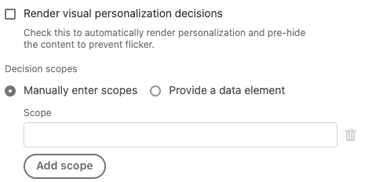

# Event types

This page describes the Adobe Experience Platform event types provided by the Adobe Experience Platform Web SDK tag extension. These are used to [build rules](https://experienceleague.adobe.com/docs/platform-learn/data-collection/tags/build-rules.html) and should not be confused with the `eventType` field in the [`xdm` object](/help/web-sdk/commands/sendevent/xdm.md).

## [!UICONTROL Send event complete]

Typically, your property would have one or more rules using the [[!UICONTROL Send event] action](action-types.md#send-event) to send events to Adobe Experience Platform Edge Network. Each time an event is sent to Edge Network, a response is returned to the browser with useful data. Without the [!UICONTROL Send event complete] event type, you wouldn't have access to this returned data.

To access the returned data, create a separate rule, then add a [!UICONTROL Send event complete] event to the rule. This rule is triggered each time a successful response is received from the server as a result of a [!UICONTROL Send event] action.

When a [!UICONTROL Send event complete] event triggers a rule, it provides data returned from the server that may be useful to accomplish certain tasks. Typically, you will add a [!UICONTROL Custom code] action (from the [!UICONTROL Core] extension) to the same rule that contains the [!UICONTROL Send event complete] event. In the [!UICONTROL Custom code] action, your custom code will have access to a variable named `event`. This `event` variable will contain the data returned from the server.

Your rule for handling data returned from Edge Network might look something like this:



Below are some examples of how to perform certain tasks using the [!UICONTROL Custom code] action in this rule.

### Manually render personalized content

In the Custom Code action, which is in the rule for handling response data, you can access personalization propositions that were returned from the server. To do so, you would type the following custom code:

```javascript
var propositions = event.propositions;
```

If `event.propositions` exists, it is an array containing personalization proposition objects. The propositions included in the array are determined, in large part, by how the event was sent to the server.

For this first scenario, assume you have not checked the [!UICONTROL Render decisions] checkbox and have not provided any [!UICONTROL decision scopes] inside the [!UICONTROL Send event] action responsible for sending the event.



In this example, the `propositions` array only contains propositions related to the event that are eligible for automatic rendering.

The `propositions` array might look similar to this example:

```json
[
  {
    "id": "AT:eyJhY3Rpdml0eUlkIjoiMTI3MDE5IiwiZXhwZXJpZW5jZUlkIjoiMCJ9",
    "scope": "__view__",
    "items": [
      {
        "id": "11223344",
        "schema": "https://ns.adobe.com/personalization/dom-action",
        "data": {
          "content": "<h2 style=\"color: yellow\">An HTML proposition.</h2>",
          "selector": "#hero",
          "type": "setHtml"
        },
        "meta": {}
      }
    ],
    "renderAttempted": false
  },
  {
    "id": "AT:PyJhY3Rpdml0eUlkIjoiMTI3MDE5IiwiZXhwZXJpZW5jZUlkIjoiMCJ8",
    "scope": "__view__",
    "items": [
      {
        "id": "11223345",
        "schema": "https://ns.adobe.com/personalization/dom-action",
        "data": {
          "content": "<h2 style=\"color: yellow\">Another HTML proposition.</h2>",
          "selector": "#sidebar",
          "type": "setHtml"
        },
        "meta": {}
      }
    ],
    "renderAttempted": false
  }
]
```

When sending the event, the [!UICONTROL Render decisions] checkbox was not checked, so the SDK did not attempt to automatically render any content. The SDK still automatically retrieved the content eligible for automatic rendering, however, and provided it to you to manually render if you would like to do so. Notice that each proposition object has its `renderAttempted` property set to `false`.

If you would have instead checked the [!UICONTROL Render decisions] checkbox when sending the event, the SDK would have attempted to render any propositions eligible for automatic rendering. As a consequence, each of the proposition objects would have its `renderAttempted` property set to `true`. There would be no need to manually render these propositions in this case.

So far, you've only looked at personalization content that is eligible for automatic rendering (for example, any content created in Adobe Target's Visual Experience Composer). To retrieve any personalization content _not_ eligible for automatic rendering, request the content by providing decision scopes using the [!UICONTROL Decision scopes] field in the [!UICONTROL Send event] action. A scope is a string that identifies a particular proposition you would like to retrieve from the server.

The [!UICONTROL Send event] action would look as follows:


In this example, if propositions are found on the server matching the `salutation` or `discount` scope, they are returned and included in the `propositions` array. Be aware that propositions qualifying for automatic rendering will continue to be included in the `propositions` array, regardless of how you configure the [!UICONTROL Render decisions] or [!UICONTROL Decision scopes] fields in the [!UICONTROL Send event] action. The `propositions` array, in this case, would look similar to this example:

```json
[
  {
    "id": "AT:cZJhY3Rpdml0eUlkIjoiMTI3MDE5IiwiZXhwZXJpZW5jZUlkIjoiMCJ2",
    "scope": "salutation",
    "items": [
      {
        "schema": "https://ns.adobe.com/personalization/json-content-item",
        "data": {
          "id": "4433221",
          "content": {
            "salutation": "Welcome, esteemed visitor!"
          }
        },
        "meta": {}
      }
    ],
    "renderAttempted": false
  },
  {
    "id": "AT:FZJhY3Rpdml0eUlkIjoiMTI3MDE5IiwiZXhwZXJpZW5jZUlkIjoiMCJ0",
    "scope": "discount",
    "items": [
      {
        "schema": "https://ns.adobe.com/personalization/html-content-item",
        "data": {
          "id": "4433222",
          "content": "<div>50% off your order!</div>",
          "format": "text/html"
        },
        "meta": {}
      }
    ],
    "renderAttempted": false
  },
  {
    "id": "AT:eyJhY3Rpdml0eUlkIjoiMTI3MDE5IiwiZXhwZXJpZW5jZUlkIjoiMCJ9",
    "scope": "__view__",
    "items": [
      {
        "id": "11223344",
        "schema": "https://ns.adobe.com/personalization/dom-action",
        "data": {
          "content": "<h2 style=\"color: yellow\">An HTML proposition.</h2>",
          "selector": "#hero",
          "type": "setHtml"
        },
        "meta": {}
      }
    ],
    "renderAttempted": false
  },
  {
    "id": "AT:PyJhY3Rpdml0eUlkIjoiMTI3MDE5IiwiZXhwZXJpZW5jZUlkIjoiMCJ8",
    "scope": "__view__",
    "items": [
      {
        "id": "11223345",
        "schema": "https://ns.adobe.com/personalization/dom-action",
        "data": {
          "content": "<h2 style=\"color: yellow\">Another HTML proposition.</h2>",
          "selector": "#sidebar",
          "type": "setHtml"
        },
        "meta": {}
      }
    ],
    "renderAttempted": false
  }
]
```

At this point, you can render proposition content as you see fit. In this example, the proposition matching the `discount` scope is an HTML proposition built using Adobe Target's Form-based Experience Composer. Assume you have an element on your page with the ID of `daily-special` and wish to render the content from the `discount` proposition into the `daily-special` element. Do the following:

1. Extract propositions from the `event` object.
1. Loop through each proposition, looking for the proposition with a scope of `discount`.
1. If you find a proposition, loop through each item in the proposition, looking for the item that is HTML content. (It's better to check than to assume.)
1. If you find an item containing HTML content, find the `daily-special` element on the page and replace its HTML with the personalized content.

Your custom code within the [!UICONTROL Custom code] action might appear as follows:

```javascript
var propositions = event.propositions;

var discountProposition;
if (propositions) {
  // Find the discount proposition, if it exists.
  for (var i = 0; i < propositions.length; i++) {
    var proposition = propositions[i]; 
    if (proposition.scope === "discount") {
      discountProposition = proposition;
      break;
    }
  }
}

var discountHtml;
if (discountProposition) {
  // Find the item from proposition that should be rendered.
  // Rather than assuming there a single item that has HTML
  // content, find the first item whose schema indicates
  // it contains HTML content.
  for (var j = 0; j < discountProposition.items.length; j++) {
    var discountPropositionItem = discountProposition.items[i]; 
    if (discountPropositionItem.schema === "https://ns.adobe.com/personalization/html-content-item") {
      discountHtml = discountPropositionItem.data.content;
      break;
    }
  }
}

if (discountHtml) {
  // Discount HTML exists. Time to render it.
  var dailySpecialElement = document.getElementById("daily-special");
  dailySpecialElement.innerHTML = discountHtml;
}
```

### Accessing Adobe Target response tokens

Personalization content returned from Adobe Target includes [response tokens](https://experienceleague.adobe.com/docs/target/using/administer/response-tokens.html), which are details about the activity, offer, experience, user profile, geo information, and more. These details can be shared with third-party tools or used for debugging. Response tokens can be configured in the Adobe Target user interface.

In the Custom Code action, which is in the rule for handling response data, you can access personalization propositions that were returned from the server. To do so, type the following custom code:

```javascript
var propositions = event.propositions;
```

If `event.propositions` exists, it is an array containing personalization proposition objects. See [Manually render personalized content](#manually-render-personalized-content) for more information on the content of `result.propositions`.

Assume you would like to gather all activity names from all propositions that were automatically rendered by the web SDK and push them into a single array. You could then send the single array to a third party. In this case, write custom code inside the [!UICONTROL Custom code] action to:

1. Extract propositions from the `event` object.
1. Loop through each proposition.
1. Determine if the SDK rendered the proposition.
1. If so, loop through each item in the proposition.
1. Retrieve the activity name from the `meta` property, which is an object containing response tokens.
1. Push the activity name into an array.
1. Send the activity names to a third party.

```javascript
var propositions = event.propositions;
if (propositions) {
  var activityNames = [];
  propositions.forEach(function(proposition) {
    if (proposition.renderAttempted) {
      proposition.items.forEach(function(item) {
        if (item.meta) {
          // item.meta contains the response tokens.
          var activityName = item.meta["activity.name"];
          // Ignore duplicates
          if (activityNames.indexOf(activityName) === -1) {
            activityNames.push(activityName);  
          }
        }
      });
    }
  });
  // Now that activity names are in an array,
  // you can send them to a third party or use
  // them in some other way.
}
```
