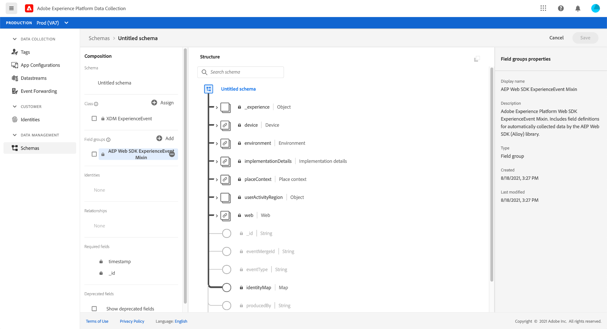
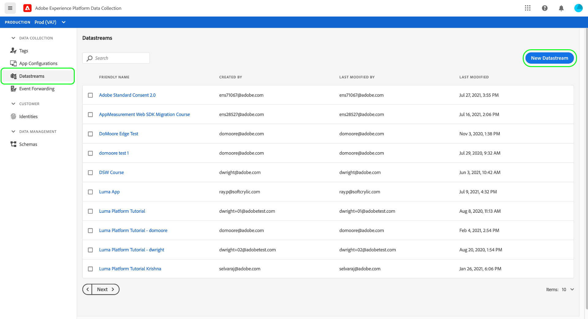
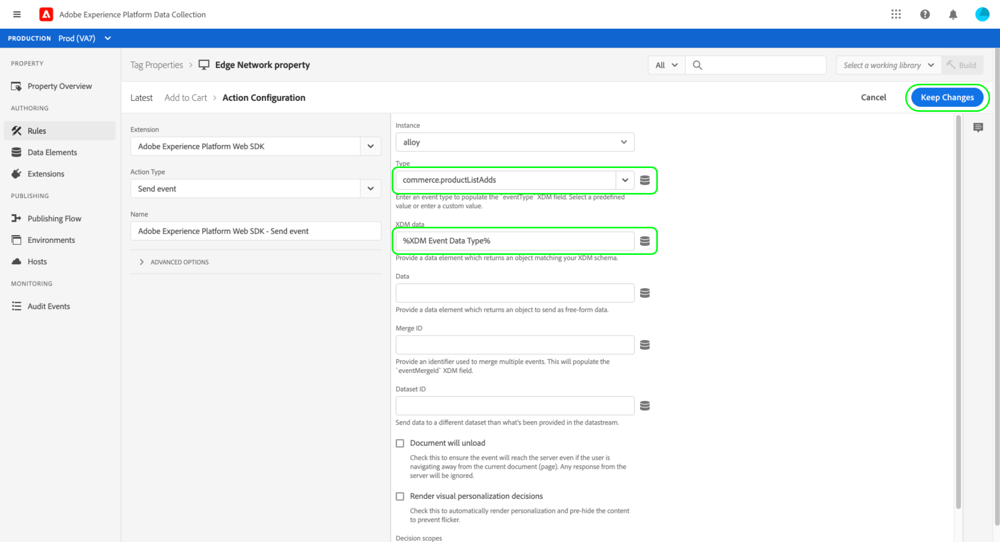

# Getting started with the Web SDK tag extension

Use Adobe Experience Platform's **tags** (formerly Launch) to send event data from your website to the Edge Network and downstream Adobe solutions.

Before following these steps, make sure that you can access the following [property rights](/help/tags/ui/administration/user-permissions.md):

* [!UICONTROL Develop]
* [!UICONTROL Manage extensions]

In addition, ensure that you have all [permissions](/help/access-control/home.md#permissions) under the following categories:

* Data modeling
* Identities

## Create an XDM schema {#schema}

The [Experience Data Model (XDM)](/help/xdm/home.md) is an open-source specification that provides common structures and definitions for data in the form of schemas. Configuring a schema is highly recommended when sending data to the Edge Network.

1. Log in to [experience.adobe.com](https://experience.adobe.com) using your Adobe ID credentials.
1. Navigate to **[!UICONTROL Data Collection]** > **[!UICONTROL Schemas]**.
1. Select **[!UICONTROL Create schema]**.
1. Select **[!UICONTROL Experience Event]**, then select **[!UICONTROL Next]**.
1. Give the schema a desired name, then select **[!UICONTROL Finish]**.
1. (Optional) You can add more fields or [field groups](/help/xdm/ui/resources/field-groups.md) for any additional data that you want to collect.

>[!NOTE]  
>Once saved, schemas only allow *additive* changes. See [schema evolution](/help/xdm/schema/composition.md#evolution) for more information.

## Create a datastream {#datastream}

A [Datastream](/help/datastreams/overview.md) is a configuration that tells the Edge Network how to handle the data that you send it. When you configure a datastream to send data to a given product, the datastream automatically passes along relevant data to each respective product in a way that specific product understands.

1. Navigate to **[!UICONTROL Data Collection]** > **[!UICONTROL Datastreams]**.
1. Select **[!UICONTROL New datastream]**.
1. Give the datastream a desired name, and select the recently created schema under **[!UICONTROL Mapping schema]**.
1. Select **[!UICONTROL Save]**.

## Create a tag property

Once you have created a schema and a datastream, you can create and configure a tag property.

1. Navigate to **[!UICONTROL Data Collection]** > **[!UICONTROL Tags]**.
1. Select **[!UICONTROL New property]**.
1. Give the tag property a desired name and domain, then select **[!UICONTROL Save]**.

## Install the tag extension

The Web SDK tag extension is installed on a given tag property.

1. Navigate to **[!UICONTROL Data Collection]** > **[!UICONTROL Tags]** > **[!UICONTROL Extensions]**.
1. Select the **[!UICONTROL Catalog]** tab.
1. Use search to locate the **[!UICONTROL Adobe Experience Platform Web SDK]** extension.
1. Select the extension card, then select **[!UICONTROL Install]** on the right.

## Configure the tag extension

When you install the Web SDK tag extension, you are automatically taken to the [Configuration](configure/config-overview.md) page.

1. Under the [Datastreams section](configure/datastreams.md), select the desired datastream for each environment.

All other configuration settings are either filled out for you or optional. Set any desired configuration settings, then select **[!UICONTROL Save]**.

## Create a variable data element

Adobe recommends using [Variable](data-element-types.md#variable) data elements to store the payload that you want to send to Adobe. XDM objects are also available data elements, but are older and more limited in applicable use cases.

1. Navigate to **[!UICONTROL Data Collection]** > **[!UICONTROL Tags]**.
1. Select the desired tag property.
1. Select **[!UICONTROL Data elements]** > **[!UICONTROL Create new data element]**.
1. Give the data element the following properties on the left:
   * **[!UICONTROL Name]**: Any desired name
   * **[!UICONTROL Extension]**: [!UICONTROL Adobe Experience Platform Web SDK]
   * **[!UICONTROL Data element type]**: [!UICONTROL Variable]
1. Set the following properties on the right:
   **Variable type**: XDM
   **[!UICONTROL Sandbox]**: The sandbox that you created your schema in
   **[!UICONTROL Schema]**: The desired schema
1. Select **[!UICONTROL Save]**.

## Create a rule

Rules determine when you want to trigger something or set variables. Creating a rule that runs whenever the library is loaded allows you to easily populate variables that you want to contain a value on every page.

1. Navigate to **[!UICONTROL Data Collection]** > **[!UICONTROL Tags]**.
1. Select the desired tag property.
1. Select **[!UICONTROL Rules]** > **[!UICONTROL Add rule]**.
1. Give the rule a desired name.
1. Select the '`+`' icon next to **[!UICONTROL Events]**.
1. Give the event the following settings:
   * **[!UICONTROL Extension]**: [!UICONTROL Core]
   * **[!UICONTROL Event type]**: [!UICONTROL Library loaded (page top)]
1. Select **[!UICONTROL Keep changes]**.

The above steps establish the criteria part of the rule, which is to trigger once the library loads. The following steps establish the action to taken when that criteria is met.

1. Select the '`+`' icon next to **[!UICONTROL Actions]**.
1. Give the action the following settings on the left:
   * **[!UICONTROL Extension]**: [!UICONTROL Adobe Experience Platform Web SDK]
   * **[!UICONTROL Action type]**: [!UICONTROL Send event]
1. Set the following fields on the right:
   * **[!UICONTROL XDM]**: The XDM variable data element
1. Select **[!UICONTROL Keep changes]**.

## Publish

The tag property contains all components necessary to send data to the Edge Network.

1. Navigate to **[!UICONTROL Data Collection]** > **[!UICONTROL Publishing flow]**.
1. Select **[!UICONTROL Add library]**.
1. Give the library a desired name. Consider this name similar to a commit name when working in version control software.
1. Set the environment drop-down menu to **[!UICONTROL Development]**.
1. Select **[!UICONTROL Add all changed resources]**.
1. Select **[!UICONTROL Save & build to Development]**.

Your changes are now deployed to your development environment.

1. Navigate to **[!UICONTROL Data Collection]** > **[!UICONTROL Environments]**.
1. Select the install icon next to the Development environment
1. Install the embed code within a test web page on your site.

Once you validate that the tag works on your devlopment environment, you can use the [!UICONTROL Publishing flow] interface to publish the library to staging, then eventually to production.

1. Add the extension and rule to a **Library**, build it to an **Environment**, and install the embed code on your site.  
2. Validate with **Adobe Experience Platform Debugger**.

You now have a lean setup that captures events and sends them to the Edge Network. You can now further build up your implementation by adding fields to your schema, adding products to a datastream, or adding data elements to your tag property.
