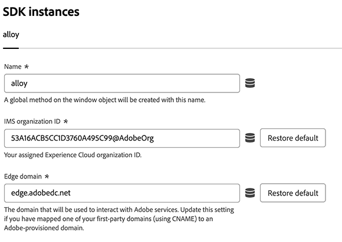
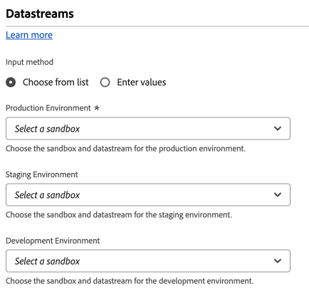
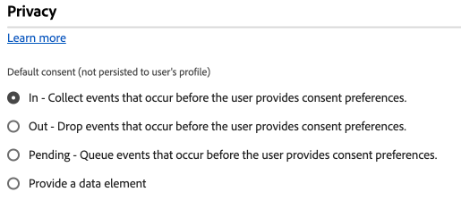
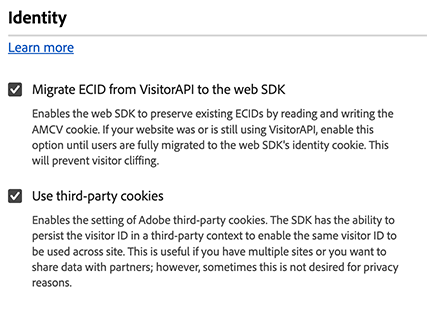
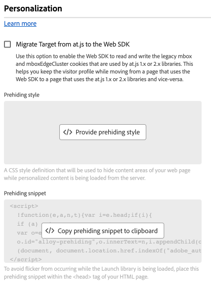
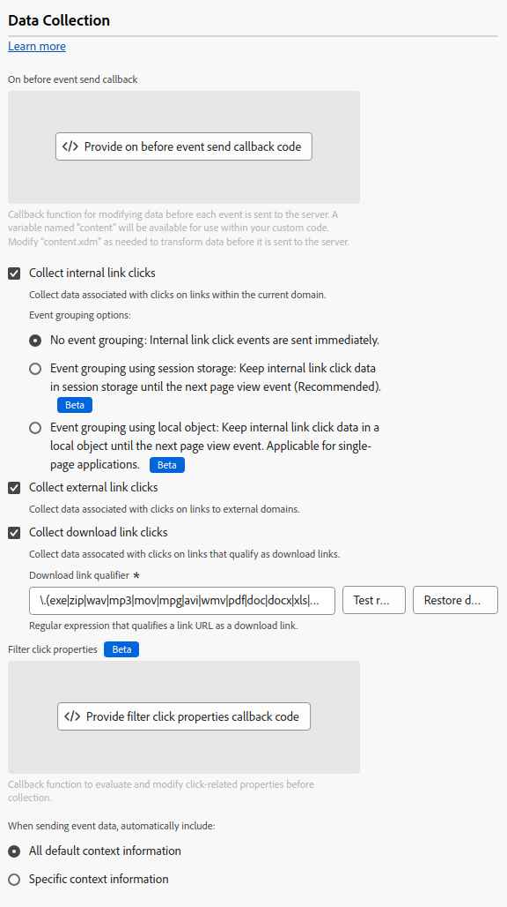
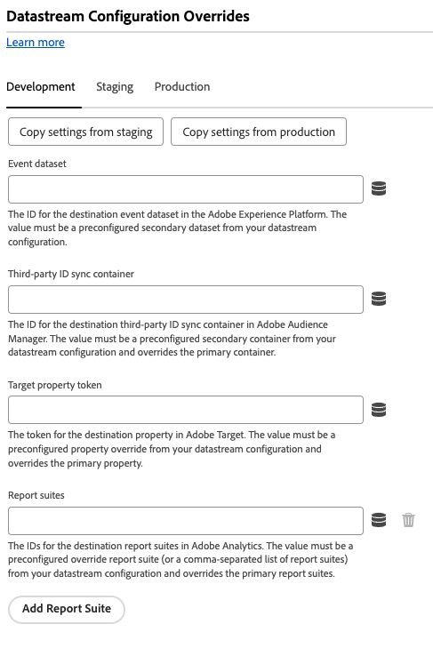

# Configure the Web SDK tag extension

The [!DNL Web SDK] tag extension sends data to Adobe Experience Cloud from web properties through the Experience Platform Edge Network.

The extension allows you to stream data into Platform, synchronize identities, process customer consent signals, and automatically collect context data.

This document explains how to configure the tag extension in the Tags UI.

## Install the Web SDK tag extension {#install}

The Web SDK tag extension needs a property to be installed on. If you have not done so already, see the documentation on [creating a tag property](https://experienceleague.adobe.com/docs/platform-learn/implement-in-websites/configure-tags/create-a-property.html).

After you have created a property, open the property and select the **[!UICONTROL Extensions]** tab on the left side bar.

Select the **[!UICONTROL Catalog]** tab. From the list of available extensions, find the [!DNL Web SDK] extension and select **[!UICONTROL Install]**.

After selecting **[!UICONTROL Install]**, you must configure the Web SDK tag extension and save the configuration.

>[!NOTE]
>
>The tag extension only gets installed after saving the configuration. See the next sections to learn how to configure the tag extension.

## Configure instance settings {#general}

The configuration options at the top of the page tell Adobe Experience Platform where to route the data and what configurations to use on the server.

* **[!UICONTROL Name]**: The Adobe Experience Platform Web SDK extension supports multiple instances on the page. The name is used to send data to multiple organizations with a tag configuration. The instance name defaults to `alloy`. However, you can change the instance name to any valid JavaScript object name.
* **[!UICONTROL IMS organization ID]**: The ID of the organization that you would like the data sent to at Adobe. Most of the time, use the default value that is autopopulated. When you have multiple instances on the page, populate this field with the value of the second organization you want to send data to.
* **[!UICONTROL Edge domain]**: The domain that the extension sends and receives data from. Adobe recommends using a 1st-party domain (CNAME) for this extension. The default 3rd-party domain works for development environments but is not suitable for production environments. Instructions on how to set up a first-party CNAME are listed [here](https://experienceleague.adobe.com/docs/core-services/interface/ec-cookies/cookies-first-party.html).

## Configure datastream settings {#datastreams}

This section allows you to select the datastreams that should be used for each of the three available environments (production, staging, and development).

When a request is sent to the Edge Network, a datastream ID is used to reference the server-side configuration. You can update the configuration without having to make code changes on your website.

See the guide on [datastreams](../../../../datastreams/overview.md) to learn how to configure a datastream.

You can either choose a datastream from the available drop-down menus, or select **[!UICONTROL Enter values]** and enter a custom datastream ID for each environment.

## Configure privacy settings {#privacy}

This section allows you to configure how Web SDK handles user consent signals from your website. Specifically, it allows you to select the default level of consent that is assumed of a user if no other explicit consent preference has been provided.

The default consent level is not saved to the user profile.

| [!UICONTROL Default consent level] | Description |
| --- | --- |
| [!UICONTROL In] | Collect events that occur before the user provides consent preferences. |
| [!UICONTROL Out] | Discard events that occur before the user provides consent preferences. |
| [!UICONTROL Pending] | Queue events that occur before the user provides consent preferences. When consent preferences are provided, the events will be collected or discarded depending on the provided preferences. |
| [!UICONTROL Provided by data element] | The default consent level is determined by a separate data element that you define. When using this option, you must specify the data element using the provided dropdown menu. |

>[!TIP]
>
>Use **[!UICONTROL Out]** or **[!UICONTROL Pending]** if you require explicit user consent for your business operations.

## Configure identity settings {#identity}

This section allows you to define the behavior of the Web SDK when it comes to handling user identification.

* **[!UICONTROL Migrate ECID from VisitorAPI]**: This option is enabled by default. When this feature is enabled, the SDK can read the `AMCV` and `s_ecid` cookies and set the `AMCV` cookie used by [!DNL Visitor.js]. This feature is important when migrating to Web SDK, as some pages might still be using [!DNL Visitor.js]. This option allows the SDK to continue to use the same [!DNL ECID] so that users are not identified as two separate users.
* **[!UICONTROL Use third-party cookies]**: When this option is enabled, Web SDK attempts to store a user identifier in a third-party cookie. If successful, the user is identified as a single user as they navigate across multiple domains, rather than being identified as a separate user on each domain. If this option is enabled, the SDK might still be unable to store the user identifier in a third-party cookie if the browser does not support third-party cookies or has been configured by the user to not allow third-party cookies. In this case, the SDK only stores the identifier in the first-party domain.

## Configure personalization settings {#personalization}

This section allows you to configure how you want to hide certain parts of a page while personalized content is loaded. This ensures that your visitors only see the personalized page.

* **[!UICONTROL Migrate Target from at.js to the Web SDK]**: Use this option to enable [!DNL Web SDK] to read and write the legacy `mbox` and `mboxEdgeCluster` cookies that are used by at.js `1.x` or `2.x` libraries. This helps you keep the visitor profile while moving from a page that uses the Web SDK to a page that uses at.js `1.x` or `2.x` libraries and vice-versa.

### Prehiding style {#prehiding-style}

The prehiding style editor allows you to define custom CSS rules to hide specific sections of a page. When the page is loaded, Web SDK uses this style to hide the sections which need to be personalized, retrieves the personalization, then un-hides the personalized page sections. This way, your visitors see the already personalized pages, without seeing the personalization retrieval process.
 
### Prehiding snippet {#prehiding-snippet}

The prehiding snippet is useful when the Web SDK library is loaded asynchronously. In this situation, to avoid flickering, we recommend hiding the content before the Web SDK library is loaded.

To use the prehiding snippet, copy and paste it inside the `<head>` element of your page.

>[!IMPORTANT]
>
>When using the prehiding snippet, Adobe recommends to use the same [!DNL CSS] rule as the one used by the [prehiding style](#prehiding-style).

## Configure data collection settings {#data-collection}

* **[!UICONTROL Callback function]**: The callback function provided in the extension is also called the [`onBeforeEventSend` function](https://experienceleague.adobe.com/docs/experience-platform/edge/fundamentals/configuring-the-sdk.html) in the library. This function allows you to modify events globally before they're sent to the Edge Network. More detailed information on how to use this function can be found [here](../../../../edge/fundamentals/tracking-events.md#modifying-events-globally). 
* **[!UICONTROL Enable click data collection]**: Web SDK can automatically collect link click information for you. By default, this feature is enabled but can be disabled using this option. Links are also labeled as download links if they contain one of the download expressions listed in the [!UICONTROL Download Link Qualifier] textbox. Adobe provides you with some default download link qualifiers. You can edit them according to your needs.
* **[!UICONTROL Automatically collected context data]**: By default, Web SDK collects certain context data regarding device, web, environment, and place context. If you would like to see a list of the information Adobe collects, you can find it [here](../../../../edge/data-collection/automatic-information.md). If you don't want this data collected or you only want certain categories of data collected, select **[!UICONTROL Specific context information]** and select the data that you want to be collected.  

## Configure datastream overrides {#datastream-overrides}

Datastream overrides allow you to define additional configurations for your datastreams, which get passed to the Edge Network via the Web SDK.

This helps you trigger different datastream behaviors than the default ones, without creating a new datastream or modifying your existing settings.

Datastream configuration override is a two step process:

1. First, you must define your datastream configuration overrides in the [datastream configuration page](../../../../datastreams/configure.md).
2. Then, you must send the overrides to the Edge Network either via a Web SDK command, or by using the Web SDK tag extension.

See the datastream [configuration overrides documentation](../../../../datastreams/overrides.md) for detailed instructions on how to override datastream configurations.

As an alternative to passing the overrides through a Web SDK command, you can configure the overrides in the tag extension screen shown below.

>[!IMPORTANT]
>
> Datastream overrides must be configured on a per-environment basis. The development, staging, and production environments all have separate overrides. You can copy the settings between them using the dedicated options shown in the screen below.

## Configure advanced settings

Use the **[!UICONTROL Edge base path]** field if you need to change the base path that is used to interact with the Edge Network. This shouldn't require updating, but in the case that you participate on a beta or alpha, Adobe might ask you to change this field.

