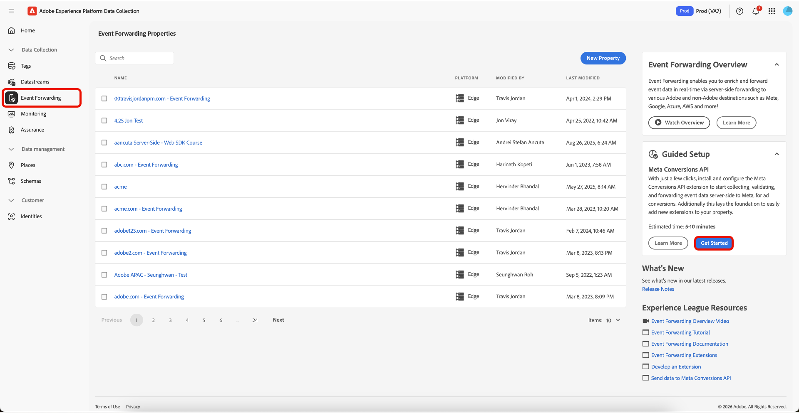
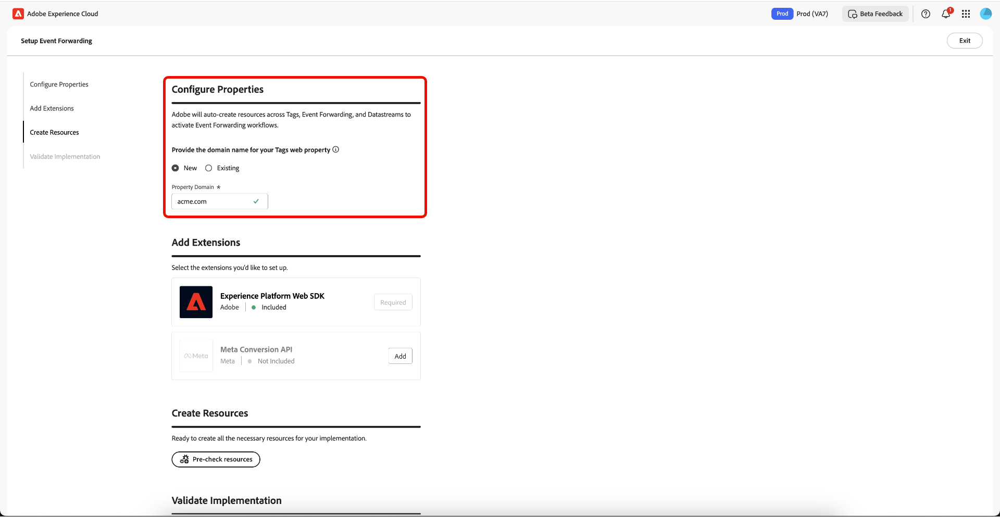

# Event Forwarding guided setup overview

>[!IMPORTANT]
>
>The guided setup feature is available to customers who have purchased the Real-Time CDP Prime and Ultimate package. Please contact your Adobe representative for more information.

>[!NOTE]
>
>Any existing client can use the guided setup workflows to create a reference implementation that can be used for the following:
>
>* Use it as the start of a brand new implementation. 
>* Take advantage of it as a reference implementation that you can examine to see how it has been configured and then replicate in your current production implementations.

The guided setup feature helps you get set up with ease and efficiency. This tool automates multiple steps that are performed in Adobe tags and event forwarding, significantly reducing the setup time.

This setup can auto-install extensions. This hybrid implementation is recommended by [!DNL Meta] to collect and forward event conversions server-side. The guided setup feature is designed to help you get started with an event forwarding implementation and is not intended to deliver an end to end, fully functional implementation that accommodates all use cases.

## Get started with guided setup {#guided-setup}

To get started with the feature, select **[!UICONTROL Get Started]** in the right navigation in the **[!UICONTROL Event Forwarding]** Data Collections UI.

### Create a new tags property {#new-property}

In the Configure Properties section, select **[!UICONTROL New]** and enter the new **[!UICONTROL Property Domain]** details.

Select **[!UICONTROL Add]** for the [!DNL Meta Conversion API] in the Add Extensions section. In the Configure [!DNL Meta] Information page, you have the option to manually enter your **[!UICONTROL Meta Pixel ID]**, **[!UICONTROL Meta System User Access Token]**, and **[!UICONTROL Data Layer Path]**, or you can use the **[!UICONTROL Connect to Meta]** option.

#### Connect to [!DNL Meta] using your credentials {#meta-credentials}

Select **[!UICONTROL Connect to Meta]**, then enter your [!DNL Meta] credentials and select **[!UICONTROL Log in]**, then select **[!UICONTROL Next]**.

You will now be requested to **Create business portfolio**. Enter the **[!UICONTROL Business portfolio name]** and select **[!UICONTROL Next]**.

Select your business portfolio from the list, then select **[!UICONTROL Next]**. You can see the settings for Business Portfolio, Ad Account, and [!DNL Meta Pixel]. Select **[!UICONTROL Continue]** to confirm settings, then select **[!UICONTROL Next]**.

Allow a few minutes for the setup process to complete, then select **[!UICONTROL Done]**.

Your **[!UICONTROL Meta Pixel ID]**, **[!UICONTROL Meta System User Access Token]**, and **[!UICONTROL Data Layer Path]** will be automatically populated. Select **[!UICONTROL Save]**.

#### Create resources for your new tags property {#create-resources}

In the Create Resources section, select **[!UICONTROL Pre-check resources]** to check you organization and properties for collisions or existing necessary resources for your implementation.

The Task Actions page displays a list of tasks and actions. Select **[!UICONTROL Create Resources]** to create these tasks.

Allow a few minutes for the required rules, data elements, extensions, libraries, SDKs, and so on to finish installing. The Create Resources section provides links to the properties and resources created.

#### Validate your implementation {#validate-implementation}

The Validate Implementation section provides the embed link you can use on your website. **[!UICONTROL Start Validation]** runs the test in your current browser session on this guided setup page. If validation succeeds here, the same implementation should work when you deploy the embed link on your site.

Select **[!UICONTROL Send PageView Event]** to send a test event through the Adobe Experience Platform Edge Network. It is then server-side forwarded to [!DNL Meta]. Select **[!UICONTROL Finished Validation]** to complete the setup.

>[!NOTE]
>
>If any failures occur during the validation process, select the **[!UICONTROL Assurance]** link to review events that may have failed.

### Use an existing tags property {#existing-property}

In the Configure Properties section, select **[!UICONTROL Existing]**, then select your tags property from the drop-down menu. The system attempts to find the event forwarding property that's already attached to this property through the datastreams. You can now continue to reconfigure the [!DNL Meta Conversion API], then pre-check and create resources.

If the selected tags property is not connected to an event forwarding property or if datastreams are missing, they will be automatically created.

To configure your [!DNL Meta Conversion API] follow the process highlighted above in the [Connect to [!DNL Meta] using your credentials](#meta-credentials).

Now that you have generated **[!UICONTROL Meta Pixel ID]**, **[!UICONTROL Meta System User Access Token]**, and **[!UICONTROL Data Layer Path]**, select **[!UICONTROL Pre-Check resources]** to create the event forwarding workflow.

Since you are using an existing tags property, the setup process differs slightly from the new property workflow. You can see the system will skip the creation of the web property, host, and environment since these already exist. Finally, select **[!UICONTROL Create Resources]** to create the tasks that are not yet available.

>[!INFO]
>
>The guided setup automatically adds notes to properties that are updated during the process. You can view these in the Notes section in the right panel of the tags property when in edit mode. You can see when the property was updated or created by the guided setup tool. This audit trail helps you track modifications made by the guided setup feature.

Allow a few minutes for the required rules, data elements, extensions, libraries, SDKs, and so on to finish installing. The Create Resources section provides links to the properties and resources created.

The Validate Implementation section provides the embed link you can use on your website. **[!UICONTROL Start Validation]** runs the test in your current browser session on this guided setup page. If validation succeeds here, the same implementation should work when you deploy the embed link on your site.

Select **[!UICONTROL Send PageView Event]** to send a test event through the Adobe Experience Platform Edge Network. It is then server-side forwarded to [!DNL Meta]. Select **[!UICONTROL Finished Validation]** to complete the setup.

>[!NOTE]
>
>If any failures occur during the validation process, select the **[!UICONTROL Assurance]** link to review events that may have failed.

## Next steps {#next-steps}

This guide covered how to use the guided setup tool to create and configure properties for the [!DNL Meta Conversions API]. 

See the [!DNL Meta] documentation on [best practices for the [!DNL Conversions API]](https://www.facebook.com/business/help/308855623839366?id=818859032317965) for more guidance on how to effectively implement your integration. For more general information on tags and event forwarding in Adobe Experience Cloud, refer to the [tags overview](../../../home.md).
