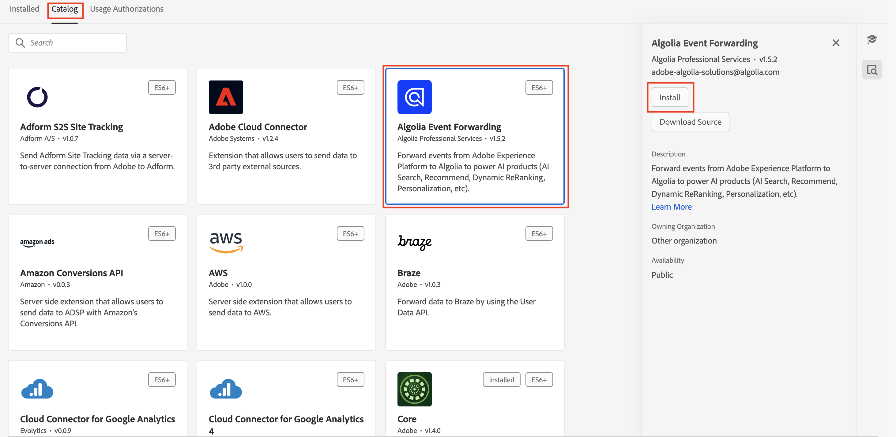
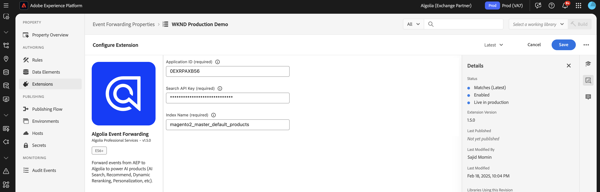
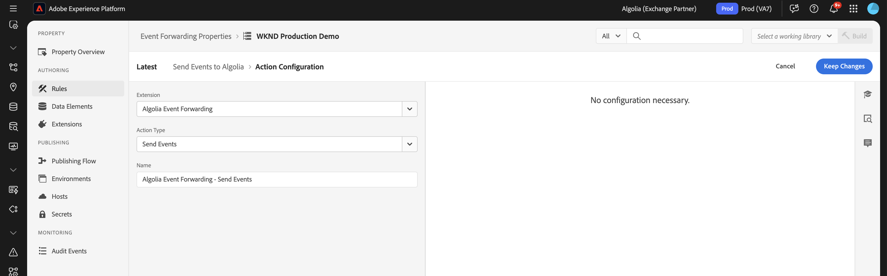
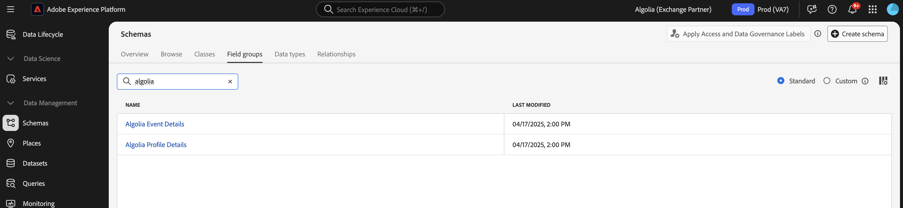
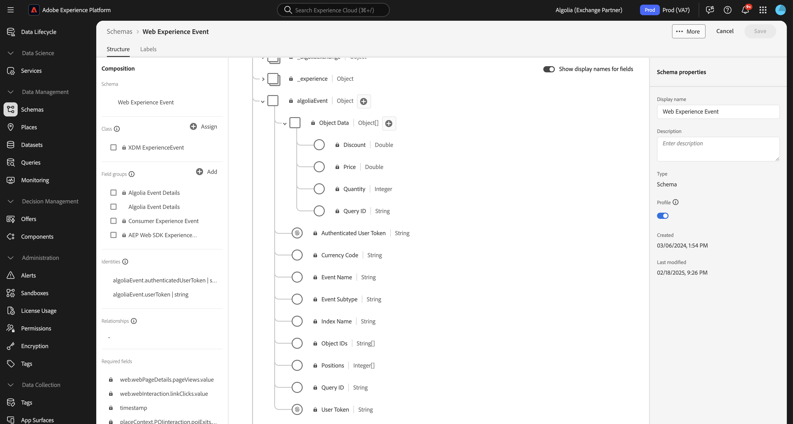
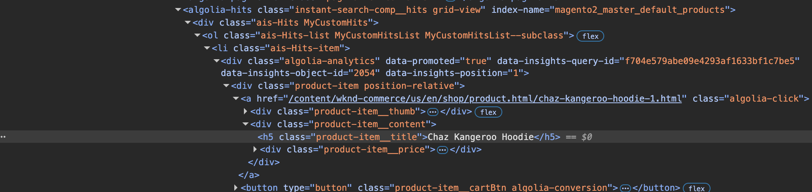
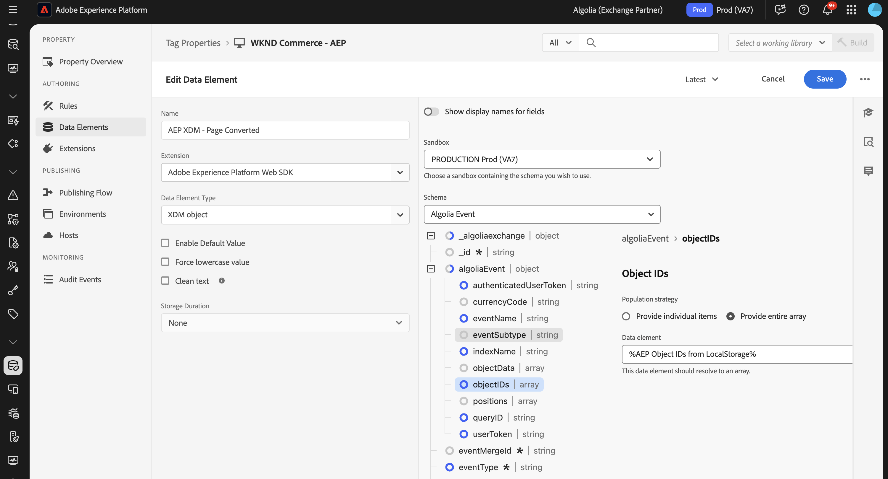
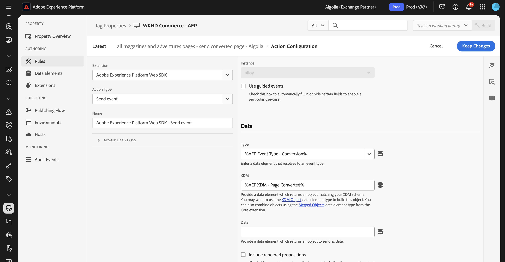
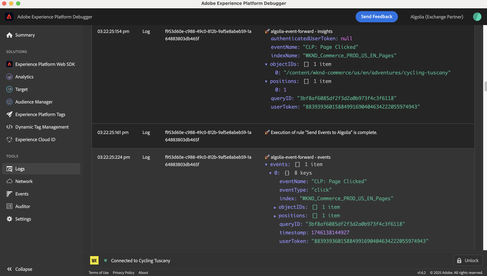
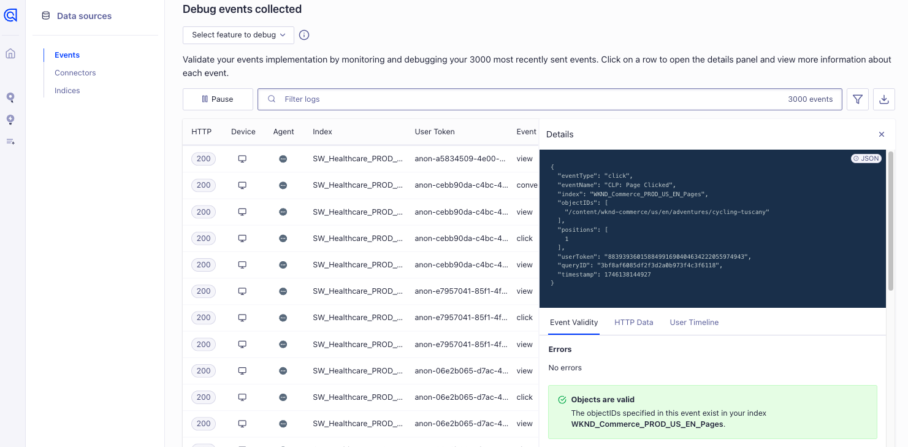

# [!DNL Algolia] event forwarding extension overview {#overview}

Use [!DNL Algolia] to deliver fast, relevant, and personalized search experiences. With AI-powered optimization, you can enhance search results and recommendations to help users quickly find the products, content, or information they need.

Use the [!DNL Algolia] event forwarding extension to send user behavior events to [!DNL Algolia] through the [!DNL Insights API]. This behavioral data enables AI-powered recommendations, personalized experiences, and intelligent search capabilities.

## Prerequisites {#prerequisites}

Before you install the extension, make sure that you have a [!DNL Algolia] account with access to the [!DNL Insights API]. If you don't have an account, [sign up](https://dashboard.algolia.com/users/sign_up) and enable access to the API.

Also make sure that you understand how to use the [!DNL Algolia] [!DNL Insights API]. For an overview of how to send events, see the [sending events with the Insights API](https://www.algolia.com/doc/guides/sending-events/getting-started/).

Gather the following values from your [!DNL Algolia] account dashboard:
    - **[!UICONTROL Application ID]**
    - **[!UICONTROL Search API Key]**
    - **[!UICONTROL Index Name]**

## Install the extension {#install}

To install the [!DNL Algolia] extension, follow these steps:

Navigate to **[!UICONTROL Data Collection]** in [!DNL Adobe Experience Platform]. Select the **[!UICONTROL Extensions]** tab.

Open the **[!UICONTROL Catalog]** and locate the **[!UICONTROL Algolia Event Forwarding]** extension and then select **[!UICONTROL Install]**.

### Configure the extension {#configure-extension}

To configure the [!DNL Algolia] event forwarding extension, navigate to the **[!UICONTROL Extensions]** tab, select the **[!UICONTROL Algolia]** extension and then select **[!UICONTROL Configure]**.

| Property | Description |
|----------|-------------|
| **[!UICONTROL Application ID]** | Enter the [!UICONTROL Application ID] found in the Algolia Dashboard under the [API Keys](https://www.algolia.com/account/api-keys/all) section. |
| **[!UICONTROL Search API Key]** | Enter the [!UICONTROL Search API Key] found in the Algolia Dashboard under the [API Keys](https://www.algolia.com/account/api-keys/all) section. |
| **[!UICONTROL Index Name]** | Enter the [!UICONTROL Index Name] that contains your products or content. This index is used as the default value. |

{style="table-layout:auto"}

## [!DNL Algolia] event forwarding extension action types {#action-types}

The [!DNL Algolia] event forwarding extension offers a single action type that can be used in the **[!UICONTROL Then]** section of a rule:

### Send event {#send-event}

Configure the **[!UICONTROL Send event]** action to forward events to [!DNL Algolia]:

Select **[!UICONTROL Rules]** > **[!UICONTROL Add Rule]** or select an existing rule. In the **[!UICONTROL Then]** portion of the rule, add an action and select **[!UICONTROL Extension]**: [!DNL Algolia] Event Forwarding > **[!UICONTROL Action Type]**: **[!UICONTROL Send Events]**.

## Implement the [!DNL Algolia] event field group {#algolia-field-group}

Ensure you add the [!DNL Algolia] event field group to your schema before you use the [!DNL Algolia] event forwarding extension. It is one of the standard field groups provided through Experience Platform.

### Add the [!DNL Algolia] event field group to your schema {#add-algolia-field-group}

To add the [!DNL Algolia] event field group:

Navigate to **[!UICONTROL Schemas]** and select **[!UICONTROL Browse]**.

Add a new schema or update an existing schema that you use to send web events and hover over the **[!UICONTROL Add]** icon. Enter *[!DNL Algolia]* in the search box to narrow down the results.

Select the **[!DNL Algolia] Event Details** field group > **[!UICONTROL Add field group]** button > **[!UICONTROL Save]**.

### Map and send data using the [!UICONTROL Data Collection] tag

The [!DNL Algolia] event forwarding extension can be used with the **[!DNL Adobe Experience Platform Web SDK]** to send data from your website to [!DNL Algolia]. This is done by creating a tag property, mapping data to the [!DNL XDM] object, and configuring rules to send events.

#### Step 1: Create a tag property with the web SDK

1. Create a tag property.
2. Install the [!DNL Adobe Experience Platform Web SDK] extension.
3. Use this extension to map data from HTML to the **[!DNL Algolia] Event** field group.

#### Step 2: Create a data element for [!DNL XDM] mapping

1. Create a [!UICONTROL Data Element] using the **[!DNL Adobe Experience Platform Web SDK]**.
2. Select **[!UICONTROL XDM object]** as the data element type.
3. Map your data to the appropriate [!DNL XDM] fields, ensuring that [!DNL Algolia]-specific fields are populated.

#### Step 3: Create a rule to send events

1. Create a new rule in your tag property.
2. Add the required event triggers such as page load, or click events.
3. Add an action using **[!DNL Adobe Experience Platform Web SDK]**.
4. Select **[!UICONTROL Send event]** as the action type.
5. Configure the action to use your [!DNL XDM] data element.

#### Step 4: Publish and test

1. Publish the rules and extension changes to your target environment.
2. Use the [!DNL Adobe Experience Platform Debugger] to verify the data is sent to Adobe Experience Platform and forwarded to [!DNL Algolia].

### Verify events in [!DNL Algolia]

After configuring the [!DNL Algolia] event forwarding extension, you can verify that events are being sent and received correctly by following these steps:

Navigate to your [!DNL Algolia] dashboard and go to **[!UICONTROL Data Sources > Events > Debugger]**.

Select the event that matches the event sent from [!DNL Algolia]'s event forwarding extension and verify that the expected data is present in the event.

## Common implementation scenarios

Use the [!DNL Algolia] event forwarding extension to capture and send user interaction data for various use cases, enhancing search relevance and personalization.

### Track product or content views

Use the extension to track when users view product or content pages, helping [!DNL Algolia] understand user interests.

### Track conversion events

Track add-to-cart events, purchases, and other conversion events to optimize [!DNL Algolia]'s AI-powered recommendations.

## Troubleshoot

If you encounter issues while implementing the [!DNL Algolia] event forwarding extension, consider the following troubleshooting steps:

### Events do not appear in [!DNL Algolia]

If events do not appear in [!DNL Algolia], check the following: 

- **Verify API Credentials**: Ensure that the **[!UICONTROL Application ID]** and **[!UICONTROL API Key]** match the values in your [!DNL Algolia] dashboard.
- **Check Event Debugger**: Use the [!DNL Algolia] Event Debugger to confirm if events are being received. If not, verify the event forwarding rule configuration.
- **Inspect XDM Mapping**: Ensure that all required fields in the [!DNL Algolia] schema are mapped correctly in the [!DNL XDM] object.

### Incorrect event data

- Ensure that your [!DNL XDM] object data element is accurately mapped to the [!DNL Algolia] schema, with all required fields.
- Confirm that the event parameters matchthe expected format and structure outlined in [!DNL Algolia]'s Insights API documentation.

## Next steps

This guide covered how to send data to [!DNL Algolia] using the [!DNL Algolia Event Forwarding Extension]. For more information on event forwarding capabilities in [!DNL Adobe Experience Platform], read the [event forwarding overview](../../../ui/event-forwarding/overview.md).

For details on how to debug your implementation using the Experience Platform Debugger and Event Forwarding Monitoring tool, read the [Adobe Experience Platform Debugger overview](../../../../debugger/home.md) and [Monitor activities in event forwarding](../../../ui/event-forwarding/monitoring.md).

## Additional resources

- [[!DNL Algolia] Insights API Documentation](https://www.algolia.com/doc/rest-api/insights/)
- [[!DNL Algolia] Events Documentation](https://www.algolia.com/doc/guides/sending-events/getting-started/)
- [[!DNL Adobe Experience Platform] Event Forwarding Documentation](https://experienceleague.adobe.com/docs/experience-platform/tags/event-forwarding/overview.html)
- [[!DNL Algolia] AI Features Overview](https://www.algolia.com/products/ai-search/)
