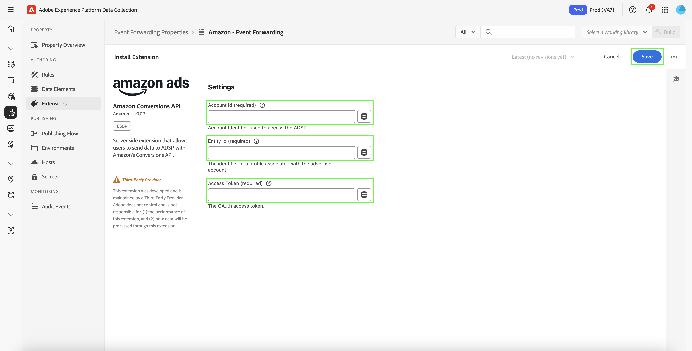
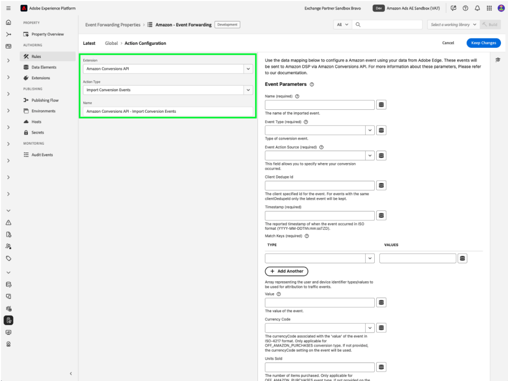
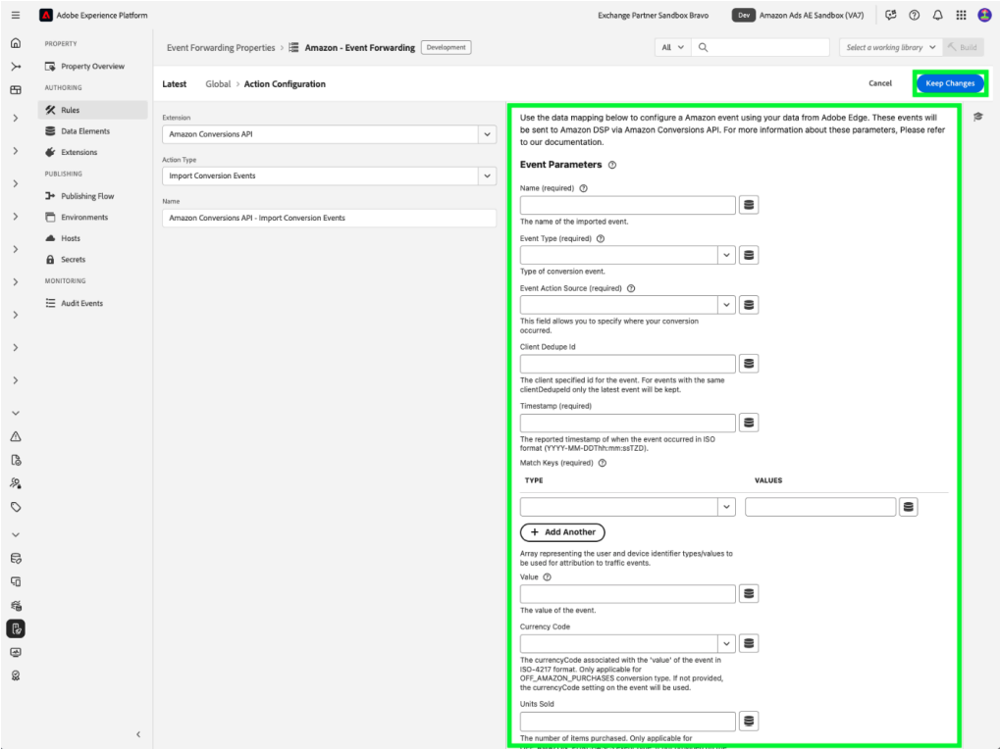

# [!DNL Amazon] web events API extension overview

The [!DNL Amazon] Conversions API extension creates a direct connection between marketing data from an advertiser's server and [!DNL Amazon]. It enables advertisers to evaluate campaign effectiveness regardless of conversion location and optimize campaigns accordingly. This extension provides complete attribution, data reliability, and optimized delivery.

## [!DNL Amazon] prerequisites {#prerequisites}

Before you install and configure the [!DNL Amazon] Conversions API extension, complete the following prerequisite steps to ensure proper authentication and data access:

### Create a secret and data element {#secret}

Create a new [!DNL Amazon] [event forwarding secret](../../../ui/event-forwarding/secrets.md) and provide it with a unique name that signifies the authenticating member. This will be used to authenticate the connection to your account while keeping the value secure.

Next, [create a data element](../../../ui/managing-resources/data-elements.md#create-a-data-element) using the [!UICONTROL Core] extension and a [!UICONTROL Secret] data element type to reference the `Amazon` secret you just created.

### Gather required configuration details {#configuration-details}

In order to connect Experience Platform to [!DNL Amazon], input the following details:

| Key Type | Description |
| --- | --- |
| Account ID | The unique account identifier for your [!DNL Amazon] account.|
| Entity ID | The identifier of a profile associated with the advertiser account. This can be found in the Campaign Manager portal URL, prefixed with `entity`.|
| Access Token | The non-expiring access token of your app, which is used for authenticating to the [!DNL Amazon] API via OAuth. Refer to the [Amazon API documentation on authentication](https://developer.amazon.com/docs/app-porting/device-messaging-fit-obtain-api-key.html) for guidance. |

## Install and configure the [!DNL Amazon] extension {#install-configure}

Follow these steps to install and configure the [!DNL Amazon] Conversions API extension:

1. Create or edit an event forwarding property.
2. Navigate to **Extensions** in the left navigation panel, then select the [!DNL Amazon] extension in the Catalog tab.
3. Select **Install**.

   

4. Configure the extension with the following details:
   - **Access Token**: Your data element secret containing the OAuth 2 token.

     

   - **Entity ID**: Your Entity ID (found in the Campaign Manager portal URL with the "entity" prefix).

     

5. Select **Save** to complete the configuration.

## Configure an event forwarding rule {#config-rule}

Once all your data elements are set up, create event forwarding rules to determine when and how your events are sent to [!DNL Amazon].

1. Navigate to **Rules** and create a new event forwarding rule.
2. Under **Actions**, select **Amazon Conversions API Extension**.
3. Set the **Action Type** to **Import Conversion Events**.

   

### Configure conversion event data {#conversion-event-data}

Conversion event data is critical to track user interactions and measure the effectiveness of your campaigns. By forwarding this data to [!DNL Amazon], you can gain insights into user behavior, optimize your campaigns, and ensure accurate attribution for conversions.

The table below outlines the key properties required to configure and forward conversion event data:

| Input | Description | Required | Example |
| --- | --- | --- | --- |
| `name` | The name of the imported event. | Yes | `My Event Name` |
| `eventType` | The standard Amazon event type associated with the event and used for reporting. | Yes | `Add to Shopping Cart` |
| `eventActionSource` | The platform from which the event was sourced. | Yes | `WEBSITE` |
| `clientDedupeId` | The advertiser-specified `id` for the conversion event. For events with the same `clientDedupeId`, only the first event is retained and all subsequent events are dropped. | Optional | `3234A398932` |
| `timestamp` | The reported timestamp of when the event occurred. The timestamp can be up to 7 days before you send an event. Data older than 7 days will not be processed. | Yes | `2023-05-08T14:04:28Z` |
| `matchKeys` | Array representing the customer and device identifier types/values to be used for attribution to traffic events. | Yes | --- |
| `matchKeys > type` | The identifier type used for attribution. | Yes | --- |
| `matchKeys > value` | The identifier value used for attribution. | Yes | List of SHA-256 hashed identifier values of the customer who performed the event. |
| `value` | The value of the event. | Optional | `5`, or `0.99` |
| `currencyCode` | The currency code associated with the `value` of the event in ISO-4217 format. Only applicable for Off Amazon Purchases event type. If not provided, the currency code setting on the conversion definition will be used. | Optional | `USD`, `EUR`, `GBP`, etc. |
| `unitsSold` | The number of items purchased. Only applicable for Off Amazon Purchases event type. If not provided on the conversion event, a default of `1` will be applied. | Optional | --- |
| `countryCode` | This value is based on ISO 3166-1 alpha-2, two-letter country codes defined in ISO 3166-1, part of the ISO 3166 standard published by the International Organization for Standardization (ISO), to represent countries, dependent territories, and special areas of geographical interest. | Yes | --- |
| `dataProcessingOptions` | Indicates user consent for advertising data usage. | Optional | LIMITED_DATA_USE |

- Select **[!UICONTROL Keep Changes]** to save the rule.

## Event deduplication {#deduplication}

Deduplication is essential to ensure accurate reporting and prevent inflated conversion counts when using both the [!DNL Amazon] Advertising Tag (AAT) and the [!DNL Amazon] Conversions API extension to track the same events.

### When is deduplication required?

- **Required**: If the same event is being sent from both the client (AAT) and the server (Conversions API).
- **Not required**: If distinct event types are being sent from the client and server without any overlap.

### How to enable deduplication

To enable deduplication, include the `clientDedupeId` field in every shared event. This unique identifier allows [!DNL Amazon] to distinguish between client-side and server-side events and prevent duplicate entries.

By properly configuring deduplication, you can ensure that your optimization data remains accurate and that your reporting is not negatively impacted.

For more details, refer to the [Amazon Event Deduplication Guide](https://advertising.amazon.com/).

## Next steps {#next-steps}

This guide covered how to configure and send conversion events to [!DNL Amazon] using the [!DNL Amazon] Conversions API extension. For more information on event forwarding capabilities in [!DNL Adobe Experience Platform], refer to the [event forwarding overview](../../../ui/event-forwarding/overview.md).

For more details on how to debug your implementation using the Experience Platform Debugger and Event Forwarding Monitoring tool, read the [Adobe Experience Platform Debugger overview](/help/debugger/home.md) and [Monitor activities](../../../ui/event-forwarding/monitoring.md) in event forwarding.
