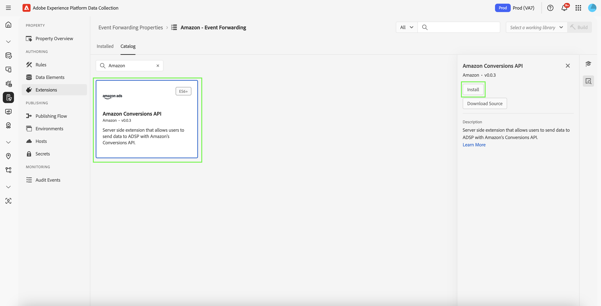

# [!DNL Amazon] web events API extension overview

The [!DNL Amazon] Conversions API extension creates a direct connection between marketing data from an advertiser's server and [!DNL Amazon]. This enables advertisers to evaluate campaign effectiveness regardless of conversion location and optimize campaigns accordingly. This extension provides complete attribution, data reliability, and optimized delivery.

## [!DNL Amazon] prerequisites {#prerequisites}

Before you install and configure the [!DNL Amazon] Conversions API extension, complete the following prerequisite steps to ensure proper authentication and data access:

### Create a secret and data element {#secret}

Authentication with [!DNL Amazon] requires a secure token that must be properly stored and referenced:

1. Create a new [!DNL Amazon] event forwarding secret with a unique name for authentication.
2. Create a data element using the **Core** extension with a **Secret** data element type to reference your [!DNL Amazon] secret.

This process ensures your authentication credentials remain secure while still being accessible to the extension when needed.

## Install and configure the [!DNL Amazon] extension {#install-configure}

Follow these steps to install and configure the [!DNL Amazon] Conversions API extension:

1. Create or edit an event forwarding property.
2. Navigate to **Extensions** in the left navigation panel, then select the [!DNL Amazon] extension in the Catalog tab.
3. Select **Install**.

   

4. Configure the extension with the following details:
   - **Access Token**: Your data element secret containing the OAuth 2 token.

     

   - **Entity ID**: Your Entity ID (found in the Campaign Manager portal URL with the "entity" prefix).

     

5. Select **Save** to complete the configuration.

### [!DNL Amazon] OAuth 2 {#oauth}

To create an [!DNL Amazon] OAuth 2 secret:

1. Select **[!DNL Amazon] OAuth 2** from the **Type** dropdown and select **Create Secret**.

   

2. Select **Create & Authorize secret with Amazon** on the popover to manually authorize the secret and continue.

   

3. Enter your [!DNL Amazon] credentials in the dialog that appears. Follow the prompts to grant event forwarding access to your data.

After completion, you'll see your secret with its status and expiration date in the **Secrets** tab.

   

## Configure an event forwarding rule {#config-rule}

Once all your data elements are set up, create event forwarding rules to determine when and how your events will be sent to [!DNL Amazon].

1. Navigate to **Rules** and create a new event forwarding rule.
2. Under **Actions**, select **Amazon Conversions API Extension**.
3. Set the **Action Type** to **Import Conversion Events**.

   

4. Configure the event properties as outlined below:

   | Input | Description |
   | --- | --- |
   | **Event Name** | The name of the conversion event. |
   | **Event Type** | Defines the type of event tracked (e.g., purchases, cart additions). |
   | **Timestamp** | Event time in ISO format. |
   | **Client Dedupe ID** | A unique ID for deduplication. |
   | **Match Keys** | User and device identifiers for attribution. |
   | **Value** | Monetary value of the event. |
   | **Currency Code** | Currency in ISO-4217 format. |
   | **Units Sold** | Quantity of items purchased. |
   | **Country Code** | Country where the event occurred. |
   | **Data Processing Options** | Flags for limited data usage. |
   | **Consent** | Indicates user consent for advertising data usage. |

5. Select **[!UICONTROL Keep Changes]** to save the rule.

   

   

## Event deduplication {#deduplication}

If you use both [!DNL Amazon] Advertising Tag (AAT) and the [!DNL Amazon] Conversions API extension for the same events, deduplication setup is required. Include `clientDedupeId` in every shared event to ensure proper deduplication. Deduplication is not needed if client and server events don't overlap.

Proper deduplication prevents inflated conversion counts and ensures your optimization data remains accurate.

Refer to the [Amazon Event Deduplication Guide](https://advertising.amazon.com/) for more details.

## Next steps {#next-steps}

This guide covered how to configure and send conversion events to [!DNL Amazon] using the [!DNL Amazon] Conversions API extension. For more information on event forwarding capabilities in [!DNL Adobe Experience Platform], refer to the [event forwarding overview](../../../ui/event-forwarding/overview.md).

For more details on how to debug your implementation using the Experience Platform Debugger and Event Forwarding Monitoring tool, read the [Adobe Experience Platform Debugger overview](https://experienceleague.adobe.com/en/docs/experience-platform/debugger/home) and [Monitor activities](https://experienceleague.adobe.com/en/docs/experience-platform/tags/event-forwarding/monitoring) in event forwarding.