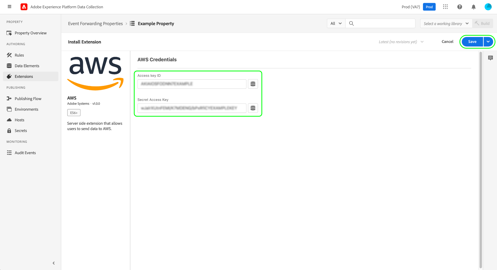

# [!DNL AWS] extension overview

>[!NOTE]
>
>Adobe Experience Platform Launch has been rebranded as a suite of data collection technologies in Adobe Experience Platform. Several terminology changes have rolled out across the product documentation as a result. Please refer to the following [document](../../../term-updates.md) for a consolidated reference of the terminology changes.

[[!DNL Amazon Web Services] ([!DNL AWS])](https://aws.amazon.com/) is a cloud computing platform that offers a wide variety of services such as distributed computing, database storage, content delivery, and customer relationship management (CRM).

The [!DNL AWS] [event forwarding](../../../ui/event-forwarding/overview.md) extension leverages [[!DNL Amazon Kinesis Data Streams]](https://docs.aws.amazon.com/streams/latest/dev/introduction.html) to send events from the Adobe Experience Platform Edge Network to [!DNL AWS] for further processing. This guide covers how to install the extension and employ its capabilities in an event forwarding rule.

## Prerequisites

You must have an [!DNL AWS] account with an existing [!DNL Kinesis] data stream in order to use this extension. If you do not have a pre-existing data stream, see the [!DNL AWS] documentation on [creating a new data stream using the [!DNL AWS] Management Console](https://docs.aws.amazon.com/streams/latest/dev/how-do-i-create-a-stream.html).

## Install the extension {#install}

To install the [!DNL AWS] extension, navigate to the Data Collection UI or Experience Platform UI and select **[!UICONTROL Event Forwarding]** from the left navigation. From here, select a property to add the extension to, or create a new property instead.

Once you have selected or created the desired property, select **[!UICONTROL Extensions]** in the left navigation, then select the **[!UICONTROL Catalog]** tab. Search for the [!UICONTROL AWS] card, then select **[!UICONTROL Install]**.

![The [!UICONTROL Install] button being selected for the [!UICONTROL AWS] extension in the Data Collection UI.](../../../images/extensions/server/aws/install.png)

On the next screen, you must provide the connection credentials for your [!DNL AWS] account. Specifically, you must provide your [!DNL AWS] access key ID and secret access key. If you do not know these values, see the [!DNL AWS] documentation on [how to obtain your access key ID and secret access key](https://docs.aws.amazon.com/powershell/latest/userguide/pstools-appendix-sign-up.html).

>[!IMPORTANT]
>
>An access policy needs to be attached to the [!DNL AWS] account used to generate the access credentials. This policy must be configured to grant access rights to send data to the [!DNL Kinesis] data stream. Refer to **Example 2** in the [!DNL AWS] document on [example policies for [!DNL Kinesis Data Streams]](https://docs.aws.amazon.com/streams/latest/dev/controlling-access.html#kinesis-using-iam-examples) to see how the policy should be defined.

When finished, select **[!UICONTROL Save]** and the extension is installed.

## Configure an event forwarding rule {#rule}

After installing the extension, create a new event forwarding [rule](../../../ui/managing-resources/rules.md) and configure its conditions as desired. When configuring the actions for the rule, select the **[!UICONTROL AWS]** extension, then select **[!UICONTROL Send Data to Kinesis Data Stream]** for the action type.

![The [!UICONTROL Send Data to Kinesis Data Stream] action type being selected for a rule in the Data Collection UI.](../../../images/extensions/server/aws/select-action-type.png)

The right panel updates to show configuration options for how the data should be sent. Specifically, you must assign [data elements](../../../ui/managing-resources/data-elements.md) to the various properties that represent your [!DNL Event Hub] configuration.

![The configuration options for the [!UICONTROL Send Data to Kinesis Data Stream] action type shown in the UI.](../../../images/extensions/server/aws/data-stream-details.png)

**[!UICONTROL Kinesis Data Stream Details]**

| Input | Description |
| --- | --- |
| [!UICONTROL Stream Name] | The name of the stream to that this event forwarding rule will send data records to. |
| [!UICONTROL AWS Region] | The [!DNL AWS] region where the [!DNL Kinesis] data stream is created. |
| [!UICONTROL Partition Key] | The [partition key](https://docs.aws.amazon.com/streams/latest/dev/key-concepts.html#partition-key) that the extension will use when sending data to the data stream.  [!DNL Kinesis Data Streams] segregates the data records belonging to a stream into multiple shards. It uses the partition key that is sent with each data record to determine which shard a given data record belongs to.  A good partition key for distributing customers might be the customer number, since it is different for each customer. A poor partition key might their zip code because they all may live in the same area nearby. In general, you should choose a partition key that has the highest range of different potential values. See the [!DNL AWS] article on [scaling your [!DNL Kinesis] data streams](https://aws.amazon.com/blogs/big-data/under-the-hood-scaling-your-kinesis-data-streams/) for best practices on managing partition keys. |

{style="table-layout:auto"}

**[!UICONTROL Data]**

| Input | Description |
| --- | --- |
| [!UICONTROL Payload] | This field contains the data that will be forwarded to the [!DNL Kinesis] data stream, in JSON format.  Under the **[!UICONTROL Raw]** option, you can paste the JSON object directly into the provided text field, or you can select the data element icon () to select from a list of existing data elements to represent the payload.  You can also use the **[!UICONTROL JSON Key-Value Pairs Editor]** option to manually add each key-value pair through a UI editor. Each value can be represented by a raw input, or a data element can be selected instead. |

{style="table-layout:auto"}

When finished, select **[!UICONTROL Keep Changes]** to add the action to the rule configuration. When you are satisfied with the rule, select **[!UICONTROL Save to Library]**. 

Finally, publish a new event forwarding [build](../../../ui/publishing/builds.md) to enable the changes to the library.

## Next steps

This guide covered how to send data to [!DNL Kinesis Data Streams] using the [!DNL AWS] event forwarding extension. For more information on event forwarding capabilities in Experience Platform, refer to the [event forwarding overview](../../../ui/event-forwarding/overview.md).
