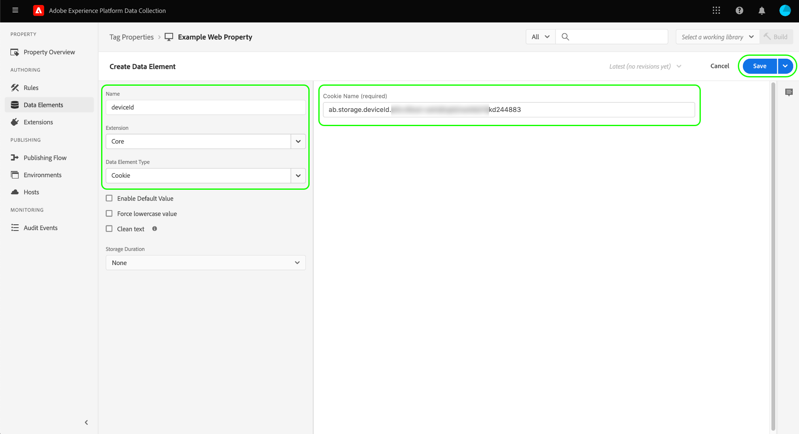
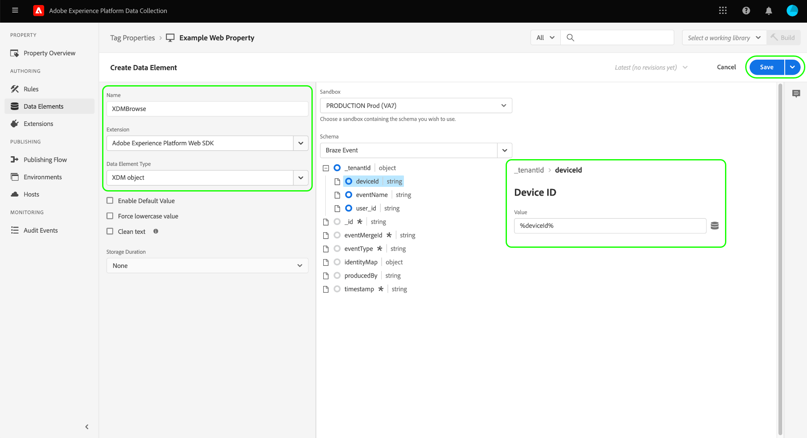
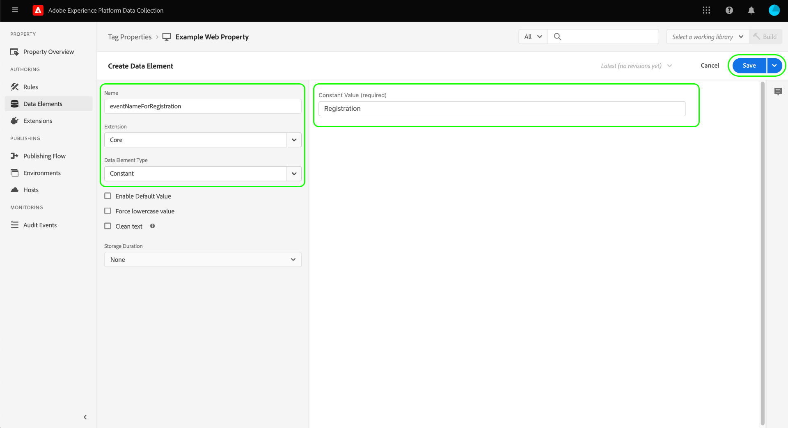
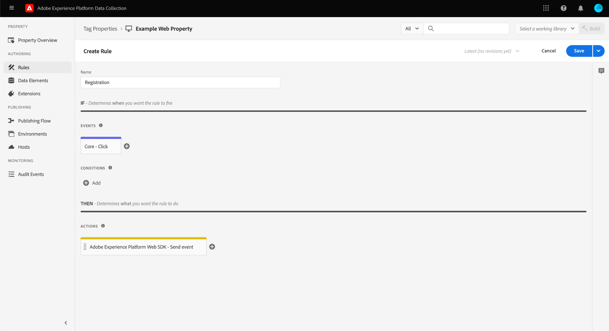
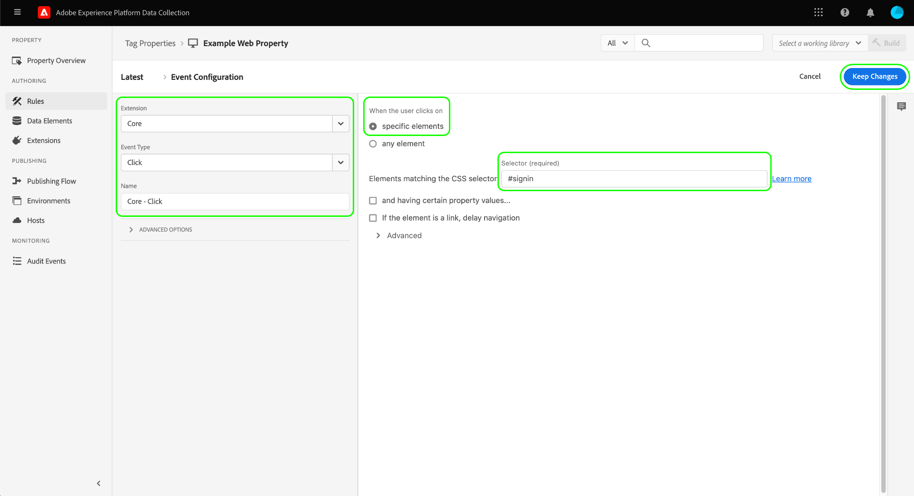
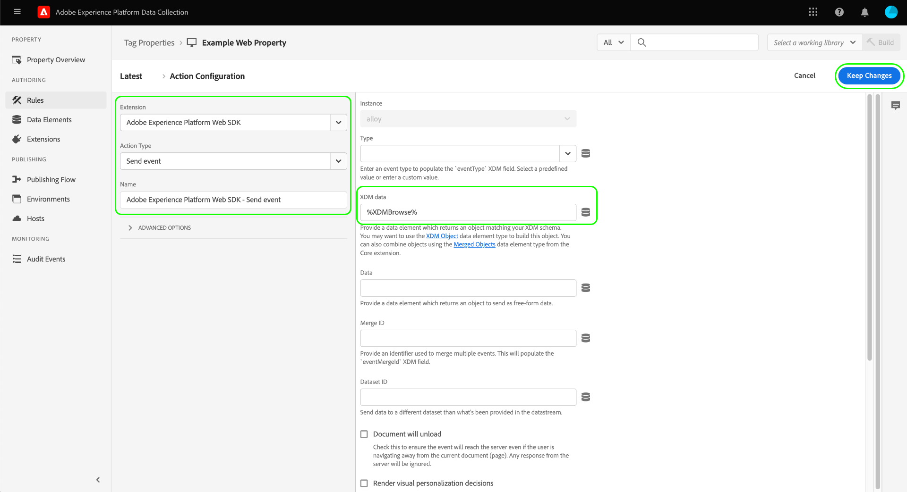
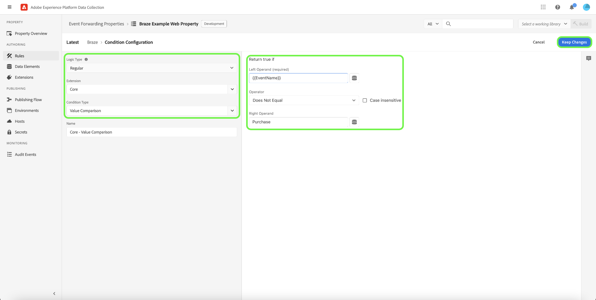
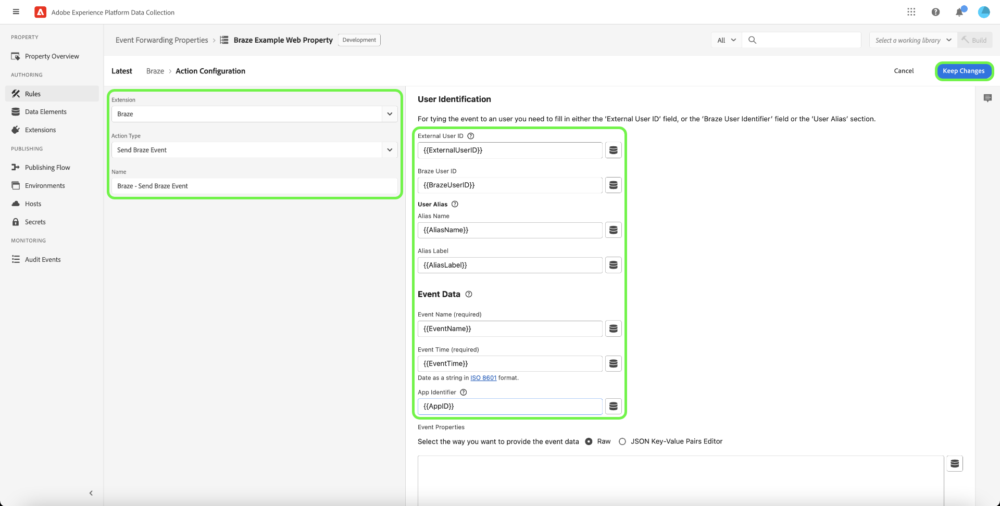
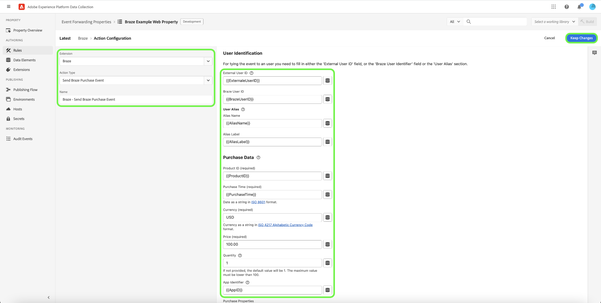
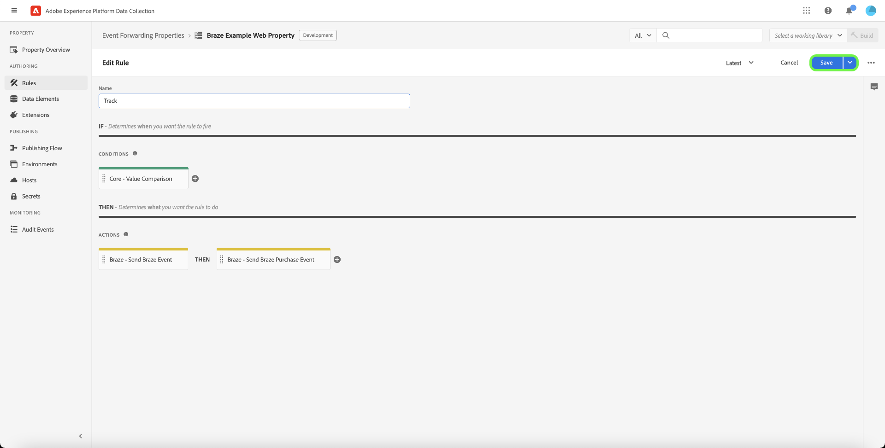

# [!DNL Braze Track Events API] event forwarding extension

[[!DNL Braze]](https://www.braze.com) is a customer engagement platform that powers customer-centric interactions between consumers and brands in real time. Using [!DNL Braze], you can do the following:

* Deliver data (such as marketing messages) to targeted users based on their language preference, location preference, and more, to increase conversion rates and support key business goals.
* Send customers personalized messages across multiple channels, including email, push notifications, and in-app messages, at just the right time and in their preferred languages.
* Target specific users for marketing and promotional campaigns to increase the number of repeat customers.
* Study user behavior and patterns to target specific audiences with customized messages, which could help increase revenue.

The [!DNL Braze Track Events API] [event forwarding](../../../ui/event-forwarding/overview.md) extension [event forwarding](https://experienceleague.adobe.com/docs/experience-platform/tags/event-forwarding/overview.html?lang=en) allows you to leverage data captured in the Adobe Experience Platform Edge Network and send it to [!DNL Braze] in the form of server-side events using the [[!DNL Braze User Identify]](https://www.braze.com/docs/api/endpoints/user_data/post_user_identify) and [[!DNL Braze User Track]](https://www.braze.com/docs/api/endpoints/user_data/post_user_track) APIs.

This document covers the use cases of the extension, how to install it in your event forwarding libraries, and how to employ its capabilities in an event forwarding [rule](../../../ui/managing-resources/rules.md).

## Use cases

This extension should be used if you want to use data from the Edge Network in [!DNL Braze] to take advantage of its customer analytics and targeting capabilities.

For example, consider a retail organization that has a multichannel presence (website and mobile) and is capturing transactional or conversational input as event data from their website and mobile platforms. Using various [tag](../../../home.md) rules, this data is sent to the Edge Network in real time. From here, the [!DNL Braze] event forwarding extension automatically sends relevant events to [!DNL Braze] from the server side.

Once the data has been sent, the organization's analytics teams can then leverage [!DNL Braze's] capabilities to process the datasets and derive business insights to generate graphs, dashboards, or other visualizations to inform business stakeholders. Refer to the [[!DNL Braze] customers](https://www.braze.com/customers) page for more details of the various use cases of the platform.

## [!DNL Braze] prerequisites and guardrails {#prerequisites}

You must have a [!DNL Braze] account in order to use its technologies. If you do not have an account, navigate to the [Get Started page](https://www.braze.com/get-started/) on [!DNL Braze] to connect to [!DNL Braze Sales] and start the account creation process.

### API guardrails

The extension uses two of [!DNL Braze]'s APIs and their limits are outlined below:

| API | Rate Limits |
| --- | --- |
| [!DNL User Track] | 50,000 requests per minute.  Refer to the [[!DNL User Track] API documentation](https://www.braze.com/docs/api/endpoints/user_data/post_user_track#rate-limit) for details. |
| [!DNL User Identify] | 20,000 requests per minute.  Refer to the [[!DNL User Identify] API documentation](https://www.braze.com/docs/api/endpoints/user_data/post_user_identify#rate-limit) for details. |

>[!NOTE]
>
>Refer to the guide on [[!DNL Braze] API limits](https://www.braze.com/docs/api/api_limits/) for further details on the limits they impose. 

### Understanding the user profile lifecycle

[!DNL Braze] creates anonymous user profiles using the unique identifier, `deviceId`, set by [!DNL Braze]. Once a user is identified by providing a User ID, an identified user profile is created.

On the first instance of assigning an `external_id` to an unknown user profile, all existing user profile data and any anonymous events are migrated to the new user profile. The anonymous user profiles sharing the same `deviceId` are also aliased to the identified user profile.

[!DNL Braze] will merge and preserve all data associated with the alias-only profile. However, any subsequent anonymous user data will be orphaned. Refer to the [!DNL Braze] documentation pages on [identified user profiles](https://www.braze.com/docs/user_guide/data_and_analytics/user_data_collection/user_profile_lifecycle/#identified-user-profiles) and [data collection best practices](https://www.braze.com/docs/user_guide/data_and_analytics/user_data_collection/best_practices/#overview) for more information.

### Billable data points

Sending additional custom attributes to [!DNL Braze] may increase your [!DNL Braze] data point consumption. Consult with your [!DNL Braze] account manager before sending additional custom attributes. Refer to the [!DNL Braze] documentation on [billable data points](https://www.braze.com/docs/user_guide/onboarding_with_braze/data_points/#billable-data-points) for more information.

### Gather required configuration details {#configuration-details}

In order to connect the Edge Network to [!DNL Braze], the following inputs are required:

| Key Type | Description | Example |
| --- | --- | --- |
| [!DNL Braze] Instance | The REST endpoint associated with the [!DNL Braze] account. Refer to the [!DNL Braze] documentation on [instances](https://www.braze.com/docs/user_guide/administrative/access_braze/braze_instances) for guidance. | `rest.iad-03.braze.com`|
| API Key | The [!DNL Braze] API Key associated with the [!DNL Braze] account.  Refer to the [!DNL Braze] documentation on the [REST API key](https://www.braze.com/docs/api/basics/#rest-api-key) for guidance. | `YOUR-BRAZE-REST-API-KEY`|

## Experience Cloud prerequisites

This section covers the prerequisite steps in Experience Cloud for all implementations. Depending on your individual implementation needs, it may be helpful to set up the following constructs before configuring the extension:

1. A [schema](../../../../xdm/schema/composition.md) to describe the structure of the data you are ingesting into Experience Cloud
1. A [datastream](https://experienceleague.adobe.com/docs/platform-learn/data-collection/event-forwarding/set-up-a-datastream.html) to route incoming data to appropriate Adobe Experience Cloud applications
1. A [dataset](https://experienceleague.adobe.com/docs/platform-learn/tutorials/data-ingestion/create-datasets-and-ingest-data.html) to store the collected data

For all implementations, the following is required on the Experience Cloud side:

1. [Create a secret](#create-a-secret)
1. [Set up tag properties](#set-up-tag-properties)
1. [Add data elements within tag properties](#add-data-elements-within-tag-properties)
1. [Add rules within tag properties](#add-rules-within-tag-properties)

### Create a secret

Create a new [event forwarding secret](../../../ui/event-forwarding/secrets.md) and set the value to your [[!DNL Braze] API Key](#configuration-details). This will be used to authenticate the connection to your account while keeping the value secure.

### Set up tag properties 

[Create a tag property](https://experienceleague.adobe.com/docs/platform-learn/implement-in-websites/configure-tags/create-a-property.html?lang=en) or choose an existing property to edit instead. This property will be configured to collect the necessary data structures for [!DNL Braze] as they are brought into the Edge Network before being sent using event forwarding.

### Add data elements within tag properties

If your website uses the [!DNL Braze] SDK, you must [create a data element](../../../ui/managing-resources/data-elements.md) that uses the **[!UICONTROL Cookie]** type (provided by the [[!UICONTROL Core] tag extension](../../client/core/overview.md)) so the [!DNL Braze] `deviceId` can be read from the cookie.

The **[!UICONTROL Cookie Name]** value must match the [!DNL Braze] cookie name for the website. The name should have a format similar to `ab.storage.deviceId.{BRAZE_PROJECT_TOKEN_FOR_WEBSITE}`. Select **[!UICONTROL Save]** when finished.

For the second data element, set the type to **[!UICONTROL XDM Object]** (from the [Adobe Experience Platform Web SDK extension](../../client/sdk/overview.md)) and map it to the schema created earlier. As you map the data, ensure that the value of the `deviceId` data element (which contains the [!DNL Braze] `deviceId` value from the cookie) is referenced as a value within one of your schema fields.

>[!NOTE]
>
>If your website is not running the [!DNL Braze] SDK, an Adobe Experience Cloud ID (ECID) will be used as the fallback `deviceId` value to be passed with the event sent to [!DNL Braze].

Depending on your scenario, you may need to create another data element that can be used to map to the event name in the schema. This can be done using the **[!UICONTROL Constant]** type provided by the [!UICONTROL Core] extension.

<!-- (Not quite sure what this means...)
>[!WARNING]
>
>The Tag property data element `deviceId`, for example, and the event forwarding data element name should match the same name as that used in your schema.
-->

### Add rules within tag properties

The final step before installing the [!DNL Braze] extension is to create a tag [rule](../../../ui/managing-resources/rules.md) (or multiple tag rules) that gets triggered for the user identification events that are being tracked, such as logins, sign-ups, registrations, and so on.

When configuring the **[!UICONTROL Events]** for the rule, select the appropriate event types that will trigger the rule. An example of an event that triggers the sign-in rule on a user click is shown below:

Finally, when selecting the **[!UICONTROL Actions]** for the rule, select the **[!UICONTROL Send event]** action type provided by the Web SDK extension. Under **[!UICONTROL XDM data]**, select the [!UICONTROL XDM Object] data type you created [earlier](#add-data-elements-within-tag-properties).

## Install and configure the [!DNL Braze] extension {#install}

To install the extension, [create an event forwarding property](../../../ui/event-forwarding/overview.md#properties) or choose an existing property to edit instead.

Select **[!UICONTROL Extensions]** in the left navigation. In the **[!UICONTROL Catalog]** tab, select **[!UICONTROL Install]** on the card for the [!DNL Braze] extension.

![Installing the [!DNL Braze] extension.](../../../images/extensions/server/braze/install-extension.png)

On the next screen, input the following [configuration values](#configuration-details) that you previously gathered from [!DNL Braze]:

* **[!UICONTROL Braze Instance]**: You can enter the value of your [!DNL Braze] instance as plain text in the provided input.
* **[!UICONTROL API Key]**: Select the [secret data element](#create-a-secret) that you created earlier, which contains your [!DNL Braze] API key.

Select **[!UICONTROL Save]** when finished.

![The [!DNL Braze] extension configuration page.](../../../images/extensions/server/braze/configure-extension.png)

## Set up event forwarding data elements

After installing and configuring the extension, the next step is to create event forwarding data elements that will capture the necessary data constructs that will be sent to [!DNL Braze].

### Create a `deviceId` data element

If your site is configured with the [!DNL Braze] SDK, then you have already defined a [secret data element](#add-data-elements-within-tag-properties) that contains the [!DNL Braze] `deviceId` on your tag property. Now you must set up a separate data element under event forwarding that will point to this value when it is sent in XDM format.

When creating the data element, select **[!UICONTROL Core]** for the extension, then select **[!UICONTROL Path]** for the data element type. For the value, input the dot-notation path to the `deviceId` field as it exists in your schema. Select **[!UICONTROL Save]** when finished.

### Create an `EventName` data element

In your event forwarding property, create a data element that uses the **[!UICONTROL Path]** type from the **[!UICONTROL Core]** extension. For the value, input the dot-notation path to the event name as it exists in your schema.

### Create data elements for events and purchases

The [[!DNL Braze User Track] API](https://www.braze.com/docs/api/endpoints/user_data/post_user_track) supports two distinct actions: custom [events](https://www.braze.com/docs/api/objects_filters/event_object/#what-is-the-event-object) and [purchases](https://www.braze.com/docs/api/objects_filters/purchase_object/#what-is-a-purchase-object). The API also supports [attributes](https://www.braze.com/docs/api/objects_filters/user_attributes_object/) which correspond to [!DNL Braze] data points. 

The data elements for `deviceId` and `EventName` are required for both custom events and purchases, but there are additional data elements that can be included for either event type. These are listed below.

>[!NOTE]
>
>All of the data elements listed below should use the **[!UICONTROL Path]** type so they can map to specific fields in your schema as outlined in the **Schema path** column.

#### Custom events

| [!DNL Braze] key | Schema path | Description | Mandatory |
| --- | --- | --- | --- |
| [!DNL Braze] Device ID | `arc.event.xdm._extconndev.brazeDeviceId` | `deviceId` identifies the user who performed the event. `deviceId` must be specified on every event, as it is crucial for [!DNL Braze] to perform analysis. | Yes |
| Event Type | `arc.event.xdm._extconndev.event_Type` | The name of the event. | Yes |
| User Identifier | `arc.event.xdm._extconndev.userId` | The user's email or login ID, if available.||
| App ID | `arc.event.xdm._extconndev.appId` | A string indicating where the event was triggered.||
| Event Fields | `arc.event.xdm._extconndev.event_Properties` | A JSON object representing all the attributes about the event. ||

{style="table-layout:auto"}

#### Purchases

| [!DNL Braze] key | Schema path | Description | Mandatory |
| --- | --- | --- | --- |
| [!DNL Braze] Device ID | `arc.event.xdm._extconndev.brazeDeviceId` | `deviceId` identifies the user who performed the event. `deviceId` must be specified on every event, as it is crucial for [!DNL Braze] to perform analysis. | Yes |
| Event Type | `arc.event.xdm._extconndev.event_Type` | The name of the event. | Yes |
| User Identifier | `arc.event.xdm._extconndev.userId` | The user's email or login ID, if available. ||
| App ID | `arc.event.xdm._extconndev.appId` | A string indicating where the event was triggered. ||
| Product ID | `arc.event.xdm._extconndev.product_Id` | An identifier for the purchase, such as UPC, ISBN, product category, or product name. | Yes |
| Currency | `arc.event.xdm._extconndev.currency` | The currency used for the purchase, in [ISO 4217 code format](https://www.iso.org/iso-4217-currency-codes.html). |Yes|
| Price | `arc.event.xdm._extconndev.price` | The value of the purchase in numerals. |Yes|
| Quantity | `arc.event.xdm._extconndev.quantity` | The quantity of product purchased. |Yes|
| Additional Fields | `arc.event.xdm._extconndev.event_Properties` | A JSON object representing additional attributes about the event. Refer to the [[!DNL Braze] documentation](https://www.braze.com/docs/user_guide/onboarding_with_braze/data_points/#billable-data-points) for details of what data points are billed. ||

{style="table-layout:auto"}

## Set up event forwarding rules

Once all your data elements are set up, you can start creating event forwarding rules that determine when and how your custom events and purchases will be sent to [!DNL Braze].

Since the [!DNL Braze User Track] API supports custom events and purchases as two separate actions, you must create at least two rules so that [!DNL Braze's] analytics for each can be appropriately leveraged.

As a result, the [!DNL Braze] extension enables you to add the following action types to your rules:

* **[!UICONTROL Braze Event]**
* **[!UICONTROL Braze Alias Event]**
* **[!UICONTROL Braze Purchase Event]**

>[!IMPORTANT]
>
>You must have at least one rule with an action type of **[!UICONTROL Braze Event]**. Without this rule, the Edge Network will not send events to [!DNL Braze].

### Create a [!DNL Track Event] rule {#tracking-rule}

Start creating a new rule in your event forwarding property. Under **[!UICONTROL Conditions]**, add a **[!UICONTROL Value Comparison]** condition type (provided by the [!UICONTROL Core] extension) to check that `EventName` is not `Purchase`. This will ensure the events are sent with the correct object payload to the [!DNL Braze] API.

Under **[!UICONTROL Actions]**, add a new action and set the extension to **[!UICONTROL Braze]**. Next, set the action type to **[!UICONTROL Braze Event]** to send Adobe Experience Edge Network events to [!DNL Braze].

From here, under **[!UICONTROL Main Fields]**, you must map the **[!UICONTROL Event Type]** field to the incoming event name property, as well as a known [!UICONTROL User Identifier] (if one exists) and your [!UICONTROL Braze Device ID] data element.

>[!NOTE]
>
>The **[!UICONTROL Braze Event]** action requires only an **[!UICONTROL Event Type]** (`name`) to be specified, but you should be including as much information as possible in the remaining fields (including the different tabs for event fields, profile fields, and additional fields). For details on the [!DNL Braze] event object, refer to the [official documentation](https://www.braze.com/docs/api/objects_filters/event_object/).

Once the [!UICONTROL Braze Event] action is added to the rule, you can also include a **[!UICONTROL Braze Purchase]** action if the event you are tracking happens to be a purchase event. An example configuration for the purchase action is shown below:

>[!NOTE]
>
>For details on the [!DNL Braze] purchase object, refer to the [official documentation](https://www.braze.com/docs/api/objects_filters/purchase_object/).

The [!DNL Track Event] rule is complete and should look similar to the image below. Select **[!UICONTROL Save]** to add the rule to the library.

>[!IMPORTANT]
>
>If your website is using the [!DNL Braze] SDK, you can continue to the next step of [validating your data within [!DNL Braze]](#validate). If you are not using the [!DNL Braze] SDK, you must [create a separate identity tracking rule](#create-an-identity-tracking-rule) to ensure that appropriate events and `deviceId` values are sent to [!DNL Braze] when a user identification event occurs.

### Create an identity tracking rule

If you are not using the [!DNL Braze SDK], the next step is to create another rule which uses both the **[!UICONTROL Braze Event]** and **[!UICONTROL Braze Alias]** action types. This rule ensures that whenever a user identification event occurs on the website (such as a login, sign-up, registration, and so on), the appropriate events and `deviceId` values are sent to [!DNL Braze].

Start defining a new rule to track identity events. In this example, a rule is being defined specifically for a registration event.

Similar to the [!DNL Track Event] rule, under **[!UICONTROL Conditions]**, include a **[!UICONTROL Value Comparison]** condition type that checks that `EventName` equals `Registration`. This ensures that this event only fires for registration events.

![Action Configuration for [!DNL Braze] action types Alias and Identify.](../../../images/extensions/server/braze/ef-registration-condition.png)

To ensure that [!DNL Braze] can automatically merge the user identities, you must add the following action types to the rule, both of which are provided by the [!DNL Braze] extension:

* **[!UICONTROL Braze Event]** 
* **[!UICONTROL Braze Alias Event]** 

Configure the **[!UICONTROL Braze Event]** action the same way as the [event tracking rule](#tracking-rule), including as much information in the provided fields as possible.

![Configuration the [!DNL Braze] Event action](../../../images/extensions/server/braze/registration-braze-event.png)

The  **[!UICONTROL Braze Alias Event]** action requires a [user identifier](https://www.braze.com/docs/api/objects_filters/aliases_to_identify), and you can optionally provide an [application identifier](https://www.braze.com/docs/api/identifier_types/) if appropriate.

![Configuration the [!DNL Braze] Alias action](../../../images/extensions/server/braze/registration-braze-alias.png)

Once both actions are added to the rule, select **[!UICONTROL Save]** to add the rule to your working library. From here, you can build the library into one of your environments to validate if it is working as expected.

![Both [!DNL Braze] actions are added to the rule](../../../images/extensions/server/braze/registration-rule-complete.png)

## Validate data within [!DNL Braze] {#validate}

If the event collection and [!DNL Adobe Experience Platform] integration were successful, you will see events within the [!DNL Braze] console when [viewing user profiles](https://www.braze.com/docs/user_guide/engagement_tools/segments/user_profiles/). Specifically, the new event data sent to [!DNL Braze] is reflected in the [!DNL Purchases] section of a particular user's [overview tab](https://www.braze.com/docs/user_guide/engagement_tools/segments/user_profiles/#overview-tab).

## Next steps

This guide covered how to send conversion events to [!DNL Braze] using event forwarding. For more details on downstream applications for event data sent to [!DNL Braze], refer to the [official documentation](https://www.braze.com/docs). 

For more information on event forwarding capabilities in Experience Platform, refer to the [event forwarding overview](../../../ui/event-forwarding/overview.md).