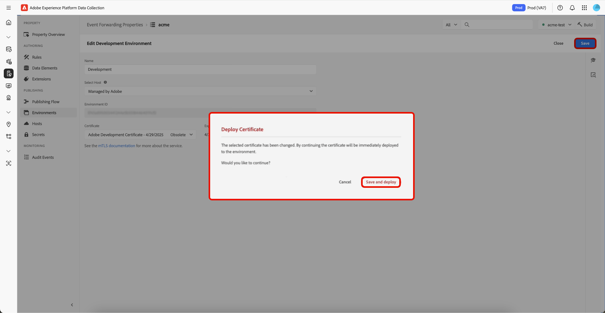

# Mutual Transport Layer Security ([!DNL mTLS]) overview

Bind Mutual Transport Layer Security ([!DNL mTLS]) certificates in the [!UICONTROL Environments UI] to take control of your extension's security. The [!DNL mTLS] certificate is a digital credential that proves the identity of a server or client in secure communications. When you use the [!DNL mTLS] Service API, these certificates help you verify and encrypt your interactions with Adobe Experience Platform Event Forwarding. This process not only protects your data but also ensures that every connection is from a trusted partner.

## Implement [!DNL mTLS] in a new environment {#implement-mtls}

Set up the Event Forwarding environment to ensure your library builds are deployed correctly to the edge network. During setup, you can select the hosting option that best fits your deployment needs. An [!DNL mTLS] certificate is also automatically added to your new environment for secure communication.

To create a new environment, select the **[!UICONTROL Environments]** tab in the left panel of your Event Forwarding properties, then select **[!UICONTROL Add Environment]**.

![Event forwarding properties showing existing environments, highlighting [!UICONTROL Add Environment].](../../../images/extensions/server/cloud-connector/add-environment.png)

On the next page, select the environment you would like to use for this set up. Three environments are available:

>[!NOTE]
>
>A property is limited to one development, one staging, and one production environment.

| Environment | Description |
| --- | --- |
| Development | The development environment is for team members to test libraries or changes in Event Forwarding.|
| Staging | The staging environment is optional and allows approved team members to test and approve a library before it's published. |
| Production | The Production environment is used for live production data. |

![The environment select screen, highlighting [!UICONTROL Select] for Development.](../../../images/extensions/server/cloud-connector/select-environment.png)

On the **[!UICONTROL Create Environment]** page, enter a **[!UICONTROL Name]** and select ***Adobe Managed*** from the **[!UICONTROL Select Host]** dropdown menu. The **[!UICONTROL Certificate]** is ***Automatically added***. Finally, select **[!UICONTROL Save]**.

![The Create Development Environment page, highlighting [!UICONTROL Name], [!UICONTROL Select Host], and [!UICONTROL Save].](../../../images/extensions/server/cloud-connector/create-environment.png)

The environement is successfully created, and you are returned to the **[!UICONTROL Environments]** tab, which displays your new environment.

![The [!UICONTROL Environments] tab, highlighting the Developemet environment.](../../../images/extensions/server/cloud-connector/new-environment-created.png)

## View environment certificate details {#view-certificate}

To view the certificate details for an environment select the **[!UICONTROL Environments]** tab in the left panel of your Event Forwarding properties, then select the environment to view details.

The following certificate details are displayed:

| Field Name | Description |
| --- | --- |
| Certificate | Details of the certificate, which include:<ul><li>**Name**: The name of the cerificate.</li><li>**Date created**: The date when the certificate was created.</li><li>**Status**: The current status of the certificate:<ul><li>**Current**: The certificate is actively in use.</li><li>**Obsolete**: The certificate is not in use but hasn't expired yet. It can still be selected for use.</li><li>**Expired**: The certificate is expired, grayed out, and no longer available for use.</li></ul></ul>  |
| Expires | Date the certificate will expire. |
| Variable Name | The variable name of the certificate. |
| Status | The current status of the certificate:<ul><li>**Depolyed**: The certificate has been successfully deployed and is active.</li><li>**Deploying**: The certificate is in the process of being deployed.</li><li>**Needs Deployment**: This status appears when an obsolete certificate is selected.</li></ul> |

![The  Edit Development Environment page, highlighting [!UICONTROL Certificate] details.](../../../images/extensions/server/cloud-connector/certificate-details.png)

### Select and deploy an obsolete certificate {#deploy-obsolete-certificate}

To use an obsolete certificate, navigate to the **[!UICONTROL Environments]** tab in the left panel of your Event Forwarding properties, then select the environment to view its details.

![The [!UICONTROL Environments] tab, highlighting the Developemet environment.](../../../images/extensions/server/cloud-connector/new-environment-created.png)

From the **[!UICONTROL Certificate]** dropdown, select an obsolete certificate, then select **[!UICONTROL Save]**.

![The  Edit Development Environment page, highlighting [!UICONTROL Certificate] dropdown with obsolete certificate and Save highlighted.](../../../images/extensions/server/cloud-connector/obsolete-certificate.png)

To deploy the certificate, select **[!UICONTROL Save and deploy]** in the **[!UICONTROL Deploy Certificate]** dialog.

## Next steps {#next-steps}

This document demonstrated how to create an environment for your Event Forwarding property, add a certificate, and use an obsolete certificate. For more information about the [!DNL mTLS] certificates, see [[!DNL mTLS] Service API Overview](../../../../data-governance/mtls-api/overview.md)

To learn how to use [!DNL mTLS] certificates in Event Forwarding rules, refer to the [Cloud Connector extension overview](../cloud-connector/overview.md#mtls-rules).
