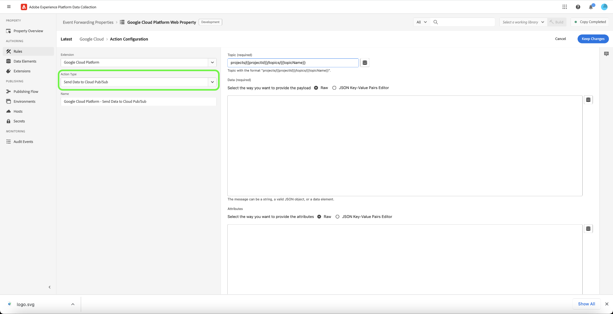

# [!DNL Google Cloud Platform] event forwarding extension

[[!DNL Google Cloud Platform]](https://cloud.google.com/) is a cloud computing platform that offers a wide variety of services such as distributed computing, database storage, content delivery, and software-as-a-service (SaaS) integration services for customer relationship management (CRM) and enterprise resource planning (ERP).

The [!DNL Google Cloud Platform] [event forwarding](../../../ui/event-forwarding/overview.md) extension leverages [[!DNL Cloud Pub/Sub]](https://cloud.google.com/pubsub) to send events from the Adobe Experience Platform Edge Network to the [!DNL Google Cloud Platform] for further processing. This guide covers how to install the extension and employ its capabilities in an event forwarding rule.

## Prerequisites

In order to use this extension, you must have an [!DNL Google Cloud Platform] account with an existing [!DNL Cloud Pub/Sub] topic. If you do not have a pre-existing data stream, see the [!DNL AWS] documentation on [creating a new data stream using the [!DNL AWS] Management Console](https://docs.aws.amazon.com/streams/latest/dev/how-do-i-create-a-stream.html).

### Create a secret and a data element

You will need to create a new `Google OAuth 2` [event forwarding secret](../../../ui/event-forwarding/secrets.md), which will be used to authenticate the connection to your account while keeping the value secure.

Next, you will need to [create a data element](../../../ui/managing-resources/data-elements.md#create-a-data-element) using the **[!UICONTROL Core]** extension and a **[!UICONTROL Secret]** data element type to reference the `Google OAuth 2` secret you just created.

## Install and configure the [!DNL Google Cloud Platform] extension {#install}

To install the extension, [create an event forwarding property](../../../ui/event-forwarding/overview.md#properties) or choose an existing property to edit instead.

Select **[!UICONTROL Extensions]** in the left navigation. In the **[!UICONTROL Catalog]** tab, select **[!UICONTROL Install]** on the card for the [!DNL Google Cloud Platform] extension.

![Install the [!DNL Google Cloud Platform] extension.](../../../images/extensions/server/google-cloud-platform/install-extension.png)

On the next screen, fill in the data element secret that you created earlier in the **[!UICONTROL Access Token]** field. The data element secret will contain your [!DNL Google Cloud Platform] OAuth 2 token.

Select **[!UICONTROL Save]** when finished.

![The [!DNL Google Cloud Platform] extension configuration page.](../../../images/extensions/server/google-cloud-platform/configure-extension.png)

## Create a [!DNL Send Data to Cloud Pub/Sub] rule {#tracking-rule}

After installing the extension, create a new event forwarding [rule](../../../ui/managing-resources/rules.md) and configure its conditions as desired. When configuring the actions for the rule, select the **[!UICONTROL Google Cloud Platform]** extension, then select **[!UICONTROL Send Data to Cloud Pub/Sub]** for the action type.

**[!UICONTROL Data]**

| Input | Description |
| --- | --- |
| [!UICONTROL Topic] | The topic that will receive the events from Event forwarding. The value must have the format `projects/{projectName}/topics/{topicName}`. |
| [!UICONTROL Data] | This field contains the data that will be forwarded to the [!DNL Cloud Pub/Sub] topic in JSON format.  Under the **[!UICONTROL Raw]** option, you can paste the JSON object directly into the provided text field, or you can select the data element icon () to select from a list of existing data elements to represent the data.  You can also use the **[!UICONTROL JSON Key-Value Pairs Editor]** option to manually add each key-value pair through a UI editor. Each value can be represented by a raw input, or a data element can be selected instead. |
| [!UICONTROL Attributes] | This field contains a JSON object with extra attributes that will be sent along with the message.  Under the **[!UICONTROL Raw]** option, you can paste the JSON object directly into the provided text field, or you can select the data element icon () to select from a list of existing data elements to represent the data.  You can also use the **[!UICONTROL JSON Key-Value Pairs Editor]** option to manually add each key-value pair through a UI editor. Each value can be represented by a raw input, or a data element can be selected instead. |

{style="table-layout:auto"}

## Next steps

This guide covers how to send data to [!DNL Cloud Pub/Sub] using the [!DNL Google Cloud Platform] event forwarding extension. For more information on event forwarding capabilities in Experience Platform, refer to the [event forwarding overview](../../../ui/event-forwarding/overview.md).