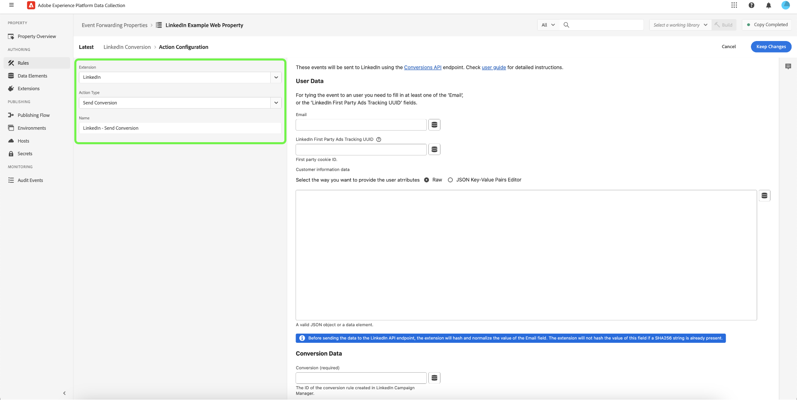

# [!DNL LinkedIn] event forwarding extension

[[!DNL LinkedIn Conversion API]](https://learn.microsoft.com/en-us/linkedin/marketing/integrations/ads-reporting/conversions-api) is a conversion tracking tool that creates a direct connection between marketing data from an advertiser's server and LinkedIn. This enables advertisers to evaluate the effectiveness of their LinkedIn marketing campaigns regardless of the location of the conversion and utilize this information to drive campaign optimization. The [!DNL LinkedIn Conversion API] can help strengthen performance and decrease cost per action with more complete attribution, improved data reliability, and better optimized delivery.

## Prerequisites {#prerequisites}

You must have access to the [[!DNL LinkedIn] Advertising API](https://learn.microsoft.com/en-us/linkedin/marketing/quick-start) in order to use this extension. Once you have access to the advertising API, you need to contact your [!DNL LinkedIn] representative to obtain access to the [[!DNL LinkedIn Conversion API]](https://learn.microsoft.com/en-us/linkedin/marketing/integrations/ads-reporting/conversions-api).

You must use [!DNL LinkedIn Campaign Manager] to establish a conversion rule after gaining access to the advertising and conversion APIs.

### Create a secret and a data element

Create a new `LinkedIn` [event forwarding secret](../../../ui/event-forwarding/secrets.md). This will be used to authenticate the connection to your account while keeping the value secure.

Next, [create a data element](../../../ui/managing-resources/data-elements.md#create-a-data-element) using the [!UICONTROL Core] extension and a [!UICONTROL Secret] data element type to reference the `LinkedIn` secret you just created.

## Install and configure the [!DNL LinkedIn] extension {#install}

To install the extension, [create an event forwarding property](../../../ui/event-forwarding/overview.md#properties) or select an existing property to edit.

Select **[!UICONTROL Extensions]** in the left navigation. In the **[!UICONTROL Catalog]** tab, select **[!UICONTROL Install]** on the card for the [!DNL Linkedin] extension.

![The extension catalog showing the [!DNL LinkedIn] extension card highlighting install.](../../../images/extensions/server/linkedin/install-extension.png)

On the next screen, enter the data element secret you created earlier into the `Access Token` field. The data element secret will contain your [!DNL LinkedIn] OAuth 2 token. Select **[!UICONTROL Save]** when finished.

![The [!DNL LinkedIn] extension configuration page.](../../../images/extensions/server/linkedin/configure-extension.png)

## Create a [!DNL Send Conversion] rule {#tracking-rule}

Once all your data elements are set up, you can start creating event forwarding rules that determine when and how your events will be sent to [!DNL LinkedIn].

Create a new event forwarding [rule](../../../ui/managing-resources/rules.md) in your event forwarding property. Under **[!UICONTROL Actions]**, add a new action and set the extension to **[!UICONTROL LinkedIn]**. Next, select **[!UICONTROL Send Web Conversion]** for the **[!UICONTROL Action Type]**.

After selection, additional controls appear to further configure the event.

**[!UICONTROL User Data]**

| Input | Description |
|---|---|
| [!UICONTROL Email] | Email address of the contact associated with the conversion event. The email value will be encoded by the extension code in SHA256 unless the provided value is already a SHA256 string. |
| [!UICONTROL LinkedIn First Party Ads Tracking UUID] | This is a first party cookie id. Advertisers need to enable enhanced conversion tracking from [[!DNL LinkedIn Campaign Manager]](https://www.linkedin.com/help/lms/answer/a423304/enable-first-party-cookies-on-a-linkedin-insight-tag) in order to activate first party cookies that append a click ID parameter `li_fat_id` to the click URLs. |
| [!UICONTROL Customer Information Data] | This field contains a JSON object with extra attributes that will be sent along with the message.  Under the **[!UICONTROL Raw]** option, you can paste the JSON object directly into the provided text field, or you can select the data element icon () to select from a list of existing data elements to represent the data.  You can also use the **[!UICONTROL JSON Key-Value Pairs Editor]** option to manually add each key-value pair through a UI editor. Each value can be represented by a raw input, or a data element can be selected instead. The accepted key values are: `firstName`, `lastName`, `companyName`, `title` and `country`. |

{style="table-layout:auto"}

**[!UICONTROL Conversion Data]**

| Input | Description |
|---|---|
| [!UICONTROL Conversion] | URN of the conversion rule created through the [API](https://learn.microsoft.com/en-us/linkedin/marketing/integrations/ads-reporting/conversions-api?view=li-lms-2023-06&tabs=http#create-a-conversion) or through [!DNL LinkedIn Campaign Manager]. |
| [!UICONTROL Conversion Time] | Each timestamp in milliseconds at which the conversion event happened.    Note: If your source records the conversion timestamp in seconds, please insert 000 at the end to transform it to milliseconds. |
| [!UICONTROL Currency] | Currency code in ISO format. |
| [!UICONTROL Amount] | Value of the conversion in decimal string (for example, "100.05"). |
| [!UICONTROL Event ID] | The unique id generated by advertisers to indicate each event. This is an optional field and is used for deduplication. |

{style="table-layout:auto"}

## Next steps

This guide covered how to send data to the [!DNL Linkedin Conversion API] using the [!DNL LinkedIn] event forwarding extension. For more information on event forwarding capabilities in [!DNL Adobe Experience Platform], refer to the [event forwarding overview](../../../ui/event-forwarding/overview.md).
