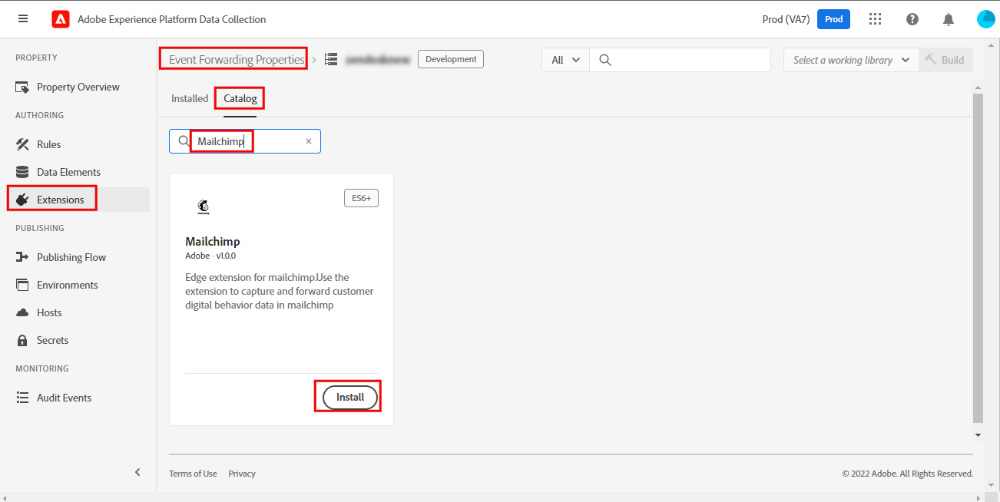
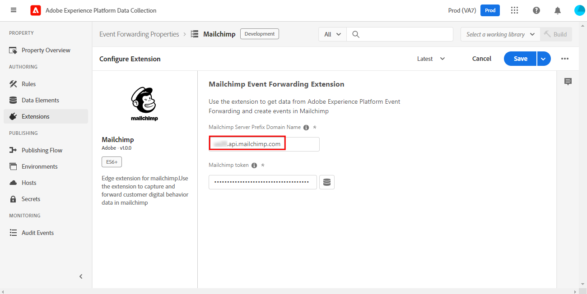
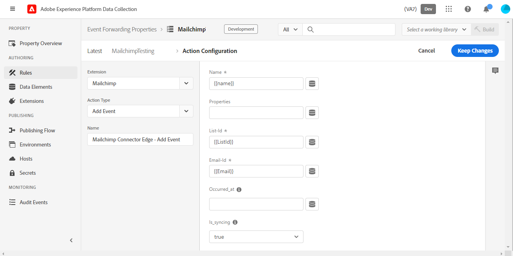

# Mailchimp event forwarding extension overview

>[!NOTE]
>  
>Adobe Experience Platform Launch has been rebranded as a suite of data collection technologies in Adobe Experience Platform. Several terminology changes have rolled out across the product documentation as a result. Please refer to the following [document](https://experienceleague.adobe.com/docs/experience-platform/tags/term-updates.html) for a consolidated reference of the terminology changes.

The Mailchimp [event forwarding](../../../ui/event-forwarding/overview.md) extension sends events to the Mailchimp Marketing API that can trigger emails for Mailchimp marketing campaigns, journeys, or transactions.

This document covers how to set up the extension and configure rules using the Add Event action.

## Prerequisites

This document assumes that you are familiar with the relevant Mailchimp products leveraged by the extension. For more information, please see the Mailchimp help documentation for [campaigns](https://mailchimp.com/help/getting-started-with-campaigns/), [journeys](https://mailchimp.com/help/about-customer-journeys/), and [transactions](https://mailchimp.com/help/transactional/).

A Mailchimp account is required to use this extension. You can sign up for an account [here](https://login.mailchimp.com/signup/). In the Mailchimp account dashboard, make note of the following values for use in this guide:

- Your Mailchimp domain prefix
- Your API key
- The Audience ID
- The default "from" email address

Depending on your Mailchimp account plan, you may have limited access to Mailchimp Customer Journey tools.

>[!TIP]
>  
>If you are using Mailchimp automations like transactional emails or Customer Journeys, the steps and screens may be slightly different than those listed here. However, you still need the same information to use this extension as described above. See the [Mailchimp Help Center](https://mailchimp.com/help/) for details on each of these values for your specific account and plan.

### Domain prefix

After logging in to Mailchimp and landing on the Dashboard view, the address bar of your browser should display a URL like `https://us11.admin.mailchimp.com` or just `us11.admin.mailchimp.com`. In this example, the prefix `us11` is just a placeholder and your value will be different. Record your URL with your prefix for a later step.

### API key

To find the API key for your account, select your profile icon in the Mailchimp UI, then select **Profile**. You should see a URL like `https://us11.admin.mailchimp.com/account/profile/` but with **your** prefix instead of `us11`.

Select **Extras**, then **API keys**:

Under **Your API keys**, you can choose an existing key or you an select **Create A Key** to create a new one. You can create a new key to use specifically with this extension. Copy the API key and save it for a later step. For more details, see the Mailchimp documentation on how to [generate your API key](https://mailchimp.com/developer/marketing/guides/quick-start/#generate-your-api-key).

### Audience ID and From address

Select **Audience** in the left navigation, then **Audience dashboard**. Next, select the audience you intend to use with this extension. To learn more, see the Mailchimp document on [creating an audience](https://mailchimp.com/help/create-audience/).

With your audience created and selected, select the **Manage Audience** dropdown and choose **Settings**. This screen shows various settings for your audience.

At the bottom of the Settings screen, you should see `Unique id for audience [audience name]` where `[audience name]` is the name of your actual audience. Copy the Audience ID and save it for a later step.

Select **Audience name and defaults** and confirm that **Default From email address** has the correct value for your campaigns. Note that the Audience ID is also listed at the top of this page and is same value you copied down in the last step.

## Mailchimp automations

Depending on your Mailchimp plan and whether you use transactional emails, Customer Journeys, or other Mailchimp automations, your specific journey settings may vary.

>[!IMPORTANT]
>  
>The event name you chose to trigger your automation or journey in Mailchimp is the same event name you must send with this extension. Note the event name in your Mailchimp automation and save it for a later step.

## Installation and configuration

This section lists the steps to install and configure the extension. To securely save the Mailchimp API key, you must use event forwarding [secrets](../../../ui/event-forwarding/secrets.md). 

### Create a secret and data element

In an event forwarding property, [create a [!UICONTROL Token] secret](../../../ui/event-forwarding/secrets.md#token) called `Mailchimp API Key`.

Next, [create a data element](../../../ui/managing-resources/data-elements.md#create-a-data-element) using the [!UICONTROL Core] extension and a [!UICONTROL Secret] data element type to reference the `Mailchimp API Key` secret you just created. Enter `Mailchimp Token` as the data element name.

### Install and configure the extension

In the same event forwarding property, select **[!UICONTROL Extensions],** then **[!UICONTROL Catalog]** to display the extensions available for installation. From here, search for the Mailchimp extension and select **[!UICONTROL Install]**.

  

The configuration screen appears. Under **[!UICONTROL Mailchimp Server Prefix Domain Name]**, enter the domain you copied earlier from your Mailchimp account, including your unique domain prefix.

>[!IMPORTANT]
>
>Do not include `http://` or `https://` in this field.

  

Under **[!UICONTROL Mailchimp token]**, select the data element icon and choose the `Mailchimp Token` data element you created earlier. Select **[!UICONTROL Save]** to save the changes.

The extension is now installed and configured for use in your property.

## Data collection

When using this extension in a [rule](../../../ui/managing-resources/rules.md), there are several data values that the extension sends to Mailchimp with each event. For a typical implementation, you can configure the [Adobe Experience Platform Web SDK extension](../../client/web-sdk/overview.md) to send that data to [!DNL Platform Edge Network] for use by the extension in the event forwarding property.

The data required by this extension can be sent from Web SDK as either XDM data (using the [`xdm`](/help/web-sdk/commands/sendevent/xdm.md) object) or non-XDM data (using the [`data`](/help/web-sdk/commands/sendevent/data.md) object).

For example, if a customer makes a purchase or registers for an event on your site, you could send a confirmation email through Mailchimp with this extension. Once you send the required information from Web SDK to the Edge Network, the extension triggers the email with Mailchimp.

  

### Data elements

The screenshot in the previous section shows the data that you can send with each event from this extension to Mailchimp. Once you configure Web SDK to send this data to the Edge Network, you can create data elements in the event forwarding property so the extension can access those values.

The table below provides more detail for each possible value.

| Name | Example path | Type | Description | Required | Limits |
|:---|:---:|:---:|:---|:---:|:---|
| `email` | `arc.event.xdm._tenant.emailId`  or  `arc.event.data._tenant.emailId` | String | The address that receives the email | **Yes** | Must exist in the Mailchimp Audience |
| `listId` | `arc.event.xdm._tenant.listId`  or  `arc.event.data._tenant.listid` | String | Audience ID | **Yes** | Must match an existing Audience ID|
| `name` | `arc.event.xdm._tenant.name`  or  `arc.event.data._tenant.name` | String | The event name | **Yes** | 2-30 characters in length |
| `properties` | `arc.event.xdm._tenant.properties`  or  `arc.event.data._tenant.properties`| Object | An optional list of properties in JSON format with details about the event | No ||
| `isSyncing` | `arc.event.xdm._tenant.isSyncing`  or  `arc.event.data._tenant.isSyncing` | boolean | Events created with `is_syncing` set to `true` **will not** trigger automations | No ||    
| `occurredAt` | `arc.event.xdm._tenant.occuredAt`  or `arc.event.data._tenant.occuredAt` | String | An ISO 8601 timestamp of when the event occurred | No ||

{style="table-layout:auto"}

>[!IMPORTANT]
>  
>The **Example path** values above are examples only. The field names and [paths](../../../ui/event-forwarding/overview.md#data-element-path) referenced in those data elements may be different in your property, depending on how you named and configured Web SDK in the steps above.

In your event forwarding property, you can create a data element for each of the fields outlined above. Once created, you can reference the data elements in the [!UICONTROL Add Event] action of this extension.

  

You can now use this extension and the Add Event action to trigger Mailchimp emails for your audiences.

## Data validation

When working with event forwarding extensions, the [Adobe Experience Platform Debugger](https://chrome.google.com/webstore/detail/adobe-experience-platform/bfnnokhpnncpkdmbokanobigaccjkpob) is very useful. In the Logs section, under Edge logs you can see the requests made by your event forwarding rules after they are triggered. The following screenshots shows a request being made to the Mailchimp API by the extension.

  

In the Mailchimp dashboard, on the Activity Feed view of your Audience or Audience Member, a list of events for that Audience or Audience Member is provided. This should match the events sent by the extension and show any optional data sent, along with the email or campaign they received. See the [Mailchimp Automation help guides](https://mailchimp.com/help/automation/) for more details.
