# [!DNL Meta Conversions API] extension overview

The [[!DNL Meta Conversions API]](https://developers.facebook.com/docs/marketing-api/conversions-api/) allows you to connect your server-side marketing data to [!DNL Meta] technologies in order to optimize your ad targeting, decrease cost per action, and measure results. Events are linked to a [[!DNL Meta Pixel]](https://developers.facebook.com/docs/meta-pixel/) ID and are processed in a similar way to client-side events.

Using the [!DNL Meta Conversions API] extension, you can leverage the API's capabilities in your [event forwarding](../../../ui/event-forwarding/overview.md) rules to send data to [!DNL Meta] from the Adobe Experience Platform Edge Network. This document covers how to install the extension and use its capabilities in an event forwarding [rule](../../../ui/managing-resources/rules.md).

## Prerequisites

It is strongly recommended to use [!DNL Meta Pixel] and the [!DNL Conversions API] to share and send the same events from the client side and server side, respectively, since this may help recover events that were not picked up by [!DNL Meta Pixel]. Before installing the [!DNL Conversions API] extension, see the guide on the [[!DNL Meta Pixel] extension](../../client/meta/overview.md) for steps on how to integrate it in your client-side tag implementations.

>[!NOTE]
>
>The section on [event deduplication](#deduplication) later in this document covers the steps to ensure the same event is not used twice, as it may be received from both the browser and the server.

In order to use the [!DNL Conversions API] extension, you must have access to event forwarding and have a valid [!DNL Meta] account with access to [!DNL Ad Manager] and [!DNL Event Manager]. Specifically, you must copy the ID of an existing [[!DNL Meta Pixel]](https://www.facebook.com/business/help/952192354843755?id=1205376682832142) (or [create a new [!DNL Pixel]](https://www.facebook.com/business/help/952192354843755) instead) so the extension can be configured to your account.

>[!INFO]
>
>If you're planning to use this extension with mobile app data, or if you also work with offline event data in your [!DNL Meta] campaigns, you'll need to create your dataset through an existing app and select **Create from a pixel ID** when prompted. See the article [Decide which dataset creation option is right for your business](https://www.facebook.com/business/help/5270377362999582?id=490360542427371) for details. Refer to the [Conversions API for App Events](https://developers.facebook.com/docs/marketing-api/conversions-api/app-events) document for all the required and optional app tracking parameters.

## Install the extension

To install the [!DNL Meta Conversions API] extension, navigate to the Data Collection UI or Experience Platform UI and select **[!UICONTROL Event Forwarding]** from the left navigation. From here, select a property to add the extension to, or create a new property instead.

Once you have selected or created the desired property, select **[!UICONTROL Extensions]** in the left navigation, then select the **[!UICONTROL Catalog]** tab. Search for the [!UICONTROL Meta Conversions API] card, then select **[!UICONTROL Install]**.

![The [!UICONTROL Install] option being selected for the [!UICONTROL Meta Conversions API] extension in the Data Collection UI.](../../../images/extensions/server/meta/install.png)

In the configuration view that appears, you must provide the [!DNL Pixel] ID you copied earlier to link the extension to your account. You can paste the ID directly into the input, or you can use a data element instead.

You also need to provide an access token to use the [!DNL Conversions API] specifically. Refer to the [!DNL Conversions API] documentation on [generating an access token](https://developers.facebook.com/docs/marketing-api/conversions-api/get-started#access-token) for steps on how to obtain this value.

When finished, select **[!UICONTROL Save]**

![The [!DNL Pixel] ID provided as a data element in the extension configuration view.](../../../images/extensions/server/meta/configure.png)

The extension is installed and you can now employ its capabilities in your event forwarding rules.

## Integration with Meta Business Extension (MBE) {#mbe}

The integration with Meta Business Extensions (MBE) enhancement allows you to quickly authenticate into your Meta Business Account. This then auto-populates your [!UICONTROL Pixel ID] and the Meta Conversions API [!UICONTROL Access Token], making it easier to install and configure the Meta Conversions API.

A dialogue prompt to authenticate in MBE appears when installing the [!UICONTROL Meta Conversions API] extension.

![The [!UICONTROL Meta Conversions API Extension] installation page highlighting [!UICONTROL Connect to Meta].](../../../images/extensions/server/meta/mbe-extension-install.png)

A dialogue prompt to authenticate in MBE also appears in the quick start workflow UI within event forwarding. 

![The quick start workflow UI highlighting [!UICONTROL Connect to Meta].](../../../images/extensions/server/meta/mbe-extension-quick-start.png)

## Integration with Event Quality Match Score (EMQ) {#emq}

The integration with Event Quality Match Score (EMQ) allows you to easily view the effectiveness of your implementation by showing EMQ scores. This integration minimizes context switching and helps you improve the success of your Meta Conversions API implementations. These event scores appear in the [!UICONTROL Meta Conversions API extension] configuration screen.

![The [!UICONTROL Meta Conversions API Extension] configuration page highlighting [!UICONTROL View EMQ Score].](../../../images/extensions/server/meta/emq-score.png)

## Integration with LiveRamp (Alpha) {#alpha}

The integration with LiveRamp adds new fields to the Meta Conversions API rule configuration, making it easier for customers to integrate with LiveRamp Conversions API. This integration eliminates the need for you to share PII directly with your partner or Meta. Due to the robust identity graph of LiveRamp, the inclusion of [!UICONTROL Partner ID (alpha)] may improve integration quality by boosting the user match rate.

![The Meta even forwarding [!UICONTROL Rule] configuration page highlighting [!UICONTROL Partner Name (alpha)] and [!UICONTROL Partner ID (alpha)].](../../../images/extensions/server/meta/live-ramp.png)

## Configure an event forwarding rule {#rule}

This section covers how to use the [!DNL Conversions API] extension in a generic event forwarding rule. In practice, you should configure several rules in order to send all accepted [standard events](https://developers.facebook.com/docs/meta-pixel/reference) via [!DNL Meta Pixel] and [!DNL Conversions API]. For mobile app data, please see the required fields, app data fields, customer information parameters, and custom data details [here](https://developers.facebook.com/docs/marketing-api/conversions-api/app-events).

>[!NOTE]
>
>Events should be [sent in real time](https://www.facebook.com/business/help/379226453470947?id=818859032317965) or as close to real time as possible for better ad campaign optimization.

Start creating a new event forwarding rule and configure its conditions as desired. When selecting the actions for the rule, select **[!UICONTROL Meta Conversions API Extension]** for the extension, then select **[!UICONTROL Send Conversions API Event]** for the action type.

![The [!UICONTROL Send Page View] action type being selected for a rule in the Data Collection UI.](../../../images/extensions/server/meta/select-action.png)

Controls appear that allow you to configure the event data that will be sent to [!DNL Meta] via the [!DNL Conversions API]. These options can be entered directly into the provided inputs, or you can select existing data elements to represent the values instead. The config options are divided into four main sections as outlined below.

| Config section | Description |
| --- | --- |
| [!UICONTROL Server Event Parameters] | General information about the event, including the time it occurred and the source action that triggered it. Refer to the [!DNL Meta] developer documentation for more information on the [standard event parameters](https://developers.facebook.com/docs/marketing-api/conversions-api/parameters/server-event) accepted by the [!DNL Conversions API].  If you are using both [!DNL Meta Pixel] and the [!DNL Conversions API] to send events, make sure to include both an **[!UICONTROL Event Name]** (`event_name`) and **[!UICONTROL Event ID]** (`event_id`) with every event, since these values are used for [event deduplication](#deduplication).  You also have the option to **[!UICONTROL Enable Limited Data Use]** to help comply with customer opt-outs. See the [!DNL Conversions API] documentation on [data processing options](https://developers.facebook.com/docs/marketing-apis/data-processing-options/) for details on this feature. |
| [!UICONTROL Customer Information Parameters] | User identity data that is used to attribute the event to a customer. Some of these values must be hashed before they can be sent to the API.  To ensure a good common API connection and high event match quality (EMQ), it is recommended that you send all [accepted customer information parameters](https://developers.facebook.com/docs/marketing-api/conversions-api/parameters/customer-information-parameters) alongside server events. These parameters should also be [prioritized based on their importance and impact on EMQ](https://www.facebook.com/business/help/765081237991954?id=818859032317965). |
| [!UICONTROL Custom Data] | Additional data to be used for ads delivery optimization, provided in the form of a JSON object. Refer to the [[!DNL Conversions API] documentation](https://developers.facebook.com/docs/marketing-api/conversions-api/parameters/custom-data) for more information on the accepted properties for this object.  If you are sending a purchase event, you must use this section to provide the required attributes `currency` and `value`.  |
| [!UICONTROL Test Event] | This option is used to verify whether your configuration is causing server events to be received by [!DNL Meta] as expected. To use this feature, select the **[!UICONTROL Send as Test Event]** checkbox, and then provide a test event code of your choice in the input below. Once the event forwarding rule is deployed, if you configured the extension and action correctly you should seeing activities appearing within the **[!DNL Test Events]** view in [!DNL Meta Events Manager]. |

{style="table-layout:auto"}

When finished, select **[!UICONTROL Keep Changes]** to add the action to the rule configuration.

![[!UICONTROL Keep Changes] being selected for the action configuration.](../../../images/extensions/server/meta/keep-changes.png)

When you are satisfied with the rule, select **[!UICONTROL Save to Library]**. Finally, publish a new event forwarding [build](../../../ui/publishing/builds.md) to enable the changes made to the library.

## Event deduplication {#deduplication}

As mentioned in the [prerequisites section](#prerequisites), it is recommended that you use both the [!DNL Meta Pixel] tag extension and the [!DNL Conversions API] event forwarding extension to send the same events from the client and server in a redundant setup. This can help recover events that were not picked up by one extension or the other.

If you are sending different event types from the client and server with no overlap between the two, then deduplication is not necessary. However, if any single event is shared by both [!DNL Meta Pixel] and the [!DNL Conversions API], you must ensure that these redundant events are deduplicated so that your reporting is not adversely affected.

When sending shared events, make sure that you are including an event ID and name with every event that you send from both the client and server. When multiple events with the same ID and name are received, [!DNL Meta] automatically employs several strategies to deduplicate them and keep the most relevant data. See the [!DNL Meta] documentation on [deduplication for [!DNL Meta Pixel] and [!DNL Conversions API] events](https://www.facebook.com/business/help/823677331451951?id=1205376682832142) for details on this process.

## Quick start workflow: Meta Conversions API Extension (Beta) {#quick-start}

>[!IMPORTANT]
>
>* The quick start feature is available to customers who have purchased the Real-Time CDP Prime and Ultimate package. Please contact your Adobe representative for more information.
>* This feature is for net new implementations and does not currently support auto installing extensions and configurations on existing tags and event forwarding properties. 

The quick start feature helps you get set up with ease and efficiency with the Meta Conversions API and the Meta Pixel extensions. This tool automates multiple steps that are performed in Adobe tags and event forwarding, significantly reducing the set up time.

This feature automatically installs and configures both the Meta Conversions API and the Meta Pixel extensions on a newly auto-generated tags and event forwarding property with the necessary rules and data elements. Additionally, it also auto installs and configures the Experience Platform Web SDK and Datastream. Lastly, the quick start feature auto-publishes the library to the designated URL in a development environment, which enables client side data collection and server side event forwarding in real-time via Event Forwarding and Experience Platform Edge Network.

The following video provides an introduction to the quick start feature.

>[!VIDEO](https://video.tv.adobe.com/v/3416939?quality=12&learn=on)

### Install quick start feature 

>[!NOTE]
>
>This feature is designed to help you get started with an event forwarding implementation. It will not deliver an end to end, fully functional implementation that accommodates all use cases.

This setup auto installs both the Meta Conversions API and the Meta Pixel extensions. This hybrid implementation is recommended by Meta to collect and forward event conversions server side.
The quick setup feature is designed to help customers get started with an event forwarding implementation and is not intended to deliver an end to end, fully functional implementation that accommodates all use cases.

To install the feature, Select **[!UICONTROL Get Started]** for **[!DNL Send Conversions Data to Meta]** on the Adobe Experience Platform Data Collection **[!UICONTROL Home]** page.

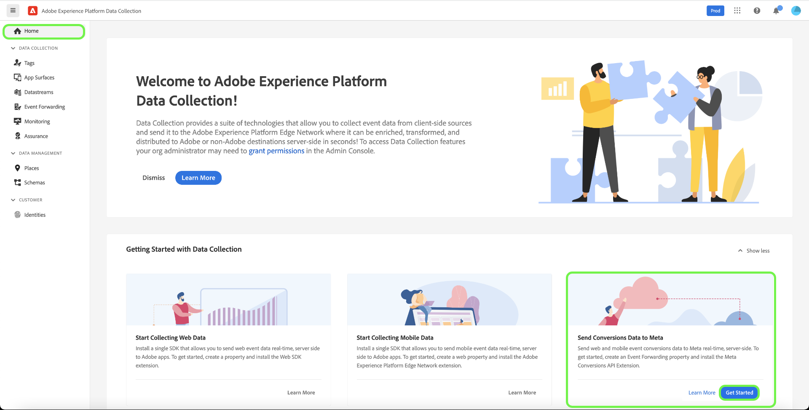

Enter your **[!UICONTROL Domain]**, then select **[!UICONTROL Next]**. This domain will be used as a naming convention for your auto generated Tags and Event Forwarding properties, rules, data elements, datastreams, and so on.

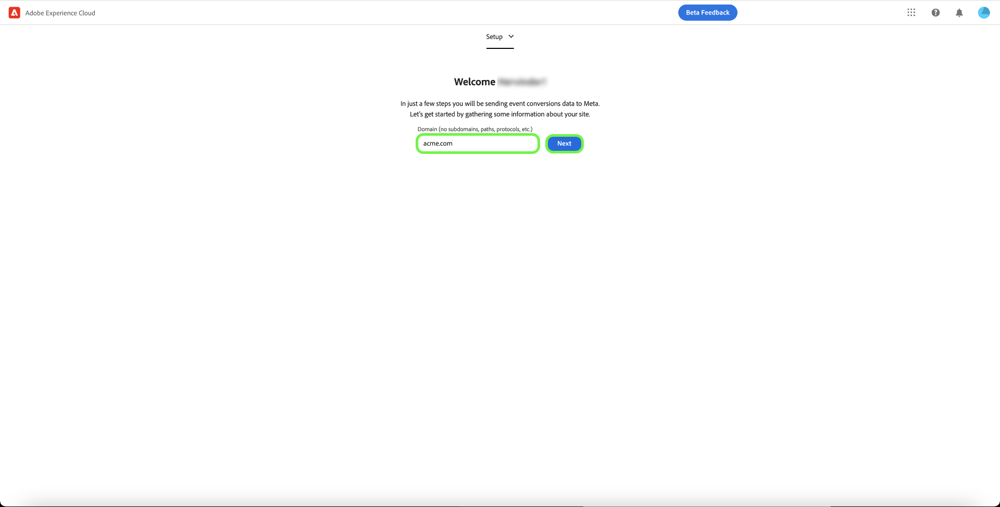

In the **[!UICONTROL Initial Setup]** dialog enter your **[!UICONTROL Meta Pixel ID]**, **[!UICONTROL Meta Conversion API Access Token]**, and **[!UICONTROL Data Layer Path]**, then select **[!UICONTROL Next]**.

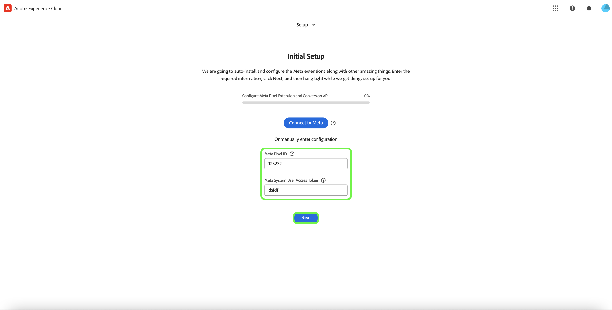

Allow a few minutes for the initial setup process to complete, then select **[!UICONTROL Next]**.

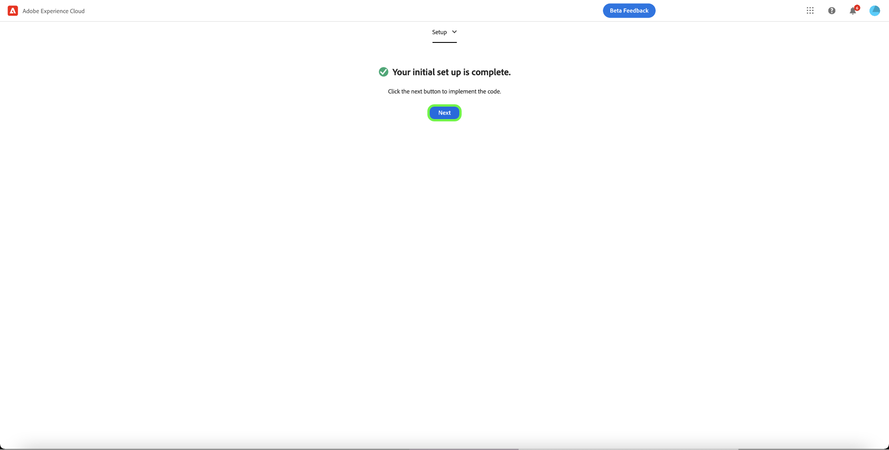

From the **[!UICONTROL Add Code on Your Site]** dialog copy the code provided using the copy  function and paste this into the `<head>` of your source website. Once implemented, select **[!UICONTROL Start Validation]**

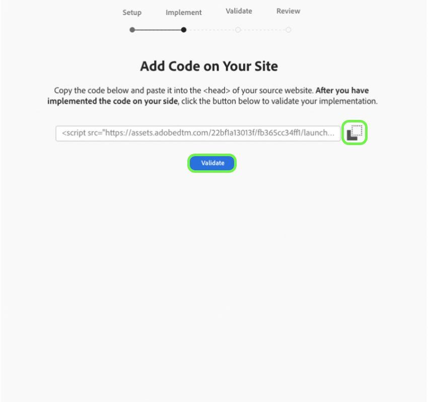

The [!UICONTROL Validation Results] dialog displays the Meta extension implementation results. Select **[!UICONTROL Next]**. You can also see additional validation results by selecting the **[!UICONTROL Assurance]** link.

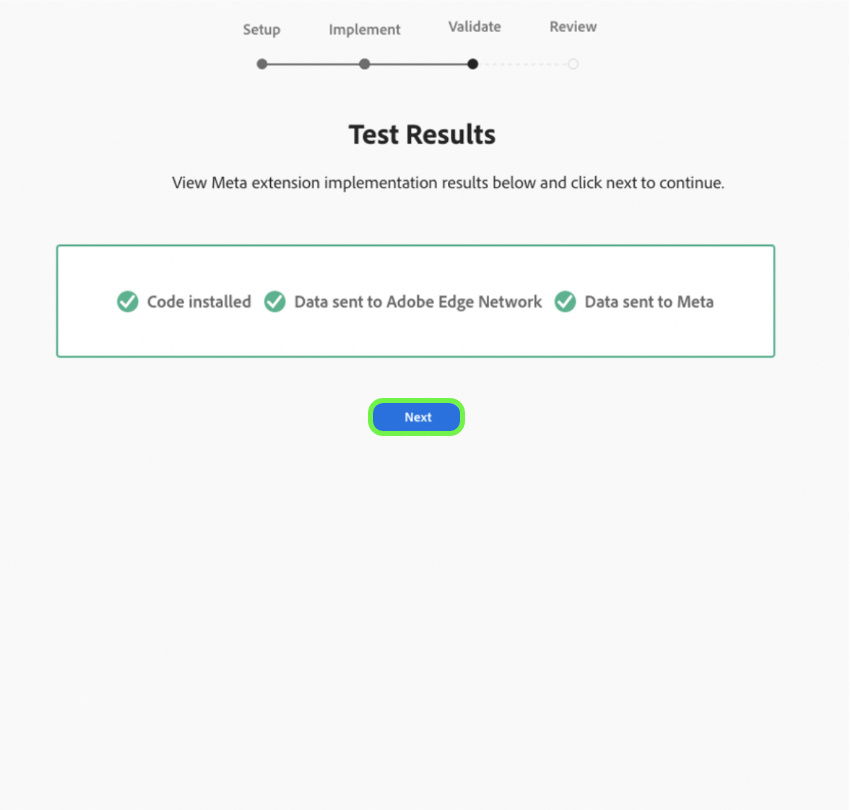

The **[!UICONTROL Next Steps]** screen display confirms completion of setup. From here you have the option to optimize your implementation by adding new events, which are shown in the next section.

If you do not want to add additional events, select **[!UICONTROL Close]**.

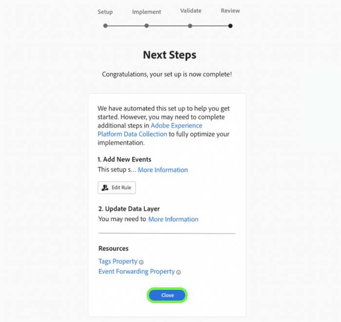

#### Adding Additional Events

To add new events, select **[!UICONTROL Edit Your Tags Web Property]**.

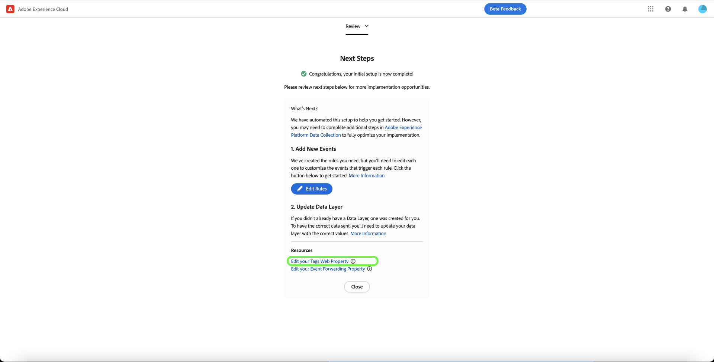

Select the rule that corresponds to the meta event that you would like to edit. For example, **MetaConversion_AddToCart**.

>[!NOTE]
>
>If there is no event, this rule will not run. This is true for all rules, with the **MetaConversion_PageView** rule being the exception.

To add an event select **[!UICONTROL Add]** under the [!UICONTROL Events] heading.

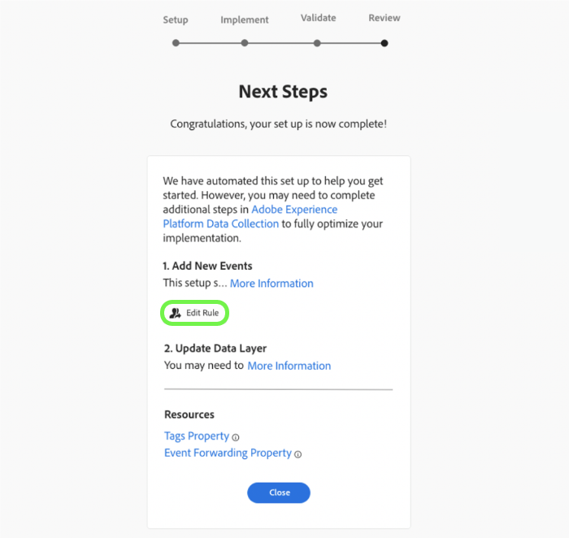

Select the [!UICONTROL Event Type]. In this example, we have selected the [!UICONTROL Click] event and configured it to trigger when the **.add-to-cart-button** is selected. Select **[!UICONTROL Keep Changes]**.

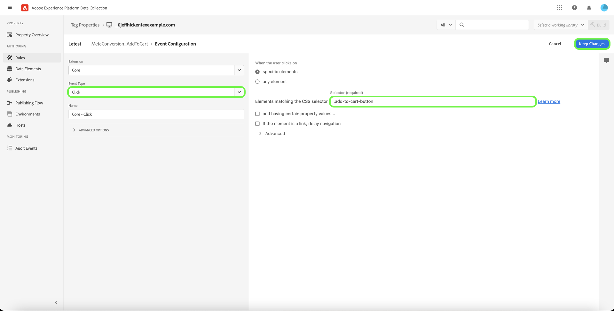

The new event has been saved. Select **[!UICONTROL Select a working library]** and select the library that you would like to build to.

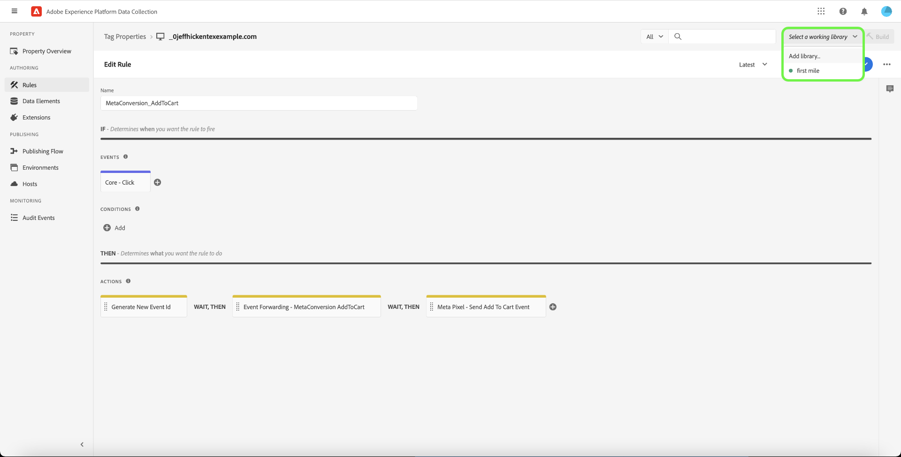

Next select the dropdown beside **[!UICONTROL Save to Library]** and select **[!UICONTROL Save to Library and Build]**. This will publish the change in the library.

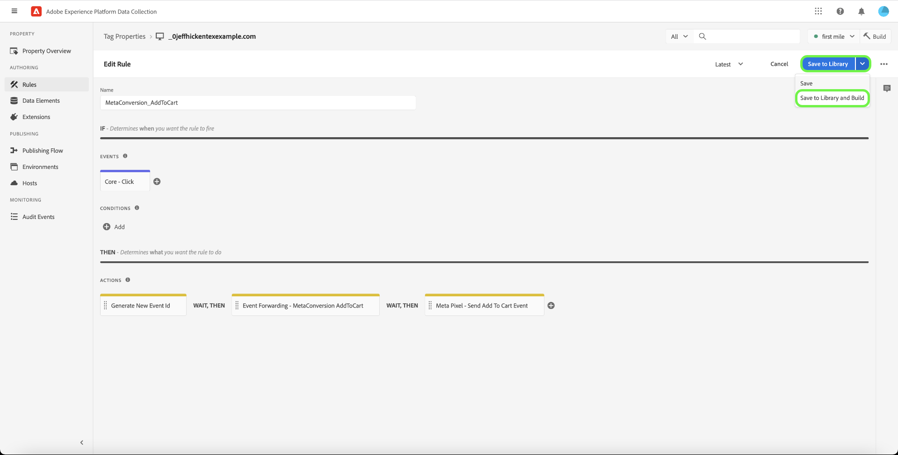

Repeat these steps for any other meta conversion event you would like to configure.

#### Data Layer Configuration {#configuration}

>[!IMPORTANT]
>
>The way you update this global data layer depends on your website architecture. A single page application will be different to a server-side rendering app. There is also the possibility that you will be wholly in charge of creating and updating this data inside the Tags product. In all instances the data layer will need to be updated in between running each of the `MetaConversion_* rules`. If you don't update the data between rules, you may also run into a case where you are sending stale data from the last `MetaConversion_* rule` in the current `MetaConversion_* rule`.

During the configuration, you were asked where your data layer lives. By default, this would be `window.dataLayer.meta`, and inside the `meta` object, your data would be expected as shown below.

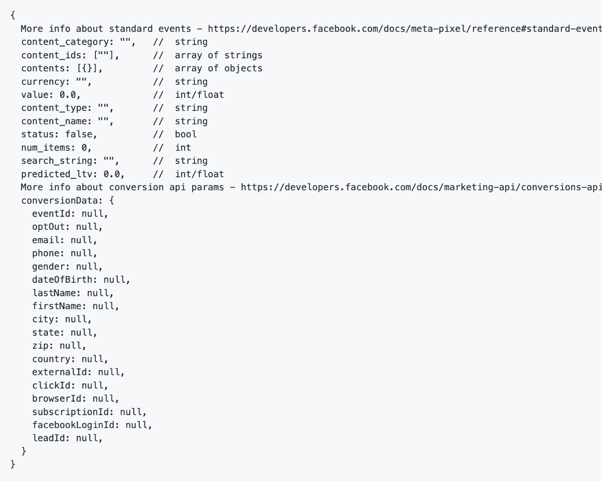

This is important to understand as every `MetaConversion_*` rule uses this data structure to pass the relevant pieces of data to the [!DNL Meta Pixel] extension and to the [!DNL Meta Conversions API]. Refer to the documentation on [standard events](https://developers.facebook.com/docs/meta-pixel/reference#standard-events) for more information on what data different meta events require.

For example, if you wanted to use the `MetaConversion_Subscribe` rule, you would need to update `window.dataLayer.meta.currency`, `window.dataLayer.meta.predicted_ltv`, and `window.dataLayer.meta.value` as per the object properties described in the documentation on [standard events](https://developers.facebook.com/docs/meta-pixel/reference#standard-events).

Below is an example of what would need to be run on a website to update the data layer before the rule is executed.

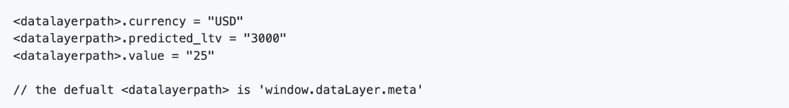

By default, the `<datalayerpath>.conversionData.eventId` will be randomly generated by the "Generate New Event Id" action on any of the `MetaConversion_* rules`.

For a local reference of how the data layer should look, you can open the custom code editor on the `MetaConversion_DataLayer` data element on your property.

## Next steps

This guide covered how to send server-side event data to [!DNL Meta] using the [!DNL Meta Conversions API] extension. From here, it is recommended to expand your integration by connecting more [!DNL Pixels] and sharing more events when applicable. Doing either of the following can help further improve your ad performance:

* Connect any other [!DNL Pixels] that are not yet connected to a [!DNL Conversions API] integration.
* If you are sending certain events exclusively through [!DNL Meta Pixel] on the client side, send these same events to the [!DNL Conversions API] from the server side as well.

See the [!DNL Meta] documentation on [best practices for the [!DNL Conversions API]](https://www.facebook.com/business/help/308855623839366?id=818859032317965) for more guidance on how to effectively implement your integration. For more general information on tags and event forwarding in Adobe Experience Cloud, refer to the [tags overview](../../../home.md).
