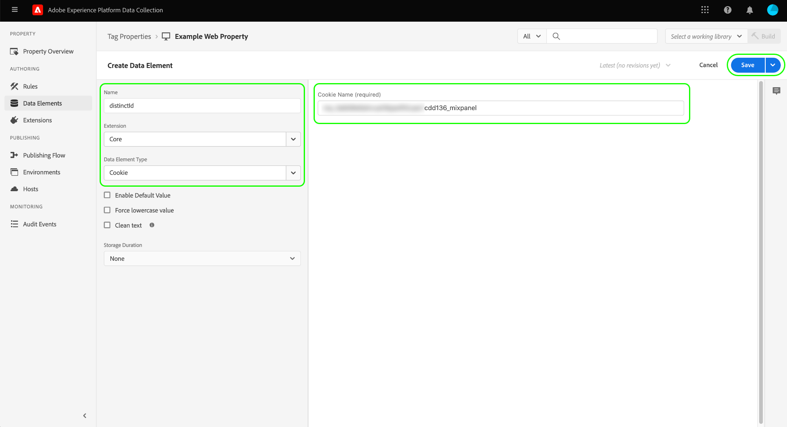
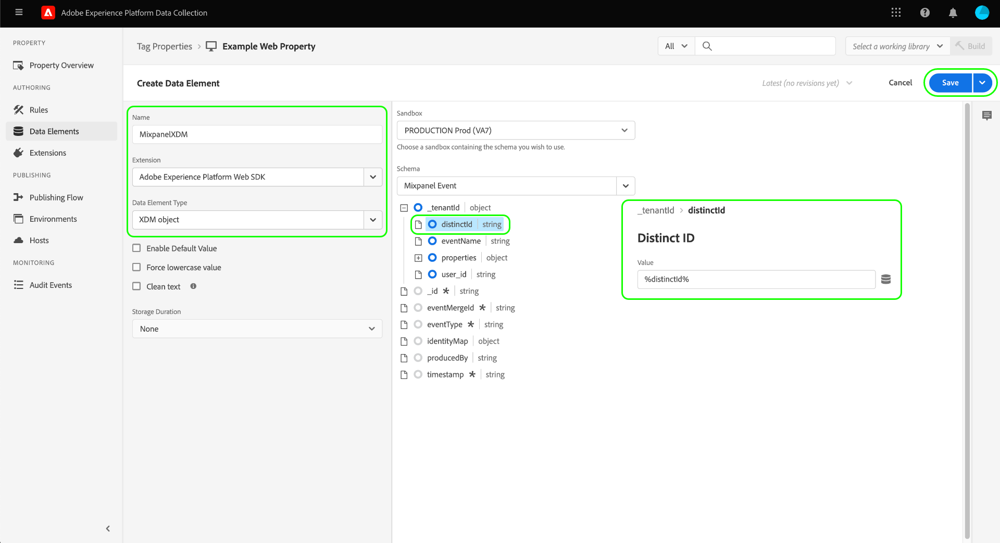
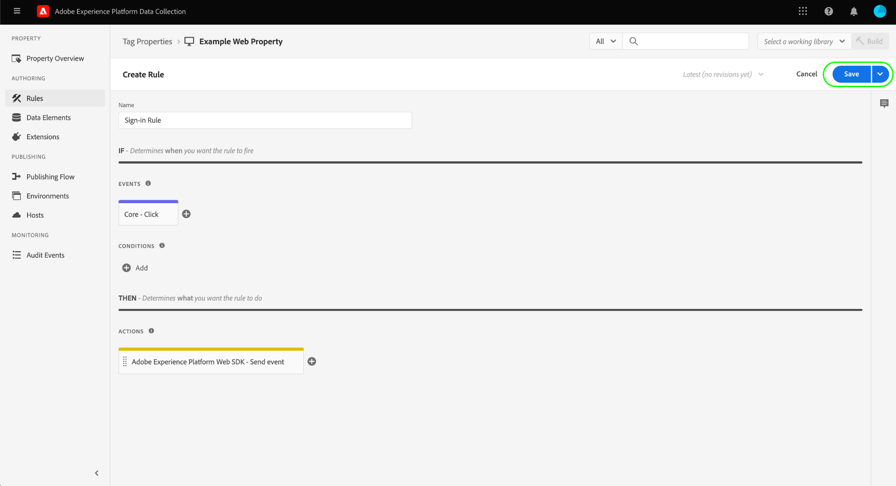
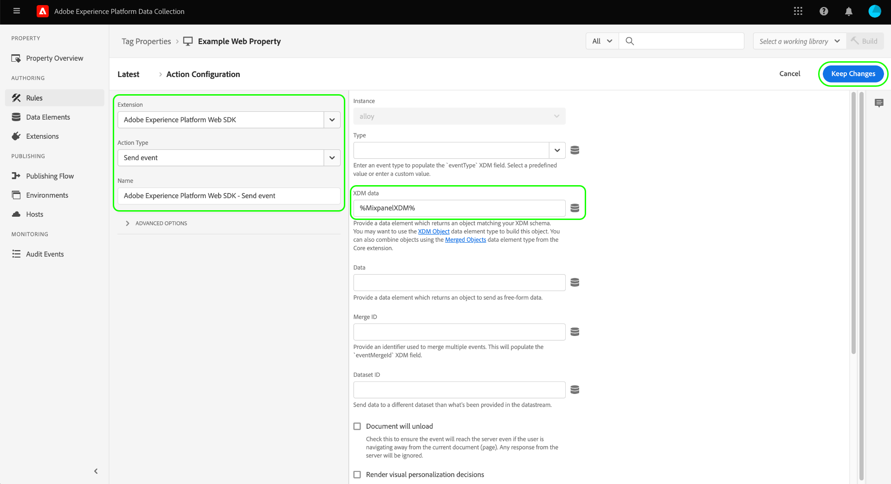
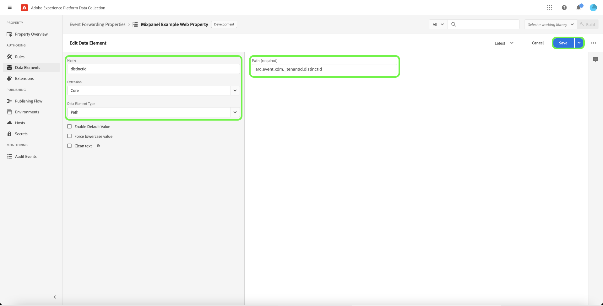
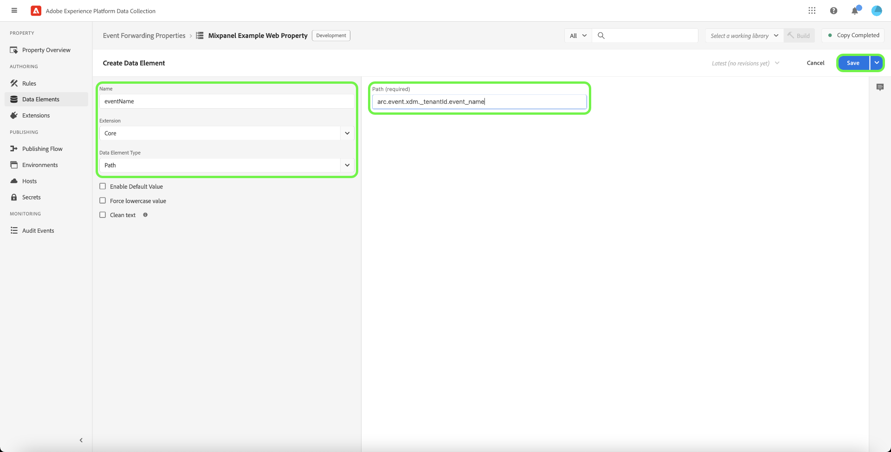
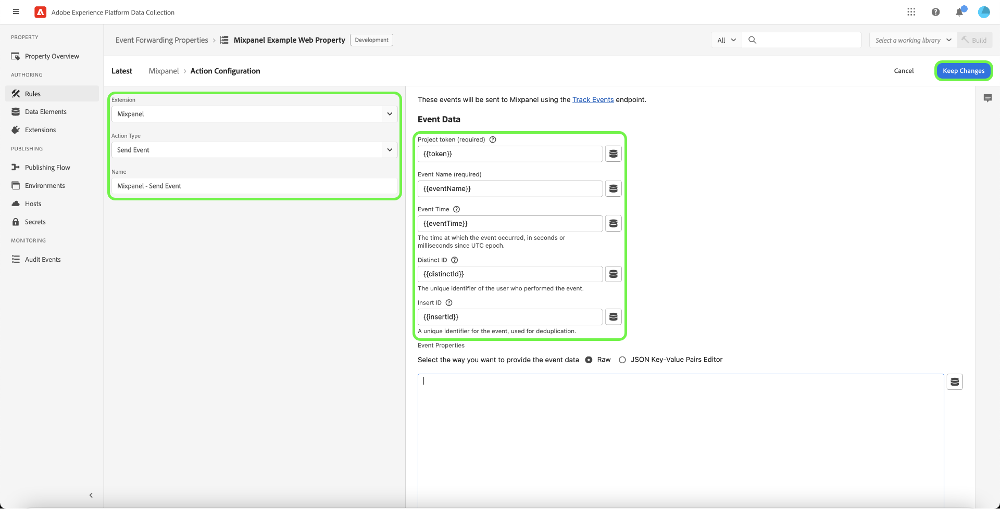

# [!DNL Mixpanel Track Events] API event forwarding extension

[[!DNL Mixpanel]](https://www.mixpanel.com) is a product analytics tool that allows you to capture data on how users interact with a digital product. You can analyze product data with simple, interactive reports that let you query and visualize the data with just a few clicks. [!DNL Mixpanel] designed to make teams more efficient by allowing everyone to analyze user data in real time to identify trends, understand user behavior, and make decisions about your product.

[!DNL Mixpanel] employs an event-based, user-centric model that connects each interaction to a single user. The [!DNL Mixpanel] data model is built on the concepts of users, events, and properties.

>[!NOTE]
>
>Refer to the [!DNL Mixpanel] documentation on [identity management](https://help.mixpanel.com/hc/en-us/articles/360041039771-Getting-Started-with-Identity-Management) to understand how [!DNL Mixpanel] merges events to create identity clusters. It is also recommended that you review the document on [distinct IDs](https://help.mixpanel.com/hc/en-us/articles/115004509426-Distinct-ID-Creation-JavaScript-iOS-Android-) to understand how they are used to identify users in event data.

The [!DNL Mixpanel Track Events] API extension allows you to leverage both [event forwarding](../../../ui/event-forwarding/overview.md) and [tags](../../../home.md) to capture event information in the Adobe Experience Platform Edge Network and send it to [!DNL Mixpanel] using the [[!DNL Track Events] API](https://developer.mixpanel.com/reference/track-event). This document covers the use cases of the extension, how to install it, and how to integrate its capabilities into your event forwarding [rules](../../../ui/managing-resources/rules.md).

## Use cases

This extension should be used if you want to use data from the Edge Network in [!DNL Mixpanel] to take advantage of its product analytics capabilities.

For example, consider a retail organization that has a multichannel presence (website and mobile). The organization captures transactional or conversational input as event data from their platforms and loads it into [!DNL Mixpanel] using the event forwarding extension.

The analytics teams can then leverage [!DNL Mixpanel's] capabilities to process the datasets and derive business insights, which can be used to generate graphs, dashboards, or other visualizations to inform business stakeholders.

For more information on use cases specific to [!DNL Mixpanel], refer to the following documentation:

* [New to [!DNL Mixpanel]](https://help.mixpanel.com/hc/en-us/sections/360008533532-New-to-Mixpanel)
* [What is [!DNL Mixpanel]?](https://developer.mixpanel.com/docs)
* [12 must-try [!DNL Mixpanel] features](https://mixpanel.com/blog/12-things-you-probably-didnt-know-you-could-do-with-mixpanel/)

## [!DNL Mixpanel] prerequisites {#prerequisites-mixpanel}

You must have a valid [!DNL Mixpanel] account in order to use this extension. Go to the [[!DNL Mixpanel] registration page](https://mixpanel.com/register/) to register and create an account if you do not have one already.

Ensure that the [[!DNL Identity Merge]](https://help.mixpanel.com/hc/en-us/articles/9648680824852-ID-Merge-Implementation-Best-Practices) setting is enabled for your project. Navigate to **[!DNL Settings]** > **[!DNL Project Setting]** > **[!DNL Identity Merge]** and toggle the setting.

<!-- (If these don't apply, do we need to include here at all?)
### API guardrails {#guardrails}

Refer to the [[!DNL Mixpanel] documentation](https://developer.mixpanel.com/reference/import-events#rate-limits) for limits and response codes. As [!DNL Mixpanel] only sends live events these limits should not apply.
-->

### Gather required configuration details {#configuration-details}

In order to connect Experience Platform to [!DNL Mixpanel] you must have the following inputs:

| Key Type | Description | Example |
| --- | --- | --- |
| Project Token | The project token associated with your [!DNL Mixpanel] account. Refer to the [!DNL Mixpanel] documentation on [finding your project token](https://help.mixpanel.com/hc/en-us/articles/115004502806-Find-Project-Token-) for guidance. | `25470xxxxxxxxxxxxxxxxxxx1289`|

## Experience Cloud prerequisites

This section covers the prerequisite steps in Experience Cloud for all implementations. Depending on your individual implementation needs, it may be helpful to set up the following constructs before configuring the extension:

1. A [schema](../../../../xdm/schema/composition.md) to describe the structure of the data you are ingesting into Experience Cloud
1. A [datastream](https://experienceleague.adobe.com/docs/platform-learn/data-collection/event-forwarding/set-up-a-datastream.html) to route incoming data to appropriate Adobe Experience Cloud applications
1. A [dataset](https://experienceleague.adobe.com/docs/platform-learn/tutorials/data-ingestion/create-datasets-and-ingest-data.html) to store the collected data

For all implementations, the following is required on the Experience Cloud side:

1. [Create a secret](#create-a-secret)
1. [Set up tag properties](#set-up-tag-properties)
1. [Add data elements within tag properties](#add-data-elements-within-tag-properties)
1. [Add rules within tag properties](#add-rules-within-tag-properties)

### Create a secret

Create a new [event forwarding secret](../../../ui/event-forwarding/secrets.md) and set the value to your [[!DNL Mixpanel] project token](#configuration-details). This will be used to authenticate the connection to your account while keeping the value secure.

### Set up tag properties

[Create a tag property](https://experienceleague.adobe.com/docs/platform-learn/implement-in-websites/configure-tags/create-a-property.html?lang=en) or choose an existing property to edit instead. This property will be configured to collect the necessary data structures for [!DNL Mixpanel] as they are brought into the Edge Network before being sent using event forwarding.

### Add data elements within tag properties

If your website uses the [[!DNL Mixpanel] SDK](https://developer.mixpanel.com/docs/nodejs), you must [create a data element](../../../ui/managing-resources/data-elements.md) that uses the **[!UICONTROL Cookie]** type (provided by the [[!UICONTROL Core] tag extension](../../client/core/overview.md)) so the [!DNL Mixpanel] `distinct_id` can be read from the cookie.

The **[!UICONTROL Cookie Name]** value must match the [!DNL Mixpanel] cookie name for the website. The name should have a format similar to `mp_{MIXPANEL_PROJECT_TOKEN_FOR_WEBSITE}_mixpanel`. Select **[!UICONTROL Save]** when finished.

>[!IMPORTANT]
>
>The name of the above data element (`distinctId` in this example) should match the name used for the same field in your schema. This also applies to the event forwarding data element you will be creating later.

For the second data element, set the type to **[!UICONTROL XDM Object]** (from the [Adobe Experience Platform Web SDK extension](../../client/sdk/overview.md)) and map it to the schema created earlier. As you map the data, ensure that the value of the `distinct_id` data element (which contains the [!DNL Mixpanel] `distinct_id` value from the cookie) is referenced as a value within one of your schema fields.

>[!NOTE]
>
>If your website is not running the [!DNL Mixpanel] SDK, an Adobe Experience Cloud ID (ECID) will be used as the fallback `distinct_id` value to be passed with the event sent to [!DNL Mixpanel].

Depending on your scenario, you may need to create another data element that can be used to map to the event name in the schema. This can be done using the **[!UICONTROL DOM Attribute]** type provided by the [!UICONTROL Core] extension.

### Add rules within tag properties

Once your data elements are set up, you can start creating rules that determine which events will result in data being sent to [!DNL Mixpanel].

Start by creating a rule that gets triggered for the user identification event. This can represent log-ins, sign-ups, registrations, or any other event that you want to use for user identification.

Under **[!UICONTROL Events]**, add a condition (specific to your website) that will trigger the identify event. An example of triggering the sign-in rule on a user click is shown below:

Select **[!UICONTROL Keep Changes]** to add the event to the rule.

Next, under **[!UICONTROL Actions]**, add the resulting actions you want the rule to take when it fires. Among these actions must be **[!UICONTROL Send event]** provided by the Platform Web SDK extension, which sends the event to the Edge Network, where it can be picked up by event forwarding extensions like [!DNL Mixpanel].

When configuring the action, under **[!UICONTROL XDM data]** select the [data element you created earlier](#add-data-elements-within-tag-properties) that contains the `distinct_id` value.

Select **[!UICONTROL Keep Changes]** to add the event to the rule, then select **[!UICONTROL Save]** to add the rule to the tag library. From here, you can [create a new build and deploy it to your website](../../../ui/publishing/overview.md).

## Install and configure the [!DNL Mixpanel] extension {#install}

To install the extension, [create an event forwarding property](../../../ui/event-forwarding/overview.md#properties) or choose an existing property to edit instead.

Select **[!UICONTROL Extensions]** in the left navigation. In the **[!UICONTROL Catalog]** tab, select **[!UICONTROL Install]** on the card for the [!DNL Mixpanel] extension.

![Installing the [!DNL Mixpanel] extension.](../../../images/extensions/server/mixpanel/install-extension.png)

On the next screen, under **[!UICONTROL Token]**, select the secret-type data element [that you created earlier](#create-a-secret) which contains your [!DNL Mixpanel] project token. Select **[!UICONTROL Save]** to complete the configuration.

![The [!DNL Mixpanel] extension input.](../../../images/extensions/server/mixpanel/configure-extension.png)

## Set up event forwarding data elements

After installing and configuring the extension, the next step is to create event forwarding data elements that will capture the necessary data constructs that will be sent to [!DNL Mixpanel].

### Create a `distinctId` data element

Add data elements under event forwarding. If the site is configured with the [[!DNL Mixpanel] SDK](https://developer.mixpanel.com/docs/nodejs) the [tag property data element](#setup-tag-properties-data-element) would have been defined. For the event forwarding data element, you will now provide a **[!UICONTROL Path]** instead.

### Create an `event_type` data element

Below is an example of a data element that has been defined for an event type:

### Create additional data element mappings

The `distinctId` and `event_type` data elements are both required to send data to [!DNL Mixpanel], but it is also recommended to include a known user ID and a custom data object with each event if available. See the guide on the [[!DNL Mixpanel Track Events] REST API](https://developer.mixpanel.com/reference/track-event) for additional guidance.

The recommended data element mappings are outlined below.

>[!IMPORTANT]
>
>All of the data elements listed below should use the **[!UICONTROL Path]** type so they can map to specific fields in your schema as outlined in the **Schema path** column.
>
>For the schema paths, you must replace the `{TENANT_ID}` placeholder with your unique [tenant ID](../../../../xdm/api/getting-started.md#know-your-tenant_id), which acts as a namespace for custom fields defined by your organization.

| [!DNL Mixpanel] key | Schema path | Description | Mandatory |
| --- | --- | --- | --- |
| [!DNL Mixpanel Distinct ID] | `arc.event.xdm._{TENANT_ID}.distinct_id` | `distinct_id` identifies the user who performed the event. `distinct_id` must be specified on every event, as it is crucial for [!DNL Mixpanel] to perform behavioral analysis correctly and efficiently, including unique users, funnels, retention, cohorts, and more. | Yes |
| [!DNL Event Type] | `arc.event.xdm._{TENANT_ID}.event_type` | This is the name of the event. [!DNL Mixpanel] recommends keeping the number of unique event names relatively small and using properties for any variable context attached to the event.  For example, instead of tracking events with names like "Paid Signup" and "Free Signup", it is recommended to track an event called "Signup" and have a property called "Account Type" with potential values "paid" and "free". | Yes |
| [!DNL Known User ID] | `arc.event.xdm._{TENANT_ID}.LoginID` | The email or login ID of the user, if available. | No |
| [!DNL Data] | `arc.event.xdm._{TENANT_ID}.properties` | A JSON object representing all the properties about the event. Data is truncated to 255 characters.| No |

{style="table-layout:auto"}

## Set up event forwarding rules

Once all your data elements are set up, you can start creating event forwarding rules that determine when and how your events will be sent to [!DNL Mixpanel]. However, before configuring your rules, it is important to understand how identity clusters work in [!DNL Mixpanel] so that the events you send are correctly attributed to individual users.

### Understanding identity clusters in [!DNL Mixpanel]

In [!DNL Mixpanel], an identity cluster contains a collection of `distinct_id` values that connect to an individual user. [!DNL Mixpanel] handles the clustering of identities for each user, resolving a single canonical `distinct_id` from each cluster to be used in reporting. You can also include your own identifier (called a local `distinct_id`) for anonymous events that occur before a user identification event.

[!DNL Mixpanel] resolves identity clusters through two methods: 

* **Identify** : [!DNL Mixpanel] connects your chosen identifier to an anonymous `distinct_id`. If the [!DNL Mixpanel] SDK is configured on your website, Platform will use the `distinct_id` assigned to the currently signed-in user.  
* **Alias**: [!DNL Mixpanel] merges two non-anonymous `distinct_id`s together if other merge criteria are passed.

>[!NOTE]
>
>Refer to the [!DNL Mixpanel] document on [identity management](https://help.mixpanel.com/hc/en-us/articles/360041039771-Getting-Started-with-Identity-Management#user-identification) for more details on these methods.
>
>Confirm that you have enabled the [[!DNL Mixpanel] identity merge feature](#prerequisites-mixpanel) to ensure that identity clusters are resolved appropriately.

Accordingly, the [!DNL Mixpanel] event forwarding extension supports the following action types for your rule configurations:

* **[!UICONTROL Track Event]**
* **[!UICONTROL Mixpanel Alias]**
* **[!UICONTROL Mixpanel Identify]**

>[!IMPORTANT]
>
>For each rule, regardless of the identity cluster resolution method used, one of the actions must use the **[!UICONTROL Track Event]** type. Without this action type, the rule will not send Adobe Experience Edge Network events to [!DNL Mixpanel].

### Create an event tracking rule

Start creating a new rule in your event forwarding property. Under **[!UICONTROL Actions]**, add a new action and set the extension to **[!UICONTROL Mixpanel]**. Next, set the action type to **[!UICONTROL Track Event]** to send Adobe Experience Edge Network events to [!DNL Mixpanel].

| Tab | Input | Description |
| --- | --- | --- |
| [!UICONTROL Main Fields] | [!UICONTROL Event Type] | The event name. |
| [!UICONTROL Main Fields] | [!UICONTROL Mixpanel Distinct ID] | This field should be mapped to the `distinctId` data element you created earlier. |
| [!UICONTROL Main Fields] | [!UICONTROL Data] | A JSON object containing the standard `properties` for the event. |
| [!UICONTROL Additional Fields] | [!UICONTROL Body Format] | If you are including additional fields, select from providing raw JSON or using a simplified set of key-value inputs. |
| [!UICONTROL Additional Fields] | [!UICONTROL Body] | Provide the keys and values of the additional fields you are including in the event. |

>[!NOTE]
>
>For more information on the standard fields for a [!DNL Mixpanel] event, refer to the [official documentation](https://developer.mixpanel.com/reference/import-events#event).

Once the [!UICONTROL Track Event] action is added to the rule, you can configure the rule's conditions so it only fires for certain events, or you can leave the conditions section empty to make the rule fire for all events.

>[!IMPORTANT]
>
>If your website is using the [!DNL Mixpanel] SDK, you can continue to the next step of [validating your data within [!DNL Mixpanel]](#validate). If you are not using the [!DNL Mixpanel] SDK, you must [create a separate identity tracking rule](#create-an-identity-tracking-rule) to ensure that appropriate events and `distinct_id` values are sent to [!DNL Mixpanel] when a user identification event occurs.
### Create an identity tracking rule

If you are not using the [!DNL Mixpanel SDK], the next step is to create another rule that uses both the **[!UICONTROL Mixpanel Alias]** and **[!UICONTROL Mixpanel Identify]** action types. This rule ensures that whenever a user identification event occurs on the website (such as a login, sign-up, registration, and so on), the appropriate events and `distinct_id` values are sent to [!DNL Mixpanel].

Start the process of creating a new rule. For the [!UICONTROL Conditions] section, add a condition that checks whether the event is a user identification event. In the example below, the condition uses a [!UICONTROL Value Comparison] (from the [!UICONTROL Core] extension) to check whether the incoming event has an event name equal to `signin`, indicating a user sign-in event.

![Showcase the Action Configuration for [!DNL Mixpanel] action types Alias and Identify.](../../../images/extensions/server/mixpanel/ef-rule-condition.png)

Once you've added the appropriate conditions to the rule, you must add the following actions:

* **[!UICONTROL Mixpanel Alias]** 
* **[!UICONTROL Mixpanel Identify]** 

#### [!UICONTROL Mixpanel Alias]

To configure the **[!UICONTROL Mixpanel Alias]** action, include the following values:

| Input | Description |
| --- | --- |
| [!UICONTROL Known User ID] | A known identifier for the user that triggered the event. This will act as the alias for the corresponding `distinct_id`. |
| [!UICONTROL Mixpanel Distinct ID] | The `distinct_id` to be merged with the alias. |

![Showcase the Action Configuration for the Action type [!DNL Mixpanel] Alias.](../../../images/extensions/server/mixpanel/alias-action-config.png)

>[!NOTE]
>
>For more information on aliases in [!DNL Mixpanel], refer to the [official documentation](https://developer.mixpanel.com/reference/identity-create-alias).

#### [!UICONTROL Mixpanel Identify]

To configure the **[!UICONTROL Mixpanel Identify]** action, include the following values:

| Input | Description |
| --- | --- |
| [!UICONTROL Known User ID] | A known identifier for the user that triggered the event. |
| [!UICONTROL Mixpanel Distinct ID] | The `distinct_id` to be merged with the alias. |

![Showcase the Action Configuration for the Action type [!DNL Mixpanel] Identify.](../../../images/extensions/server/mixpanel/identify-action-config.png)

>[!NOTE]
>
>For more information on identities in [!DNL Mixpanel], refer to the [official documentation](https://developer.mixpanel.com/reference/create-identity).
Once both actions are added to the rule, select **[!UICONTROL Save]** to add the rule to your event forwarding library. From here, you can [create a new build and activate your changes](../../../ui/publishing/overview.md).

![Add an event forwarding rule for [!DNL Mixpanel] action types Alias and Identify.](../../../images/extensions/server/mixpanel/ef-rule-complete.png)

## Validate data within [!DNL Mixpanel] {#validate}

If your implementation is successful and events are collected, you will see events within the [[!DNL Mixpanel] console](https://help.mixpanel.com/hc/en-us/articles/4402837164948).

Check if [!DNL Mixpanel] has merged the post login events populated with email values and the events created when using **[!UICONTROL Mixpanel Alias]** and **[!UICONTROL Mixpanel Identify]**. If implemented correctly, [!DNL Mixpanel] will associate them with a single [user profile](https://help.mixpanel.com/hc/en-us/articles/115004501966).

## Next steps

This guide covered how to send conversion events to [!DNL Mixpanel] using event forwarding. This event forwarding extension leverages the [!DNL Mixpanel] SDK and JavaScript API. For more information on these underlying technologies, refer to the official documentation:

* [[!DNL Mixpanel] SDK](https://developer.mixpanel.com/docs/nodejs)
* [[!DNL Mixpanel] JavaScript API](https://developer.mixpanel.com/docs/javascript-full-api-reference#mixpanelidentify)

For more information on event forwarding capabilities in Experience Platform, refer to the [event forwarding overview](../../../ui/event-forwarding/overview.md).
