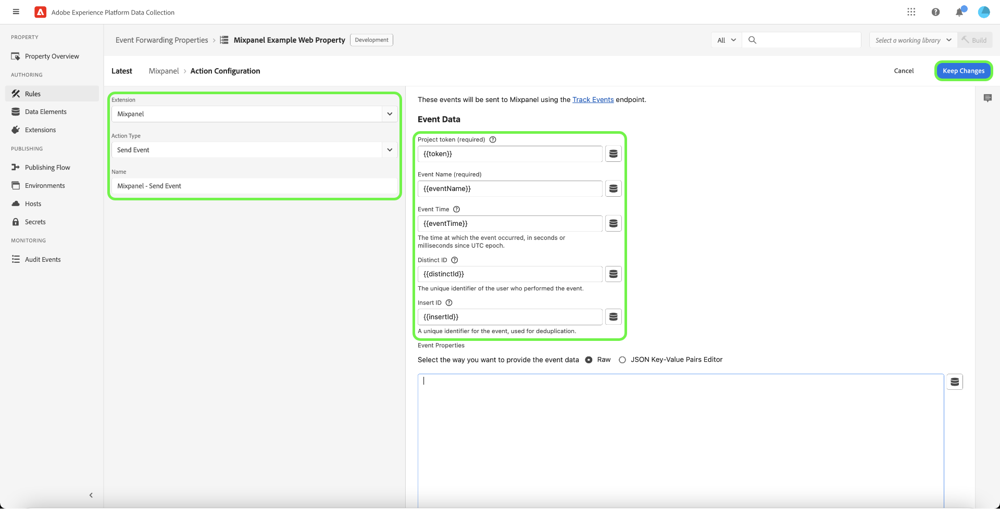

# [!DNL Mixpanel Track Events] API event forwarding extension

[[!DNL Mixpanel]](https://www.mixpanel.com) is a product analytics tool that allows you to capture data on how users interact with a digital product. You can analyze product data with simple, interactive reports that let you query and visualize the data with just a few clicks. [!DNL Mixpanel] designed to make teams more efficient by allowing everyone to analyze user data in real time to identify trends, understand user behavior, and make decisions about your product.

[!DNL Mixpanel] employs an event-based, user-centric model that connects each interaction to a single user. The [!DNL Mixpanel] data model is built on the concepts of users, events, and properties.

>[!NOTE]
>
>Refer to the [!DNL Mixpanel] documentation on [identity management](https://help.mixpanel.com/hc/en-us/articles/360041039771-Getting-Started-with-Identity-Management) to understand how [!DNL Mixpanel] merges events to create identity clusters. It is also recommended that you review the document on [distinct IDs](https://help.mixpanel.com/hc/en-us/articles/115004509426-Distinct-ID-Creation-JavaScript-iOS-Android-) to understand how they are used to identify users in event data.

## Use cases

This extension should be used if you want to use data from the Edge Network in [!DNL Mixpanel] to take advantage of its product analytics capabilities.

For example, consider a retail organization that has a multichannel presence (website and mobile). The organization captures transactional or conversational input as event data from their platforms and loads it into [!DNL Mixpanel] using the event forwarding extension.

The analytics teams can then leverage [!DNL Mixpanel's] capabilities to process the datasets and derive business insights, which can be used to generate graphs, dashboards, or other visualizations to inform business stakeholders.

For more information on use cases specific to [!DNL Mixpanel], refer to the following documentation:

* [New to [!DNL Mixpanel]](https://docs.mixpanel.com/docs)
* [What is [!DNL Mixpanel]?](https://developer.mixpanel.com/docs)
* [12 must-try [!DNL Mixpanel] features](https://mixpanel.com/blog/12-things-you-probably-didnt-know-you-could-do-with-mixpanel/)

## [!DNL Mixpanel] prerequisites {#prerequisites-mixpanel}

You must have a valid [!DNL Mixpanel] account in order to use this extension. Go to the [[!DNL Mixpanel] registration page](https://mixpanel.com/register/) to register and create an account if you do not have one already.

Ensure that the [[!DNL Identity Merge]](https://help.mixpanel.com/hc/en-us/articles/9648680824852-ID-Merge-Implementation-Best-Practices) setting is enabled for your project. Navigate to **[!DNL Settings]** > **[!DNL Project Setting]** > **[!DNL Identity Merge]** and toggle the setting.

### Understanding identity clusters in [!DNL Mixpanel]

In [!DNL Mixpanel], an identity cluster contains a collection of `distinct_id` values that connect to an individual user. [!DNL Mixpanel] handles the cluster of identities for each user, resolving a single canonical `distinct_id` from each cluster to be used in reporting. You can also include your own identifier (called a local `distinct_id`) for anonymous events that occur before a user identification event.

[!DNL Mixpanel] resolves identity clusters through two methods:

* **Identify** : [!DNL Mixpanel] connects your chosen identifier to an anonymous `distinct_id`. If your website has the [!DNL Mixpanel] SDK enabled, Experience Platform will use the `distinct_id` assigned to the user who is currently logged in.
* **Alias**: [!DNL Mixpanel] combines two non-anonymous `distinct id`s together if additional merge criteria are met.

>[!NOTE]
>
>Refer to the [!DNL Mixpanel] document on [identity management](https://help.mixpanel.com/hc/en-us/articles/360041039771-Getting-Started-with-Identity-Management#user-identification) for more details on these methods.
>
>Confirm that you have enabled the [[!DNL Mixpanel] identity merge feature](#prerequisites-mixpanel) to ensure that identity clusters are resolved appropriately.

### Gather required configuration details {#configuration-details}

In order to connect Experience Platform to [!DNL Mixpanel] you must have the following inputs:

| Key Type | Description | Example |
| --- | --- | --- |
| Project Token | The project token associated with your [!DNL Mixpanel] account. Refer to the [!DNL Mixpanel] documentation on [finding your project token](https://help.mixpanel.com/hc/en-us/articles/115004502806-Find-Project-Token-) for guidance. | `25470xxxxxxxxxxxxxxxxxxx1289` |

## Install and configure the [!DNL Mixpanel] extension {#install}

To install the extension, [create an event forwarding property](../../../ui/event-forwarding/overview.md#properties) or choose an existing property to edit instead.

Select **[!UICONTROL Extensions]** in the left navigation. In the **[!UICONTROL Catalog]** tab, select **[!UICONTROL Install]** on the card for the [!DNL Mixpanel] extension.

![Installing the [!DNL Mixpanel] extension.](../../../images/extensions/server/mixpanel/install-extension.png)

## Create a [!DNL Send Event] rule

Start creating a new rule in your event forwarding property. Under **[!UICONTROL Actions]**, add a new action and set the extension to **[!UICONTROL Mixpanel]**. Next, set the action type to **[!UICONTROL Track Event]** to send Edge Network events to [!DNL Mixpanel].

| Input | Description | Required |
| --- | --- | --- |
| [!UICONTROL Project Token] | This field should be mapped to the project token associated with your [!DNL Mixpanel] account. | Yes |
| [!UICONTROL Event Type] | The event name. | Yes |
| [!UICONTROL Event Time] | The event time. | |
| [!UICONTROL Mixpanel Distinct ID] | The unique identifier of the user who performed the event. | |
| [!UICONTROL Insert ID] | A unique identifier for the event, used for deduplication. | |
| [!UICONTROL Event Properties] | A JSON object containing custom properties of the event. Select from providing raw JSON or using a simplified set of key-value inputs. | |

>[!NOTE]
>
>For more information on the standard fields for a [!DNL Mixpanel] event, refer to the [official documentation](https://developer.mixpanel.com/reference/import-events#event).

Once the [!UICONTROL Track Event] action is added to the rule, you can configure the rule's conditions so it only fires for certain events, or you can leave the conditions section empty to make the rule fire for all events.

>[!IMPORTANT]
>
>If your website is using the [!DNL Mixpanel] SDK, you can continue to the next step of [validating your data within [!DNL Mixpanel]](#validate). If you are not using the [!DNL Mixpanel] SDK, you must [create a separate identity tracking rule](#create-an-identity-tracking-rule) to ensure that appropriate events and `distinct_id` values are sent to [!DNL Mixpanel] when a user identification event occurs.

## Validate data within [!DNL Mixpanel] {#validate}

If your implementation is successful and events are collected, you will see events within the [[!DNL Mixpanel] console](https://help.mixpanel.com/hc/en-us/articles/4402837164948).

Check if [!DNL Mixpanel] has merged the post login events populated with email values and the events created when using **[!UICONTROL Send Event]**. If implemented correctly, [!DNL Mixpanel] will associate them with a single [user profile](https://help.mixpanel.com/hc/en-us/articles/115004501966).

## Next steps

This guide covered how to send conversion events to [!DNL Mixpanel] using event forwarding. This event forwarding extension leverages the [!DNL Mixpanel] SDK and JavaScript API. For more information on these underlying technologies, refer to the official documentation:

* [[!DNL Mixpanel] SDK](https://developer.mixpanel.com/docs/nodejs)
* [[!DNL Mixpanel] JavaScript API](https://developer.mixpanel.com/docs/javascript-full-api-reference#mixpanelidentify)

For more information on event forwarding capabilities in Experience Platform, refer to the [event forwarding overview](../../../ui/event-forwarding/overview.md).
