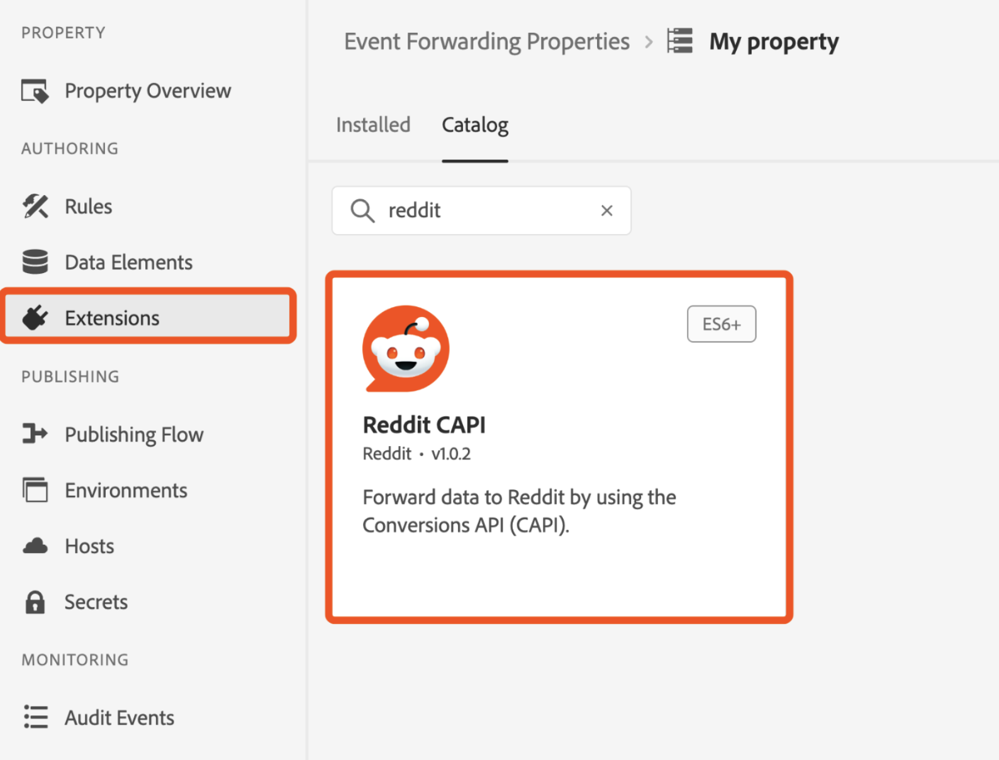
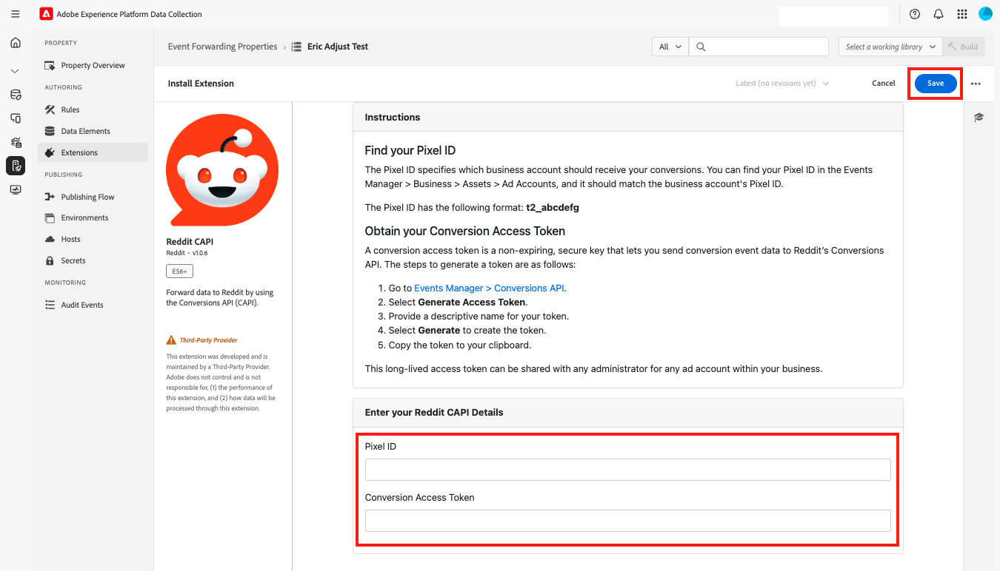

# [!DNL Reddit] Conversions API extension overview

Use the [!DNL Reddit] Conversions API extension to send user interaction events captured in the Adobe Experience Platform Edge Network to [!DNL Reddit Ads]. This integration helps your brand reach an audience of over 379 million weekly active users, and enables you to understand user behavior and run targeted advertisements.

Read this guide to learn how to install, configure, and use the [!DNL Reddit] Conversions API extension in your event forwarding rules.

## Prerequisites {#prerequisites}

Before you install and configure the [!DNL Reddit] Conversions API extension, ensure that the following prerequisites are met:

1. **Set up a [!DNL Reddit Ads] account**: Request access to the Ads API.
2. **Find your Pixel ID**: Locate your Pixel ID in your [!DNL Reddit Ads] account.
3. **Create a conversion access token**: Generate a token to authenticate API requests.

## Install and configure the [!DNL Reddit] extension {#install-configure}

Follow these steps to install and configure the [!DNL Reddit] Conversions API extension:

1. Create a new event forwarding property or select an existing property.
2. Navigate to **Extensions** in the left navigation panel.
    
3. Open the **Catalog** tab and select the card for the [!DNL Reddit] extension.
    
4. Provide the following configuration details:
   - **Pixel ID**: Enter your [!DNL Reddit Ads] Pixel ID.
   - **Conversion Access Token**: Enter the token generated in your [!DNL Reddit Ads] account.
5. Select **Save** to complete the configuration.

## Configure an event forwarding rule {#config-rule}

After you set up your data elements, create event forwarding rules to determine when and how events are sent to [!DNL Reddit Ads].

1. Navigate to **Rules** in your event forwarding property and create a new rule.
2. Under **Actions**, add a new action and set the extension to **[!DNL Reddit CAPI]**.
3. Set the **Action Type** to **Send Event**.
    
4. Configure the additional controls for your event as shown in the table below:

    | Field name | Description | Example | 
    | --- | --- | --- |
    | `Event Name` | Specify the name of the conversion event. | `Purchase` |
    | `Event Type` | Define the type of event. This can be a supported Reddit conversion event or a custom one. | `SignUp`, `MyCustomEvent` |
    | `Timestamp` | Provide the event time in ISO format or epoch time. | `2025-04-15T16:01:00.000Z`, `1744742460000` |
    | `Client Dedupe ID` | Add a unique ID for deduplication. | `abc123` |
    | `Match Keys` | Include user and device identifiers for attribution. | `{"email":"hashed_email@example.com", "phone":"hashed_phone"}` |
    | `Value` | Specify the monetary value of the event. | `99.99` |
    | `Currency Code` | Use ISO-4217 format for the currency. | `USD` |
    | `Units Sold` | Enter the quantity of items purchased. | `3` |
    | `Country Code` | Specify the country where the event occurred. | `US` |
    | `Data Processing Options` | Add privacy flags, such as LDU (Limited Data Usage). | `{"modes":["LDU"],"country":"US","region":"US-NY"}` |
    | `Consent` | Indicate user consent for advertising data usage. | `true` |

5. Select **Keep Changes** to save the rule.

## Key benefits {#benefits}

- **Audience reach**: Engage with over 379 million weekly active users on [!DNL Reddit].
- **Behavioral insights**: Leverage user interaction data to understand behavior and optimize campaigns.
- **Targeted advertising**: Run personalized advertisements based on user interactions captured in Adobe Experience Platform.

## Event metadata {#event-metadata}

The following fields may appear to depend on your selected event type. 

>[!NOTE]
>
>It is strongly recommended to provide all these fields with dynamic product ads (DPAs) when using conversion events.

### Event metadata fields

| Field Name | Description | Example |
| --- | --- | --- |
| `Conversion ID` (required) | Unique ID for the conversion event, used for deduplication. | `abc123` |
| `Item Count` | The total number of items for the conversion event. | `6` |
| `Currency` | The currency for the value provided, in ISO-4217 format. | `USD` |
| `Value` | Total monetary value of the conversion event, including decimals. | `1.23` |
| `Products` | A JSON array of objects with details about the products associated with the event. Each object must include an `id` at a minimum. | `[{"id":"SKU123","name":"ProductName","category":"CategoryName"},{"id":"SKU456","name":"ProductName","category":"CategoryName"}]` |

### User data fields

The following parameters are optional but recommended:

| Field Name | Description | Example |
| --- | --- | --- |
| `Email` (strongly recommended) | Hashed or unhashed user email. | `example@email.com` |
| `External ID` | Hashed or unhashed advertiser-assigned user ID. | `customer12345` |
| `UUID` (strongly recommended) | ID generated by the Reddit Pixel on your website. | `1677712978045.b8f7eb7d-b357-437b-8bd3-e1c8166c7132` |
| `IP Address` (strongly recommended) | User's device IP address. | `192.168.0.1` |
| `User Agent` (strongly recommended) | Browser or app used by the user. | `Chrome/98.0.4758.102` |
| `IDFA` | Hashed or unhashed Apple Identifier for Advertisers. | `8A2E4F6D-0852-4B2A-B9D5-79334DE14B16` |
| `AAID` | Hashed or unhashed Android Advertising ID. | `38400000-8cf0-11bd-b23e-10b96e40000d` |
| `Screen Width` | Width of the user's display. | `1920` |
| `Screen Height` | Height of the user's display. | `1080` |
| `Data Processing Options` (JSON format) | User privacy settings. Only supports LDU (Limited Data Usage). | `{"modes":["LDU"],"country":"US","region":"US-NY"}` |

### Important considerations

Before sending data to [!DNL Reddit Ads], the extension hashes and normalizes the values of the following fields: `Email`, `External ID`, `IDFA`, and `AAID`. The extension does not re-hash these fields if they already contain an SHA-256 hash.

This section provides a detailed breakdown of the event metadata and user data fields, ensuring users understand the required and optional parameters for configuring their events. Let me know if you need further refinements.

## Validate and deploy {#validate-deploy}

After configuring the extension and rules, validate the integration by checking event data in the [!DNL Reddit Ads] Events Manager. Use the Match Quality Score (MQS) to evaluate the accuracy and reliability of your signal integrations.

For additional details on [!DNL Reddit Ads], visit the [Reddit Ads documentation](https://ads.reddit.com/).

## Next steps {#next-steps}

After reading this document, you should now understand how to configure and use the [!DNL Reddit] Conversions API extension. For more information on event forwarding capabilities in Adobe Experience Platform, refer to the [event forwarding overview](../../../ui/event-forwarding/overview.md) or refer to the following resources:

- [Configure Signals](../../../ui/event-forwarding/configure-signals.md): Learn how to configure signals for better data accuracy.
- [Share match keys and event metadata](../../../ui/event-forwarding/share-match-keys.md): Understand how to share match keys and event metadata effectively.
- [Deduplicate events](../../../ui/event-forwarding/deduplicate-events.md): Ensure accurate event tracking by deduplicating events.
- [Create a conversion access token](../../../ui/event-forwarding/create-conversion-token.md): Follow the steps to create a conversion access token for secure API authentication.
