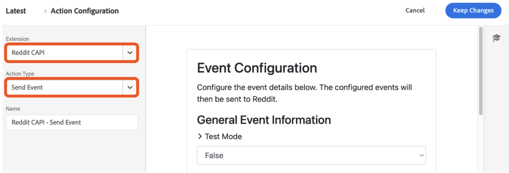
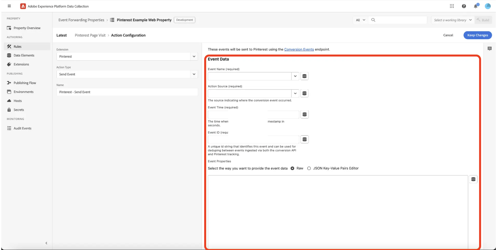

# [!DNL Reddit] Conversions API extension overview

Reddit is a social media platform with a diverse user base, making it ideal for advertisers targeting specific audiences.

Use the [[!DNL Reddit] Conversions API extension](https://ads-api.reddit.com/docs/v2/#tag/Conversions-API) to send user interaction events captured in the Adobe Experience Platform Edge Network to [!DNL Reddit Ads]. Use this extension to help your brand reach an audience of over 379 million weekly active users, and better understand user behavior and run targeted advertisements.

Read this guide to learn how to install, configure, and use the [!DNL Reddit] Conversions API extension in your event forwarding [rules](https://experienceleague.adobe.com/en/docs/experience-platform/tags/ui/rules).

## Key benefits {#benefits}

Use the Reddit Conversions API extension to:

- **Reach your audience**: Engage with over 379 million weekly active users on [!DNL Reddit].
- **Analyze user behavior**: Leverage user interaction data to understand behavior and optimize campaigns.
- **Deliver targeted ads**: Run personalized advertisements based on user interactions captured in Adobe Experience Platform.

## Prerequisites {#prerequisites}

You must have a valid Reddit Ads account to use this extension. Go to [[!DNL Reddit Ads] registration page](https://business.reddithelp.com/s/article/Create-and-manage-your-Reddit-Ads-account) to register and create an account if you do not have one already. Once you have your account set up, [request access to the Ads API](https://www.redditforbusiness.com/api-partnership).

### Gather required configuration details {#configuration-details}

To connect the Experience Platform to [!DNL Reddit], the following inputs are required:

| Credential | Description | Example |
| --- | --- | --- |
| Pixel ID | The Pixel ID is a unique identifier associated with your [!DNL Reddit Ads] account. It is used to track user interactions and conversion events on your website or app. You can find your Pixel ID in your [!DNL Reddit Ads] [account](https://ads.reddit.com/accounts).| 123456789012 |
| Conversion Access Token | Your [!DNL Reddit] Conversion Access Token. Refer to the [[!DNL Reddit] Conversions API](https://business.reddithelp.com/s/article/conversion-access-token) document for guidance.   **You are only required to go through this process once as this token does not expire.** | {YOUR_REDDIT_BEARER_TOKEN} |

## Install and configure the [!DNL Reddit] extension {#install-configure}

Follow these steps to install and configure the [!DNL Reddit] Conversions API extension:

1. In the Experience Platform Data Collection UI, select [!UICONTROL Extensions] from the left navigation to access the [!UICONTROL Extensions] catalog. Then [Create a new event forwarding property](https://experienceleague.adobe.com/en/docs/experience-platform/tags/event-forwarding/overview#properties) or select an existing property.
2. Navigate to **[!UICONTROL Extensions]** in the left navigation panel. Select **[!UICONTROL Catalog]** and then select the **[!DNL Reddit]** extension.
    
3. Provide the following configuration details:
   - **Pixel ID**: Enter your [!DNL Reddit Ads] Pixel ID.
   - **Conversion Access Token**: Enter the token generated in your [!DNL Reddit Ads] account and select **[!UICONTROL Save]** when finished.
   

## Configure an event forwarding rule {#config-rule}

After you set up your data elements, create event forwarding rules to determine when and how events are sent to [!DNL Reddit Ads].

1. Navigate to **Rules** in your event forwarding property and create a new [rule](https://experienceleague.adobe.com/en/docs/experience-platform/tags/ui/rules).
2. Under **Actions**, add a new action and set the extension to **[!DNL Reddit CAPI]**.
3. Set the **Action Type** to **Send Event**.
    
4. Configure the additional controls for your event as shown in the table below:

    | Field name | Description | Example | 
    | --- | --- | --- |
    | `Event Name` | Specify the name of the conversion event. | `Purchase` |
    | `Event Type` | Define the type of event that can be a [supported Reddit conversion event](https://business.reddithelp.com/s/article/supported-conversion-events#supported-conversion-events) or a custom one. | `SignUp`, `MyCustomEvent` |
    | `Timestamp` | Provide the event time in ISO format or epoch time. | `2025-04-15T16:01:00.000Z`, `1744742460000` |
    | `Client Dedupe ID` | Add a unique ID for deduplication. | `abc123` |
    | `Match Keys` | Include user and device identifiers for attribution. | `{"email":"hashed_email@example.com", "phone":"hashed_phone"}` |
    | `Value` | Specify the monetary value of the event. | `99.99` |
    | `Currency Code` | Use ISO-4217 format for the currency. | `USD` |
    | `Units Sold` | Enter the quantity of items purchased. | `3` |
    | `Country Code` | Specify the country where the event occurred. | `US` |
    | `Data Processing Options` | Add privacy flags, such as LDU (Limited Data Usage). | `{"modes":["LDU"],"country":"US","region":"US-NY"}` |
    | `Consent` | Indicate user consent for advertising data usage. | `true` |

5. Select **Keep Changes** to save the rule.

## Event metadata {#event-metadata}

Read this section for a detailed breakdown of the event metadata and user data fields, ensuring you understand the required and optional parameters for configuring your events. The fields shown may vary depending on the event type selected.

>[!NOTE]
>
>To get the best results from your conversion events, make sure to fill in all the fields when setting up [dynamic product ads](https://business.reddithelp.com/s/article/dynamic-product-ads).

### Event metadata fields

| Field Name | Description | Example |
| --- | --- | --- |
| `Conversion ID` (required) | The unique ID for the conversion event, used for deduplication. | `abc123` |
| `Item Count` | The total number of items for the conversion event. | `6` |
| `Currency` | The currency for the value is provided, in [ISO-4217](https://www.iso.org/iso-4217-currency-codes.html) format. | `USD` |
| `Value` | The total monetary value of the conversion event, including decimals. | `1.23` |
| `Products` | A JSON array of objects with details about the products associated with the event. Each object must include an `id` at a minimum. | `[{"id":"SKU123","name":"ProductName","category":"CategoryName"},{"id":"SKU456","name":"ProductName","category":"CategoryName"}]` |

### User data fields

The following parameters are optional but recommended:

| Field Name | Description | Example |
| --- | --- | --- |
| `Email` (strongly recommended) | A hashed or unhashed user email. | `example@email.com` |
| `External ID` | A hashed or unhashed advertiser-assigned user ID. | `customer12345` |
| `UUID` (strongly recommended) |The ID generated by the Reddit Pixel on your website. | `1677712978045.b8f7eb7d-b357-437b-8bd3-e1c8166c7132` |
| `IP Address` (strongly recommended) | The user's device IP address. | `192.168.0.1` |
| `User Agent` (strongly recommended) | The browser or app used by the user. | `Chrome/98.0.4758.102` |
| `IDFA` | A hashed or unhashed Apple Identifier for Advertisers. | `8A2E4F6D-0852-4B2A-B9D5-79334DE14B16` |
| `AAID` | A hashed or unhashed Android Advertising ID. | `38400000-8cf0-11bd-b23e-10b96e40000d` |
| `Screen Width` | The width of the user's display. | `1920` |
| `Screen Height` | The height of the user's display. | `1080` |
| `Data Processing Options` (JSON format) | The user privacy settings. Only supports LDU (Limited Data Usage). | `{"modes":["LDU"],"country":"US","region":"US-NY"}` |

### Important considerations

Before sending data to [!DNL Reddit Ads], the extension hashes and normalizes the values of the following fields: `Email`, `External ID`, `IDFA`, and `AAID`. The extension does not re-hash these values if they have already been hashed in [!DNL SHA-256].

## Validate and deploy {#validate-deploy}

After configuring the extension and rules, validate the integration by checking event data in the [[!DNL Reddit Ads] Events Manager](https://business.reddithelp.com/s/article/Events-Manager). Use the [Match Quality Score (MQS)](https://business.reddithelp.com/s/article/match-quality-score) to evaluate the accuracy and reliability of your signal integrations.

For additional details on [!DNL Reddit Ads], visit the [Reddit Ads documentation](https://ads.reddit.com/).

## Next steps {#next-steps}

After reading this document, you should now understand how to configure and use the [!DNL Reddit] Conversions API extension. For more information on event forwarding capabilities in Adobe Experience Platform, refer to the [event forwarding overview](../../../ui/event-forwarding/overview.md) or to the following resources:

- [Share match keys](https://business.reddithelp.com/s/article/about-attribution-matching-signals) and [event metadata](https://business.reddithelp.com/s/article/about-event-metadata): Understand how to share match keys and event metadata effectively.
- [Deduplicate events](https://business.reddithelp.com/s/article/event-deduplication): Ensure accurate event tracking by deduplicating events.
- [Create a conversion access token](https://business.reddithelp.com/helpcenter/s/article/conversion-access-token): Follow the steps to create a conversion access token for secure API authentication.
