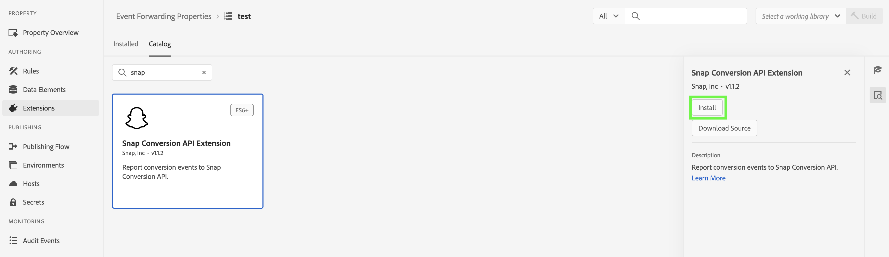
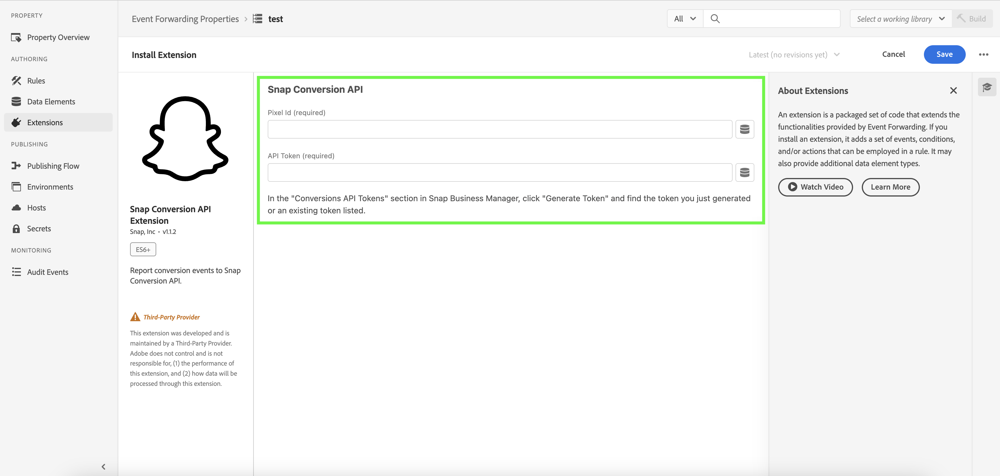
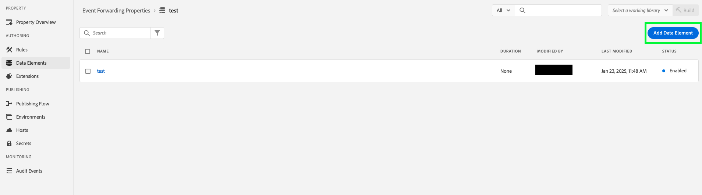
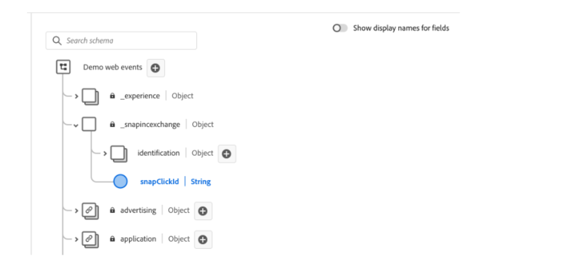
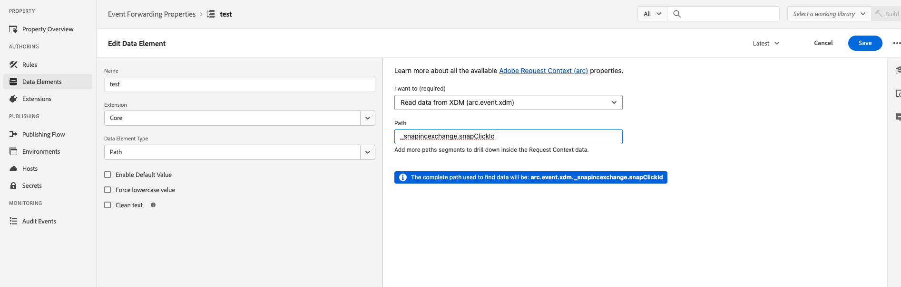
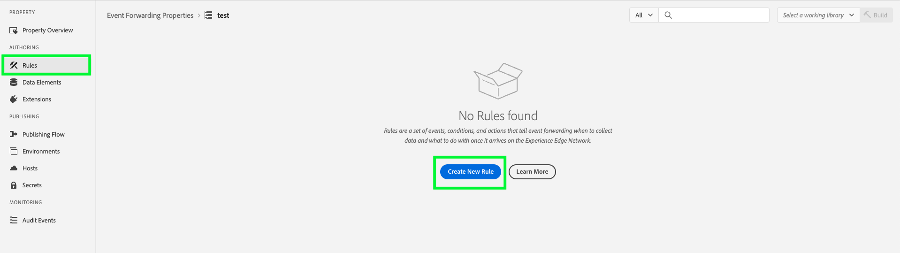
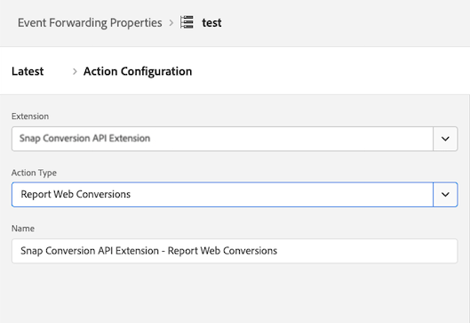

# [!DNL Snapchat] conversions API extension overview

The [!DNL Snap] Conversion API Extension is a secure [Edge Network Server API](/help/server-api/overview.md) interface that allows you to share information with [!DNL Snapchat] directly about user actions on your websites. You can leverage the event forwarding rules to send data from the **[!DNL Adobe Experience Platform Edge Network]** to **[!DNL Snapchat]** by using the **[!DNL Snap]** Conversion API extension.

## [!DNL Snapchat] prerequisites {#prerequisites}

To use the [!DNL Snapchat] Conversions API, you must have an [Event Forwarding property](https://experienceleague.adobe.com/en/docs/experience-platform/tags/event-forwarding/getting-started) set up in the Adobe Experience Platform and the [required permissions](https://experienceleague.adobe.com/en/docs/experience-platform/collection/permissions) to edit the property. 

Create a [Datastream](/help/tags/ui/event-forwarding/getting-started.md) and add the [Event Forwarding service](/help/tags/ui/event-forwarding/getting-started#enable-event-forwarding) to it. 

A **[!DNL Snapchat]** [Business Manager](https://business.snapchat.com/) account is required to use the Conversions API. Business Manager helps advertisers integrate **[!DNL Snapchat]**'s marketing efforts across their business and with external partners. See the **[!DNL Snapchat]** [help center article](https://businesshelp.snapchat.com/s/article/get-started?language=en_US) on creating a Business Manager account if you don't have one.

A **[!DNL Snap Pixel]**(https://businesshelp.snapchat.com/s/article/pixel-website-install?language=en_US) must be set up in the Snapchat Ads Manager, and you must have access to view the `Pixel ID`. The `Pixel ID` can be found in the **[!UICONTROL Events Manager]**(https://businesshelp.snapchat.com/s/article/events-manager?language=en_US) section.

You need a static, long-lived API token. See the [[!DNL Snapchat] Conversions API documentation](https://developers.snap.com/api/marketing-api/Conversions-API/GetStarted#access-token) to obtain this token.

## Install and configure the [!DNL Snapchat] web events API extension {#install}

To install the extension, navigate to **[!UICONTROL Data Collection]**>**[!UICONTROL Event Forwarding]**. Select the property where you want to install the extension.

Once the desired property is selected, follow these steps:

1. In the left navigation panel, select **[!UICONTROL Extensions]**.
2. Search for the **[!UICONTROL Snap Conversion API Extension]** and select **[!UICONTROL Install]**.

    .

3. On the configuration screen, input the following values:

 * **[!UICONTROL Pixel Id]**  
 * **[!UICONTROL API Token]**

When finished, select **[!UICONTROL Save]**.

.
<!-- 
![[!DNL Snap] configuration screen for the [!DNL Snap] conversion API extension.](../../../images/extensions/server/snap/configure.png) -->

## Create data elements {#create-data-elements}

To pass data points as parameters to the [!DNL Snapchat] Conversions API extension, you must create [data elements](https://experienceleague.adobe.com/en/docs/platform-learn/implement-web-sdk/event-forwarding/setup-event-forwarding#create-an-event-forwarding-data-element) for each data point. Follow these steps:

1. Navigate to **[!UICONTROL Authoring]**>**[!UICONTROL Data Elements]** in your property's **[!UICONTROL Property Info]** screen, and then select **[!UICONTROL Add Data Element]**.

    .

2. Enter a name for the data element.

3. Select **[!UICONTROL Core]** as the extension and **[!UICONTROL Path]** as the data element type. 

4. From the drop-down menu, select the appropriate item, and fill in the [!UICONTROL Path] field in the right-side panel to reference the desired data in your schema. 

    .

For example, if you are creating a data element that references `snapClickId` in the schema shown below:

.

You must configure the data element because `snapClickId` is located under `_snap.inc.exchange` in the XDM schema.

.

See the [Event Forwarding properties documentation](/help/tags/ui/event-forwarding/overview#data-elements.md) for more details on creating data elements.

## Create rules to send conversions events to snap {#create-snap-rules}

[Rules](https://experienceleague.adobe.com/en/docs/platform-learn/implement-web-sdk/event-forwarding/setup-event-forwarding#create-an-event-forwarding-rule) are used to trigger extensions in Platform. This section outlines how to create rules within your event forwarding property to send conversion events to Snap using the CAPI extension.

### Create a new rule

1. Navigate to your event forwarding property and select **[!UICONTROL Rules]** from the Authoring menu. Then, click **[!UICONTROL Create New Rule]**.

    .

2. Name the rule and configure a condition for triggering the Snap event. For example, to send a `PURCHASE` event whenever an event includes an order number, set a condition to check if the user interaction contains a valid purchase order number. 

    .

3. After saving the condition, add an action to trigger the Snap Conversion API. In the left-side panel:

    * Set the [!UICONTROL Extension] dropdown menu to [!UICONTROL Snap Conversions API Extension].

    * Set the [!UICONTROL Action Type] dropdown menu to [!UICONTROL Report Web Conversions].

    * Name the rule accordingly.

    .

4. Configure the [CAPI parameter values](https://developers.snap.com/api/marketing-api/Conversions-API/Parameters) you want to send for the event in the **[!UICONTROL Data Bindings]** section on the right-side panel. The fields in the extension map to CAPI parameters as shown below. See the [Snapchat Conversions API documentation](https://developers.snap.com/api/marketing-api/Conversions-API/Parameters) for more information about each parameter.

| Data binding field | Snap CAPI parameter |
| --- | --- |
| Event Type (required) |`event_name`|
| Email | `em` |
| Phone Number | `ph` |
| User Agent | `client_user_agent` |
| IP Address | `client_ip_address` |
| Click ID | `sc_click_id` |
| Cookie1 | `so_cookie1` |
| First Name | `fn` |
| Last Name | `ln` |
| Gender | `ge` |
| City | `ph` |
| State  | `st` |
| Zip | `zp` |
| Country | `country` |
| External Id  | `external_id` |
| Partner Id | `partner_id` |
| Subscription Id | `subscription_id` |
| Lead Id | `lead_id` |
| Item or Category | `content_category` |
| Content Name  | `content_ids` |
| Content Type  | `content_name` |
| Contents | `contents` |
| Description | `description` |
| Event Tag | `event_tag` |
| Number of Items | `num_items` |
| Price | `value` |
| Currency | `currency` |
| Transaction Id | `order_id` (also sent for `event_id` in place of `client dedup idD`) |
| Predicted LTV | `predicted_ltv` |
| Search String | `search_string` |
| Sign Up Method | `sign_up_method` |
| Client Dedup Id | `event_id` |
| Limited Data Use | `data_processing_options` |
| Page Url | `event_source_url` |

### Required and optional fields

* Required fields: 

    * All events will have `event_source` set to `WEB`. 

    * At least one of the following fields or combinations is required for matching: 

        * E-mail
        * Phone Number
        * IP Address and User Agent

**Additional notes:**

* For `Purchase` events, the `Currency` and `Price` fields are required.

* Enabling the **[!UICONTROL Test Mode]** checkbox sends events as test events, which appear in the test event tool instead of standard reporting. See this [business help center article](https://businesshelp.snapchat.com/s/article/capi-event-testing?language=en_US#:~:text=Snap's%20Conversions%20API%20(CAPI)%20Test,being%20processed%20as%20production%20results.) for more details. 

* The `contents` parameter should be a JSON string containing at least one of the following fields: 

    * `id`
    * `item_category`
    * `brand`
    * `delivery_category`
    * `item_price`
    * `quantity`

Example:

```json
{
  "id": "id1",
  "brand": "brand1",
  "delivery_category": "c1",
  "item_price": 2.00,
  "quantity": 2
}
```

To use [custom conversions value and ROAS reporting](https://businesshelp.snapchat.com/s/article/custom-conversions-value-roas?language=en_US), include relevant parameters in the `contents` field. For example, `brand`, `item_price`, `id`.

Example configuration for a `Purchase` event:

[Image showing data bindings](../../../images/extensions/server/snap/data_bindings.png)

The optional fields could be set as shown:

[Image showing optional fields](../../../images/extensions/server/snap/optional_fields.png)

Once you set the rule's name, condition and action as described above, save the rule and make sure it's enabled. 

[Image showing enabled rule](../../../images/extensions/server/snap/enabled_rule.png)

You can now publish these changes to your property. Please see the documentation on [publishing flow](https://experienceleague.adobe.com/en/docs/experience-platform/tags/publish/overview) for more information.

## Troubleshoot {#troubleshoot}

For troubleshooting and optimizing your setup, review the [Event Quality Score recommendations](https://businesshelp.snapchat.com/s/article/event-quality-score) to ensure your events achieve the highest possible match rates and performance outcomes.

If you experience issues with your **Event Quality Score**, learn more about our recommendations to improve it [here](https://businesshelp.snapchat.com/s/article/esq-issues-recommendations?language=en_US).

## Next steps {#next-steps}

This guide covered how to send server-side event data to **[!DNL Snap]** using the **[!DNL Snap Conversions API]** extension. For more information on event forward capabilities in Platform, refer to the [Event forwarding overview](../../../ui/event-forwarding/overview.md).
