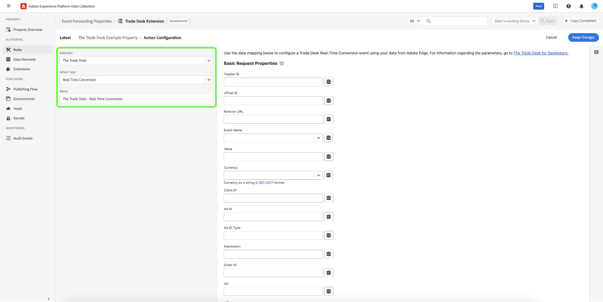

# [!DNL The Trade Desk Real-Time Conversions API] extension overview

The [[!DNL Trade Desk Real-Time Conversions API]](https://partner.thetradedesk.com/v3/portal/data/doc/DataConversionEventsApi) allows you to send events to [!DNL The Trade Desk] in order to leverage retargeting and attribution.

You can use the [!DNL Trade Desk Real-Time Conversions API] extension to send data from the Adobe Experience Platform Edge Network to [!DNL The Trade Desk] by utilizing the API's capabilities in your [event forwarding](../../../ui/event-forwarding/overview.md) rules. 

Using the [!DNL Trade Desk Real-Time Conversions API] extension, you can leverage the API's capabilities in your [event forwarding](../../../ui/event-forwarding/overview.md) rules to send data to [!DNL The Trade Desk] from the Adobe Experience Platform Edge Network. 

This document covers how to install the extension and use its capabilities in an event forwarding [rule](../../../ui/managing-resources/rules.md).

## Prerequisites {#prerequisites}

You must have a relevant Advertiser ID, UPixel ID, and Tracker ID are required from within your [!DNL The Trade Desk] account in order to configure the [!DNL The Trade Desk] Real-Time Conversions API.

>[!INFO]
>
>If you are a merchant, you will also need to obtain your Merchant ID.

## Install and configure the [!DNL The Trade Desk] Real-Time Conversions API {#install}

To install the extension, [create an event forwarding property](../../../ui/event-forwarding/overview.md#properties) or select an existing property to edit instead.

Select **[!UICONTROL Extensions]** in the left navigation. In the **[!UICONTROL Catalog]** tab, select the **[!UICONTROL The Trade Desk]** Real-Time Conversions API card, then select **[!UICONTROL Install]**.

![The extension catalog showing the [!DNL The Trade Desk] extension card highlighting install.](../../../images/extensions/server/tradedesk/install-extension.png)

On the next screen, enter the [!UICONTROL Advertiser ID], and optionally a [!UICONTROL Merchant ID]. You can paste the ID's directly into these inputs, or you can use a data element instead. These will serve as the default values used when making an event call to [!DNL The Trade Desk] Real-Time Conversions API. Select **[!UICONTROL Save]** when finished.

![The [!DNL The Trade Desk] extension configuration page with the [!UICONTROL Advertiser ID] and [!UICONTROL Merchant ID] fields highlighted.](../../../images/extensions/server/tradedesk/configure-extension.png)

The extension is installed and you can now employ its capabilities in your event forwarding rules.

## Configure an event forwarding rule {#rule}

Once you have installed and configured the extension, you can start creating event forwarding rules that determine how and when you events will be sent to [!DNL The Trade Desk].

You should consider configuring several rules in order to send all accepted [request properties](https://partner.thetradedesk.com/v3/portal/data/doc/DataConversionEventsApi#properties) via [!DNK The Trade Desk] and [!DNL The Trade Desk] Real-Time Conversions API.

>[!NOTE]
>
>Events should be sent out in real-time or as close to real-time as possible.

Create a new event forwarding [rule](../../../ui/managing-resources/rules.md) in your event forwarding property. Under **[!UICONTROL Actions]**, add a new action and set the extension to **[!UICONTROL The Trade Desk]**. Next, select **[!UICONTROL Real Time Conversion]** for the **[!UICONTROL Action Type]**.

After selection, additional controls appear to further configure the event data that will be sent to [!DNL The Trade Desk]. Select **[!UICONTROL Keep Changes]** to save the rule.

The configuration options are divided into three main sections as outlined below:

**[!UICONTROL Basic Request Properties]**

| Input | Description | 
| --- | --- |
| Tracker ID | The platform ID of the event tracker. |
| UPixel ID | The universal pixel ID for the event. |
| Referrer URL | The website URL from where the event occurred, if any. |
| Event Name | The type of event defined by the partner platform. |
| Value | The revenue-tracking value in decimal string (for example, "19.98"). |
| Currency | Currency code in ISO format. |
| Client IP |  The client IPv4 or IPv6 IP address. |
| Ad ID | The unique advertising ID for the event. |
| Ad ID Type | The type of the advertising ID, specified in the AD ID property: TDID, IDFA, AAID, DAID, NAID, IDL, EUID, or UID2. |
| Impression | A 36-character string (including dashes) that serves as the unique ID for the impression to which the event is attributed. |
| Order ID | The associated order identifier of the event. |
| td1-td10 | Ten sequentially numbered custom dynamic properties that can be used to provide additional conversion metadata. |

{style="table-layout:auto"}

![The [!DNL Basic Request Properties] section showing example data input into the fields.](../../../images/extensions/server/linkedin/configure-extension-basic-request-properties.png)

Refer to the [!DNL The Trade Desk] developer documentation for more information on the [request properties](https://partner.thetradedesk.com/v3/portal/data/doc/DataConversionEventsApi#properties) accepted by the 
[!DNL The Trade Desk] Real-Time Conversions API. 

**[!UICONTROL Object Request Parameters]**

This section contains the JSON-formatted request parameters such as Items, Privacy, and Data Processing.

![The [!DNL Object Request Parameters] section showing available fields.](../../../images/extensions/server/linkedin/configure-object-request-params.png)

Refer to the [Real-Time Conversions Event](https://partner.thetradedesk.com/v3/portal/data/doc/DataConversionEventsApi#properties-items) documentation for more information on the [!UICONTROL Object Request Parameters] and their properties.

**[!UICONTROL Configuration Overrides]**

>NOTE
>
>The [!UICONTROL Configuration Overrides] fields allow you to set a different [!DNL Advertiser ID] and/or [!DNL Merchant ID] on every rule.

| Input | Description | 
| --- | --- |
| Advertiser ID | The Advertiser ID that you would like to override the Advertiser ID supplied in the extension configuration. |
| Merchant ID | The Merchant ID that you would like to override the Merchant ID supplied in the extension configuration.  |

![The [!DNL Configuration Overrides] section showing available fields.](../../../images/extensions/server/linkedin/configure-overrides.png)

When you are satisfied with the rule, select **[!UICONTROL Save to Library]**. Finally, publish a new event forwarding [build](../../../ui/publishing/builds.md) to enable the changes made to the library.

## Next steps

This guide covered how to send server-side event data to [!DNL The Trade Desk] using the [!DNL The Trade Desk] Real-Time Conversions API extension. From here, it is recommended to expand your integration by creating distinct rules that send specific conversion events as applicable. For more information on event forwarding capabilities in [!DNL Adobe Experience Platform], read the [event forwarding overview](../../../ui/event-forwarding/overview.md).

See the [!DNL The Trade Desk] documentation on [best practices for the [!DNL The Trade Desk] Real-Time Conversions API](https://www.facebook.com/business/help/308855623839366?id=818859032317965) for more guidance on how to effectively implement your integration.

For details on how to debug your implementation using the Experience Platform Debugger and Event Forwarding Monitoring tool, read the [Adobe Experience Platform Debugger overview](../../../../debugger/home.md) and [Monitor activities in event forwarding](../../../ui/event-forwarding/monitoring.md).
